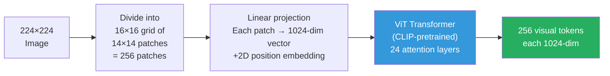
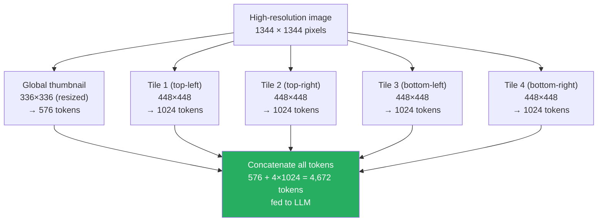

# Lesson 7.1 — How Vision Enters a Language Model: Image Tokenization Strategies

---

## The Fundamental Problem

Language models operate on tokens — discrete units drawn from a vocabulary of ~32K to 128K entries. Images are continuous, high-dimensional, 2D signals. A 224×224 RGB image is a 150,528-dimensional tensor. The LLM cannot accept this directly.

Image tokenization is the process of converting a 2D continuous image into a 1D sequence of vectors that a transformer can process. Every multimodal model does this, and the choice of tokenization strategy has direct consequences for visual understanding quality, token count, and the type of images the model can handle.

---

## Approach 1: Patch Embeddings (Vision Transformer / ViT)

The Vision Transformer (Dosovitskiy et al., 2020) established the dominant approach. Divide the image into a grid of non-overlapping patches, embed each patch as a vector, and process the sequence of patch embeddings with a transformer.

**The math:**

Given an image of size H × W × 3 and patch size P × P:
- Number of patches = (H/P) × (W/P)
- Each patch contains P × P × 3 pixel values = P² × 3 numbers
- Each patch is flattened and multiplied by a learned projection matrix → one D-dimensional vector
- Position embeddings added to each patch vector (to encode spatial location)

For a standard CLIP ViT-L/14 (patch size 14 × 14):
- 224 × 224 image → (224/14) × (224/14) = 16 × 16 = **256 patch tokens**
- 336 × 336 image → (336/14) × (336/14) = 24 × 24 = **576 patch tokens**

Each patch token captures the visual content of its 14×14 pixel region. The sequence of patch tokens flows through the ViT's transformer layers, producing a rich visual representation.



---

## Why CLIP Vision Encoders Are the Standard Choice

Most multimodal models do not train a vision encoder from scratch. They use a CLIP (Contrastive Language-Image Pre-training) vision encoder pre-trained on 400M image-text pairs.

CLIP training makes vision encoders remarkable for multimodal use:
- The encoder learns to produce visual representations that are semantically aligned with text descriptions
- Visual tokens from CLIP already "speak the same language" as text — the semantic concepts are shared
- This dramatically reduces the training needed to connect vision to language

Common CLIP variants used in production multimodal models:
- **ViT-L/14** (used in LLaVA-1.5, many smaller models): 307M params, 1024-dim output per patch
- **ViT-bigG/14** (used in InternVL-2, higher-end models): 1.8B params, 1280-dim output
- **SigLIP** (Google, used in Gemma 3, PaliGemma): trained with sigmoid loss instead of contrastive softmax — better performance at higher resolutions

---

## Approach 2: Fixed-Resolution Limitations and the Fine-Detail Problem

Standard ViT at 224×224 has a critical weakness: **coarse patches cannot capture fine details**. Each 14×14 patch averages over 196 pixels. Text in images, small objects, and fine-grained visual details are lost.

**Example failure:** A 224×224 image of a business card. Each 14×14 patch covers ~10-15 characters of text. The model cannot read the phone number reliably — not because of the LLM, but because the patch embeddings have already averaged away the detail.

This motivated dynamic high-resolution strategies.

---

## Approach 3: Dynamic Resolution Tiling (LLaVA-NeXT, InternVL-2)

Modern multimodal models handle high-resolution images by tiling: divide the input image into multiple tiles, process each tile independently through the ViT, and concatenate all resulting tokens.



**How this enables fine-grained visual understanding:**
- Each 448×448 tile has 32×32 = 1,024 patches at 14×14 pixels each
- The detail resolution is 4× better than a single 224×224 pass
- Text in images becomes legible; small object recognition dramatically improves

**The trade-off:** More tiles = more visual tokens = more LLM context consumed.

| Image type | Tiles | Visual tokens | LLM context used |
|---|---|---|---|
| Simple query image (336×336) | 1 | 576 | Minimal |
| Standard photo (448×448) | 1+1 thumbnail | 576+576=1,152 | Low |
| High-res document (1344×1344) | 9+1 thumbnail | 9,216+576=9,792 | High |
| Product image with text labels | 4+1 thumbnail | 4,096+576=4,672 | Medium |

---

## Approach 4: Pixel Shuffle (Efficient Visual Token Compression)

Pixel Shuffle is used by InternVL and related models to reduce token count after high-resolution encoding. After the ViT produces patch tokens from a high-resolution image, neighboring 2×2 blocks of tokens are merged into a single token via concatenation followed by a linear projection.

```
2×2 block of visual tokens (4 tokens of dim D)
    → concatenate → 1 token of dim 4D
    → linear projection → 1 token of dim D

Effect: 4 tokens → 1 token (4× compression)
```

A 1024-token high-res tile becomes 256 tokens after pixel shuffle. This dramatically reduces the context consumed by visual tokens while preserving most of the information (the projection learns what to keep).

---

## Visual Token Count: Why It Matters

Visual tokens consume the LLM's context window — the same window used for conversation history, system prompts, and retrieved documents.

For a model with an 8K context window:
- 3 high-res images × 4,672 tokens each = 14,016 visual tokens → **context overflow**
- Even with pixel shuffle compression (256 per tile): 3 images × (4 tiles × 256 + 576) = ~4,800 tokens
- This leaves ~3,200 tokens for conversation text

This is why modern multimodal models have been pushing context windows to 32K, 128K, or 1M tokens — not just for long documents, but to accommodate high-resolution images and multi-image conversations.

> **Interview note:** "Why do multimodal models need long context windows?" The answer is not just "for long text." It is: "High-resolution image processing via dynamic tiling produces thousands of visual tokens per image. A single 1344×1344 image can generate 4,672–9,792 visual tokens. A multi-image conversation with three such images consumes 14,000–30,000 context tokens in visual content alone, before any conversation text. Models targeting high-resolution image understanding and multi-image conversations need 32K–128K context windows to function."

---

## Summary

- ViT patch tokenization divides an image into non-overlapping patches (typically 14×14 pixels), embeds each as a vector, and processes the sequence. A 224×224 image → 256 tokens; a 448×448 image → 1,024 tokens.
- CLIP-pretrained ViT encoders are the standard choice because they produce semantically meaningful visual tokens already aligned with language from pre-training on 400M image-text pairs.
- Fixed-resolution ViT loses fine-grained detail in text-heavy and high-resolution images because each 14×14 patch covers too many pixels.
- Dynamic resolution tiling (LLaVA-NeXT, InternVL-2) processes high-res images as grids of tiles plus a global thumbnail, generating 1,000–9,000+ tokens per image for fine-grained visual understanding.
- Pixel shuffle compresses visual tokens by merging neighboring token blocks, reducing context consumption at the cost of some spatial precision.
- Visual token count directly limits how many images a model can process per conversation and determines the minimum required context window.

---
