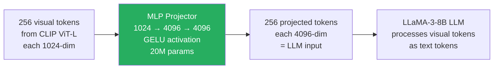

# Lesson 7.2 — The Vision-Language Connector: MLP Projectors, Q-Former, and Perceiver Resampler

---

## The Alignment Problem

After Lesson 7.1, you have N visual tokens in the vision encoder's embedding space — dimension d_vision (e.g., 1024 for CLIP ViT-L). The LLM operates in its own embedding space — dimension d_model (e.g., 4096 for LLaMA-3-8B). These two spaces are not the same. A visual token cannot be dropped directly into the LLM's input sequence.

The connector bridges this gap. It maps visual tokens from vision space to LLM space, allowing the LLM to "see" the image as if it were additional tokens in its input sequence.

The connector is where the design choices most directly affect: (a) token count fed to the LLM, (b) how much fine-grained visual detail is preserved, and (c) how easily the model can be trained.

Three major connector architectures exist. Each makes a different trade-off between simplicity, compression, and detail preservation.

---

## Connector 1: MLP Projector (LLaVA Style)

The simplest connector. A two-layer MLP with a GELU activation maps each visual token independently from d_vision to d_model.

```
For each visual token v_i ∈ R^{d_vision}:
    h = GELU(W₁ · v_i + b₁)      # Hidden layer
    z_i = W₂ · h + b₂             # Output layer
    z_i ∈ R^{d_model}             # LLM embedding dimension

Result: N visual tokens → N projected tokens, each in LLM embedding space
```

**Properties:**
- **Token count is preserved:** N visual tokens in → N projected tokens out. 256 CLIP tokens → 256 tokens fed to LLM.
- **No information loss by design:** Each token is independently projected — no aggregation or selection.
- **Very few parameters:** For ViT-L (d_vision=1024) → LLaMA-3-8B (d_model=4096): W₁ is 1024×4096 and W₂ is 4096×4096 → ~20M parameters total. Tiny.
- **Fast to train:** Converges in hours on standard hardware.
- **No cross-token interaction:** Each visual token is projected independently — the connector does not reason about relationships between visual tokens.



**Used by:** LLaVA, LLaVA-1.5, LLaVA-NeXT, Bunny, and most current open-source multimodal models. The MLP projector won out in practice because its simplicity and lossless token preservation made it easier to scale and fine-tune.

> **Interview note:** "Why do most open-source multimodal models use MLP projectors instead of more sophisticated connectors?" The answer: "MLP projectors are lossless (all visual tokens passed to LLM), have very few parameters (fast to train), and are architecturally simple (easy to debug). More complex connectors like Q-Former provide token compression but sacrifice fine-grained detail. With modern long-context LLMs and efficient attention (Flash Attention), the cost of handling 256–1024 visual tokens is manageable, making the simplicity of MLP projectors the winning trade-off for most open-source models."

---

## Connector 2: Q-Former (BLIP-2 Style)

The Q-Former (Querying Transformer) was introduced with BLIP-2 (Li et al., 2023). Instead of projecting all N visual tokens, it uses a fixed set of M learnable query tokens that extract information from the visual tokens via cross-attention. M is much smaller than N (e.g., M=32 regardless of image resolution).

**Architecture:**

The Q-Former is a small transformer with two types of attention:
1. **Self-attention among the M query tokens** — queries interact with each other
2. **Cross-attention from queries to visual tokens** — queries attend over all N visual tokens to extract relevant information

```
Input:
    M learnable query vectors q_1, ..., q_M (learned parameters)
    N visual tokens from vision encoder: v_1, ..., v_N

Q-Former forward pass:
    For each layer in Q-Former:
        q = self_attention(q)           # Queries attend to each other
        q = cross_attention(q, KV=v)    # Queries attend to visual tokens
        q = feedforward(q)

Output:
    M query output vectors, each projected to d_model
    → M tokens fed to LLM (M=32, regardless of N)
```

**Properties:**
- **Token compression:** N visual tokens (variable, e.g., 256 or 1024) → M query tokens (fixed, e.g., 32). Token count is fixed and small.
- **Information bottleneck:** 32 query tokens must summarize an entire image. Fine-grained spatial details are lost.
- **More parameters:** The Q-Former itself has millions of parameters. Harder to train than MLP.
- **Resolution agnostic:** The same 32 output tokens regardless of whether input is 256 or 1024 visual tokens.

**When the information bottleneck hurts:** Document understanding, fine-grained object recognition, reading text in images, counting objects — tasks requiring spatial detail are worse with Q-Former because 32 tokens compress away fine-grained spatial information.

**When the bottleneck helps:** Efficiency — 32 tokens vs 256 tokens dramatically reduces LLM computation. For tasks requiring high-level semantic understanding (image captioning, scene description), the quality difference is small.

**Used by:** BLIP-2, InstructBLIP, MiniGPT-4.

---

## Connector 3: Perceiver Resampler (Flamingo Style)

The Perceiver Resampler (Alayrac et al., 2022 — Flamingo) is conceptually similar to Q-Former but with a different design:

- Fixed number of learned **latent vectors** (not query tokens — they do not attend to each other first)
- The latents attend to visual features via cross-attention, "resampling" them into a fixed-size output
- Designed for video and multi-image inputs where visual token count varies dramatically

```
Perceiver Resampler:
    Learned latents: L ∈ R^{M × d}    (M fixed, e.g., 64)
    Visual features: F ∈ R^{N × d}    (N variable)
    
    For each Perceiver layer:
        L' = cross_attention(Q=L, K=F, V=F)  # Latents attend to visual tokens
        L' = self_attention(L')               # Optional self-attention
        L' = FFN(L')
    
    Output: M latent vectors → M tokens fed to LLM
```

**Properties:**
- Same compression benefit as Q-Former: variable N → fixed M output
- Designed for sequential visual inputs (video frames): latents are the same across all frames, amortizing the compression
- Slightly different inductive bias than Q-Former — latents do not have cross-token interaction before attending to visuals

**Used by:** Flamingo, Idefics, OpenFlamingo, Otter.

---

## The Trend: MLP Wins in Practice

Despite the elegance of Q-Former and Perceiver Resampler, the field has largely converged on MLP projectors for a pragmatic reason: **when paired with dynamic resolution tiling and efficient attention, MLP preserves more visual information at acceptable token cost**.

The LLaVA-NeXT paper (2024) demonstrated that a simple MLP projector with dynamic resolution tiling outperforms BLIP-2's Q-Former on most benchmarks, especially those requiring fine-grained visual understanding.

The key enablers for MLP dominance:
1. **Long-context LLMs (8K–128K context)** can absorb thousands of visual tokens
2. **Flash Attention** makes long-context computation efficient
3. **Dynamic tiling** handles high-resolution without needing compression

Q-Former/Perceiver remain relevant for:
- Very limited compute (must minimize visual tokens fed to LLM)
- Video/multi-image inputs where visual token count would be unmanageable without compression
- Edge deployment where LLM context length is the hard constraint

---

## The Connector's Role in Training

The connector is a small set of parameters that must bridge two pre-trained systems. Its training needs to reconcile what the vision encoder knows and what the LLM knows.

**Stage 1 of multimodal training** (covered in Lesson 7.4) trains ONLY the connector:
- Vision encoder: frozen (CLIP representations are too good to disturb)
- LLM: frozen (language understanding should not change at this stage)
- Connector: trained on image-caption pairs to map visual → language space

The connector's job in Stage 1 is purely alignment: "learn to express visual information in terms the frozen LLM already understands." This is why large-scale captioning datasets (LAION, CC3M) are used — simple descriptive captions are enough to teach the mapping.

After Stage 1, the connector can express visual content in language space. Stage 2 then trains the LLM to reason over these visual representations — the connector is already good at translation.

---

## Summary

| Connector | Output tokens | Complexity | Fine-grained detail | Main trade-off |
|---|---|---|---|---|
| MLP Projector | Same as input (256–4096) | Very low | Preserved | Token count grows with image resolution |
| Q-Former | Fixed (e.g., 32) | High | Lost (bottleneck) | Efficient but loses spatial detail |
| Perceiver Resampler | Fixed (e.g., 64) | Medium | Lost (bottleneck) | Designed for video/variable inputs |

- **MLP Projector:** Direct per-token linear mapping with GELU nonlinearity. Preserves all visual tokens (no compression). Simple, fast to train, ~20M parameters. Dominant in current open-source models.
- **Q-Former:** M learnable query tokens attend over N visual tokens via cross-attention. Compresses N → M (e.g., 256 → 32). Loses fine-grained spatial detail. Used in BLIP-2 family.
- **Perceiver Resampler:** M learned latents attend over N visual tokens. Same compression as Q-Former, designed for variable-length inputs across frames or images. Used in Flamingo family.
- **The trend:** MLP projectors paired with dynamic resolution tiling have outperformed Q-Former/Perceiver on fine-grained tasks. Long-context LLMs and Flash Attention make the token cost manageable.
- The connector is trained first (Stage 1) with the LLM and vision encoder frozen, learning to map visual information into the LLM's semantic space using image-caption pairs.

---
