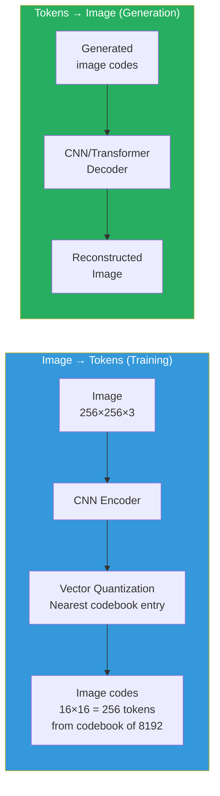
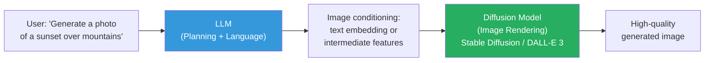
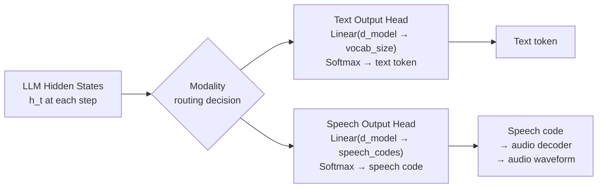

# Lesson 7.3 — How the Model Decides What to Output: Decoder Heads, Special Tokens, and Multimodal Generation

---

## Two Regimes: Understanding vs. Generation

Everything in Lessons 7.1 and 7.2 addresses **multimodal understanding** — the model takes an image as input and produces text as output. This is the dominant mode of current multimodal models (LLaVA, InternVL, Gemini for most queries).

This lesson covers **multimodal generation** — the model can produce output in modalities other than text: generating images from text, generating speech, or interleaving text and image outputs in a single response.

These are fundamentally different problems:
- Understanding adds visual tokens to the LLM's input but keeps text-only output
- Generation requires the model to output tokens from a different distribution (image tokens, speech tokens) or route to a separate decoder

Understanding how output routing works — and the trade-offs between approaches — is what distinguishes someone who has thought deeply about multimodal architecture from someone who just knows the buzzwords.

---

## How Text-Output Multimodal Works (The Simple Case)

For vision-to-text models (LLaVA, GPT-4V, Claude 3), the output side is unchanged from a standard LLM. The architecture is:

```
[visual tokens (from projector)] + [text tokens] → standard LLM → text token output
```

The LLM's output head is identical to a text-only model — it predicts over the vocabulary at each output step. The visual tokens are simply prefix context that the LLM attends to when generating text.

There is no output routing decision here. Visual tokens go in; text always comes out. The model never needs to decide "should I output an image or text?" — text is the only output option.

---

## Approach 1: Special Tokens for Modality Switching

To enable multimodal output, the LLM's vocabulary is extended with special tokens that signal modality transitions:

```
Standard vocabulary: "Hello", "world", ".", "the", "cat", ... (32K–128K tokens)

Extended vocabulary: ... same as above ...
    + <image_start>
    + <image_end>  
    + <image_0001> through <image_8192>   # discrete image token IDs
    + <audio_start>
    + <audio_end>
    + <audio_0001> through <audio_4096>   # discrete audio codes
```

When the model generates `<image_start>`, it switches into "image generation mode" — subsequent tokens are image codes rather than text tokens. When it generates `<image_end>`, it switches back to text generation.

**Example output from a multimodal generation model:**
```
User: "Describe what a cat looks like, then show me one."

Model output sequence:
"A cat is a small domesticated carnivore with soft fur, pointed ears...
<image_start>
[4096 image code tokens here]
<image_end>
This image shows a typical domestic cat with the features described above."
```

The same LLM vocabulary is used throughout. The decoder at the end converts image codes back to pixels using a trained image decoder (VQGAN or diffusion model).

---

## Approach 2: VQ-VAE Image Tokenization for End-to-End Generation

For the model to generate images by predicting discrete tokens, you need a way to convert images into discrete token sequences and back.

**VQ-VAE (Vector Quantized Variational Autoencoder)** does this:



**VQGAN** (the standard modern version) uses adversarial training to produce higher-quality discrete image representations. Each image is encoded into a 2D grid of discrete codes (e.g., 16×16=256 codes for a 256×256 image), where each code is an index into a learned codebook of 8,192 entries.

The LLM now predicts image codes as tokens — exactly like predicting text tokens, but from the image codebook. This is truly end-to-end: one model, one training objective (next-token prediction), one inference pass. No separate image generation system needed.

**Models using this approach:** Show-o (image + text in unified LLM), LWM (world model), Unified-IO 2, DALL-E 1 (the original — GPT-3 predicting image tokens).

**Limitation:** VQGAN-encoded images cannot match diffusion model quality. The discrete tokenization loses information. This is why high-quality image generation has moved toward diffusion.

---

## Approach 3: LLM as Planner + Diffusion as Renderer

The dominant approach for high-quality image generation in multimodal systems:



Here, the LLM does not generate image pixels. Instead, it:
1. Understands the user's image request
2. Generates a detailed, refined prompt for the diffusion model
3. The diffusion model renders the actual image

This is not truly end-to-end (two separate models), but it achieves much higher image quality than VQ-VAE approaches. GPT-4o with image generation uses this pattern (connected to DALL-E 3 as the renderer).

**A variant (EMU, GILL):** The LLM generates intermediate conditioning features (not just text prompts) — dense feature vectors that condition the diffusion model more precisely than text alone. Still two-model, but more tightly coupled.

---

## Approach 4: Output Heads for Different Modalities

For models designed to produce both text and speech (or other modalities), a common approach is **modality-specific output heads**:



The routing decision is made by the model based on context — typically controlled by special tokens that appear in the input or that the model learns to generate as mode-switch signals.

**SpeechLM, VoxtLM, and similar models** use this architecture for joint text and speech generation from a single transformer backbone.

---

## What the LLM Actually "Sees" During Multimodal Generation Training

For a model trained to generate both text and image tokens, the training sequences look like:

```
"<text>User: show me a picture of a sunset</text>
<text>Model: Here is a sunset image:</text>
<image_start>
2048 1293 8192 3847 ... [256 image code tokens from VQGAN encoding of a real sunset image]
<image_end>
<text>The warm colors reflect off the mountains in the foreground.</text>"
```

The training objective is the same next-token prediction on the full sequence. The model learns that after `<image_start>`, it should predict image codes (not text vocabulary tokens); after `<image_end>`, it switches back to text.

This is conceptually elegant — one model, one objective, multiple output modalities. The challenge is the training data requirement: you need many examples of interleaved text and images where the image codes are pre-computed using the VQGAN encoder.

---

## The Practical Reality: What Most Production Systems Do

For most real multimodal applications in 2024–2025, the architecture is:
- **Input:** Vision encoder + MLP connector → visual tokens → LLM → text output
- **Image generation output (if any):** LLM generates a refined prompt → separate diffusion API call

True end-to-end multimodal generation (same model for understanding and generating images) is still primarily a research frontier, with Show-o, Janus, and Unified-IO as representative open models. Commercial systems like GPT-4o and Gemini Ultra have this capability but use proprietary architectures.

> **Interview note:** "How does GPT-4 generate images?" The honest answer: "GPT-4 itself does not generate images — it generates refined text prompts for DALL-E 3, which renders the image. GPT-4 handles the understanding, intent refinement, and response, while DALL-E handles the pixel generation. True end-to-end text-to-image generation from the same LLM backbone (using discrete image tokens like VQGAN codes) is an active research area but is not used in most production systems due to lower image quality compared to diffusion-based approaches."

---

## Summary

- **Understanding-only models** (LLaVA, most open-source): visual tokens added to LLM input; text-only output. No output routing needed. The dominant architecture today.
- **Special token modality switching:** Extend the LLM's vocabulary with modality control tokens (`<image_start>`, `<image_end>`) and discrete image/audio tokens. The model predicts these tokens like text — end-to-end but requires quality trade-offs.
- **VQ-VAE/VQGAN image tokenization:** Encodes images into discrete token sequences (256–1024 codes per image from a codebook of 8,192). Allows the LLM to generate images by predicting these codes. End-to-end but lower quality than diffusion.
- **LLM + diffusion renderer:** LLM generates conditioning for a separate diffusion model. Not end-to-end but achieves highest image quality. Used by GPT-4o → DALL-E 3, Google Gemini → Imagen.
- **Modality-specific output heads:** Separate output projection heads for text vs. speech/image codes, routed by special tokens. Used in joint text+speech models.
- The field is moving toward true end-to-end unified generation (Show-o, Janus), but two-model approaches (LLM + diffusion) dominate production systems today due to superior image quality.

---
