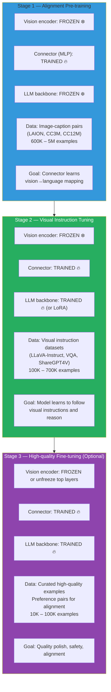

# Lesson 7.4 — Training a Multimodal Model: Stages, Data, and What Gets Frozen When

---

## Why Multimodal Training Cannot Be Done in One Shot

You have three pre-trained components: a vision encoder (CLIP ViT), a connector (MLP projector), and an LLM backbone. You want to combine them into a model that understands images and responds to visual queries.

You cannot simply concatenate their parameters and train everything together end-to-end on visual instruction data. Here is why:

**The CLIP vision encoder** was trained on 400M image-text pairs via contrastive learning. It produces excellent visual representations that already carry semantic meaning aligned with language. Training it on a small multimodal dataset would destroy this pre-training — catastrophic forgetting of the visual representations.

**The LLM backbone** was trained on trillions of text tokens. It has deep language understanding, reasoning capability, and world knowledge. Visual instruction data typically has 100K–700K examples — orders of magnitude less than the LLM's original training. Training the full LLM on this data risks catastrophic forgetting of language capabilities.

**The connector** starts with random weights. It needs to learn to bridge two pre-trained spaces. Training it alongside massive frozen systems is the efficient way — the connector is the only component that needs to change in the early stages.

The solution: **staged training**, where different components are frozen or trainable at each stage.

---

## The Three-Stage Training Pipeline



---

## Stage 1: Alignment Pre-training — Teaching the Connector

**What happens:** The connector (MLP projector, ~20M parameters) learns to map visual tokens from the vision encoder's embedding space into the LLM's embedding space. The vision encoder and LLM remain completely frozen.

**Why freeze both the encoder and LLM:**
- The vision encoder already knows how to represent images
- The LLM already knows how to process its embedding space
- The connector's job is purely translation — learning this mapping is fast and does not require changing either endpoint

**Training data:** Simple image-caption pairs. At this stage, the caption can be as simple as "A cat sitting on a couch" or "A red sports car parked on a street." The goal is not instruction following — it is teaching the connector what visual features correspond to which language concepts.

| Dataset | Size | Description |
|---|---|---|
| CC3M (Conceptual Captions) | 3.3M | Web-scraped image-alt-text pairs |
| CC12M | 12M | Larger version of CC3M |
| LAION-400M (subset) | 400M (sample 1-5M) | Large-scale web image-text pairs |
| COCO-Caption | 330K | Manually captioned images, high quality |
| LLaVA-CC3M-Pretrain-595K | 595K | Filtered and formatted for LLaVA-style training |

**Training configuration:**
```python
# Stage 1: Only connector parameters are trainable
for name, param in model.named_parameters():
    if "projector" in name or "connector" in name:
        param.requires_grad = True    # Only connector is trained
    else:
        param.requires_grad = False   # Everything else frozen

# Training settings
stage1_args = TrainingArguments(
    num_train_epochs=1,          # Only 1 epoch — just needs basic alignment
    learning_rate=1e-3,          # Higher LR OK — only small connector training
    per_device_train_batch_size=32,
    gradient_accumulation_steps=2,
    bf16=True,
    warmup_ratio=0.03,
)
```

**Expected outcome:** After Stage 1, if you feed the model an image and ask "describe this image," it can produce a basic caption. It cannot follow complex instructions or reason over images — just translate visual content to language.

---

## Stage 2: Visual Instruction Tuning — Teaching the Model to Reason

**What happens:** The LLM backbone is unfrozen (or trained with LoRA) alongside the connector. The vision encoder remains frozen. The model learns to follow instructions about images, answer questions, reason over visual content, and handle multi-turn visual conversations.

**Why unfreeze the LLM in Stage 2 but not earlier:**
- The connector is now trained and can express visual information in the LLM's embedding space
- The LLM needs to adapt its attention patterns and reasoning to incorporate visual tokens
- Without unfreezing the LLM, the model cannot learn visual reasoning — it can only describe images at a basic level

**Data types for Stage 2:**

| Data type | Example | Purpose |
|---|---|---|
| Visual instruction following | Image + "Describe what you see in detail" → 3-sentence description | General visual comprehension |
| Visual question answering (VQA) | Image + "How many people are in this image?" → "3" | Precise visual information extraction |
| Visual reasoning | Image + "What is wrong in this picture?" → analysis | Higher-order visual understanding |
| Chart/diagram understanding | Graph image + "What was the highest value in Q3?" → "47%" | OCR + structured visual data |
| Multi-turn visual conversation | Image + follow-up questions over 4 turns | Conversation coherence with visual context |
| Interleaved text-image | Document with embedded images + "Summarize this article" | Multi-image context |
| Spatial reasoning | Image + "Is the red ball to the left or right of the blue cube?" | Spatial understanding |

**Key datasets for Stage 2:**

| Dataset | Size | Content |
|---|---|---|
| LLaVA-Instruct-150K | 150K | GPT-4 generated visual instruction pairs from COCO images |
| ShareGPT4V | 100K | GPT-4V generated high-quality descriptions and Q&A |
| VQAv2 | 1.1M | Visual question-answer pairs on COCO images |
| TextVQA | 45K | VQA requiring reading text in images |
| AI2D | 5K | Science diagram understanding |
| DocVQA | 50K | Document understanding, OCR-heavy |
| ChartQA | 20K | Chart and graph question answering |
| LLaVA-665K | 665K | Mixed instruction, VQA, conversation data |

**Training configuration:**
```python
from peft import LoraConfig

# Stage 2: LLM trained with LoRA, connector fully trained, vision encoder frozen
lora_config = LoraConfig(
    r=128,           # Higher rank for multimodal — model needs significant adaptation
    lora_alpha=256,
    target_modules=["q_proj", "k_proj", "v_proj", "o_proj",
                    "gate_proj", "up_proj", "down_proj"],
    lora_dropout=0.05,
    task_type="CAUSAL_LM"
)

stage2_args = TrainingArguments(
    num_train_epochs=1,           # 1 epoch typically sufficient for stage 2
    learning_rate=2e-4,
    per_device_train_batch_size=8,
    gradient_accumulation_steps=2,
    bf16=True,
    warmup_ratio=0.03,
    lr_scheduler_type="cosine",
)
```

**The data collator challenge — loss masking:**

For visual instruction training, loss must be computed only on assistant response tokens. Additionally, visual tokens (the image) are input context — they should not be predicted.

```python
def multimodal_data_collator(examples):
    """
    Apply loss masking:
    - Image tokens: no loss (they are input context)
    - User instruction tokens: no loss (input)
    - Assistant response tokens: apply loss (these are what we learn)
    """
    
    for example in examples:
        labels = example["input_ids"].copy()
        
        # Mask everything up to and including the start of assistant response
        assistant_start = find_assistant_token_position(labels, tokenizer)
        labels[:assistant_start] = [-100] * assistant_start
        
        # Special: image placeholder tokens should never be predicted
        for i, token_id in enumerate(labels):
            if token_id == IMAGE_TOKEN_ID:
                labels[i] = -100
        
        example["labels"] = labels
    
    return batch_collate(examples)
```

---

## Stage 3: High-Quality Fine-tuning and Alignment (Optional)

Used by production models (Gemini, Claude, GPT-4V). For open-source models, often skipped or simplified.

**What happens:**
- All parameters potentially trainable (or targeted PEFT)
- Vision encoder top layers may be unfrozen for very challenging visual tasks
- Dataset is high-quality curated data, not large scale

**Data for Stage 3:**
- Carefully curated visual instruction data (human-written, not GPT-4 generated)
- Preference pairs for alignment (chosen/rejected responses to visual queries)
- Safety-specific data: refusal examples for inappropriate image requests
- Hard examples where Stage 2 model fails (task-specific failure mode remediation)

---

## What Each Stage Teaches — The Mental Model

| Capability | Taught in Stage |
|---|---|
| "These visual tokens represent a cat" | Stage 1 |
| "The cat is sitting on a couch, not a bed" | Stage 1 |
| "You asked me what the cat is doing — it is sleeping" | Stage 2 |
| "There are 3 cats in the image" (counting) | Stage 2 |
| "The text in the image says 'STOP'" (OCR) | Stage 2 |
| "I should not describe explicit images even if asked" | Stage 3 |
| "Your description request is ambiguous — let me clarify" | Stage 3 |

---

## Fine-Tuning an Existing Multimodal Model

You do not always start from scratch. For most production use cases, you take an existing multimodal model (LLaVA-NeXT, InternVL-2, PaliGemma) and fine-tune it for a specific domain or task.

**Domain-specific visual fine-tuning:**

Example: Fine-tuning LLaVA for radiology (reading chest X-rays).

```python
# Start from LLaVA-NeXT-8B (already has Stage 1 + Stage 2 training)
# Fine-tune with medical visual instruction data

# Data: (chest X-ray image, radiology report) pairs
# Instruction format: "Describe the findings in this chest X-ray."

# Keep vision encoder frozen — CLIP representations still useful for medical images
# Fine-tune the LLM + connector with LoRA on medical data

lora_config = LoraConfig(
    r=64,
    lora_alpha=128,
    target_modules=["q_proj", "k_proj", "v_proj", "o_proj"],
    task_type="CAUSAL_LM"
)

# Training data: 50K (X-ray, report) pairs
# Expected result: model learns radiology terminology and reporting format
# But it retains general visual understanding from the original training
```

**Critical rule:** When fine-tuning a pre-trained multimodal model, keep the vision encoder frozen unless you have compelling evidence it is the limiting factor. The connector and LLM are where domain adaptation happens most efficiently.

> **Interview note:** "Walk me through the stages of training a multimodal model." Complete answer: "Three stages. Stage 1: freeze everything except the connector (MLP projector), train on 600K–5M image-caption pairs — the connector learns to map visual tokens to the LLM's embedding space. Takes hours on a few GPUs. Stage 2: unfreeze the LLM (or use LoRA), keep vision encoder frozen, train on 100K–700K visual instruction pairs — the model learns to follow visual instructions, answer questions, reason over images. Stage 3 (optional): curated high-quality data and preference alignment for production quality. For fine-tuning an existing multimodal model, skip Stage 1 (connector already trained), apply LoRA on Stage 2-style training for your domain."

---

## Summary

- Multimodal training is staged because: the vision encoder is too valuable to disturb, the LLM is too powerful to risk catastrophic forgetting, and the connector is the only untrained component at the start.
- **Stage 1 (Alignment):** Only connector trained. Image-caption pairs. Teaches vision→language mapping. Fast — hours on a few GPUs.
- **Stage 2 (Visual Instruction Tuning):** LLM + connector trained (vision encoder frozen). Visual instruction, VQA, multi-turn conversation datasets. Builds actual visual reasoning capability.
- **Stage 3 (Optional):** Curated high-quality data, alignment, safety. Used by production systems.
- Loss masking is critical: only apply loss to assistant response tokens — not to image placeholder tokens, system prompts, or user instructions.
- When fine-tuning an existing multimodal model: start from Stage 2 (skip Stage 1 if connector is already trained), apply domain-specific visual instruction data, keep vision encoder frozen.

---
