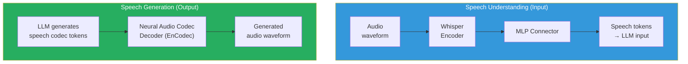

# Lesson 7.5 — Audio and Video in LLMs: How Speech and Video Are Tokenized and Processed

---

## Why Audio and Video Are Harder Than Images

Images are a static 2D signal. Audio and video add a third dimension: time. This creates two compounding problems:

1. **Sequence length explosion:** A 30-second audio clip at 16kHz contains 480,000 audio samples. A 30-second video at 24fps with 256 visual tokens per frame contains 720 frames × 256 = 184,320 visual tokens. Even with aggressive compression, these are far longer sequences than any text input.

2. **Temporal structure:** Unlike an image, where every patch contributes equally, audio and video have temporal dependencies — the meaning of a sound at time t depends on what came before. This temporal structure must be captured in the representation.

Understanding how speech and video are handled gives you the architectural vocabulary to discuss multimodal systems that go beyond image understanding.

---

## Part 1: Audio / Speech in LLMs

### The Audio Tokenization Pipeline

The goal is the same as image tokenization: convert a continuous signal (audio waveform) into a discrete sequence of tokens that an LLM can process.

Two distinct approaches exist:

**Approach A: Encoder-based speech representation (ASR-style)**

Use a pre-trained speech encoder (like Whisper's encoder) to convert audio into dense continuous representations, then project to LLM space via a connector.

```
Audio waveform
    → Feature extraction (log-mel spectrogram)
    → Whisper encoder (or similar)
    → Dense speech representations: T × d_audio tokens
    → MLP connector
    → T' × d_model tokens fed to LLM
```

This is the approach used by models like SALMONN (Whisper encoder + connector + LLM) and Qwen-Audio. The LLM "hears" audio as a sequence of continuous speech representations, much like how it "sees" images as visual tokens.

**Token count for encoder-based approach:**
- Whisper encoder processes audio in 30-second chunks at 80-channel mel spectrogram
- For each second of audio: approximately 2–25 tokens depending on downsampling
- 10-second speech → ~50–250 tokens fed to LLM (after compression)
- Much more compact than raw audio samples

**Approach B: Discrete speech codec tokenization (AudioLM-style)**

Use a neural audio codec (EnCodec, SoundStream, Codec2) to convert audio into discrete token sequences — like VQGAN for images.

```
Audio waveform
    → Neural audio codec (EnCodec, SoundStream)
    → Hierarchical discrete codes
         Level 0 (coarse): ~75 tokens/second
         Level 1 (fine): another 75 tokens/second
         Level 2-7 (very fine): more levels for quality
    → LLM predicts these discrete codes (like text tokens)
```

For a 10-second audio clip at just level 0: 10 × 75 = 750 tokens. With all 8 codec levels: 10 × 75 × 8 = 6,000 tokens. The codec is hierarchical — you can use fewer levels for lower quality with fewer tokens.

**Why discrete codecs matter for speech generation:**
- Just like VQGAN enables image generation by predicting discrete image codes, speech codecs enable speech generation by predicting discrete audio codes
- The LLM can interleave text tokens and speech codec tokens in its output sequence
- This enables true speech-to-speech or text-to-speech without a separate TTS system
- Used by: VoiceBox, AudioPaLM, SpeechLM, VALL-E



### The LLM's Perspective on Audio Tokens

Whether using encoder-based or codec-based audio, the LLM receives a sequence of tokens representing audio. The key difference from text:
- Text tokens are semantically discrete ("the" is different from "cat")
- Audio tokens are temporally continuous — the meaning of token 50 depends on tokens 1–49

The LLM handles this well because its attention mechanism is already designed for sequence dependencies. The main challenge is sequence length — even compressed audio generates many more tokens per second of content than text.

### Real-World Audio-Capable Models

| Model | Architecture | Capability |
|---|---|---|
| Whisper (OpenAI) | Encoder-only | ASR only — no generative LLM |
| Qwen-Audio | Whisper encoder + Qwen LLM | Audio understanding, speech recognition, audio QA |
| SALMONN | Whisper encoder + BEATs + Vicuna | Speech + general audio understanding |
| VALL-E | LLaMA + EnCodec | Text-to-speech generation |
| AudioPaLM | PaLM + SoundStream codec | Speech understanding and generation |
| GPT-4o (voice mode) | Proprietary | Native real-time speech understanding and generation |

---

## Part 2: Video in LLMs

### The Naive Approach — And Why It Fails

The obvious approach: extract frames from the video at some rate (e.g., 1 fps), process each frame as an image using the ViT + connector pipeline, and concatenate all visual tokens.

Problem: the token count is catastrophic.

```
30-second video at 2 fps = 60 frames
Each frame at 448×448 with pixel shuffle (256 tokens/frame after compression):
60 × 256 = 15,360 visual tokens

For a 5-minute video: 300 × 256 = 76,800 visual tokens

This completely overwhelms any practical context window.
```

Even with Flash Attention making long contexts computationally feasible, 76,800 visual tokens leave no room for the conversation text, and quadratic-attention memory pressure makes this impractical.

### Solution 1: Sparse Temporal Sampling

Sample frames at a low rate (1 fps or even 0.5 fps) and only pass sampled frames to the LLM. Simple and effective for low-motion content.

**Limitation:** Misses events between sampled frames. 0.5 fps samples only every 2 seconds — a car accident lasting 0.5 seconds is invisible.

**When it works:** Static or slow-changing videos (lectures, cooking demonstrations, presentations). When the main content is semantic (what objects are present, what is written on the slide) rather than temporal (what happened in the last 0.1 seconds).

### Solution 2: Temporal Token Pooling

After extracting visual tokens from each frame, **pool across neighboring frames** to produce one set of tokens representing multiple frames.

```
Frame 1: 256 visual tokens
Frame 2: 256 visual tokens
Frame 3: 256 visual tokens
Frame 4: 256 visual tokens

→ Temporal average pooling across 4 frames
→ 256 tokens representing the 4-frame temporal window
```

This reduces token count proportionally: 4 frames → 1 set of 256 tokens instead of 4 × 256. The model sees the average visual content over time — good for scenes with slow motion, bad for fast-moving action.

### Solution 3: Key Frame Selection

Identify frames that are actually different from their neighbors (key frames) and skip redundant frames.

```python
def select_key_frames(frames, threshold=0.1):
    """
    Select frames where the visual content changes significantly.
    Uses pixel-level difference or embedding difference.
    """
    key_frames = [frames[0]]
    
    for i in range(1, len(frames)):
        # Compute difference from last key frame
        diff = compute_frame_similarity(frames[i], key_frames[-1])
        
        if diff > threshold:  # Sufficient change → this is a key frame
            key_frames.append(frames[i])
    
    return key_frames
```

In a static lecture slide video, 5 minutes might have only 20 key frames (one per slide transition) instead of 9,000 frames at 30fps. Key frame selection brings the token count down from 9,000 × 256 = 2.3M to 20 × 256 = 5,120 tokens — manageable.

**Limitation:** Action sequences, sports, fast-moving content — everything is a key frame.

### Solution 4: Video-Specific Vision Encoders (Video ViT)

Instead of processing each frame independently and concatenating, use a **Video ViT** that processes multiple frames jointly:

```
Video ViT processes 4D input: (T frames) × (H/P) × (W/P) spatial patches
Applies 3D attention: each spatial patch attends to corresponding patches across time
Outputs temporally-aware patch tokens
```

A Video ViT inherently learns temporal structure — which spatial regions change over time, how motion flows, what events occur. The output is a compressed temporal-spatial representation rather than per-frame independent tokens.

Models using this approach: InternVideo, Video-LLaVA, VideoChat.

### Solution 5: Token Merging Across Frames (ToMe for Video)

**Token Merging (ToMe)** identifies visually redundant tokens across frames and merges them:

```
Frame 1 tokens: background tokens (static sky, static building)
Frame 2 tokens: same background tokens (barely changed)

→ Merge these redundant background tokens across frames
→ Keep distinct tokens (the moving car in the foreground)
```

Result: important/dynamic content retains full temporal resolution; static background is collapsed. The model gets high temporal resolution on the interesting parts of the video at much lower total token count.

---

## Long Video Understanding: The Open Research Challenge

For videos longer than a few minutes, even the best compression strategies hit limits. This is an active research area with several approaches:

**Chunked processing:** Process the video in overlapping chunks, maintain a summary state between chunks.

**Memory-augmented video:** Use an external memory bank to store compressed representations of past video segments; the LLM retrieves from this memory when needed.

**Hierarchical encoding:** Coarse pass over the full video to identify relevant segments; fine-grained processing only on relevant segments (similar to RAG for video).

None of these are fully solved. Long-video understanding (> 5 minutes) remains significantly harder than short-clip understanding.

---

## The Common Thread: The Sequence Length Challenge

Image, audio, and video all share the same fundamental challenge when added to LLMs: they generate far more tokens than text for equivalent content:

| Content | Typical token count | Notes |
|---|---|---|
| 1 sentence of text | ~15 tokens | Compact |
| 1 paragraph | ~75 tokens | |
| Standard image (224×224) | 256 tokens | ~17× a sentence |
| High-res image (1344×1344, tiled) | 4,672 tokens | ~312× a sentence |
| 10s audio clip | 150–750 tokens | Varies by compression |
| 30s video (sparse sampling) | 1,920–7,680 tokens | Depends on fps, resolution |
| 5-minute video | 19,200–76,800 tokens | Requires aggressive compression |

This sequence length explosion is why:
- Flash Attention is not optional for multimodal models (Lesson 11.6)
- KV cache management (Lesson 11.2) becomes critical — visual tokens are held in KV cache throughout generation
- Long-context LLMs (32K, 128K, 1M tokens) were developed partly driven by multimodal needs

> **Interview note:** "Why do multimodal models need special inference optimization?" Strong answer: "Visual tokens are expensive in two ways. First, they consume a large fraction of the context window — a single high-resolution image generates 4,672 tokens, leaving limited room for conversation. Second, all visual tokens are held in KV cache throughout the generation — a 30-second video clip might contribute 10,000 entries to the KV cache that must persist for the entire response. This makes Flash Attention essential (for efficient attention over long sequences) and PagedAttention critical (for efficient KV cache management when visual tokens are a large fraction of the cache)."

---

## Summary

**Audio:**
- Encoder-based: Whisper or similar encoder → dense representations → MLP connector → LLM. Compact (50–250 tokens per 10 seconds). Good for speech understanding.
- Codec-based: Neural audio codec (EnCodec, SoundStream) converts audio to discrete tokens (75 tokens/second/level). Enables speech generation by predicting codec codes. Used for voice assistants and TTS.

**Video:**
- Naive frame extraction creates catastrophic token counts: a 5-minute video at 2fps with 256 tokens/frame = 76,800 visual tokens.
- Key strategies: sparse temporal sampling (for low-motion content), temporal token pooling (average across neighboring frames), key frame selection (skip redundant frames), Video ViT (joint spatiotemporal encoding), token merging (collapse redundant cross-frame tokens).
- Long video (> 5 minutes) remains an open research challenge — memory-augmented approaches and hierarchical encoding are active directions.

**The unifying challenge:** All media types generate far more tokens than text. Images (256–9,792 tokens), audio (50–750 tokens per 10 seconds), and video (1,920–76,800+ tokens) drive the need for long-context LLMs, Flash Attention, and careful KV cache management in multimodal systems.

---
