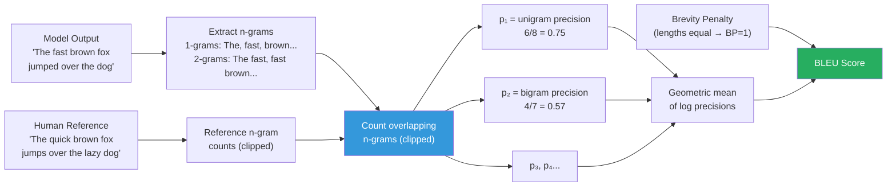
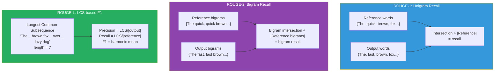
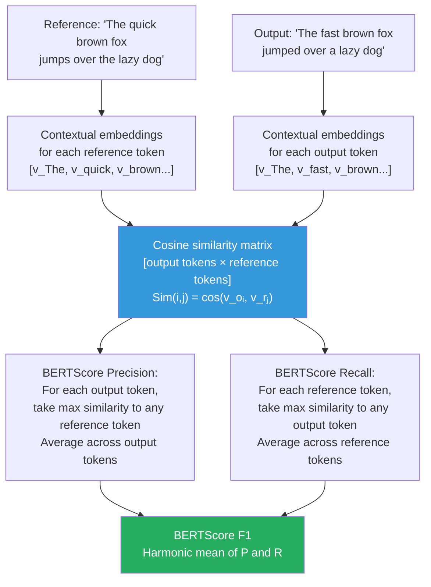

# Lesson 8.2A — BLEU, ROUGE, and BERTScore: Generation Metrics From the Ground Up

> *Lesson 8.2 (Benchmark Evaluation) and Lesson 8.3 (LLM-as-Judge) reference these metrics by name and assume you know what they are. This lesson builds that foundation. Read it before or alongside those two lessons.*

---

## The Problem: How Do You Know If the Model Said the Right Thing?

Evaluating classification models is simple. The model outputs a class label — "positive" or "negative" — and you check whether it matches the ground truth. Right or wrong. Accuracy in, accuracy out.

Language generation breaks that simplicity completely. When a model is asked to summarize a legal document, translate a sentence, or answer a medical question, the output is free-form text. There is no single correct answer. "The patient experienced cardiac arrest" and "The patient suffered a heart attack" convey the same fact. A naive string-match evaluation marks the second one wrong if the reference says the first. That is useless.

This is the problem that BLEU, ROUGE, and BERTScore were each built to solve — and each one reflects a different theory of what "correctness" means for generated text.

BLEU (2002) came from machine translation, where the intuition was: a good translation shares most of its words and phrases with a human-written reference. ROUGE (2004) came from summarization, where the concern was the opposite: a good summary captures most of the key information from the original. BERTScore (2020) came from the recognition that both BLEU and ROUGE have a fatal flaw — they cannot tell that "happy" and "joyful" mean the same thing.

Understanding these three metrics is not optional for anyone working with LLMs. Interviewers ask about them routinely because the choice of metric directly determines whether your evaluation actually measures model quality — or measures something else entirely.

---

## BLEU — Bilingual Evaluation Understudy

### The Idea

BLEU was designed for machine translation. Its founding assumption: a good translation shares n-grams (contiguous sequences of words) with a human-translated reference. If the human reference says "The cat sat on the mat" and the model outputs "The cat sat on the mat," every n-gram matches — perfect score. If the model outputs something completely different, the n-gram overlap is low.

BLEU measures **precision** — of the n-grams in the model's output, what fraction appear in the reference? This is the right question for translation: if your output contains words or phrases not in the reference, they are probably wrong.

### How It Is Computed

BLEU computes n-gram precision for multiple n (typically n = 1, 2, 3, 4) and combines them geometrically. Then it applies a brevity penalty to prevent the model from gaming precision by outputting a single word.

```
Modified Precision for n-grams:
p_n = (count of n-grams in output that appear in reference) / (total n-grams in output)

BLEU = BP × exp( Σ wₙ × log(pₙ) )

Where:
- BP = Brevity Penalty: 1 if output length ≥ reference length, else e^(1 - ref_len/out_len)
- wₙ = weight per n-gram order, typically 1/4 for n=1,2,3,4
- The geometric mean of log precisions ensures that if any pₙ = 0, BLEU = 0
```

The "modified" in modified precision is important. Without it, a model could repeat "the the the the" to rack up unigram matches. Modified precision clips each matched n-gram by the maximum number of times it appears in the reference.


*BLEU computation pipeline. N-gram precision is computed at each order, combined geometrically, and multiplied by the brevity penalty.*

### A Concrete Calculation

Use this fixed pair throughout to compare all three metrics:

- **Reference:** `"The quick brown fox jumps over the lazy dog"` (9 words)
- **Output:** `"The fast brown fox jumped over a lazy dog"` (9 words)

**Unigram precision (p₁):**

Go through each word in the output and check if it appears in the reference (with clipping):

| Output word | In reference? |
|---|---|
| The | ✅ |
| fast | ❌ |
| brown | ✅ |
| fox | ✅ |
| jumped | ❌ (reference has "jumps") |
| over | ✅ |
| a | ❌ (reference has "the") |
| lazy | ✅ |
| dog | ✅ |

Matches: 6 out of 9 output words → **p₁ = 6/9 ≈ 0.667**

**Bigram precision (p₂):**

Output bigrams: "The fast", "fast brown", "brown fox", "fox jumped", "jumped over", "over a", "a lazy", "lazy dog" → 8 bigrams.
Matches in reference: "brown fox", "over the" (no — output has "over a"), "lazy dog" = 2 exact matches → **p₂ = 2/8 = 0.25**

Notice how quickly BLEU degrades. "jumped" instead of "jumps" breaks "fox jumped" and "jumped over" as bigrams. "fast" instead of "quick" breaks "The fast" and "fast brown". By the time you get to 4-grams, BLEU is near zero despite the sentence meaning the same thing.

**Brevity penalty:** Lengths are equal (9 = 9), so BP = 1.

**Final BLEU-2 ≈ 0.408** (geometric mean of 0.667 and 0.25). For a sentence that is semantically almost identical to the reference.

### BLEU's Fundamental Limitation

BLEU cannot recognize synonyms. "quick" and "fast" are the same in any meaningful sense — BLEU gives you zero credit for "fast." "jumps" and "jumped" are the same verb in different tenses — zero credit. This is not a quirk; it is a fundamental consequence of string matching. When you use BLEU to evaluate a model, you are measuring how closely its vocabulary choices match the reference, not whether its output is correct.

> **Interview note:** "What is BLEU and what are its limitations?" The weak answer: "BLEU measures n-gram overlap and has a brevity penalty." The strong answer: "BLEU computes modified n-gram precision — the fraction of n-grams in the model output that appear in the reference — geometrically averaged across n=1 to 4. It was designed for translation, where reference-vocabulary alignment is a reasonable proxy for quality. Its core limitation is that it is a lexical metric: 'fast' gets zero credit when the reference says 'quick,' and 'jumped' gets zero credit when the reference says 'jumps.' For tasks with diverse valid expressions — summarization, open-ended QA, instruction following — BLEU systematically underestimates quality for any model that paraphrases rather than copies the reference. BLEU scores below 0.3 on standard MT benchmarks typically indicate poor output; above 0.4 is generally competitive — but these thresholds do not transfer to other tasks."

---

## ROUGE — Recall-Oriented Understudy for Gisting Evaluation

### The Idea

ROUGE was designed for summarization evaluation. It flips BLEU's concern: where BLEU asks "how many words in the output are correct?" ROUGE asks "how many words from the reference did the output capture?"

This is **recall** — the fraction of the reference that appears in the output. For summarization, recall is the right question: a good summary must cover the key points of the source. Missing important content is a failure even if everything you wrote is accurate.

### The Three Main Variants

**ROUGE-1** counts unigram (individual word) overlap between output and reference.

**ROUGE-2** counts bigram (two-word phrase) overlap. It is more sensitive to phrase-level structure than ROUGE-1.

**ROUGE-L** measures the Longest Common Subsequence (LCS) — the longest sequence of words that appears in both output and reference in the same order, without requiring the words to be adjacent. This captures structural similarity while allowing for some reordering.


*The three ROUGE variants. ROUGE-1 and ROUGE-2 measure n-gram recall. ROUGE-L measures longest common subsequence, allowing words to be non-adjacent.*

### Calculating ROUGE on the Same Example

- **Reference:** `"The quick brown fox jumps over the lazy dog"` (9 words)
- **Output:** `"The fast brown fox jumped over a lazy dog"` (9 words)

**ROUGE-1 Recall:** Count how many reference words appear in the output:

| Reference word | In output? |
|---|---|
| The | ✅ |
| quick | ❌ |
| brown | ✅ |
| fox | ✅ |
| jumps | ❌ (output has "jumped") |
| over | ✅ |
| the | ❌ (output has "a") |
| lazy | ✅ |
| dog | ✅ |

Captured: 6 out of 9 reference words → **ROUGE-1 Recall = 6/9 ≈ 0.667**

**ROUGE-L:** The longest common subsequence is "The brown fox over lazy dog" (skipping "quick"/"fast" and "jumps"/"jumped" and "the"/"a"). Length = 6.

- Precision = 6/9 ≈ 0.667
- Recall = 6/9 ≈ 0.667
- F1 = 0.667

ROUGE-L is more forgiving than ROUGE-2 because it does not require adjacency — "brown fox" and "over lazy dog" can be matched as part of the LCS even if other words between them differ.

### ROUGE's Limitation

Like BLEU, ROUGE is a lexical metric — it requires exact string matches. "quick" and "fast" have zero overlap. A model that writes fluent, semantically correct summaries using different vocabulary than the reference will score lower than a model that copies phrases from the source text verbatim, even if the copying model produces an inferior summary. This makes ROUGE especially problematic for evaluating abstractive summarization, where good models are expected to paraphrase.

---

## BERTScore — Semantic Similarity via Contextual Embeddings

### The Idea

BERTScore (Zhang et al., 2020) starts from a different premise: instead of counting word matches, compute the **semantic similarity** between the output and reference using a pre-trained language model.

A BERT model (or RoBERTa, DeBERTa, etc.) converts each token in a sentence into a dense embedding vector — a point in a high-dimensional space where semantically similar words are geometrically close. "happy" and "joyful" land near each other. "cat" and "dog" are closer to each other than either is to "skyscraper."

BERTScore matches each token in the output to the most similar token in the reference using cosine similarity, and aggregates these similarities into precision, recall, and F1 scores.

### How It Is Computed


*BERTScore computation. A similarity matrix is built between all output-reference token pairs. Precision uses greedy matching from the output side; recall uses greedy matching from the reference side.*

### Calculating BERTScore on the Same Example

The key mismatches are the words BLEU and ROUGE penalized:

| Output token | Best matching reference token | Cosine similarity |
|---|---|---|
| "The" | "The" | 1.00 |
| "fast" | "quick" | ~0.92 (synonyms in embedding space) |
| "brown" | "brown" | 1.00 |
| "fox" | "fox" | 1.00 |
| "jumped" | "jumps" | ~0.97 (same verb, different tense) |
| "over" | "over" | 1.00 |
| "a" | "the" | ~0.82 (articles — contextually similar) |
| "lazy" | "lazy" | 1.00 |
| "dog" | "dog" | 1.00 |

**BERTScore Precision ≈ (1.00 + 0.92 + 1.00 + 1.00 + 0.97 + 1.00 + 0.82 + 1.00 + 1.00) / 9 ≈ 0.968**

Where BLEU gave a bigram precision of 0.25 and ROUGE-1 recall of 0.667, BERTScore gives ~0.97 — correctly recognizing that "fast" and "quick" mean the same thing, and "jumped" and "jumps" are the same verb.

### BERTScore's Limitation

BERTScore requires running a full transformer forward pass to compute embeddings, making it orders of magnitude slower than BLEU or ROUGE. For evaluating millions of examples, this is a real constraint.

More subtly: BERTScore inherits the biases of the embedding model. Two factually different claims can produce similar embeddings if they use similar vocabulary. "The treatment was effective" and "The treatment was not effective" are very similar in embedding space, but opposites in meaning. BERTScore handles semantic similarity well but is not a factual accuracy checker.

> **Interview note:** "When would you use BERTScore over BLEU?" The strong answer has three parts: (1) **Task type** — use BERTScore whenever valid outputs can express the same meaning with different words: paraphrase detection, abstractive summarization, open-ended QA, instruction following. Use BLEU only where exact phrase matching is meaningful: machine translation between specific language pairs with established references, code generation where syntax is strict. (2) **Reference quality** — BERTScore is more robust when you have only one human reference; BLEU degrades badly with a single reference because it cannot account for valid alternative expressions. (3) **Cost** — BLEU and ROUGE are instant; BERTScore requires a model forward pass per example. At evaluation scale, this matters.

---

## Putting the Three Metrics Side by Side

| | BLEU | ROUGE | BERTScore |
|---|---|---|---|
| **Primary measure** | Precision | Recall | Semantic similarity |
| **Mechanism** | N-gram overlap | N-gram / LCS overlap | Contextual embedding cosine similarity |
| **Handles synonyms** | ❌ No | ❌ No | ✅ Yes |
| **Handles paraphrases** | ❌ No | ❌ No | ✅ Partially |
| **Computation cost** | Near-instant | Near-instant | Requires model forward pass |
| **Designed for** | Translation | Summarization | Any generation task |
| **Typical score range** | 0.0–0.5 (higher is rare) | 0.3–0.7 for summarization | 0.85–0.97 (scores compress near 1) |
| **Score interpretability** | Hard (absolute score varies by task/domain) | Moderate | Hard (model-dependent, task-dependent) |
| **Best for** | Comparing systems on the same MT benchmark | Summarization evaluation, retrieval evaluation | Tasks with diverse valid outputs |

The key insight from this table: **no single metric is universally correct**. The choice of metric is itself a modeling decision. A system optimized purely for BLEU will learn to copy reference vocabulary. A system evaluated purely on BERTScore might produce fluent paraphrases that miss key facts. In production evaluation, the standard is to report multiple metrics and interpret them together — then validate with human judgment on a sample.

> **Interview note:** "Your model improved BLEU by 3 points. Is that a meaningful improvement?" The weak answer: "Yes, higher BLEU means better." The strong answer: "It depends on the task and the baseline. For machine translation on a standard benchmark like WMT, a 3-point BLEU improvement is statistically significant and meaningful. For summarization or open-ended QA, BLEU is a poor proxy for quality — the 3-point improvement may simply mean the model's vocabulary got closer to the reference without any improvement in factual coverage or coherence. I'd validate the BLEU gain with ROUGE and BERTScore, then do a human evaluation on a 200-example sample to see if human preference correlates with the metric movement."

---

## Code: Computing All Three Metrics

```python
from evaluate import load
from bert_score import score as bert_score

# Example sentences — same pair used throughout this lesson
references = ["The quick brown fox jumps over the lazy dog"]
predictions = ["The fast brown fox jumped over a lazy dog"]

# ── BLEU ─────────────────────────────────────────────────────────────────────
bleu = load("bleu")

# BLEU expects tokenized inputs (list of lists for references)
bleu_result = bleu.compute(
    predictions=predictions,
    references=[[r] for r in references]  # Multiple references supported
)
print(f"BLEU: {bleu_result['bleu']:.4f}")
# → BLEU: 0.3276 (varies by implementation detail)

# ── ROUGE ─────────────────────────────────────────────────────────────────────
rouge = load("rouge")

rouge_result = rouge.compute(
    predictions=predictions,
    references=references
)
# rouge1, rouge2, rougeL, rougeLsum are F1 scores (harmonic mean of P and R)
print(f"ROUGE-1: {rouge_result['rouge1']:.4f}")  # → ~0.727
print(f"ROUGE-2: {rouge_result['rouge2']:.4f}")  # → ~0.286
print(f"ROUGE-L: {rouge_result['rougeL']:.4f}")  # → ~0.727

# ── BERTScore ─────────────────────────────────────────────────────────────────
# model_type: use "roberta-large" for best quality,
# "distilbert-base-uncased" for speed when evaluating at scale
P, R, F1 = bert_score(
    cands=predictions,
    refs=references,
    model_type="roberta-large",
    lang="en",
    verbose=False
)
print(f"BERTScore F1: {F1.mean().item():.4f}")  # → ~0.967
```

---

## Summary

- BLEU measures **precision** — what fraction of n-grams in the output appear in the reference. It uses a brevity penalty to prevent gaming via short outputs. It was designed for machine translation and breaks down on tasks where valid outputs can use different vocabulary than the reference.
- ROUGE measures **recall** — what fraction of reference content the output captures. ROUGE-L uses longest common subsequence, allowing non-adjacent word matches. It was designed for summarization and suffers the same lexical matching limitation as BLEU.
- BERTScore measures **semantic similarity** using contextual embeddings. It matches output tokens to reference tokens via cosine similarity, correctly giving credit for synonyms ("fast"/"quick"), paraphrases, and morphological variants ("jumped"/"jumps"). It is slower but more task-appropriate for open-ended generation.
- All three metrics require a human-written reference. Their quality depends entirely on reference quality — a single low-quality reference will bias all scores.
- None of these metrics measures factual accuracy. A model that generates fluent, semantically similar text that is factually wrong can score well on all three. For factual tasks, pair these metrics with LLM-as-judge or domain-specific evaluation.
- In production: report ROUGE-1/2/L for summarization, BERTScore for instruction following and QA. Treat BLEU as a benchmark comparison tool only. Always validate metric movements with human evaluation on a representative sample.

---