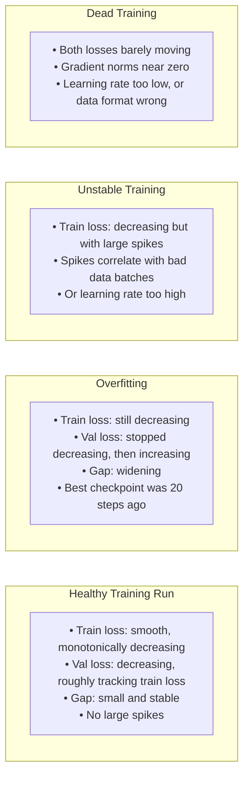

# Lesson 8.1 — Evaluation During Training: Loss, Perplexity, and Learning Curves

---

## Why Training Metrics Are Not Enough — But You Still Need to Understand Them

When you are training a model, the only signal you have in real time is the loss curve. It is easy to either over-trust it ("loss is going down, everything is fine") or dismiss it ("loss doesn't capture real quality, I'll just evaluate at the end"). Both are wrong.

The correct stance: understand exactly what loss tells you, what it hides, and what the shape of a healthy learning curve looks like. This lets you catch problems early — before you waste hours of GPU time on a run that was already failing at step 500.

---

## Training Loss vs Validation Loss

Every training run should track both. They measure different things.

**Training loss** is computed on the same data the model is training on. By definition, a model can always reduce training loss by memorizing the training data — even without generalizing at all.

**Validation loss** is computed on held-out data the model has never seen. It is a proxy for how well the model will perform on real inputs. This is the number that matters.

The gap between them — `val_loss - train_loss` — is the primary signal for detecting overfitting:

| Pattern | What it means |
|---|---|
| Both losses decrease together | Healthy training — model is generalizing |
| Train loss decreasing, val loss flat | Early overfitting — model is memorizing, not generalizing |
| Train loss decreasing, val loss increasing | Clear overfitting — stop training here or earlier |
| Both losses flat | Learning rate too low, or data issue |
| Train loss spiking then recovering | Learning rate too high, or bad batch in data |
| Val loss lower than train loss | Usually a data leakage issue — check your splits |

The right moment to stop training is when validation loss stops improving — not when training loss reaches zero. This is called **early stopping**, and it is the most common practical intervention in fine-tuning runs.

> **Interview note:** "How do you know when to stop fine-tuning?" The answer is not "when training loss is low." It is: "When validation loss stops improving — specifically when it has not improved for N evaluation steps (patience parameter). You save checkpoints at every evaluation and restore the best validation loss checkpoint after training, ignoring the final model state which is likely overfit."

---

## Perplexity: What It Is and What It Misses

Perplexity is directly derived from loss. For a language model trained with cross-entropy loss L:

```
Perplexity = e^L
```

If loss = 2.3, perplexity = e^2.3 ≈ 10. This means: on average, the model assigns probability 1/10 to the correct next token among its vocabulary. Lower perplexity = model is less "surprised" by the correct answer = better language modeling.

Perplexity is useful for **comparing models on the same dataset** — if model A has perplexity 8 and model B has perplexity 12 on the same held-out text, model A is a better language model for that distribution.

**What perplexity misses:**

Loss (and therefore perplexity) measures the average log-probability of the correct token at every position. This has two critical blind spots:

1. **It rewards probability everywhere, even on prompt tokens.** Standard SFT masks prompt tokens from the loss — you only compute loss on the response tokens. If your data collator is wrong and computes loss on prompt tokens too, the loss will be artificially low but the model will learn to predict the prompt (which you do not want).

2. **It does not measure task correctness.** A model can have low validation perplexity but still produce factually wrong, poorly formatted, or incoherent responses. Perplexity measures fluency of the text distribution, not quality of the content.

Always evaluate perplexity *in addition to* task-specific metrics — never instead of them.

---

## What a Healthy Learning Curve Looks Like



**Key metrics to log alongside loss:**

- **Gradient norm:** `||∇θ||`. Healthy training: gradient norm is stable. Spikes in gradient norm → bad batch or instability. Norm collapsing to near zero → dead training.
- **Learning rate:** log the actual LR at each step to verify your scheduler is working as intended.
- **Eval loss frequency:** evaluate on validation set every N steps (not just at epoch boundaries). For fine-tuning runs of 1–3 epochs, evaluate every 50–200 steps.

---

## Loss Tells You Nothing About Format Compliance

This is the most common source of confusion for teams new to fine-tuning.

Suppose you are fine-tuning a model to output JSON. Your training data is perfect JSON. Your validation loss is 1.8 — better than baseline. You deploy the model and find that 30% of its outputs are malformed JSON that cannot be parsed.

How? Because the loss on the malformed outputs might be only slightly worse than on the correct outputs. The model is mostly getting tokens right — the structural braces and brackets might be fine — but occasionally generating an extra comma or missing a quote. That small probability error barely moves the average loss but breaks your downstream parser completely.

**The implication:** always evaluate with task-specific metrics in addition to loss. For instruction tuning: response quality (MT-Bench, IFEval). For code: execution pass rate. For JSON output: parse success rate. For classification: accuracy. Loss is a training signal, not a quality signal.

---

## Practical Evaluation Setup During Training

```python
from transformers import TrainingArguments

training_args = TrainingArguments(
    # Evaluate on validation set every 100 steps
    evaluation_strategy="steps",
    eval_steps=100,
    
    # Save a checkpoint every 100 steps (so you can restore best)
    save_strategy="steps",
    save_steps=100,
    
    # Automatically keep only the best checkpoint (by eval loss)
    load_best_model_at_end=True,
    metric_for_best_model="eval_loss",
    greater_is_better=False,
    
    # How many eval steps to wait before stopping if no improvement
    # early_stopping_patience is set in EarlyStoppingCallback
    save_total_limit=3,  # Keep only 3 checkpoints to save disk space
)
```

```python
from transformers import EarlyStoppingCallback

trainer = Trainer(
    model=model,
    args=training_args,
    train_dataset=train_dataset,
    eval_dataset=eval_dataset,
    callbacks=[EarlyStoppingCallback(early_stopping_patience=3)]
    # Stop if val loss doesn't improve for 3 consecutive eval checkpoints
)
```

---

## Summary

- Training loss measures how well the model fits the training data. Validation loss measures generalization. Always track both — the gap between them is the primary overfitting signal.
- Perplexity = e^loss. Useful for comparing models on the same dataset. Does not measure task correctness, format compliance, or content quality.
- A healthy learning curve has train and val loss decreasing together with a small, stable gap. Val loss diverging from train loss is the overfitting signal — stop training at the checkpoint with lowest val loss, not at the end of training.
- Loss assumes you have correctly masked the prompt tokens — only response tokens contribute to the loss. If prompt tokens are included, loss is artificially low and the model learns the wrong thing.
- Loss cannot measure task-specific quality (JSON validity, code correctness, factual accuracy). Always pair loss monitoring with task-specific evaluation metrics.
- Use `load_best_model_at_end=True` and `EarlyStoppingCallback` to automatically restore the best checkpoint and avoid over-training.

---
