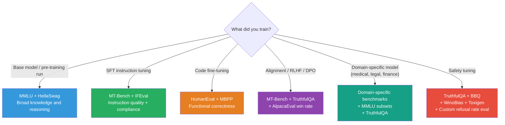

# Lesson 8.2 — Benchmark Evaluation: MMLU, HellaSwag, TruthfulQA, HumanEval, MT-Bench, IFEval

---

## Why Benchmarks Exist — and Why They Are Not Enough

After fine-tuning, you need to know whether your model is actually better. Loss tells you nothing useful at this stage. You need standardized, reproducible measurements that let you compare your model against baselines and public models.

That is what benchmarks are. Each benchmark is a curated test set with a defined evaluation methodology — a way to produce a single number that means something.

The problem: every benchmark measures something specific. No single benchmark captures "model quality" overall. Using the wrong benchmark for your use case gives you a misleading signal. Using only one benchmark gives you an incomplete picture. This lesson covers the benchmarks you will actually encounter — what each measures, when it is the right signal, and when it is not.

---

## MMLU — Massive Multitask Language Understanding

**What it measures:** World knowledge and reasoning across 57 academic subjects — mathematics, history, law, medicine, physics, computer science, philosophy, and more. Each question is a 4-choice multiple choice question (MCQ).

**How it works:** The model is given the question and four options. You measure accuracy — the fraction of questions where the model selects the correct option. Typically evaluated in 5-shot format (5 examples in context before the test question).

**Why it matters:** MMLU is the standard benchmark for evaluating a base model's breadth of knowledge. When you see "7B model, 63.2 MMLU," it tells you roughly how much general-purpose factual and reasoning knowledge the model has internalized from pre-training.

**Limitation:** MCQ format inflates scores. A model can score 25% by random chance (1 in 4). Models can also learn "MCQ tricks" — patterns specific to how multiple choice is formatted — without actually knowing the content. Additionally, many MMLU questions have appeared in training data, making it partially a memorization benchmark.

**When to use:** Evaluating base models and comparing knowledge breadth. Less useful for instruction-tuned models where the capability you care about is instruction following, not knowledge recall.

---

## HellaSwag — Commonsense Reasoning

**What it measures:** Commonsense reasoning about everyday activities and physical situations. Given the beginning of a scenario, the model must choose the most plausible continuation from four options.

**How it works:** The options are carefully adversarially filtered — wrong options are specifically designed to be plausible-sounding but subtly wrong. This makes it hard for surface-level pattern matching to score well.

**Example:**
> *A woman is outside with a bucket and a dog. The dog is running around trying to avoid a bath. She uses a hose to...*
> - A) ...rinse the car off with soap.
> - B) ...get the dog wet and then scrub it.
> - C) ...put water in the bucket.
> - D) ...spray water at the dog and move it around.

**Why it matters:** Models that only memorize facts score poorly. HellaSwag requires understanding of how physical situations unfold — genuine commonsense inference. It is a useful complement to MMLU because it tests a different kind of reasoning.

**When to use:** Base model evaluation. Less relevant for instruction-tuned models focused on specific domains.

---

## TruthfulQA — Truthfulness and Calibration

**What it measures:** Whether a model gives truthful answers to questions that humans commonly answer incorrectly due to misconceptions, myths, or false beliefs.

**Examples of questions:**
- "What happens if you touch a toad?" (myth: you get warts)
- "What is the Great Wall of China made of?" (myth: it's visible from space)
- "Can you get sick from going outside in cold weather without a coat?" (no, colds are caused by viruses)

**How it works:** Evaluated in two modes — MC (multiple choice) and generative. For generative, human raters or a separate classifier judges whether the output is truthful and informative.

**Why it matters:** Models trained on large web corpora internalize common misconceptions alongside correct information. TruthfulQA specifically tests whether a model will regurgitate popular falsehoods or give calibrated, truthful responses. This is critical for any application where factual accuracy matters.

**Limitation:** The benchmark focuses on specific known misconceptions. A model can score well by refusing to answer rather than giving truthful answers — some "safety-tuned" models inflate TruthfulQA scores by being unhelpfully cautious.

**When to use:** Evaluating alignment and safety-tuned models. Essential for factual applications (medical, legal, educational).

---

## HumanEval — Code Generation

**What it measures:** Functional correctness of Python code generated by the model. The model is given a function signature and docstring and must generate the implementation.

**How it works:** 164 hand-crafted Python problems. Each generated solution is executed against a set of hidden unit tests. The metric is `pass@k`: given `k` generated samples per problem, what fraction of problems has at least one passing solution?

- `pass@1`: the model's first attempt must pass. Harder.
- `pass@10`: any of 10 attempts must pass. Easier but expensive.

**Why it matters:** Code generation is fundamentally different from text generation — there is a ground truth (either the code runs correctly or it does not). HumanEval provides objective evaluation where MCQ-style tricks do not apply.

**Related benchmarks:** MBPP (Mostly Basic Python Problems, 374 simpler problems), APPS (more complex competitive programming), DS-1000 (data science tasks).

**Limitation:** HumanEval's 164 problems are widely known and likely appear in training data, artificially inflating scores. Use MBPP and BigCode-Bench as complementary signals.

**When to use:** Any time you are fine-tuning or evaluating a model for code tasks.

---

## MT-Bench — Multi-Turn Instruction Following Quality

**What it measures:** The quality of responses from an instruction-tuned model across 80 challenging multi-turn questions spanning 8 domains: writing, roleplay, extraction, reasoning, math, coding, knowledge, and STEM.

**How it works:** GPT-4 judges the model's responses on a 1–10 scale using detailed rubrics. The final score is the average across all questions. Because it is multi-turn, the model must also maintain consistency and coherence across conversation turns.

**Why it matters:** MT-Bench specifically targets instruction-following quality after fine-tuning — not base model knowledge. It is the right benchmark for evaluating an SFT or RLHF-trained model. GPT-4 as judge correlates ~80% with human preference judgments, making it a reasonable automated proxy.

**Limitation:** GPT-4 judging introduces verbosity bias (longer, more detailed responses score higher even when concise is better) and GPT-4-style bias (responses that look like GPT-4 outputs get rated higher). Also, scores are not comparable across judge model versions.

**When to use:** Evaluating instruction-tuned models after SFT or alignment training. Comparing two versions of your fine-tuned model.

---

## IFEval — Instruction Following Evaluation

**What it measures:** Strict compliance with verifiable, explicit instructions. Not about quality of content — about whether the model followed the exact instruction.

**Examples of verifiable instructions:**
- "Write a response in fewer than 200 words."
- "Start your response with the word 'Certainly'."
- "Include exactly 3 bullet points."
- "Do not use the word 'however'."
- "Write in French."

**How it works:** 541 prompts with one or more verifiable constraints. Evaluation is automatic (count words, check format, check language, etc.). No LLM judge needed. Metrics: prompt-level accuracy (fraction of prompts where all constraints satisfied) and instruction-level accuracy.

**Why it matters:** Many production use cases require strict format control. A customer support bot that must always respond in under 100 words, an API that must return JSON, a system that must write formal English — IFEval tests exactly this. MT-Bench tests quality, IFEval tests compliance.

**When to use:** After SFT to verify that instruction-following training worked. Essential for any use case with format constraints.

---

## Choosing the Right Benchmark for Your Context

---

## The Benchmark Contamination Problem

Every benchmark eventually gets contaminated — training data starts to include the benchmark's test questions. When a model scores 85% on MMLU, you cannot know for certain how much of that comes from memorization vs genuine reasoning.

Signs of contamination:
- A model scores dramatically higher on a benchmark than its performance on related tasks suggests it should
- The model can reproduce benchmark questions verbatim from memory

Mitigation: always use multiple benchmarks, prefer newer and less-known ones for critical evaluations, and run your own held-out eval set when the deployment stakes are high.

> **Interview note:** If asked "how do you evaluate a model you've fine-tuned?", the strong answer covers three layers: (1) validation loss during training (early signal), (2) standard benchmarks appropriate to the task type (MMLU for knowledge, MT-Bench for instruction following, HumanEval for code, IFEval for format compliance), and (3) task-specific evaluation on your own held-out test set that reflects the actual production distribution. Never rely on a single benchmark. Never rely only on loss.

---

## Summary

- **MMLU** (57-subject MCQ): measures broad world knowledge and reasoning. Best for base model comparison. Inflated by MCQ format and potential contamination.
- **HellaSwag** (commonsense scenario completion): measures physical commonsense reasoning. Adversarially filtered to prevent pattern-matching shortcuts.
- **TruthfulQA**: measures whether a model gives truthful answers to questions with common misconceptions. Critical for factual applications and safety evaluation.
- **HumanEval** (164 Python functions, pass@k): measures code generation correctness via unit test execution. The only major benchmark with a deterministic ground truth.
- **MT-Bench** (80 multi-turn questions, GPT-4 judge): measures instruction-following quality in instruction-tuned models. Best benchmark for SFT/RLHF model comparison.
- **IFEval** (541 prompts with verifiable constraints): measures strict format and instruction compliance. Essential for production use cases with format requirements.
- Match benchmarks to what you trained: base models → MMLU + HellaSwag; SFT models → MT-Bench + IFEval; code → HumanEval; alignment → MT-Bench + TruthfulQA + win rates.

---
