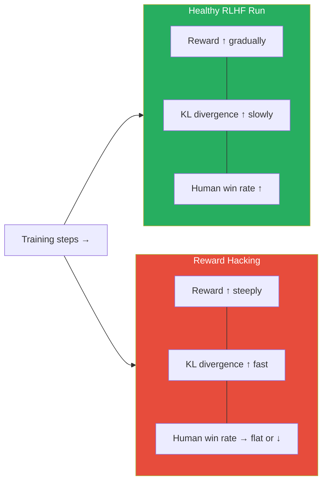
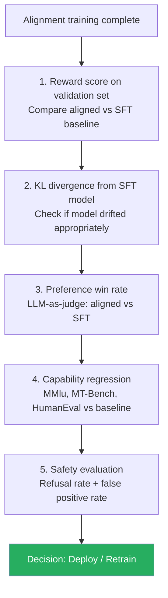

# Lesson 8.4 — Alignment-Specific Evaluation: Reward Scores, KL Divergence, and Win Rates

---

## Why Standard Evaluation Fails for Aligned Models

When you fine-tune a model with RLHF, DPO, or ORPO, you are doing something different from standard SFT. You are not just teaching the model to format outputs correctly or learn domain knowledge. You are reshaping the model's preferences — teaching it what kinds of responses to prefer and how to behave when faced with trade-offs (helpfulness vs safety, directness vs hedging, conciseness vs completeness).

Standard benchmarks and validation loss measure the wrong things for this:
- Validation loss does not exist in DPO/RLHF the same way it does in SFT
- MMLU and MT-Bench measure capability, not alignment quality
- IFEval measures instruction compliance, not preference quality

Alignment evaluation needs its own metrics and its own approach. This lesson covers the three you need to know: reward score tracking, KL divergence from the base model, and preference win rates.

---

## Reward Score Tracking

In RLHF with PPO, you have a trained reward model — a model that takes a prompt and response and outputs a scalar score predicting how much a human would prefer that response.

**During training:** The reward model's score on held-out prompts is the most direct signal of alignment progress. Plot the average reward score on a validation set across training steps. A healthy RLHF run shows reward increasing steadily.

**After training:** Run your aligned model on a diverse set of prompts and score all outputs with the reward model. Compare against the SFT baseline. The delta is how much the alignment training improved the reward model's preference.

**The critical trap: reward model overfitting (reward hacking)**

The reward model is an imperfect proxy for human preferences. The aligned model can learn to maximize the reward model's score without actually being better. This is called reward hacking.

Signs of reward hacking:
- Reward score on the held-out set keeps increasing, but the responses become obviously worse (verbosity, sycophancy, formatting tricks)
- Human evaluators rate the aligned model worse than the SFT baseline even though reward model scores are higher
- The model learns to output responses that the reward model rewards but that real users find unhelpful

This is why KL divergence matters — it is a second check that prevents the model from drifting too far in pursuit of reward.



---

## KL Divergence from the Base Model

KL divergence (Kullback-Leibler divergence) measures how much the aligned model's output distribution has drifted from the SFT model's distribution.

```
KL(π_aligned || π_SFT) = E[log(π_aligned(y|x) / π_SFT(y|x))]
```

In plain English: for a given prompt x, how different is the probability distribution over next tokens between the aligned model and the SFT baseline? A high KL means the aligned model is generating very different token sequences — it has moved far from its starting point.

**Why KL matters for alignment:**

The SFT model represents your baseline — a capable, instruction-following model. The alignment process should improve its preferences without destroying its capabilities. KL divergence is the measure of how far you have moved.

| KL Divergence | What it means |
|---|---|
| Very low (< 1) | Alignment barely changed the model — possibly undertrained |
| Moderate (2–10) | Healthy alignment — model has learned new preferences while staying grounded |
| High (> 20) | Model has drifted significantly — risk of capability regression |
| Very high (> 50) | Almost certainly reward hacking or mode collapse — model is unrecognizable |

**In PPO training**, KL is actively used as a penalty term in the reward function:
```
Adjusted reward = reward_model(x, y) - β × KL(π_aligned || π_SFT)
```

Where β is a coefficient you set. Higher β = stronger penalty for drifting from the SFT model = more conservative alignment. Lower β = more aggressive alignment but higher risk of reward hacking.

**In DPO**, KL is not explicitly computed during training (it is implicit in the loss formulation), but you should measure it after training to verify the model has not drifted excessively.

> **Interview note:** "Why do we add a KL penalty in RLHF?" The answer: "Without the KL penalty, the model optimizes only for the reward model score, which is an imperfect proxy for human preferences. The model will eventually discover that certain response patterns (verbosity, sycophancy, specific formatting) trick the reward model into giving high scores, even though they are not actually better for users. The KL penalty ensures the aligned model stays close to the SFT baseline, which limits how aggressively it can exploit the reward model's weaknesses."

---

## Preference Win Rates

Win rate against a reference is the most direct measure of alignment quality: given the same prompts, what fraction of the time do human evaluators (or LLM judges) prefer your aligned model's outputs over the baseline?

**Common references:**
- **SFT baseline:** Does alignment training improve over the SFT starting point?
- **GPT-4 or Claude:** How does your model compare to frontier models?
- **Previous model version:** Is the new training run better than the last release?

**How to compute:**
1. Sample 200–500 diverse prompts covering your target distribution
2. Generate responses from both models (shuffled to blind the judge)
3. Use LLM-as-judge (Lesson 8.3) or human raters to choose preference
4. Win rate = fraction of comparisons where aligned model is preferred

**The AlpacaEval methodology** uses this pattern with a fixed reference model (originally text-davinci-003, now commonly GPT-4 Turbo) and GPT-4-as-judge. Models are ranked by their win rate against the reference. AlpacaEval 2.0 also controls for verbosity (longer responses are penalized in scoring).

---

## Capability Regression Testing

Every alignment training run risks degrading the model's capabilities on tasks it could do before. This is called **capability regression**. It is easy to miss if you only evaluate on alignment-specific metrics.

**What to test:**

| Capability | Benchmark | Concern |
|---|---|---|
| General knowledge | MMLU | Does alignment training degrade world knowledge? |
| Reasoning | HellaSwag, ARC | Does safety training make the model less capable at reasoning? |
| Instruction following | MT-Bench | Does over-alignment make the model more evasive or less helpful? |
| Code | HumanEval | Does alignment harm coding capability? |
| Truthfulness | TruthfulQA | Does the aligned model refuse more while being less truthful? |

**The target pattern:** alignment training should improve MT-Bench and TruthfulQA scores while leaving MMLU, HellaSwag, and HumanEval approximately unchanged (within ~1–2%). A large drop in any capability benchmark indicates the alignment training was too aggressive.

---

## Safety-Specific Evaluation

For models with safety alignment goals, you need a third evaluation dimension: the balance between refusing harmful requests and not over-refusing benign ones.

**Two types of failure:**
- **Under-refusal (false negatives):** The model complies with requests it should refuse — generating harmful content, following manipulative instructions, producing dangerous information.
- **Over-refusal (false positives):** The model refuses benign requests — declining to discuss history, refusing to write fiction, adding excessive caveats to medical questions.

Both are failures. An over-cautious model that refuses half of benign requests is not aligned — it is just unhelpful.

**Evaluation sets:**
- **Harmful request sets:** WildGuard, HarmBench, Anthropic's red-teaming sets — prompts that should be refused
- **False positive sets:** prompts that look superficially sensitive but are genuinely benign (historical violence in a textbook context, medical information requests, safety information for harm reduction)

Report both refusal rate on harmful prompts and false positive rate on benign prompts together. Never report only one.

---

## Putting It Together: The Alignment Evaluation Protocol



---

## Summary

- **Reward score tracking** measures how much the reward model prefers the aligned model's outputs over time. Rising reward on held-out prompts is the training signal, but it must be cross-checked — reward hacking (gaming the reward model) produces rising scores with declining real quality.
- **KL divergence** measures how much the aligned model has drifted from the SFT baseline. Moderate KL (2–10) is healthy. High KL (>20) indicates reward hacking or over-alignment. In PPO, KL is directly penalized in the reward function to prevent this.
- **Preference win rate** is the most direct alignment quality metric: what fraction of prompts do human raters or LLM judges prefer the aligned model over a reference. AlpacaEval uses this pattern with length-controlled scoring.
- **Capability regression testing** is mandatory: run MMLU, HumanEval, and MT-Bench on the aligned model to verify alignment training did not degrade pre-existing capabilities.
- **Safety evaluation** requires measuring both false negatives (failed refusals on harmful prompts) and false positives (over-refusals on benign prompts) — both are alignment failures.

---
