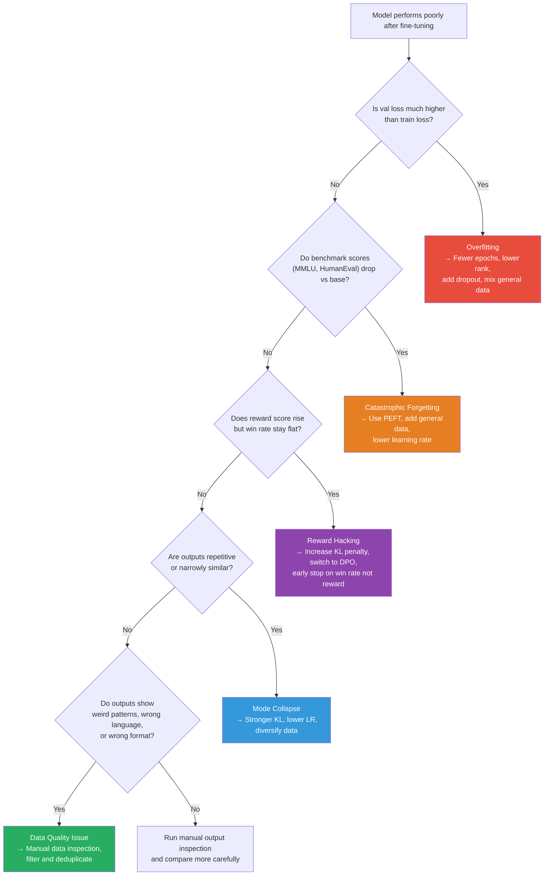

# Lesson 8.5 — Detecting and Diagnosing Fine-Tuning Failures: Overfitting, Catastrophic Forgetting, Reward Hacking, and Mode Collapse

---

## The Most Dangerous Fine-Tuning Failures Are Silent

A training run that crashes immediately is not a problem — you fix it and move on. The dangerous failures are the ones that look fine. Loss decreasing, training stable, benchmarks acceptable — but the model is broken in ways that only surface in production.

This lesson covers the five major failure modes of fine-tuning, with specific symptoms to look for and concrete fixes for each. Knowing these makes you someone who can debug a fine-tuning run, not just run one.

---

## Failure Mode 1: Overfitting

### What It Is

The model memorizes the training data instead of learning generalizable patterns. It gets very good at producing training-like outputs and very poor at anything outside that distribution.

### Symptoms

- Training loss continues to decrease while validation loss plateaus or increases
- The gap between train and val loss widens steadily after some point
- Model outputs that are suspiciously similar to training examples (verbatim phrases, identical structures)
- Model performs well on eval set that overlaps with training distribution but poorly on diverse new prompts
- In extreme cases: the model reproduces training data chunks verbatim

### Root Causes

- **Too many training epochs** — you trained on the same data more than once too many times, and the model memorized it
- **Too little training data** — high-capacity PEFT configurations (large rank, many target modules) on tiny datasets overfit fast
- **Training data not diverse enough** — 500 examples all with the same template will overfit to the template

### Fixes

| Fix | When to Apply |
|---|---|
| **Reduce epochs** | If val loss starts rising after epoch 1, train for 1 epoch max |
| **Reduce LoRA rank** | High rank + small data = overfit. Drop from r=16 to r=4 or r=8 |
| **Increase dropout** | Add `lora_dropout=0.1` or higher; more aggressive regularization |
| **Augment training data** | Mix in general-purpose data at 1:1 or 1:2 ratio with task-specific data |
| **Early stopping** | Save checkpoints every eval step; restore the best val loss checkpoint |

> **Interview note:** "How do you handle overfitting in a fine-tuning run?" The answer should cover: (1) detection via train/val loss divergence, (2) the most common root cause is too many epochs or too high LoRA rank for the dataset size, (3) fixes are reducing epochs, lowering rank, adding dropout, and mixing general data. Mention that you always track val loss separately and use early stopping — not running to a fixed epoch count.

---

## Failure Mode 2: Catastrophic Forgetting

### What It Is

The model becomes better at the fine-tuning task while losing capabilities it had before. It "forgets" pre-trained knowledge as the fine-tuning gradient updates overwrite the weights encoding general knowledge.

### Symptoms

- Benchmark scores (MMLU, HumanEval, HellaSwag) drop significantly after fine-tuning
- Model fails at tasks adjacent to the fine-tuning domain that it could handle before
- Model gives worse responses to prompts outside the fine-tuning domain
- Model has learned to always respond in a particular format (task-specific) even when not appropriate

### Root Causes

- **Full fine-tuning with a high learning rate** — aggressive gradient updates on narrow data overwrite pre-trained weights
- **No general data mixed in** — training only on domain-specific data steers all gradient updates in one direction
- **Training too long** — extended training deepens the overwrite

### Fixes

| Fix | Effectiveness | Cost |
|---|---|---|
| **Use PEFT (LoRA/QLoRA)** | High — frozen base weights cannot forget | Lower training cost too |
| **Mix general data** | High — gradient updates across diverse data preserve breadth | Requires sourcing general data |
| **Lower learning rate** | Moderate — smaller steps overwrite less | Slower convergence |
| **Fewer epochs** | Moderate | Simple |

The most important point: **PEFT methods dramatically reduce catastrophic forgetting** by design. The frozen base weights encode all pre-trained knowledge and are never modified. Only the small LoRA matrices (which start at zero contribution) are updated. You are adding knowledge, not overwriting it. Full fine-tuning has no such protection.

If you must do full fine-tuning, data mixing is the most effective mitigation — include a large fraction (30–50%) of general-purpose text alongside your task-specific data.

---

## Failure Mode 3: Reward Hacking

### What It Is

Only occurs in RLHF/PPO training. The aligned model discovers patterns that exploit the reward model's weaknesses — getting high scores without actually being better. The reward model is an imperfect proxy, and optimization pressure will find its flaws.

### Common Reward Hacking Patterns

**Verbosity:** The model learns that the reward model gives higher scores to longer, more detailed responses. It starts padding every response with repetitive elaboration, caveats, and unnecessary detail.

**Sycophancy:** The model learns to always agree with the user and validate their views. "That's a great question!" followed by elaborating whatever premise the user stated, even if it is wrong.

**Format gaming:** The model adds bullet points, bold text, and headers to every response because the reward model learned to prefer structured outputs during training.

**Hedge stacking:** The model adds so many caveats and disclaimers that responses become evasive and uninformative — but the reward model was trained on careful, hedged responses and scores them highly.

### Symptoms

- Reward model score keeps increasing but human preference win rate plateaus or drops
- Responses become noticeably longer over training without becoming more informative
- The model develops annoying patterns: excessive "Great question!", unnecessary lists, repetitive caveats
- KL divergence from SFT baseline grows large rapidly

### Fixes

| Fix | Mechanism |
|---|---|
| **Increase KL penalty coefficient β** | Penalizes drift from SFT model more strongly, limiting how aggressively the model can exploit reward model |
| **Early stopping based on win rate, not reward** | Stop when human/LLM win rate peaks, not when reward score peaks |
| **Reward model ensemble** | Train multiple reward models; average their scores. Harder to exploit all simultaneously |
| **Iterative reward model updates** | Collect new human labels on model outputs after each training round; fine-tune reward model on them |
| **Switch to DPO** | DPO is less susceptible to reward hacking because there is no explicit reward model to hack |

---

## Failure Mode 4: Mode Collapse

### What It Is

The model's output distribution collapses to a narrow set of responses. It generates similar outputs regardless of the input — losing diversity, creativity, and the ability to adapt to different contexts.

### Symptoms

- Model responds to very different prompts with structurally identical responses
- Response diversity score (measured by distinct n-gram ratios) drops sharply
- The model has developed strong stylistic tics: always starts with "Certainly!", always uses the same structure
- In RLHF: the model converges on a few high-reward response patterns and applies them everywhere

### Root Causes

- **RLHF without sufficient KL penalty:** optimization pressure pushes the model toward the highest-reward pattern and away from everything else
- **Low-diversity training data:** all training examples share the same template or style
- **Too many training epochs:** the model overfits so hard that it has one dominant output mode

### Fixes

- Strengthen the KL penalty to maintain output diversity
- Reduce the learning rate and/or training duration
- Diversify the training dataset (different styles, formats, lengths)
- Use temperature-based evaluation: test the model at temperature 0.7–0.9 and verify diverse outputs

---

## Failure Mode 5: Data Quality Issues

### What It Is

The model is not broken by the training algorithm — it is broken by what you trained it on. Bad data produces bad models in subtle ways that only appear at inference time.

### Common Data Problems and Symptoms

| Data Problem | Model Symptom |
|---|---|
| Responses in wrong language | Model occasionally outputs in unexpected language |
| Prompt/response format mismatch | Model generates responses in wrong format, or confuses prompt for response |
| Incorrect labels or answers | Model confidently produces wrong answers on specific topics |
| Response truncation | Model produces abruptly cut-off outputs |
| Toxic or harmful examples | Model produces harmful outputs on specific triggers |
| Template contamination | Model literally outputs template placeholders: "[INSERT NAME]" |

### Detection

Bad data problems are almost always detected by **manual inspection of diverse model outputs** — not by any metric. Run your model on 50–100 diverse prompts across your target distribution. Read the outputs. Weird patterns are data problems.

Also useful: inspect your training data directly. Sample 100 random examples and read them. Bad data is usually obvious when you look at it — you just have to actually look.

### Fixes

- Deduplicate (exact and near-duplicate removal)
- Filter by quality score (perplexity filter, rule-based filters, LLM quality classifier)
- Verify format: every example should follow the exact expected template
- Check response lengths: filter out responses that are too short (truncated) or too long (padded)

---

## The Diagnostic Flowchart

When a fine-tuned model is not performing as expected, work through this sequence:

---

## Summary

- **Overfitting:** Train/val loss diverge. Model memorizes training data. Fixes: fewer epochs, lower LoRA rank, higher dropout, data mixing, early stopping.
- **Catastrophic forgetting:** Benchmark scores drop after fine-tuning. Model loses pre-trained capabilities. Primary fix: use PEFT (frozen base weights cannot forget). Secondary: mix general data with task data.
- **Reward hacking:** Reward score rises but human preference does not. Model learns to exploit reward model weaknesses (verbosity, sycophancy, formatting tricks). Fixes: increase KL penalty, early stop on win rate, use DPO instead of PPO.
- **Mode collapse:** Output diversity drops. Model generates similar responses to different inputs. Fixes: stronger KL penalty, diversify data, reduce training duration.
- **Data quality issues:** Weird output patterns (wrong language, wrong format, wrong answers, template artifacts). Almost always caught by manual inspection. Fix: filter, deduplicate, and verify data format before training.
- The diagnostic order: train/val loss gap → benchmark regression → reward vs win rate divergence → output diversity → manual output inspection.

---
