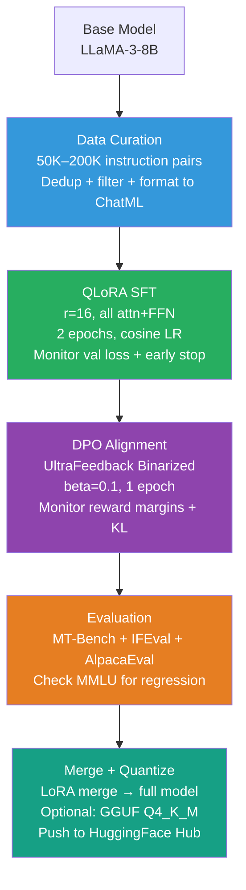

# Case Study 1 — Training an Instruction-Following Chat Model End-to-End

> **The interview question this answers:** "Walk me through how you would train a general-purpose instruction-following chat model from a base LLM."

---

## The Problem Statement

You are given a pre-trained base language model (LLaMA-3-8B or Mistral-7B-v0.1) and the goal of producing a high-quality instruction-following chat model — one that can follow diverse instructions, respond helpfully across domains, maintain appropriate tone, and handle multi-turn conversations. You need to cover: dataset curation, SFT training, alignment, evaluation, and getting to a deployable artifact.

This is the canonical fine-tuning pipeline. Every other case study builds on it.

---

## Step 1: Base Model Selection

The choice of base model shapes everything downstream.

**LLaMA-3-8B** (Meta, 2024) is the current practical standard for this scale:
- Strong base capability from 15T tokens of pre-training
- 8K context natively (extended to 128K with LongRoPE variants)
- GQA architecture (8 KV heads) — efficient inference
- Broad community support and fine-tuned variants for comparison

**When you might choose differently:**
- Mistral-7B-v0.3: slightly better on some European languages, Apache 2.0 license
- Qwen2-7B: stronger for multilingual and coding tasks
- Gemma-2-9B: strong capability, but check Google's license terms

**Always verify license compatibility** with your use case before training. Meta's LLaMA-3 license permits commercial use with user count restrictions above 700M MAU.

---

## Step 2: Data Curation for SFT

This is where most teams underinvest and then wonder why their model is mediocre.

**The target dataset profile:**
- 50,000–200,000 high-quality instruction-response pairs
- Diverse task coverage (generation, extraction, reasoning, coding, refusal, multi-turn)
- Diverse output styles (short/long, structured/prose, formal/casual)
- Clean, no toxic content, no factual errors

**Open datasets to combine:**

| Dataset | Size | Strength |
|---|---|---|
| OpenHermes-2.5 | 1M (sample 50K) | High diversity, GPT-4 generated, well-filtered |
| UltraChat-200K | 200K | Multi-turn conversations, diverse topics |
| SlimOrca | 518K (sample 50K) | Chain-of-thought reasoning, GPT-4 quality |
| Dolphin | 150K | Strong instruction following, broad coverage |
| WizardLM-Evol | 143K | Evolved complexity distribution |
| Code Alpaca | 20K | Basic coding coverage |

**The mixing strategy:** Do not concatenate all datasets naively. Sample strategically to balance task types. If your final dataset is 100K examples, a rough target:
- General Q&A and instruction: 35%
- Reasoning and CoT: 20%
- Multi-turn conversation: 20%
- Code: 15%
- Refusal/safety: 10%

**Quality filtering steps:**
```python
# Step 1: Deduplication
from datasets import load_dataset
from sentence_transformers import SentenceTransformer

# Near-duplicate removal: embed instructions, remove pairs with cosine similarity > 0.92
encoder = SentenceTransformer("all-MiniLM-L6-v2")
instruction_embeddings = encoder.encode([ex["instruction"] for ex in dataset])
# Use faiss or sklearn to find and remove near-duplicates

# Step 2: Length filtering
# Remove: instruction < 10 tokens, response < 20 tokens, response > 2048 tokens
filtered = [
    ex for ex in dataset
    if 10 <= len(ex["instruction"].split()) <= 512
    and 20 <= len(ex["response"].split()) <= 1024
]

# Step 3: Format validation
# Verify every example has the required fields in the correct format

# Step 4: Quality scoring (optional but recommended)
# Use a small reward model or GPT-4o-mini to score response quality
# Remove bottom 10-20% by score
```

**Data formatting** — standardize to ChatML before training:
```python
def format_to_chatML(example):
    return {
        "messages": [
            {"role": "system", "content": "You are a helpful assistant."},
            {"role": "user", "content": example["instruction"]},
            {"role": "assistant", "content": example["response"]}
        ]
    }

# Apply tokenizer chat template
def apply_template(example, tokenizer):
    text = tokenizer.apply_chat_template(
        example["messages"],
        tokenize=False,
        add_generation_prompt=False
    )
    return {"text": text}
```

---

## Step 3: SFT with QLoRA

**Why QLoRA here:** An 8B model in BF16 uses ~16 GB of VRAM. Training with full optimizer states pushes to ~64 GB — needs multi-GPU. With QLoRA, training fits on a single A100 80GB with room to spare.

**Training configuration:**

```python
from transformers import AutoModelForCausalLM, BitsAndBytesConfig, TrainingArguments
from peft import LoraConfig
from trl import SFTTrainer

# 1. Quantization config
bnb_config = BitsAndBytesConfig(
    load_in_4bit=True,
    bnb_4bit_quant_type="nf4",
    bnb_4bit_compute_dtype=torch.bfloat16,
    bnb_4bit_use_double_quant=True,
)

# 2. LoRA config — target all attention + FFN for broad instruction following
lora_config = LoraConfig(
    r=16,
    lora_alpha=32,
    target_modules=[
        "q_proj", "k_proj", "v_proj", "o_proj",   # All attention
        "gate_proj", "up_proj", "down_proj"          # FFN
    ],
    lora_dropout=0.05,
    bias="none",
    task_type="CAUSAL_LM"
)

# 3. Training arguments
training_args = TrainingArguments(
    output_dir="./llama3-8b-sft",
    num_train_epochs=2,                    # 2-3 epochs typical for instruction tuning
    per_device_train_batch_size=4,
    gradient_accumulation_steps=4,         # Effective batch size = 16
    learning_rate=2e-4,                    # Standard for QLoRA
    lr_scheduler_type="cosine",
    warmup_ratio=0.05,
    bf16=True,
    gradient_checkpointing=True,
    optim="paged_adamw_32bit",
    evaluation_strategy="steps",
    eval_steps=100,
    save_strategy="steps",
    save_steps=100,
    load_best_model_at_end=True,
    logging_steps=10,
    save_total_limit=3,
)

# 4. SFT Trainer (handles loss masking automatically with response template)
trainer = SFTTrainer(
    model=model,
    args=training_args,
    train_dataset=train_dataset,
    eval_dataset=eval_dataset,
    peft_config=lora_config,
    max_seq_length=2048,
    dataset_text_field="text",
)
```

**What to watch during training:**
- `train/loss` and `eval/loss` — val loss should track train loss closely. Divergence → overfitting.
- `eval/loss` should reach ~1.0–1.4 for a well-trained instruction model (varies by dataset)
- Gradient norm: stable around 0.5–2.0. Frequent spikes → reduce LR. Near zero → LR too low.
- Stop at the checkpoint with lowest eval loss, not at the end of training.

---

## Step 4: DPO Alignment

SFT teaches the model to produce good responses. DPO teaches it to prefer better responses over worse ones — improving helpfulness, safety, and avoiding common failure patterns.

**Dataset selection for DPO:**
- **UltraFeedback Binarized** (60K pairs): GPT-4-annotated chosen/rejected pairs across diverse instructions. Standard choice.
- **Orca DPO Pairs**: preference data derived from Orca reasoning traces.

```python
from trl import DPOTrainer, DPOConfig

# Load the SFT-merged model as the base for DPO
# (Important: DPO needs the reference model = SFT model frozen)

dpo_config = DPOConfig(
    beta=0.1,                    # KL penalty strength. Higher = stay closer to SFT.
    learning_rate=5e-7,          # Much lower than SFT — DPO is sensitive to LR
    num_train_epochs=1,          # 1 epoch of DPO is usually enough
    per_device_train_batch_size=2,
    gradient_accumulation_steps=8,
    bf16=True,
    lr_scheduler_type="cosine",
    warmup_ratio=0.1,
    loss_type="dpo",             # Standard DPO loss
    evaluation_strategy="steps",
    eval_steps=50,
)

dpo_trainer = DPOTrainer(
    model=sft_model,             # Your SFT-trained model (policy)
    ref_model=ref_model,         # Copy of SFT model (frozen reference)
    args=dpo_config,
    train_dataset=dpo_dataset,
    eval_dataset=dpo_eval,
    tokenizer=tokenizer,
)
```

**DPO monitoring:**
- `rewards/chosen` should be higher than `rewards/rejected` — if inverted, something is wrong.
- `logps/chosen` and `logps/rejected` — chosen log probability should be increasing.
- KL divergence from reference should stay moderate (2–10). Very high KL → overfitting to preference data.

---

## Step 5: Evaluation

**Benchmark battery:**

| Benchmark | What it measures | Expected range (good 8B model) |
|---|---|---|
| MT-Bench | Multi-turn instruction quality (GPT-4 judge, 1-10) | 7.0–8.2 |
| IFEval | Strict instruction compliance | 70–80% prompt accuracy |
| AlpacaEval 2.0 | Win rate vs GPT-4 Turbo reference | 15–25% |
| MMLU | General knowledge (check for regression) | ~65–70% (should not drop from base) |

```bash
# Run MT-Bench evaluation
python gen_model_answer.py --model-path ./llama3-8b-dpo-merged \
    --model-id my-model --bench-name mt_bench

python gen_judgment.py --model-list my-model \
    --judge-model gpt-4 --bench-name mt_bench
```

---

## Step 6: Merging LoRA Weights and Publishing

After DPO (which may also have been done with LoRA), merge all adapters into the base model for deployment.

```python
from peft import PeftModel
from transformers import AutoModelForCausalLM

# Load base model in FP16 (not quantized — merge needs full precision)
base_model = AutoModelForCausalLM.from_pretrained(
    "meta-llama/Meta-Llama-3-8B",
    torch_dtype=torch.float16,
    device_map="auto"
)

# Load and merge SFT adapter
model = PeftModel.from_pretrained(base_model, "./llama3-8b-sft-checkpoint")
model = model.merge_and_unload()

# Load and merge DPO adapter on top
model = PeftModel.from_pretrained(model, "./llama3-8b-dpo-checkpoint")
merged_model = model.merge_and_unload()

# Save merged model
merged_model.save_pretrained("./llama3-8b-final")
tokenizer.save_pretrained("./llama3-8b-final")

# Push to HuggingFace Hub
merged_model.push_to_hub("your-org/llama3-8b-chat")
tokenizer.push_to_hub("your-org/llama3-8b-chat")
```

**Optional: Quantize to GGUF for deployment:**
```bash
# Convert to GGUF using llama.cpp
python convert_hf_to_gguf.py ./llama3-8b-final --outfile llama3-8b-chat.gguf

# Quantize to Q4_K_M for efficient CPU/GPU serving
./quantize llama3-8b-chat.gguf llama3-8b-chat-Q4_K_M.gguf Q4_K_M
```

---

## Common Pitfalls

| Pitfall | Symptom | Fix |
|---|---|---|
| Prompt template mismatch | Model generates with wrong format, ignores system prompt | Use `tokenizer.apply_chat_template()` consistently |
| Loss computed on prompt tokens | Artificially low train loss, model learns to predict prompts | Verify loss masking in data collator |
| DPO LR too high | Model loses SFT quality, produces incoherent outputs | Use 5e-7 or lower; 1e-6 is often too high |
| No eval dataset | Cannot detect overfitting | Always hold out 5% for validation |
| Too many DPO epochs | KL diverges, model becomes evasive or sycophantic | 1 epoch of DPO almost always enough |

---

## Summary: The Full Pipeline at a Glance



---
