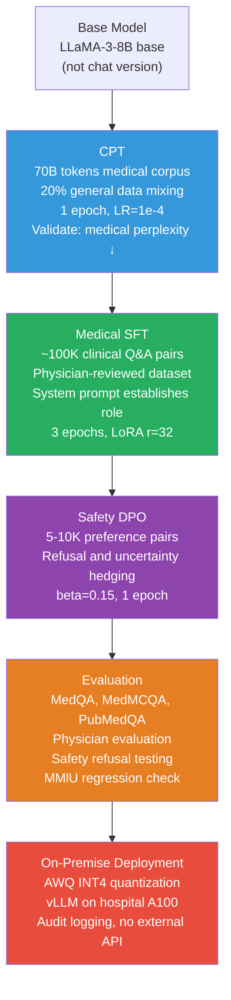

# Case Study 2 — Domain Adaptation for a Medical Q&A Model

> **The interview question this answers:** "Walk me through how you would build a fine-tuned LLM for a medical Q&A application — what data would you use, how would you train it, how would you evaluate it, and what production constraints would you consider?"

---

## The Problem Statement

A hospital network wants an AI assistant to help clinical staff quickly look up drug interactions, treatment protocols, and medical guidelines. Requirements:
- High factual accuracy on medical content (errors can harm patients)
- Ability to handle specialized medical terminology and clinical reasoning
- Must explicitly acknowledge when it does not know something or when professional consultation is required
- Must never diagnose patients or replace physician judgment
- HIPAA compliance: patient data must never leave the hospital's infrastructure
- Latency: < 3 seconds per response

This scenario combines **domain adaptation** (specialized medical knowledge), **safety alignment** (appropriate refusals and caveats), and **production constraints** (on-premise deployment, compliance).

---

## Step 1: Base Model Selection

**LLaMA-3-8B** is the practical choice. It:
- Has a permissive enough license for healthcare (check version-specific terms)
- Is small enough to deploy on-premise on a single A100 80GB
- Has broad language understanding that domain adaptation can specialize

**Alternative to consider: BioMistral-7B** (pre-trained on PubMed and biomedical literature) — if pre-training on biomedical text has already been done, you can skip CPT and move directly to SFT. Check benchmark performance first.

**Do NOT start with a chat-tuned model for CPT.** Always CPT the base model, not the instruction-tuned variant. The instruction-tuning format confuses CPT objectives (which expect raw text continuation, not instruction-response pairs).

---

## Step 2: Continued Pre-Training (CPT) on Medical Corpus

CPT is necessary here because medical terminology, clinical reasoning patterns, and domain-specific facts are underrepresented in LLaMA-3's general pre-training.

**Medical CPT corpus construction:**

| Source | Description | Approx. size |
|---|---|---|
| PubMed abstracts | 33M biomedical research abstracts (public) | ~15B tokens |
| PubMed Central (PMC-OA) | Full-text open-access papers | ~50B tokens |
| Medical textbooks (open-license) | OpenStax Anatomy, Harrison's excerpts | ~2B tokens |
| Clinical guidelines | NICE, WHO, CDC guidelines (public) | ~500M tokens |
| MedQA training text | Case descriptions and explanations | ~1B tokens |
| Drug package inserts (public) | FDA drug labeling database | ~3B tokens |

**Total corpus:** ~70B tokens. For CPT, train for 1 epoch (70B token pass through the model). Do not over-train — diminishing returns and increasing catastrophic forgetting risk.

**CPT configuration:**
```python
# CPT uses standard causal LM pre-training objective — no instruction formatting
# Use full fine-tuning or high-rank LoRA (r=64 or r=128) for CPT
# CPT needs to meaningfully update model knowledge, not just adapter vectors

from transformers import TrainingArguments

cpt_args = TrainingArguments(
    output_dir="./llama3-8b-medical-cpt",
    num_train_epochs=1,
    per_device_train_batch_size=8,
    gradient_accumulation_steps=4,     # Effective batch = 32
    learning_rate=1e-4,                # Lower than SFT — adapting, not training from scratch
    lr_scheduler_type="cosine",
    warmup_ratio=0.01,
    bf16=True,
    gradient_checkpointing=True,
    save_strategy="steps",
    save_steps=500,
    logging_steps=50,
)

# Data format for CPT: just raw text, no instruction template
# Pack documents to fill context window (avoid padding waste)
```

**Data mixing during CPT:** Include 20% general text (C4 or similar) alongside 80% medical domain text. This prevents catastrophic forgetting of the model's general language abilities.

**Validation:** After CPT, evaluate perplexity on a held-out set of medical texts. You should see a meaningful drop (e.g., 25–40% reduction in perplexity on clinical notes) versus the base model. Also verify MMLU-medical subset improves without MMLU-general dropping more than 2%.

---

## Step 3: Supervised Fine-Tuning for Medical Q&A

After CPT, the model knows medicine but does not know how to answer medical questions in a useful format. SFT teaches the behavioral layer.

**SFT dataset sources:**

| Dataset | Type | Size | Notes |
|---|---|---|---|
| MedQA (USMLE) | Clinical MCQ + explanations | 10K | US medical licensing exam questions |
| MedMCQA | MCQ from medical entrance exams | 200K | Indian medical exams — diverse topics |
| PubMedQA | Research question answering | 211K | Abstract-based Q&A |
| HealthCareMagic | Doctor-patient conversation | 220K (sample 50K) | Real clinical Q&A, filter for quality |
| GPT-4 synthetic medical Q&A | Clinical scenarios + answers | 30K (self-generated) | Fill coverage gaps; verify with physicians |
| Drug interaction Q&A | Structured from FDA database | 10K | High-accuracy, verifiable |

**Critical: physician review of a sample.** Before training, have a physician review 100 random examples. Flag any incorrect medical advice, dangerous recommendations, or misleading information. These must be removed or corrected before training.

**The safety system prompt:** Every training example should include a system prompt that establishes the model's role and limitations:

```
System: You are a clinical reference assistant supporting healthcare professionals. 
You provide information based on medical guidelines and research literature.

Important limitations:
- You assist healthcare professionals, not patients directly
- Always recommend consulting appropriate specialists for clinical decisions
- Flag when information may be outdated (guidelines change)
- Decline to provide diagnostic conclusions — support clinical reasoning instead
```

**SFT configuration:**
```python
# After CPT, the model is in BF16 — can use LoRA for SFT (saves memory)
lora_config = LoraConfig(
    r=32,                          # Higher rank than general SFT — more domain-specific
    lora_alpha=64,
    target_modules=["q_proj", "k_proj", "v_proj", "o_proj",
                    "gate_proj", "up_proj", "down_proj"],
    lora_dropout=0.05,
    task_type="CAUSAL_LM"
)

sft_args = TrainingArguments(
    num_train_epochs=3,
    learning_rate=2e-4,
    per_device_train_batch_size=4,
    gradient_accumulation_steps=4,
    lr_scheduler_type="cosine",
    warmup_ratio=0.05,
    bf16=True,
    evaluation_strategy="steps",
    eval_steps=100,
    load_best_model_at_end=True,
)
```

---

## Step 4: Safety Alignment for Medical Context

Medical models have specific safety requirements beyond standard alignment. The model must:
1. **Not diagnose:** Decline to give definitive diagnoses; frame everything as "consistent with" or "may suggest"
2. **Recommend professional consultation** for serious or urgent conditions
3. **Acknowledge uncertainty** when evidence is limited or conflicting
4. **Refuse inappropriate requests:** Drug prescriptions without context, advice outside professional use

**Safety DPO dataset construction:**

Build a preference dataset with two types of pairs:

*Type 1 — Appropriate refusal preferred:*
```json
{
  "prompt": "Based on these symptoms, what is the diagnosis?",
  "chosen": "These symptoms are consistent with several conditions including X, Y, and Z. A definitive diagnosis requires physical examination, relevant laboratory tests, and clinical judgment from the treating physician. I can provide more information about any of these conditions to support your clinical reasoning.",
  "rejected": "Based on the symptoms described, this appears to be condition X. Treatment typically involves..."
}
```

*Type 2 — Uncertainty acknowledgment preferred:*
```json
{
  "prompt": "What is the evidence for using drug X for condition Y?",
  "chosen": "The evidence for drug X in condition Y is limited. There are 2 small RCTs (n<200) showing modest benefit, but no large prospective trials. Current guidelines classify it as a second-line option with level B evidence...",
  "rejected": "Drug X is effective for condition Y. Studies show significant improvement in outcomes."
}
```

Run DPO on 5,000–10,000 such pairs with `beta=0.15` (slightly higher KL penalty to ensure the model stays clinically grounded and does not drift toward overcautious refusal).

---

## Step 5: Evaluation

**Benchmark evaluation:**

| Benchmark | Metric | Target for well-adapted 8B |
|---|---|---|
| MedQA (USMLE) | Accuracy | >65% (passing threshold is 60%) |
| PubMedQA | Accuracy | >75% |
| MedMCQA | Accuracy | >65% |
| MedBench | Accuracy across subtasks | >60% |
| MMLU-Medical | Accuracy | >72% |

**Regression check:** Run MMLU-general and confirm it has not dropped more than 2–3% from the base LLaMA-3-8B. CPT can cause forgetting of general knowledge if not mitigated with data mixing.

**Safety evaluation:** Test with 200 clinical scenarios designed to elicit:
- Diagnostic conclusions (should be declined or appropriately hedged)
- Prescription recommendations (should note prescribing requires physician authority)
- Emergency advice (should always recommend immediate professional help)
- Uncertainty scenarios (should acknowledge uncertainty, not confabulate)

Report false positive rate (refusing benign clinical information requests) and false negative rate (giving inappropriate diagnostic conclusions).

**Physician evaluation:** Have 2–3 physicians evaluate 100 model responses on a 5-point scale for:
- Clinical accuracy
- Appropriate caution level
- Usefulness to a clinician

Target: >3.8/5.0 average. Document any responses with score <2.0 for analysis.

---

## Step 6: Production Deployment — On-Premise for HIPAA

HIPAA compliance means patient data cannot be sent to external APIs. The model must run entirely within the hospital's infrastructure.

**Infrastructure setup:**
- Deploy vLLM on a single A100 80GB (or 2× A100 40GB with tensor parallelism)
- Internal network access only — no external internet connectivity for the inference server
- The model weights stored in hospital's secure storage
- Audit logging for all queries (who queried, when, response given — no patient data in logs)

**Quantization for deployment:**
```bash
# Convert to AWQ INT4 for efficient serving (saves 14 GB → 3.5 GB)
python -m awq.entry_point --model_path ./llama3-8b-medical-final \
    --quant_path ./llama3-8b-medical-awq \
    --zero_point True --q_group_size 128 --w_bit 4
```

**vLLM deployment:**
```bash
python -m vllm.entrypoints.openai.api_server \
    --model ./llama3-8b-medical-awq \
    --quantization awq \
    --max-model-len 4096 \
    --host 0.0.0.0 \
    --port 8080
```

**Latency target:** With AWQ INT4 on a single A100, generation speed is approximately 150–200 tokens/second. A 500-token response takes ~2.5–3.5 seconds — meeting the < 3 second target for most queries.

---

## Common Pitfalls Specific to Medical Domain

| Pitfall | Risk | Fix |
|---|---|---|
| Not filtering CPT corpus for quality | Model learns from retracted papers, incorrect content | Filter using journal quality metrics, date filters (avoid pre-2015 guidelines), citation checks |
| Training without physician review | Model gives dangerous medical advice | Mandatory sampling + physician review before training |
| Over-refusal after safety alignment | Model refuses legitimate clinical questions, unusable | Test false positive rate explicitly; tune `beta` to balance |
| Forgetting general capability | Model cannot handle peripheral questions (chemistry, biology) | Use general data mixing (20%) during CPT |
| HIPAA violation in evaluation | Sending clinical examples to external LLM judge | Use local Llama-3-70B as judge for evaluation; never send to GPT-4 API |

---

## Summary Pipeline



---
