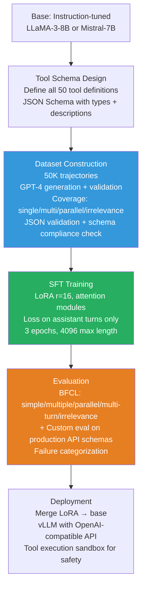

# Case Study 3 — Training a Function-Calling / Tool-Use Model

> **The interview question this answers:** "How would you fine-tune a model to reliably call APIs and external tools? Walk me through your data strategy, training approach, and evaluation."

---

## The Problem Statement

You are building an AI assistant for a SaaS platform with 50+ internal APIs — calendar, CRM, email, database queries, analytics tools. The model must:
- Recognize when a user's request requires a tool call vs. a direct answer
- Select the correct tool from the available set (correct tool selection)
- Extract arguments precisely from natural language (correct argument extraction)
- Handle multi-step workflows (sequential tool calls)
- Gracefully decline to call tools when the request is ambiguous or the tool is not appropriate
- Produce coherent final responses that integrate tool results

This is more complex than it sounds. The failure modes are different from general instruction following, and evaluation requires actually executing tool calls.

---

## Step 1: Base Model Selection

**LLaMA-3-8B-Instruct** or **Mistral-7B-Instruct-v0.3** are the practical starting points. Use an instruction-tuned base (not raw base) because:
- Function calling training is a refinement on top of general instruction following
- Training from scratch in tool-use format on a base model requires much more data
- The instruction-tuned model already understands Q&A format and can be taught the tool-call extension

**Alternative:** **Mistral-7B-v0.3** has native function calling support built in from training — starting from it can reduce the amount of tool-use SFT needed.

---

## Step 2: Designing the Tool Schema and Data Format

Before building training data, standardize the tool call format. Use the OpenAI function calling schema (industry standard):

```python
# Tool definition format (JSON Schema)
CALENDAR_TOOL = {
    "type": "function",
    "function": {
        "name": "create_calendar_event",
        "description": "Create a new calendar event for the user",
        "parameters": {
            "type": "object",
            "properties": {
                "title": {
                    "type": "string",
                    "description": "The event title"
                },
                "start_datetime": {
                    "type": "string",
                    "description": "Start time in ISO 8601 format (e.g., '2024-06-15T14:00:00')"
                },
                "duration_minutes": {
                    "type": "integer",
                    "description": "Duration of the event in minutes"
                },
                "attendees": {
                    "type": "array",
                    "items": {"type": "string"},
                    "description": "Email addresses of attendees"
                }
            },
            "required": ["title", "start_datetime", "duration_minutes"]
        }
    }
}
```

**The training example format** (complete trajectory):
```json
{
    "messages": [
        {
            "role": "system",
            "content": "You are a helpful assistant with access to the user's tools.",
            "tools": [CALENDAR_TOOL, CRM_TOOL, EMAIL_TOOL]
        },
        {
            "role": "user",
            "content": "Can you set up a 1-hour meeting with sarah@company.com and john@company.com for next Monday at 2pm?"
        },
        {
            "role": "assistant",
            "content": null,
            "tool_calls": [{
                "id": "call_abc123",
                "type": "function",
                "function": {
                    "name": "create_calendar_event",
                    "arguments": "{\"title\": \"Meeting\", \"start_datetime\": \"2024-06-17T14:00:00\", \"duration_minutes\": 60, \"attendees\": [\"sarah@company.com\", \"john@company.com\"]}"
                }
            }]
        },
        {
            "role": "tool",
            "tool_call_id": "call_abc123",
            "content": "{\"success\": true, \"event_id\": \"evt_789\", \"message\": \"Event created successfully\"}"
        },
        {
            "role": "assistant",
            "content": "I've created a 1-hour meeting for next Monday at 2:00 PM and invited sarah@company.com and john@company.com. They should receive calendar invitations shortly."
        }
    ]
}
```

---

## Step 3: Building the Training Dataset

This is the most labor-intensive part of tool-use training. You need examples covering all four tool-use skills:

### Coverage Matrix

| Skill | # Examples | Example types |
|---|---|---|
| Direct answer (no tool needed) | 5,000 | Questions answerable from knowledge, greetings, clarifications |
| Single tool call | 15,000 | One tool, correct args, different phrasings of same intent |
| Tool selection (multiple tools available) | 8,000 | User query could match 2+ tools, model must pick correctly |
| Argument extraction edge cases | 7,000 | Relative dates ("next Monday"), implicit args, missing required args |
| Multi-turn sequential calls | 8,000 | 2-4 tool calls in sequence, each informed by previous result |
| Parallel tool calls | 3,000 | Multiple independent tools called simultaneously |
| Irrelevance / decline | 4,000 | Queries where no available tool applies, model should say so |
| **Total** | **50,000** | |

### Data Generation Approach

**For your specific 50 API tools, GPT-4 generation is the most practical approach:**

```python
import openai
import json

def generate_tool_call_example(tool_definitions, user_query_template):
    """Generate a complete tool-call trajectory using GPT-4."""
    
    system_prompt = f"""You are generating training data for a tool-calling AI assistant.
    
Given a user query, generate the complete conversation trajectory including:
1. The user's message
2. The assistant's tool call (correct JSON arguments)  
3. A realistic tool result
4. The assistant's final response integrating the result

Available tools: {json.dumps(tool_definitions, indent=2)}

Return valid JSON with the complete messages array."""

    response = openai.chat.completions.create(
        model="gpt-4o",
        messages=[
            {"role": "system", "content": system_prompt},
            {"role": "user", "content": f"Generate an example for this query type: {user_query_template}"}
        ],
        response_format={"type": "json_object"},
        temperature=0.8  # Some randomness for diversity
    )
    
    return json.loads(response.choices[0].message.content)

# Generate with diverse query templates
query_templates = [
    "Schedule a meeting with [person] at [time]",
    "Show me the sales numbers for [period]",
    "Send an email to [person] about [topic]",
    "Look up the account details for [customer]",
    # ... 50 more templates covering all 50 tools
]
```

**Quality filters for generated data:**
1. **JSON validity:** Parse every tool call argument JSON — reject if invalid
2. **Required fields check:** Verify all `required` fields from the schema are present in arguments
3. **Type validation:** Check argument types match schema (string vs integer vs array)
4. **Irrelevance check:** For "no tool needed" examples, verify the assistant actually declines to call any tool
5. **Execute and verify (optional but recommended):** For tools with test environments, actually execute the calls and verify they succeed

### Hard Examples: The Edge Cases That Fail in Production

Beyond the standard cases, deliberately include hard examples:

```python
# Hard example 1: Relative date parsing
user: "Set up a meeting for the day after tomorrow at 3pm"
# Model must resolve "day after tomorrow" to correct ISO 8601 datetime

# Hard example 2: Partial information requiring clarification
user: "Schedule a meeting with John"
# Model should NOT hallucinate John's email or time — should ask for clarification

# Hard example 3: Ambiguous tool selection
user: "Send an update to the team"
# Could be email tool OR slack tool OR CRM update tool — model must ask for clarification

# Hard example 4: Tool result error handling
tool_result: {"error": "User not found", "code": 404}
# Model should report the error clearly, not pretend it succeeded

# Hard example 5: Multiple entities
user: "Schedule separate 30-minute calls with Alice, Bob, and Carol tomorrow morning"
# Model must make 3 separate tool calls, not one call with all three
```

---

## Step 4: SFT Training

```python
from trl import SFTTrainer, SFTConfig
from peft import LoraConfig

lora_config = LoraConfig(
    r=16,
    lora_alpha=32,
    target_modules=["q_proj", "k_proj", "v_proj", "o_proj"],
    # Note: tool-calling is primarily learned via attention modules
    # FFN modules less critical for this task
    lora_dropout=0.05,
    task_type="CAUSAL_LM"
)

sft_config = SFTConfig(
    num_train_epochs=3,
    learning_rate=2e-4,
    per_device_train_batch_size=4,
    gradient_accumulation_steps=4,
    bf16=True,
    max_seq_length=4096,    # Tool call trajectories can be long
    evaluation_strategy="steps",
    eval_steps=100,
    load_best_model_at_end=True,
)

# IMPORTANT: Loss masking must cover tool result turns
# The model should learn to generate: tool calls + final responses
# The model should NOT learn to generate: user queries + tool results (these are inputs)
```

**Loss masking for tool-calling:**
Apply loss only on:
- The assistant's tool call turns (the model must generate the JSON correctly)
- The assistant's final text responses

Do NOT apply loss on:
- System message (includes tool definitions — these are context)
- User turns
- Tool result turns (these come from the execution environment)

---

## Step 5: Evaluation on BFCL

The **Berkeley Function Calling Leaderboard (BFCL)** is the standard benchmark for tool-use capability.

```bash
# Install BFCL evaluation framework
pip install bfcl

# Run evaluation against your model
python bfcl/eval_runner.py \
    --model your-model-path \
    --test-category simple \
    --test-category multiple \
    --test-category parallel \
    --test-category multi_turn \
    --test-category irrelevance
```

**BFCL categories and what they test:**

| Category | Tests | What failure means |
|---|---|---|
| Simple | Single tool, straightforward args | Basic argument extraction broken |
| Multiple | Choose correct tool from 2+ options | Tool selection doesn't work |
| Parallel | Call 2+ tools simultaneously | Parallel call format not learned |
| Multi-turn | Sequential calls across conversation turns | Context not maintained |
| Irrelevance | No tool needed — model should decline | Model calls tools unnecessarily |

**Target scores for a well-trained 8B model:**

| Category | Target |
|---|---|
| Simple | > 85% |
| Multiple | > 75% |
| Parallel | > 70% |
| Multi-turn | > 65% |
| Irrelevance | > 80% |

**Custom evaluation against your actual APIs:** Always supplement BFCL with evaluation on your specific tool schemas. BFCL uses generic tools; your production tools have specific naming, argument conventions, and edge cases that only a custom eval set captures.

---

## Step 6: Common Failure Analysis

After training, categorize failures from your eval set:

```python
failure_categories = {
    "wrong_tool": 0,           # Called a different tool than needed
    "missing_required_arg": 0, # Required argument not included in call
    "wrong_arg_type": 0,       # String where integer expected (or vice versa)
    "hallucinated_arg": 0,     # Argument that doesn't exist in schema
    "no_call_needed": 0,       # Called tool when direct answer was right
    "missed_required_call": 0, # Did not call tool when it was needed
    "wrong_arg_value": 0,      # Correct field, wrong value (e.g., wrong date format)
    "parallel_as_sequential": 0  # Made sequential calls when parallel was correct
}
```

Each category has a specific fix:
- `wrong_tool`: Add more tool selection contrast examples (similar queries, different correct tools)
- `missing_required_arg`: Add clarification request examples (when required arg not in query, ask)
- `wrong_arg_type`: Add explicit type examples in training data
- `hallucinated_arg`: Add negative examples where model explicitly omits optional args

---

## Common Pitfalls

| Pitfall | Symptom | Fix |
|---|---|---|
| Only training single-tool examples | Model fails on multi-tool scenarios | Ensure 20%+ of training is multi-turn/parallel |
| Not training irrelevance detection | Model calls tools for everything | Include 10% "no tool needed" examples |
| Not validating argument JSON | Model generates valid-looking but syntactically broken JSON | JSON validation as quality filter in data pipeline |
| Loss on tool result turns | Model learns to generate fake tool results | Verify loss masking excludes tool result turns |
| Using wrong date format | Model returns human-readable dates instead of ISO 8601 | Explicitly teach format in training examples and tool descriptions |

---

## Summary Pipeline



---
