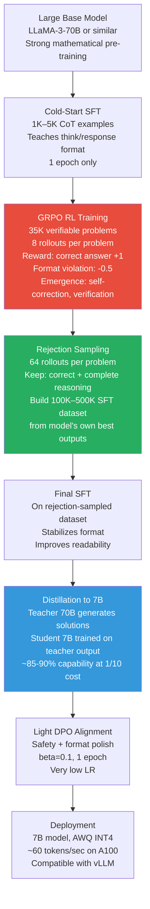

# Case Study 4 — Training a Reasoning Model (DeepSeek-R1 Style)

> **The interview question this answers:** "How would you train a model with strong reasoning capabilities for math and code? Walk me through the data strategy, training algorithm, and what emerges from RL training."

---

## The Problem Statement

You want to build a model that can solve competition-level math problems and hard coding challenges — tasks that require multi-step reasoning, self-correction, and extended thinking. The target is a model that:
- Can solve 70–80% of AIME-level math competition problems
- Achieves > 85% pass@1 on HumanEval and > 90% on MBPP
- Shows evidence of reasoning — not just pattern matching to memorized solutions
- Can explain its reasoning step-by-step when asked
- Is deployable as a 7B or 8B model (distilled from a larger trained version)

This is the approach pioneered by DeepSeek-R1 and replicated in various forms by open-source projects (Sky-T1, OpenR, STILL-3). It combines SFT, RL with verifiable rewards, rejection sampling, and distillation.

---

## Why Standard SFT Is Insufficient for Reasoning

Standard SFT on `(problem, solution)` pairs teaches pattern matching. The model sees a math problem and learns to output something that looks like its training solutions. On novel problems outside the training distribution, it fails because it never learned the underlying reasoning process — only the surface form.

The critical limitation of pure SFT:
- Model learns "problems that look like X have solutions that look like Y"
- Does not learn to explore, backtrack, or verify — the key capabilities in genuine reasoning
- Performance on truly novel problems (OOD from training data) is poor

**RL with verifiable rewards** fixes this by letting the model explore many solution paths and learning from the outcome — which solutions actually produce correct answers. This creates genuine reasoning capability, not memorization.

---

## Step 1: Base Model Selection

**For the RL-trained reasoning model:** A large, capable base model is essential. RL training amplifies existing capabilities — it cannot teach from scratch. Use:
- LLaMA-3-70B base (not instruction-tuned) for maximum capability
- DeepSeek-V3 base (if using DeepSeek's approach exactly)
- Qwen2.5-72B base (strong math capability from pre-training)

**For the distilled deployment model:** After RL training, you distill to 7B or 8B:
- LLaMA-3-8B base
- Qwen2.5-7B base

---

## Step 2: Cold-Start SFT — Teaching the Reasoning Format

Before RL training, you need a brief SFT phase to teach the model to use the `<think>` scratchpad format. RL training will build on this format.

**Why cold start?** Without any format training, the RL model has no idea what "use a scratchpad" means. The cold-start SFT establishes the output structure that RL training will then optimize within.

**Cold-start dataset construction:**
Collect 1,000–5,000 high-quality reasoning examples in the exact format you want the model to use:

```
<think>
Let me carefully read the problem...

[Extended reasoning process, potentially with mistakes and corrections]
[The model explores, backtracks, tries different approaches]
[Self-verification: "Let me check this answer..."]
</think>

The answer is: [final answer]
```

**Sources for cold-start data:**
- Use GPT-4o or Claude 3.5 Sonnet with "think step by step" prompting on hard problems, then format the outputs
- Select only examples where the final answer is verified correct
- Target math problems (MATH dataset, AMC, AIME) and competitive coding (LeetCode hard, Codeforces)
- Aim for 30–60% solution length in `<think>` tokens (models that learned to "think more" perform better)

**Cold-start SFT configuration:**
```python
# Standard SFT — but on reasoning format data
# Use full fine-tuning or high-rank LoRA (r=64) on the 70B model
# Goal: teach format, not solve problems — keep training minimal (1 epoch)
sft_config = TrainingArguments(
    num_train_epochs=1,           # Just enough to learn the format
    learning_rate=1e-5,           # Conservative — don't overfit to examples
    per_device_train_batch_size=1,
    gradient_accumulation_steps=8,
    bf16=True,
    max_seq_length=8192,          # Long — reasoning traces are long
)
```

---

## Step 3: GRPO Training with Verifiable Rewards

This is the core of the approach. Group Relative Policy Optimization (GRPO) trains the model to reason correctly by sampling many solution attempts and learning from which ones succeed.

**The reward function — this is the critical design decision:**

```python
def compute_reward(
    model_output: str,
    ground_truth_answer: str,
    problem_type: str
) -> float:
    """
    Binary reward: +1 for correct answer, 0 for wrong.
    Optionally: format penalties for missing <think> tags.
    """
    
    # Extract final answer from model output
    if "</think>" in model_output:
        # Split at </think>, take what comes after
        response_part = model_output.split("</think>")[-1].strip()
    else:
        response_part = model_output
    
    # For math: check if numerical answer matches
    if problem_type == "math":
        extracted = extract_math_answer(response_part)  # Parse LaTeX, numbers, fractions
        correct = math_equal(extracted, ground_truth_answer)
    
    # For code: execute and check against test cases
    elif problem_type == "code":
        correct = execute_and_check(response_part, test_cases=ground_truth_answer)
    
    # Base reward
    base_reward = 1.0 if correct else 0.0
    
    # Format reward: penalize if <think> tags missing
    format_reward = 0.0
    if "<think>" in model_output and "</think>" in model_output:
        format_reward = 0.1  # Small bonus for using reasoning format
    else:
        format_reward = -0.5  # Penalty for skipping scratchpad
    
    return base_reward + format_reward
```

**GRPO training loop:**

```python
# For each training batch:
# 1. Sample G=8 rollouts from the current model
# 2. Score each with the reward function
# 3. Compute group-relative advantages
# 4. Update model

for batch in training_data:
    problems = batch["problems"]
    ground_truths = batch["answers"]
    
    # Step 1: Sample G rollouts per problem
    G = 8
    all_outputs = []
    for problem in problems:
        outputs = model.generate(
            problem,
            num_return_sequences=G,
            temperature=0.8,
            max_new_tokens=4096,   # Long -- reasoning needs space
        )
        all_outputs.append(outputs)
    
    # Step 2: Compute rewards
    rewards = []
    for outputs, truth, problem_type in zip(all_outputs, ground_truths, batch["types"]):
        problem_rewards = [
            compute_reward(output, truth, problem_type)
            for output in outputs
        ]
        rewards.append(problem_rewards)
    
    # Step 3: Group-relative advantages
    # For each problem, normalize rewards within the group
    advantages = []
    for problem_rewards in rewards:
        mean_r = np.mean(problem_rewards)
        std_r = np.std(problem_rewards) + 1e-8  # Prevent division by zero
        problem_advantages = [(r - mean_r) / std_r for r in problem_rewards]
        advantages.append(problem_advantages)
    
    # Step 4: Policy gradient update
    # Maximize: E[advantage * log_prob(output|problem)]
    loss = compute_grpo_loss(model, problems, all_outputs, advantages)
    optimizer.zero_grad()
    loss.backward()
    optimizer.step()
```

**Training data for GRPO — verifiable problems only:**

| Source | Type | Size | Verifiable? |
|---|---|---|---|
| MATH dataset | Competition math | 12.5K | ✓ (numerical/expression) |
| GSM8K | Grade school math | 8.5K | ✓ (numerical) |
| AMC/AIME problems | Competition math | ~2K | ✓ |
| OmniMath | Olympiad math | 4K | ✓ |
| LeetCode easy/medium/hard | Coding | 2K+ | ✓ (test cases) |
| HumanEval variants | Coding | 1K+ | ✓ (test cases) |
| Codeforces problems | Competitive coding | 5K+ | ✓ |

**Total: ~35K problems, each sampled G=8 times per training step.**

---

## Step 4: What Emerges During RL Training

This is the most remarkable part of the pipeline. Behaviors that were never explicitly taught emerge spontaneously:

**Self-correction:** The model begins correcting itself mid-reasoning:
```
<think>
So the answer would be 48. Wait, let me re-check step 3.
I made an error — the constraint is x > 0, not x ≥ 0, so x=0 is excluded.
Let me redo from step 3...
The correct count is therefore 47.
</think>
The answer is 47.
```

**Backtracking:** The model tries one approach, recognizes it is failing, and tries another:
```
<think>
Let me try direct computation... This is getting very messy.
Let me try a different approach — maybe there is a pattern.
Testing small cases: n=1 gives 2, n=2 gives 6, n=3 gives 14...
The pattern looks like 2(2^n - 1). Let me verify...
</think>
```

**Verification:** The model spontaneously verifies its answers:
```
<think>
I got x = 3/7. Let me check: substitute back into the original equation.
Left side: 2(3/7) + 5 = 6/7 + 35/7 = 41/7
Right side: 41/7 ✓
The answer checks out.
</think>
```

**Longer reasoning on harder problems:** The model allocates more thinking tokens to harder problems. This dynamic compute allocation is not explicitly trained — it emerges from RL pressure to get right answers.

> **Interview note:** "Do you train the model to self-correct?" The answer: "No — self-correction, backtracking, and verification are emergent behaviors from RL training with outcome rewards. The model discovers that using more thinking tokens and exploring multiple approaches leads to correct answers more often. The RL training signal (correct/incorrect final answer) creates pressure toward behaviors that increase accuracy, and these reasoning behaviors are what increase accuracy."

---

## Step 5: Rejection Sampling — Building a High-Quality SFT Dataset

After RL training, use the now-capable RL model to generate a high-quality dataset for a final SFT pass.

**Why rejection sampling after RL?** RL training produces a model with strong reasoning capability but sometimes unstable output format, verbose reasoning that is hard to follow, and occasional format violations. A final SFT pass on the best RL outputs produces a cleaner, more stable model.

```python
def rejection_sample_dataset(
    rl_trained_model,
    problems: list[str],
    ground_truths: list[str],
    n_samples_per_problem: int = 64,
    target_dataset_size: int = 100_000
) -> list[dict]:
    """
    Generate many rollouts, keep only correct ones with complete reasoning.
    """
    
    accepted = []
    
    for problem, truth in zip(problems, ground_truths):
        # Generate n_samples rollouts from RL model
        outputs = rl_trained_model.generate(
            problem,
            num_return_sequences=n_samples_per_problem,
            temperature=0.7,
            max_new_tokens=4096,
        )
        
        for output in outputs:
            # Criteria for acceptance:
            # 1. Final answer is correct
            if not is_correct(output, truth):
                continue
            
            # 2. Has complete <think>...</think> block
            if "<think>" not in output or "</think>" not in output:
                continue
            
            # 3. Reasoning is non-trivial (>100 thinking tokens)
            think_content = output.split("<think>")[1].split("</think>")[0]
            if len(think_content.split()) < 50:
                continue
            
            # 4. No formatting artifacts or repetitions
            if is_repetitive(output) or has_formatting_artifacts(output):
                continue
            
            accepted.append({
                "problem": problem,
                "solution": output,
                "verified_correct": True
            })
            
            if len(accepted) >= target_dataset_size:
                return accepted
    
    return accepted
```

**Target:** 100K–500K accepted (problem, reasoning_trace, answer) triples. These form the dataset for the final SFT pass.

---

## Step 6: Final SFT Pass

Run standard SFT on the rejection-sampled dataset. This:
- Stabilizes the output format
- Produces cleaner reasoning chains (RL training optimizes for correctness, not readability)
- Reduces hallucination in reasoning steps
- Allows for alignment (safety) to be applied cleanly

```python
# Standard SFT config — same as Case Study 1 but on reasoning data
# Use the full 70B RL-trained model as starting point
# QLoRA if memory-constrained, full FT if cluster available
```

---

## Step 7: Distillation to 7B/8B Deployment Model

The RL-trained 70B reasoning model is too large for most deployments. Distill it to a 7B model that retains most of the reasoning capability.

**Distillation approach: Response distillation**

```python
# Use the 70B reasoning model to generate solutions to ALL training problems
# Then train the 7B model on these 70B-generated solutions

for problem in all_problems:
    # 70B generates high-quality reasoning traces
    teacher_solution = reasoning_70b.generate(
        problem,
        temperature=0.0,  # Greedy for quality
        max_new_tokens=4096,
    )
    
    # Only keep if teacher solution is correct
    if is_correct(teacher_solution, ground_truth[problem]):
        distillation_dataset.append({
            "problem": problem,
            "solution": teacher_solution  # Full 70B reasoning trace
        })

# Train 7B model on this dataset — standard SFT
# 7B model learns to mimic the 70B model's reasoning process
```

**Results of distillation (typical for this approach):**

| Model | MATH | AIME 2024 | HumanEval pass@1 |
|---|---|---|---|
| LLaMA-3-8B base | 30% | 2/30 | 62% |
| LLaMA-3-8B + SFT only | 52% | 5/30 | 79% |
| Distilled from 70B RL model | 72% | 14/30 | 87% |
| 70B RL model (teacher) | 79% | 21/30 | 92% |

The distilled 7B captures ~85–90% of the teacher's capability at 1/10th the inference cost.

---

## Step 8: Final Alignment

Before deployment, run DPO on the distilled 7B to:
- Remove any unsafe reasoning patterns the RL training introduced
- Polish the response format
- Improve the model's behavior on non-math/code queries

```python
# Light DPO — the reasoning model doesn't need heavy alignment
# Just safety and polish
dpo_config = DPOConfig(
    beta=0.1,
    learning_rate=1e-7,    # Very conservative — don't disturb reasoning capability
    num_train_epochs=1,
)
```

---

## The Full Pipeline



---

## Key Insights This Pipeline Reveals

1. **RL is the source of reasoning capability**, not SFT. SFT can distill it, but cannot create it from scratch.

2. **Verifiable problems are the enabling constraint.** This approach only works for math and code because you can automatically check correctness. For open-ended reasoning, you cannot build this reward signal without human annotation.

3. **The 70B→7B capability gap is smaller than expected.** The distilled 7B retains ~85–90% of teacher capability — the teacher's reasoning traces encode the reasoning process efficiently enough that a much smaller model can learn to replicate it.

4. **Emergence, not design.** Self-correction, backtracking, and extended thinking are not engineered features. They emerge from optimization pressure. This is why the DeepSeek-R1 result was surprising — behaviors appeared that the training pipeline never explicitly targeted.

---
