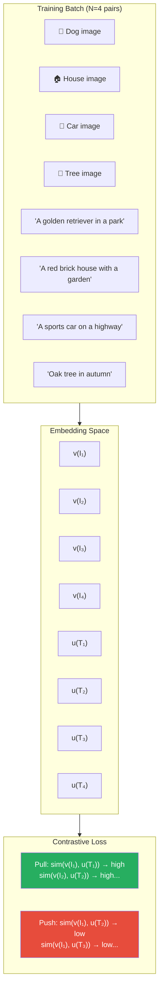
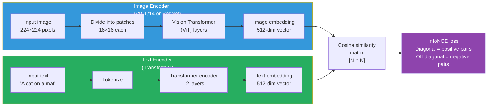
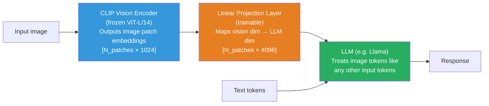

# Supplemental — Contrastive Learning and CLIP: How Models Learn From Image-Text Pairs

> *Lesson 7.1 (multimodal encoders) and Lesson 7.2 (VLMs / LLaVA architecture) assume you know what CLIP is and how it was trained. This lesson gives you that foundation.*

---

## The Problem: Learning Visual Representations Without Labels

To train a model that understands images, the classic approach is supervised learning: collect millions of images, hire annotators to label each one ("cat," "dog," "car"), and train a classifier. This works but has a hard ceiling — you can only train the model to recognize the categories you labeled. Labeling is expensive, subjective, and cannot scale to the infinite diversity of real-world visual concepts.

What if instead of labels, you used text? The internet contains hundreds of millions of images that already have natural language descriptions: alt text, captions, surrounding paragraphs. A photo of a dog on Wikipedia is surrounded by text about dogs. A product photo on an e-commerce site is paired with a product description. These image-text pairs are not curated labels — they are messy, noisy, natural language — but they exist at a scale no human labeling effort can match.

The challenge is learning from this data. The text paired with an image does not say "this is a dog." It might say "my golden retriever Luna playing in the park last Sunday." There is no classification target. What you can do is learn that the image and its paired text are semantically related, and that this image is not related to 400 million other texts in your dataset. This is the contrastive learning objective — and CLIP is its most successful application.

---

## Contrastive Learning: Pull Matches Together, Push Non-Matches Apart

The core idea of contrastive learning: train an encoder such that matched pairs (semantically related items) have similar representations, while unmatched pairs (semantically unrelated) have dissimilar representations.

For a batch of N image-text pairs `{(I₁, T₁), (I₂, T₂), ..., (Iₙ, Tₙ)}`, you have N matched pairs and N×(N-1) unmatched pairs. The objective is:

- Image Iᵢ should be close to text Tᵢ (matched) in embedding space
- Image Iᵢ should be far from text Tⱼ where j≠i (unmatched)

"Close" and "far" are measured by cosine similarity in a shared embedding space.


*Contrastive training pulls matched image-text pairs together in embedding space while pushing all N×(N-1) unmatched pairs apart.*

---

## The InfoNCE Loss

The standard loss for contrastive learning is InfoNCE (Noise Contrastive Estimation):

```
L_InfoNCE = -1/N · Σᵢ log( exp(sim(vᵢ, uᵢ) / τ) / Σⱼ exp(sim(vᵢ, uⱼ) / τ) )
```

Where:
- **vᵢ** = image embedding for pair i (from image encoder)
- **uᵢ** = text embedding for pair i (from text encoder)
- **sim(v, u)** = cosine similarity = (v · u) / (||v|| · ||u||)
- **τ** (tau) = temperature — controls sharpness of the distribution (usually learned)
- The denominator sums over all N texts in the batch — making the unmatched pairs the negatives

Intuitively: you are solving an N-way classification problem. Given image i, which of the N texts in the batch is its match? The loss is cross-entropy of this classification. With a batch of N=4096 pairs (CLIP used up to 32,768), you are contrasting each image against 32,767 incorrect texts. The model must learn rich, discriminative representations to solve this correctly.

---

## CLIP: Contrastive Language-Image Pretraining

CLIP (Radford et al., OpenAI, 2021) applies contrastive learning to 400 million image-text pairs scraped from the internet. The architecture is two separate encoders:


*CLIP trains two encoders — visual and text — to project their inputs into a shared embedding space where matched pairs are close and unmatched pairs are far apart.*

The key design choices:
- **Separate encoders, shared embedding space.** Images and text are encoded independently, then compared in the shared space. This means at inference time, you can encode image and text separately and compare them efficiently.
- **No classification head.** CLIP learns a general embedding, not a fixed set of categories. This is what enables zero-shot transfer.
- **Massive scale.** 400M pairs, trained for weeks on hundreds of GPUs. Scale is what makes the representations general.

---

## Zero-Shot Image Classification: CLIP's Key Capability

After pretraining, CLIP can classify images into arbitrary categories without any fine-tuning — **zero-shot classification**.

How it works:

1. Construct a text prompt for each candidate class: `"a photo of a {class_name}"` for each class in your list
2. Encode the image with the vision encoder → image embedding
3. Encode all class text prompts → text embeddings
4. Compute cosine similarity between image embedding and each text embedding
5. The highest-similarity class is the prediction

```python
import torch
import clip

model, preprocess = clip.load("ViT-L/14", device="cuda")

# Zero-shot classification on ImageNet
image = preprocess(Image.open("cat.jpg")).unsqueeze(0).to("cuda")
classes = ["cat", "dog", "car", "tree", "airplane"]
text_prompts = [f"a photo of a {c}" for c in classes]

with torch.no_grad():
    # Encode image → 512-dim vector
    image_features = model.encode_image(image)
    # Encode all class prompts → [5 × 512] matrix
    text_inputs = clip.tokenize(text_prompts).to("cuda")
    text_features = model.encode_text(text_inputs)

    # Normalize embeddings (cosine similarity requires unit vectors)
    image_features /= image_features.norm(dim=-1, keepdim=True)
    text_features /= text_features.norm(dim=-1, keepdim=True)

    # Compute similarities → pick highest
    similarities = (100.0 * image_features @ text_features.T).softmax(dim=-1)
    predicted_class = classes[similarities.argmax().item()]
```

CLIP achieves ~76% zero-shot accuracy on ImageNet — without seeing a single ImageNet training example. This is the power of contrastive pretraining on diverse web data.

---

## How CLIP Connects to Vision-Language Models

Understanding CLIP is what makes the LLaVA architecture (Lesson 7.2) comprehensible. LLaVA is not a single end-to-end model — it is CLIP + a projection layer + an LLM.


*LLaVA architecture. The CLIP vision encoder converts an image into a sequence of patch embeddings. A learned projection maps these into the LLM's embedding dimension. The LLM then processes image tokens and text tokens identically.*

Why CLIP specifically?

- CLIP's image embeddings are already trained to align with language — they live in a space shaped by text descriptions. This alignment is exactly what you need to inject visual information into a language model.
- CLIP was trained on web-scale data, giving it broad visual knowledge.
- The vision encoder is typically kept frozen during LLaVA training — you only train the projection layer (and optionally the LLM). CLIP's pretrained representations are valuable enough to reuse directly.

> **Interview note:** "Why do VLMs like LLaVA use CLIP as the vision encoder rather than training a vision encoder from scratch?" Weak answer: "Because CLIP is a good model." Strong answer: "CLIP's embeddings are uniquely useful for VLMs because they were trained to align with natural language — the contrastive objective forces CLIP's image representations to occupy the same semantic space as text descriptions. This makes the projection from visual to text embedding space much easier to learn: the CLIP encoder has already done most of the semantic alignment work. Training a vision encoder from scratch in the VLM pipeline would require vastly more data and compute to achieve the same visual-semantic alignment."

---

## Summary

- Contrastive learning trains encoders by pulling matched pairs close and pushing unmatched pairs apart in a shared embedding space. The InfoNCE loss makes this a classification problem: given one item, identify its match among N candidates.
- CLIP applies contrastive learning to 400M internet image-text pairs using two separate encoders (ViT for images, Transformer for text). The encoders are trained to maximize similarity between matched pairs and minimize similarity between unmatched pairs.
- Temperature τ controls sharpness: low τ makes the model commit strongly to the highest-similarity match; high τ spreads probability more evenly.
- Zero-shot classification works because CLIP's embedding space is shaped by text descriptions — you classify by comparing image embeddings to text embeddings of class names, with no task-specific training.
- In VLMs like LLaVA, the CLIP vision encoder converts images into patch embeddings that already live in a language-aligned space. A lightweight projection layer maps these to the LLM's embedding dimension. The LLM then processes visual tokens and text tokens identically — CLIP is what makes this bridging possible.

---
