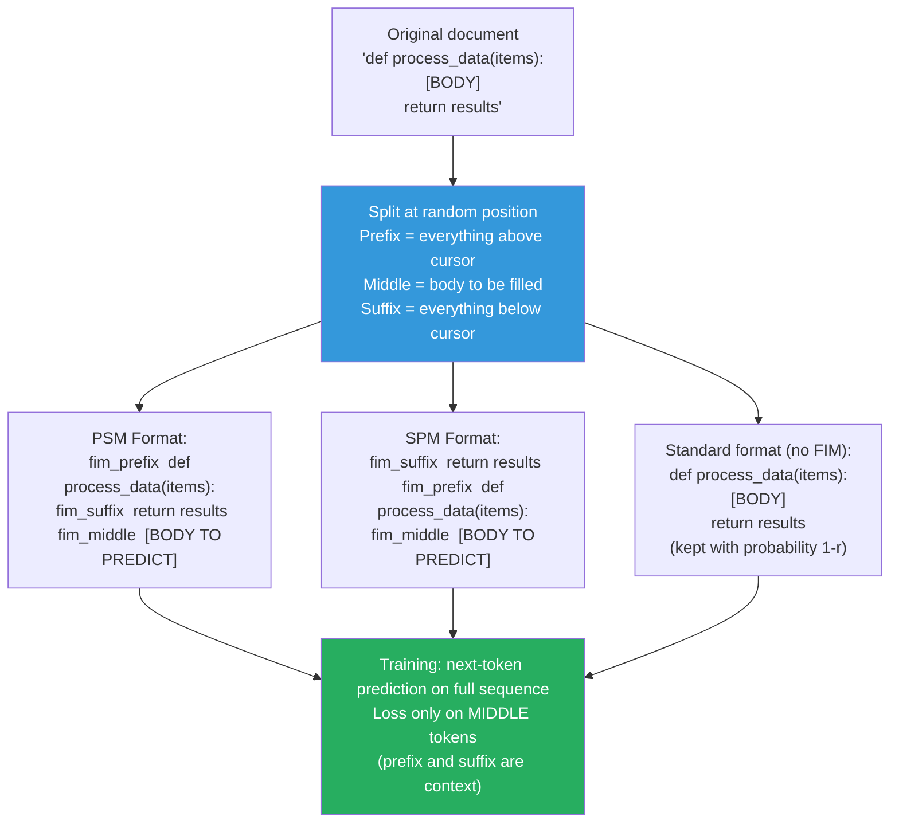

# Supplemental — Fill-in-the-Middle (FIM): Training Code Models to Complete, Not Just Generate

> *Lesson 5.5 (coding capability training) mentions FIM as a key objective for code models. This lesson explains what FIM is, why standard left-to-right training cannot do it, and how the training transformation works.*

---

## The Problem: Autocomplete Is Not Generation

When a user asks a language model "write a function that sorts a list," the model generates code from scratch — left to right, beginning to end. This is what standard autoregressive training teaches: predict the next token given all previous tokens.

But when a developer uses an IDE autocomplete tool — the actual, dominant use case for coding models — the task looks completely different. The developer already has code before the cursor and after the cursor. They want the model to fill in what goes in between:

```python
def process_data(items):
    # ← cursor is here — model must fill this in
    return results
```

The model needs to see both what came before (the function signature and context above) and what comes after (the `return results` line) to complete the middle correctly. Standard left-to-right models are blind to anything after the cursor. They cannot use the suffix to inform the completion.

This is the FIM problem, and it is why models like StarCoder, CodeLlama, and DeepSeek-Coder are specifically trained with a FIM objective alongside standard next-token prediction.

---

## Why You Cannot Just Fine-Tune a Standard Model

A standard left-to-right language model learns:

```
P(token_t | token_1, token_2, ..., token_{t-1})
```

It generates from left to right, conditioned only on past tokens. If you ask it to complete a function body knowing only the lines above, it can do this. But if you also give it the lines below (suffix) and ask it to complete the middle, it has no mechanism to condition on the suffix. The suffix tokens would need to appear before the completion position in the input sequence, which violates the causal attention mask.

You cannot fix this with prompting tricks. The architecture's causal attention mask physically prevents the model from attending to tokens that come later in the sequence. The solution is to restructure the training data so that the model learns to treat suffixes as valid conditioning information — before the completion, not after.

---

## The FIM Transformation

FIM works by rearranging the document's tokens into a new format that lets the model see prefix and suffix before generating the middle. The document:

```
[PREFIX tokens] [MIDDLE tokens] [SUFFIX tokens]
```

is transformed into one of two orderings during training:

**PSM (Prefix-Suffix-Middle):**

```
<|fim_prefix|> [PREFIX] <|fim_suffix|> [SUFFIX] <|fim_middle|> [MIDDLE]
```

**SPM (Suffix-Prefix-Middle):**

```
<|fim_suffix|> [SUFFIX] <|fim_prefix|> [PREFIX] <|fim_middle|> [MIDDLE]
```

Special tokens (`<|fim_prefix|>`, `<|fim_suffix|>`, `<|fim_middle|>`) signal to the model which segment is which. During training, the model learns to generate the MIDDLE tokens conditioned on both PREFIX and SUFFIX — because PREFIX and SUFFIX both appear before MIDDLE in the input sequence, they are within the causal attention window.


*FIM training transformation. The document is split at a random position. Prefix, suffix, and middle are rearranged with special delimiter tokens. The model predicts middle tokens auto-regressively — conditioned on both prefix and suffix since they appear first in the sequence.*

---

## Training Details

**FIM rate (r):** Not every training document is transformed. Typically 50% of documents are left in standard causal format (prefix → middle → suffix, no rearrangement), and 50% are transformed with FIM. This ensures the model remains a strong standard code generator while also learning infilling.

**PSM vs SPM split:** Among FIM-transformed documents, typically 50% use PSM and 50% use SPM. Both orderings are trained simultaneously so the model handles either at inference.

**Loss masking:** During FIM training, the loss is computed only on the MIDDLE tokens. The PREFIX and SUFFIX are treated as context — the model sees them but does not need to predict them. This is analogous to how prompt tokens are masked during SFT.

**Random split position:** The split position (where middle begins and ends) is sampled uniformly at random across the document. This forces the model to handle completions of any length — a one-line completion is as valid as a 50-line completion.

```python
import random

FIM_PREFIX = "<|fim_prefix|>"
FIM_SUFFIX = "<|fim_suffix|>"
FIM_MIDDLE = "<|fim_middle|>"

def apply_fim_transform(document: str, fim_rate: float = 0.5) -> str:
    """Transform a code document with FIM at a random rate."""

    if random.random() >= fim_rate:
        return document  # Standard causal — no transformation

    # Split document at two random character positions
    chars = list(document)
    if len(chars) < 10:
        return document

    # Sample split positions: |prefix|middle|suffix|
    split1 = random.randint(1, len(chars) - 2)
    split2 = random.randint(split1 + 1, len(chars) - 1)

    prefix = "".join(chars[:split1])
    middle = "".join(chars[split1:split2])
    suffix = "".join(chars[split2:])

    # Choose PSM or SPM randomly
    if random.random() < 0.5:
        # PSM: Prefix-Suffix-Middle
        return f"{FIM_PREFIX}{prefix}{FIM_SUFFIX}{suffix}{FIM_MIDDLE}{middle}"
    else:
        # SPM: Suffix-Prefix-Middle
        return f"{FIM_SUFFIX}{suffix}{FIM_PREFIX}{prefix}{FIM_MIDDLE}{middle}"
```

---

## Inference: Using FIM at Prediction Time

At inference, you construct the prompt using the same delimiters:

```python
prompt = f"{FIM_PREFIX}{code_before_cursor}{FIM_SUFFIX}{code_after_cursor}{FIM_MIDDLE}"
```

The model then generates tokens after `<|fim_middle|>` — the completion. It generates until it produces `<|fim_pad|>` (end of completion) or you reach a length limit.

```python
from transformers import AutoTokenizer, AutoModelForCausalLM

model_name = "bigcode/starcoder2-7b"
tokenizer = AutoTokenizer.from_pretrained(model_name)
model = AutoModelForCausalLM.from_pretrained(model_name, torch_dtype=torch.bfloat16)

# Code before and after the cursor
prefix = "def calculate_statistics(data: list) -> dict:\n    "
suffix = "\n    return stats"

# Construct FIM prompt
fim_prompt = f"<fim_prefix>{prefix}<fim_suffix>{suffix}<fim_middle>"

inputs = tokenizer(fim_prompt, return_tensors="pt")
outputs = model.generate(**inputs, max_new_tokens=100, temperature=0.2)

# Extract the completion (tokens after fim_middle)
completion = tokenizer.decode(outputs[0][inputs.input_ids.shape[1]:], skip_special_tokens=True)
print(completion)
# Output: "stats = {}\n    stats['mean'] = sum(data) / len(data)\n    stats['max'] = max(data)"
```

---

## Why FIM Matters for Real Development Workflows

The majority of real IDE autocomplete interactions are infilling, not generation:

- Completing a function body when the signature and return are already written
- Filling in a missing argument in a function call
- Completing a try-except block
- Writing the middle of a regex or SQL query with known structure before and after

Without FIM training, a code model asked to fill in the middle either ignores the suffix (treating the task as pure generation) or cannot handle it at all. With FIM, the model can use the suffix as a strong constraint — it knows what the code after the cursor looks like, and it generates completions that are consistent with both the prefix and the suffix.

> **Interview note:** "What is the FIM objective and why does code training need it?" Weak answer: "It lets the model fill in the middle of code." Strong answer: "Standard autoregressive training teaches left-to-right generation only — the model cannot attend to tokens that appear after the generation position in the sequence. But the dominant real-world code completion task requires conditioning on both prefix (code above cursor) and suffix (code below cursor). FIM addresses this by rearranging training documents: prefix and suffix are placed before the middle in the training sequence, separated by special delimiter tokens. The model learns to generate the middle conditioned on both. This is trained on 50% of documents (the rest stay as standard causal) so the model retains standard generation capability while gaining infilling capability."

---

## Summary

- Standard left-to-right language models can only attend to past tokens. They cannot condition on code that comes after the cursor, which is the primary real-world use case for IDE autocomplete.
- FIM solves this by rearranging training documents: `[PREFIX][SUFFIX][MIDDLE]` instead of the original order. Both prefix and suffix appear before the middle in the sequence, putting them inside the causal attention window.
- Two format variants are trained simultaneously — PSM (Prefix-Suffix-Middle) and SPM (Suffix-Prefix-Middle) — each using special delimiter tokens. During training, ~50% of documents are FIM-transformed; the rest are kept in standard order.
- Loss is computed only on the MIDDLE tokens. Prefix and suffix are context — the model sees them but is not penalized for not predicting them.
- At inference, construct the prompt as `<|fim_prefix|>{code_before}<|fim_suffix|>{code_after}<|fim_middle|>` and let the model generate the completion.
- Models trained with FIM — StarCoder, CodeLlama, DeepSeek-Coder — substantially outperform models without FIM on code infilling benchmarks (HumanEval-FIM, SantaCoder infilling suite), while maintaining competitive performance on standard code generation benchmarks.

---
