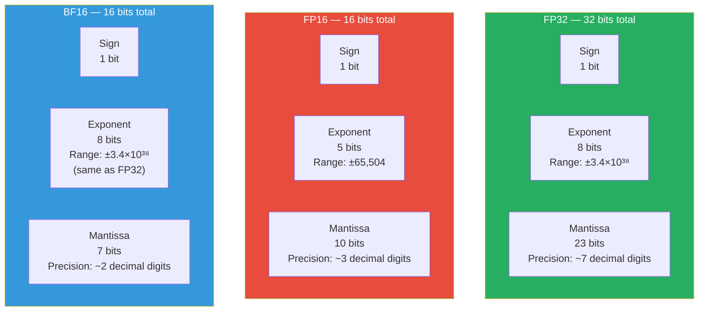
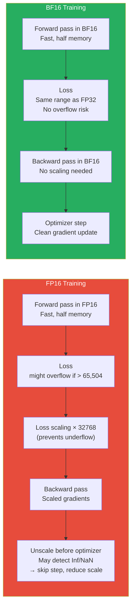
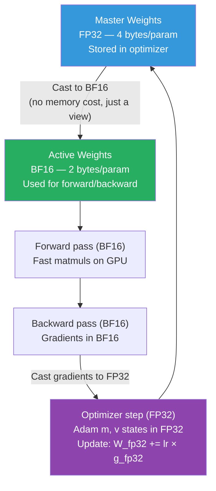

# Supplemental — Floating Point Formats: FP32, FP16, BF16, and Why the Choice Matters for Training

> *Lesson 4.4 (gradient checkpointing, mixed precision) and Lesson 12.5 (mixed precision in depth) both assume you understand what FP16 and BF16 actually are and why BF16 is preferred for LLM training. This lesson builds that foundation.*

---

## The Problem: Representing Real Numbers in Finite Bits

A neural network weight is a real number — something like 0.003847192. Computers cannot store real numbers exactly. They use a finite number of bits to approximate them. The question is: which bits to spend on range (how large can the number be?) and which to spend on precision (how many decimal places can we distinguish?).

This trade-off is not academic. It directly determines whether your training run will:
- **Overflow** — a computation produces a number too large to represent (NaN or Inf)
- **Underflow** — a gradient becomes too small to distinguish from zero
- **Stay numerically stable** — the model trains cleanly

For LLM training at scale, the wrong choice of floating point format crashes runs, silently corrupts gradients, or forces you to carry expensive FP32 copies of weights just to prevent these failures.

---

## How Floating Point Numbers Work

Every floating-point number uses three components:

```
(-1)^sign × 2^(exponent - bias) × (1 + mantissa)

Where:
- sign: 1 bit — positive or negative
- exponent: determines the magnitude (range)
- mantissa (fraction/significand): determines the precision
```

The **exponent** controls the range of representable numbers — how large or how small a number can be. More exponent bits → wider range → less likely to overflow or underflow.

The **mantissa** controls precision — how finely you can distinguish between two nearby numbers. More mantissa bits → finer precision → smaller quantization error.

The allocation of bits between exponent and mantissa is the fundamental design choice, and different formats make different trade-offs.

---

## The Three Formats Side by Side


*BF16 trades mantissa bits for exponent bits compared to FP16, achieving FP32's range at half the memory cost.*

| Format | Total bits | Exponent bits | Mantissa bits | Max value | Min positive normal |
|---|---|---|---|---|---|
| **FP32** | 32 | 8 | 23 | ~3.4×10³⁸ | ~1.2×10⁻³⁸ |
| **FP16** | 16 | 5 | 10 | ~65,504 | ~6.1×10⁻⁵ |
| **BF16** | 16 | 8 | 7 | ~3.4×10³⁸ | ~1.2×10⁻³⁸ |

The critical number: **FP16's maximum value is 65,504**. FP32 and BF16 can represent numbers up to ~3.4×10³⁸. This difference is not a rounding curiosity — it is a training stability cliff.

---

## Why FP16 Causes Training Instability

During neural network training, intermediate values — particularly in the loss and backward pass — can be large. The gradient of the loss with respect to early layers, after being multiplied through many weight matrices, can easily exceed 65,504. When it does in FP16, the value overflows to **Inf**. Inf propagates through all subsequent operations. Your training run produces NaN losses and the weights become garbage.

This is not a hypothetical failure. Training large transformers in FP16 without additional safeguards consistently causes numerical instability, especially:
- In attention softmax (the `exp` function can produce very large intermediate values)
- In the backward pass through deep networks (gradient magnitudes grow)
- At the beginning of training when gradients are often large

**The fix for FP16: loss scaling.** Before backward pass, multiply the loss by a large constant (e.g., 2¹⁵ = 32768). This rescales all gradients upward by the same factor. After backward pass, divide the gradients by the same constant before the optimizer step. This prevents gradients from underflowing to zero while keeping the effective update the same. Loss scaling works but adds complexity — you need to dynamically adjust the scale factor when overflow is detected.

---

## Why BF16 Is Better for Training

BF16 (Brain Float 16, developed by Google Brain) makes a different trade-off: keep FP32's 8 exponent bits, but reduce the mantissa to 7 bits.

**The consequence:** BF16 has identical range to FP32. A value that fits in FP32 will fit in BF16 — no overflow at the same magnitude. The cost is less precision: BF16 has ~2 decimal digits of precision vs FP32's ~7.

For training, this trade-off is almost always correct:
- **Range matters more than precision for stability.** Gradients need to be representable, not perfectly precise. A gradient of 1234.5 in BF16 might be rounded to 1232 — this introduces a small error, but the gradient step is still in the right direction.
- **Accumulators can use FP32.** Even in mixed precision training, accumulation of weight updates happens in FP32 (see master weights below). The BF16 imprecision is absorbed in this step.
- **No loss scaling needed.** Because BF16 shares FP32's range, the overflow problem does not arise. Training is simpler and more stable.


*FP16 training requires loss scaling and overflow detection infrastructure. BF16 training is cleaner — FP32's range eliminates the overflow failure mode.*

---

## Mixed Precision Training: How FP16/BF16 and FP32 Work Together

Neither FP16 nor BF16 is used alone for training. The standard approach is **mixed precision training** — use 16-bit formats for most operations (faster, half the memory), but keep FP32 **master weights** for the optimizer step (more accurate accumulation).

The pattern:

```
1. Store master weights in FP32 (optimizer states also in FP32)
2. Cast weights to BF16 for each forward pass
3. Run forward + backward in BF16 → gradients in BF16
4. Cast BF16 gradients to FP32
5. Apply FP32 optimizer step: master_weights += lr × FP32_gradients
6. Back to step 2 for next iteration
```

Why keep FP32 master weights? Because weight updates are very small — typically on the order of `lr × gradient = 1e-4 × 0.01 = 1e-6`. Adding a 1e-6 update to a weight of magnitude ~0.1 requires about 7 significant decimal digits of precision. BF16 has only ~2 significant digits. Accumulating tiny updates in BF16 produces catastrophic cancellation — the update is rounded away to zero and the weight never changes.

FP32 master weights ensure the accumulation of small updates is exact. The memory cost: FP32 master weights add 4 bytes per parameter on top of the 2-byte BF16 active weights — but this is still far less than storing everything in FP32.


*Mixed precision training. Forward and backward in BF16 (fast, memory-efficient). Optimizer accumulation in FP32 (precise). Master weights in FP32 prevent catastrophic cancellation of small updates.*

---

## Memory Implications: The Numbers

For a 7B parameter model in different formats:

| Component | FP32 | FP16/BF16 | Mixed Precision |
|---|---|---|---|
| Model weights | 28 GB | 14 GB | 14 GB (BF16 active) + 28 GB (FP32 master) |
| Adam optimizer states (m + v) | 56 GB | 28 GB | 56 GB (FP32 — must be FP32 for accumulation) |
| Gradients | 28 GB | 14 GB | 14 GB (BF16 during backward) → FP32 at optimizer step |
| **Total** | **~112 GB** | **~56 GB** | **~70 GB** |

Mixed precision is not the most memory-efficient choice — storing FP32 master weights and FP32 optimizer states costs more than pure FP16. But it is the most training-stable. Pure FP16 without master weights causes quality degradation because of the update cancellation problem. BF16 throughout (including optimizer states) loses too much precision in accumulation.

> **Interview note:** "Why do we use BF16 instead of FP16 for LLM training?" Weak answer: "BF16 is more stable." Strong answer: "FP16 and BF16 both use 16 bits total but allocate bits differently. FP16 uses 5 bits for exponent and 10 for mantissa — its maximum representable value is only ~65,504. During transformer training, attention computations and backward-pass gradients routinely produce intermediate values larger than this, causing overflow to Inf. BF16 borrows bits from the mantissa to match FP32's 8-bit exponent — its range is identical to FP32 (~3.4×10³⁸). This eliminates the overflow problem without requiring loss scaling. The cost is less precision (~2 vs ~7 significant digits), but this is acceptable because FP32 master weights accumulate the small optimizer updates where precision matters."

---

## TF32: NVIDIA's Training Format

NVIDIA introduced TF32 (TensorFloat-32) in Ampere GPUs (A100 and later). It is not a storage format — it is a **compute format** used internally by Tensor Core matrix multiply units.

TF32 uses:
- 1 sign bit, 8 exponent bits (same as FP32 — same range)
- 10 mantissa bits (same as FP16 — same precision as FP16, not FP32)

When you run a BF16 or FP32 matrix multiply on an A100, the hardware internally uses TF32 arithmetic at 3× the throughput of standard FP32 matrix multiply. This is transparent — you do not configure TF32 explicitly. Enabling it (default on PyTorch) gives you faster matmuls with slightly reduced precision in the intermediate computation, which rarely affects model quality.

---

## Summary

- Floating point numbers allocate bits between exponent (range) and mantissa (precision). More exponent bits = larger representable range; more mantissa bits = finer precision.
- FP32 (32-bit): 8 exponent + 23 mantissa. Full range (~±3.4×10³⁸), full precision (~7 decimal digits). The reference format — always accurate, never stable problems, but 2× the memory and bandwidth cost of 16-bit formats.
- FP16 (16-bit): 5 exponent + 10 mantissa. Maximum value ~65,504 — overflow occurs easily in transformer training, requiring loss scaling infrastructure and overflow detection.
- BF16 (16-bit): 8 exponent + 7 mantissa. Same range as FP32 — no overflow risk. Only 2 significant decimal digits of precision, but this is acceptable when FP32 master weights handle accurate accumulation. BF16 is the preferred format for LLM training.
- Mixed precision training runs forward/backward in BF16 (fast, memory-efficient) but keeps FP32 master weights and FP32 optimizer states. This is necessary because weight updates (lr × gradient ≈ 1e-6) require more precision than BF16 can represent — summing them in BF16 causes catastrophic cancellation.
- For a 7B model, pure FP32 training requires ~112 GB. Mixed precision (BF16 forward, FP32 optimizer) requires ~70 GB. QLoRA with NF4 base model reduces this further to ~10 GB by quantizing the frozen weights.

---
