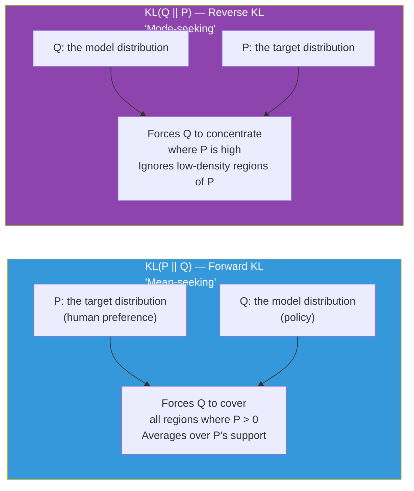
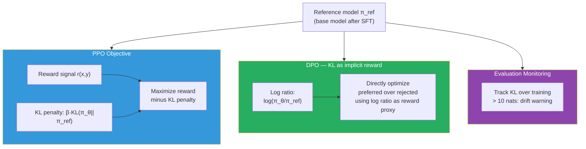

# Supplemental — KL Divergence: What It Measures and Why Alignment Depends on It

> *This concept appears in Lesson 6.2 (PPO KL penalty), Lesson 6.3 (DPO's implicit reward), and Lesson 8.4 (alignment evaluation). Read this before those lessons if you want to understand the math, not just the API.*

---

## The Problem: How Do You Measure the Distance Between Two Distributions?

When you fine-tune a language model with reinforcement learning from human feedback, you face a specific danger: the model will optimize hard for the reward signal and in doing so drift far from the original pretrained behavior. It might find clever, degenerate outputs that maximize reward without being genuinely good — this is reward hacking. To prevent this, you add a penalty: the more the fine-tuned model's output distribution diverges from the original model, the more it is penalized.

To build this penalty, you need a number that answers: "how different are these two probability distributions?" If both distributions assign similar probabilities to the same sequences, the number should be small. If they disagree sharply — one assigns high probability to sequences the other considers unlikely — the number should be large.

That number is KL divergence.

Standard distance metrics like Euclidean distance do not work here. Distributions are not points in space — they are functions over a vocabulary. You need a measure that respects the probabilistic structure of the distributions. KL divergence does exactly that, and it comes directly from information theory.

---

## What KL Divergence Measures

KL divergence between two distributions P and Q is defined as:

```
KL(P || Q) = Σₓ P(x) · log( P(x) / Q(x) )
```

Where:
- **P** is the "true" or reference distribution
- **Q** is the "approximating" distribution
- The sum is over all possible values x (all tokens, or all sequences)
- The result is measured in **nats** (if using natural log) or **bits** (if using log base 2)

In plain English: KL(P || Q) measures the average number of extra bits you need to encode samples from P if you use a code designed for Q. When P and Q are identical, the ratio P(x)/Q(x) = 1 everywhere, log(1) = 0, and KL = 0. When P assigns high probability to something Q considers unlikely, that ratio is large, log is large, and KL is large.

**Critical property: KL divergence is asymmetric.** KL(P || Q) ≠ KL(Q || P). This is not a bug — it reflects a genuine asymmetry in what each direction measures, and it has direct consequences for how alignment algorithms work.


*The two directions of KL divergence pull the approximating distribution in fundamentally different ways.*

---

## Forward KL vs Reverse KL: Why the Direction Matters

**Forward KL: KL(P || Q)** — you are minimizing the cost of encoding samples from P using Q. Because the sum is weighted by P(x), every region where P assigns positive probability must be covered by Q. If P says some sequence is likely and Q says it is nearly impossible, log(P/Q) → ∞ and KL blows up. Forward KL is **mean-seeking**: Q must spread out to cover everything P covers, even if this means Q assigns small probability to many things P considers unlikely.

**Reverse KL: KL(Q || P)** — the sum is weighted by Q(x). Q only penalizes regions where it assigns high probability but P assigns low probability. Q can safely ignore regions where it assigns zero probability, even if P assigns high probability there. Reverse KL is **mode-seeking**: Q concentrates on one or a few high-probability modes of P and ignores the rest.

In RLHF, the KL penalty used is typically **KL(π_θ || π_ref)** — the reverse direction, where π_θ is the fine-tuned policy and π_ref is the reference model. This means: penalize the policy when it assigns high probability to sequences the reference model considers unlikely. This is the right constraint for alignment — you want to stop the policy from generating output the original model would never produce, while allowing it to shift probability mass toward rewarded outputs.

---

## Concrete Example

Suppose you have a vocabulary of 4 tokens: A, B, C, D.

- **Reference model** π_ref: {A: 0.5, B: 0.3, C: 0.15, D: 0.05}
- **Fine-tuned model** π_θ: {A: 0.1, B: 0.1, C: 0.1, D: 0.7}

The fine-tuned model has shifted almost all probability to D — perhaps because D was rewarded during RL training. The reference model considered D very unlikely (0.05).

```
KL(π_θ || π_ref) = Σ π_θ(x) · log( π_θ(x) / π_ref(x) )

= 0.1 · log(0.1/0.5) + 0.1 · log(0.1/0.3) + 0.1 · log(0.1/0.15) + 0.7 · log(0.7/0.05)

= 0.1·(-1.609) + 0.1·(-1.099) + 0.1·(-0.405) + 0.7·(2.639)

= -0.161 + (-0.110) + (-0.041) + 1.847

= 1.535 nats
```

This is a large KL. The PPO training loop would add a penalty of `β × 1.535` to the loss, pulling the policy back toward the reference distribution. The hyperparameter β controls how strong this pull is — a larger β means stricter adherence to the reference model.

---

## How KL Divergence Appears in Each Alignment Method

**In PPO (Lesson 6.2):**

The PPO objective for alignment is:

```
Objective(π_θ) = E[r(x, y)] - β · KL(π_θ(y|x) || π_ref(y|x))
```

Where r(x, y) is the reward model score. The KL term directly penalizes the policy for drifting from the reference model. Without it, the policy collapses into reward hacking.

**In DPO (Lesson 6.3):**

DPO's key insight is that the PPO objective has an analytical solution — the optimal policy under the KL-constrained reward objective is:

```
π*(y|x) = π_ref(y|x) · exp(r(x,y)/β) / Z(x)
```

This can be rearranged to express the reward in terms of log ratios of the policy and reference:

```
r(x,y) = β · log( π*(y|x) / π_ref(y|x) ) + β · log Z(x)
```

The log ratio `log(π/π_ref)` is exactly the per-token KL contribution. DPO directly parameterizes the reward using this ratio — which is why it can bypass training a separate reward model. Understanding KL is what makes DPO's derivation legible instead of magical.

**In Alignment Evaluation (Lesson 8.4):**

After training, you track KL(π_θ || π_ref) as a diagnostic metric. If KL grows very large during or after training, the model has drifted far from the reference — a warning sign of reward hacking or over-optimization. A KL budget of 5–10 nats is commonly considered acceptable in practice.


*KL divergence plays a different but critical role in each alignment method.*

> **Interview note:** "Why do PPO-based RLHF methods add a KL penalty?" Weak answer: "To stop the model from going too far from the original." Strong answer: "The KL penalty — specifically KL(π_θ || π_ref) — penalizes the policy when it assigns high probability to sequences the reference model considers unlikely. Without this constraint, the policy exploits the reward model: it finds degenerate outputs that score well but are not actually good, because the reward model was only trained on the distribution of the original model. The KL penalty keeps the policy within the distribution where the reward model's scores are meaningful. The hyperparameter β controls the strength of this constraint — too high and the policy cannot move; too low and reward hacking occurs."

---

## The β Hyperparameter: How Hard to Pull Back

In both PPO and DPO, β is the trade-off coefficient between reward maximization and KL constraint.

| β value | Effect |
|---|---|
| β → 0 | No constraint — policy maximizes reward freely, reward hacking likely |
| β = 0.1 | Weak constraint — common in DPO, allows significant adaptation |
| β = 0.5 | Moderate constraint — PPO commonly operates here |
| β → ∞ | Strong constraint — policy barely moves from reference model |

In DPO, β directly scales the log probability ratio in the training loss. Lower β means the model is more sensitive to preference differences — small margin between preferred and rejected is enough to drive a large update. Higher β requires larger margins to produce the same update.

---

## Summary

- KL divergence KL(P || Q) measures the average extra cost of encoding P-distributed samples using a code designed for Q. It is zero when P = Q and grows as the distributions diverge.
- KL is asymmetric. KL(P || Q) ≠ KL(Q || P). Forward KL is mean-seeking (Q must cover everything P covers); reverse KL is mode-seeking (Q concentrates on P's modes and can ignore the rest).
- In RLHF, the KL penalty uses the reverse direction KL(π_θ || π_ref): penalize the policy when it assigns high probability to sequences the reference model finds unlikely. This keeps the policy within the distribution where the reward model is reliable.
- DPO's implicit reward is the log ratio log(π_θ/π_ref) — exactly the per-token KL contribution. Understanding KL is what makes DPO's derivation comprehensible rather than a black box.
- The β hyperparameter controls the KL-reward trade-off. In practice, β = 0.1–0.5 is common. Track KL during and after training — values above 10 nats signal dangerous drift from the reference model.

---
