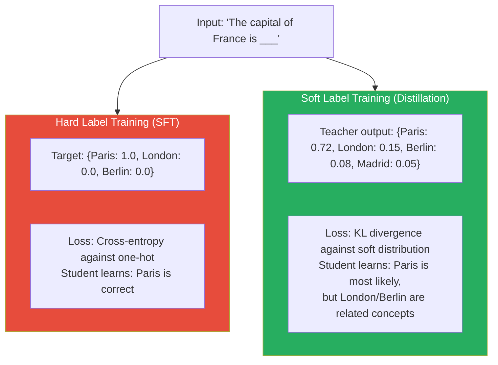
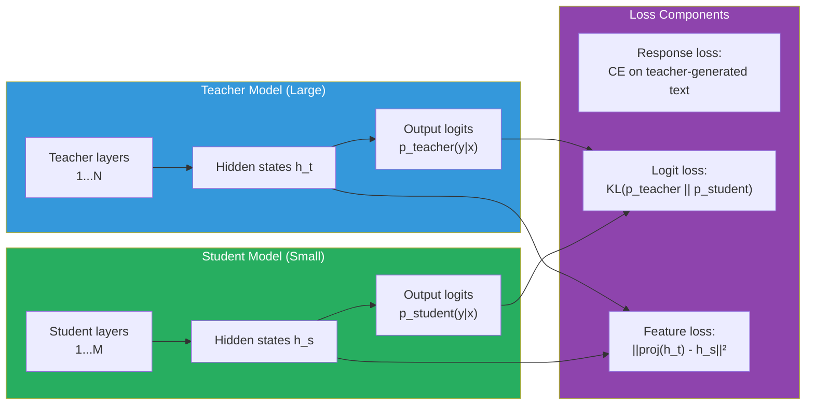

# Supplemental — Knowledge Distillation: Teaching Small Models to Think Like Large Ones

> *Knowledge distillation is referenced in Lesson 5.6 (SLM training strategies) and Case Study 4 (reasoning model distillation). This lesson explains what it is, how it works, and when to use it.*

---

## The Problem: Large Models Are Expensive to Serve

A 70B parameter model generates tokens slowly, costs several dollars per hour of GPU time, and cannot run on anything short of a high-end server. But empirically, much of what a 70B model knows can be extracted into a 7B or even a 3B model — if you train the small model against the large model's outputs rather than against human-written data alone.

This is the core insight of knowledge distillation (Hinton et al., 2015): a large, well-trained model (the **teacher**) contains rich information not just in its predictions, but in the full probability distribution it assigns over outputs. A smaller model (the **student**) trained to match the teacher's distributions learns more than a student trained only on the final correct answers.

The practical payoff is significant. DeepSeek-R1 distilled its reasoning capabilities into a 7B model by training the smaller model on the 671B model's chain-of-thought outputs. The resulting 7B model substantially outperforms other 7B models on reasoning benchmarks — it learned to reason by imitating the larger model's process, not just its final answers.

---

## Why Soft Labels Contain More Information Than Hard Labels

Standard supervised training uses **hard labels**: the correct answer is 1, everything else is 0. For a next-token prediction task, if the correct next token is "Paris," the target distribution is {Paris: 1.0, London: 0.0, Berlin: 0.0, ...}.

But a well-trained teacher model produces **soft labels**: {Paris: 0.72, London: 0.15, Berlin: 0.08, ...}. These soft probabilities encode the teacher's uncertainty and its knowledge about relationships between outputs. London and Berlin both get nonzero probability because they are all European capitals — they are related. A model that only sees the hard label {Paris: 1.0} learns nothing about that relationship.

Soft labels act as implicit regularization. They carry more signal per training example because every non-zero probability is meaningful information about the teacher's knowledge structure.


*Hard labels give one bit of information per example (correct/incorrect). Soft labels give a full distribution — encoding relationships between outputs.*

---

## The Distillation Loss

The student is trained to minimize the KL divergence between its output distribution and the teacher's output distribution:

```
L_distill = KL( p_teacher(y|x) || p_student(y|x) )
           = Σ_y p_teacher(y|x) · log( p_teacher(y|x) / p_student(y|x) )
```

In practice, this is computed using **temperature scaling**. Both teacher and student logits are divided by a temperature T > 1 before softmax:

```
p_T(y|x) = softmax(logits / T)
```

Higher temperature flattens the distribution — more probability mass spreads to non-top tokens, making the soft labels richer and easier for the student to learn from. Temperature T = 4 or T = 10 is common for distillation.

**Combined loss:** In practice, you mix distillation loss with standard cross-entropy on the ground-truth labels:

```
L_total = α · L_distill + (1 - α) · L_CE

Where:
- L_distill = KL(teacher || student) at temperature T
- L_CE = cross-entropy loss on ground truth labels
- α controls the balance (often 0.5–0.9, favoring distillation)
```

```python
import torch
import torch.nn.functional as F

def distillation_loss(
    student_logits: torch.Tensor,   # [batch, vocab_size]
    teacher_logits: torch.Tensor,   # [batch, vocab_size]
    hard_labels: torch.Tensor,      # [batch] — ground truth token IDs
    temperature: float = 4.0,
    alpha: float = 0.7,             # weight on distillation vs hard label loss
) -> torch.Tensor:

    # Soft targets from teacher (temperature-scaled)
    teacher_probs = F.softmax(teacher_logits / temperature, dim=-1)
    student_log_probs = F.log_softmax(student_logits / temperature, dim=-1)

    # KL divergence loss (distillation component)
    # Multiply by T² to maintain gradient scale (Hinton et al. 2015)
    distill_loss = F.kl_div(student_log_probs, teacher_probs, reduction="batchmean") * (temperature ** 2)

    # Standard cross-entropy on hard labels
    hard_loss = F.cross_entropy(student_logits, hard_labels)

    return alpha * distill_loss + (1 - alpha) * hard_loss
```

---

## Types of Distillation for LLMs

Distillation for language models takes several forms. They differ in **what** the student learns from the teacher.

### Response Distillation (Black-Box Distillation)

The student trains on the teacher's **generated text outputs** — you sample responses from the teacher and use them as training data for the student.

The teacher is used as a data generator. The student never sees the teacher's internal probabilities, just the final text. This is the most common form in the LLM era because:
- You may not have access to the teacher's logits (API-only models)
- Generating high-quality chain-of-thought data from a teacher and training the student on it is simple and effective

**DeepSeek-R1 distillation** is pure response distillation: run the 671B model on math and reasoning problems, collect its full chain-of-thought responses, train a 7B model on those responses with standard SFT loss. The 7B model learns to produce similar reasoning traces.

### Logit Distillation (White-Box Distillation)

The student trains directly on the teacher's **output probability distributions** — matching the full softmax distribution at each token, not just the sampled output.

This requires access to the teacher model's weights (or logits API). It contains more information per training example than response distillation but is computationally heavier — you must run the teacher model forward for every training token.

### Feature Distillation (Intermediate Layer Matching)

Beyond output distributions, you can align the student's **internal representations** to the teacher's. Match the student's hidden states at layer k to the teacher's hidden states at layer m (with a learned linear projection between them).

This is more complex to implement and not commonly used for LLM fine-tuning, but it is used in some SLM training pipelines where maximum transfer is needed.


*Three levels of distillation: response (text outputs), logits (output distributions), features (internal representations). Each requires progressively more access to the teacher model.*

---

## A Concrete Example: Distilling a Reasoning Model

Suppose you have a 671B reasoning model (the teacher) that generates step-by-step chain-of-thought for math problems, and you want to transfer this capability into a 7B model (the student) that is cheap to serve.

**Dataset construction:**
1. Take a set of math problems (MATH, GSM8K, competition problems)
2. Run the 671B model on each problem with temperature sampling — generate 8–16 solutions per problem
3. Execute each solution: check if the final numeric answer is correct
4. Keep only the solutions that arrive at the correct answer (rejection sampling)
5. This gives you a dataset of (problem, correct-reasoning-chain) pairs

**Student training:**
1. Initialize the 7B student from a pretrained base model
2. Fine-tune on the collected (problem, chain-of-thought) pairs using standard SFT cross-entropy loss
3. The student learns to produce similar reasoning traces to the 671B teacher — not by understanding the teacher's internal representations, but by imitating its output patterns at scale

**Result:** A 7B model trained this way substantially outperforms a 7B model trained only on (problem, answer) pairs without reasoning traces. The reasoning chain is the knowledge being transferred.

> **Interview note:** "What is knowledge distillation and how does it apply to small language models?" Weak answer: "Training a small model to mimic a large model." Strong answer: "Distillation transfers knowledge from a large teacher model to a small student model by training the student to match the teacher's outputs — either its text outputs (response distillation) or its full probability distributions (logit distillation). Soft labels from the teacher carry more information than hard labels: the probability mass assigned to non-correct tokens encodes relationships between outputs. In the LLM context, the most impactful form is response distillation for reasoning: generate chain-of-thought from a large model, filter for correct solutions, train the small model on these traces. This is how DeepSeek-R1's reasoning capabilities were transferred to 7B and 8B models."

---

## Trade-offs: When Distillation Beats Other Approaches

| | Standard SFT | Distillation | Full Fine-Tuning |
|---|---|---|---|
| **Data requirement** | Human-labeled examples | Teacher-generated outputs (cheap at scale) | Human-labeled examples |
| **Student quality ceiling** | Limited by human annotation quality | Approaches teacher quality on covered tasks | Highest (direct optimization) |
| **Compute for training** | Low | Medium (teacher inference + student training) | High |
| **Requires teacher access** | No | Yes (for logit distillation) or generation only (response distillation) | No |
| **Best for** | General instruction following | Specialized reasoning, narrow task transfer | When maximum quality matters and compute allows |

Distillation is most valuable when:
- The teacher model is significantly more capable than the student on a specific skill (reasoning, code, tool use)
- The skill requires imitation of process, not just output (chain-of-thought reasoning)
- Human annotation of the skill is expensive but teacher generation is cheap

---

## Summary

- Knowledge distillation trains a small student model to match a large teacher model's outputs. The teacher's soft probability distributions contain more information per example than hard labels — they encode relationships between outputs and the teacher's uncertainty.
- Temperature scaling flattens the teacher's distribution, making soft labels richer and easier for the student to learn from. Temperatures of 4–10 are common. The distillation loss scales by T² to maintain gradient magnitude.
- Three levels of distillation exist: response distillation (student trains on teacher's generated text), logit distillation (student matches teacher's output probabilities), and feature distillation (student's internal states match teacher's). Response distillation is most common for LLMs because it only requires generation access to the teacher.
- For reasoning models: generate chain-of-thought traces from the large teacher on math/logic problems, filter to correct solutions via execution, and train the student via SFT on those traces. This is how DeepSeek-R1's reasoning was transferred to 7B models.
- Distillation is most valuable when the target skill is complex, imitable, and expensive to annotate by humans — like multi-step reasoning — but cheap to generate from a capable teacher.

---
