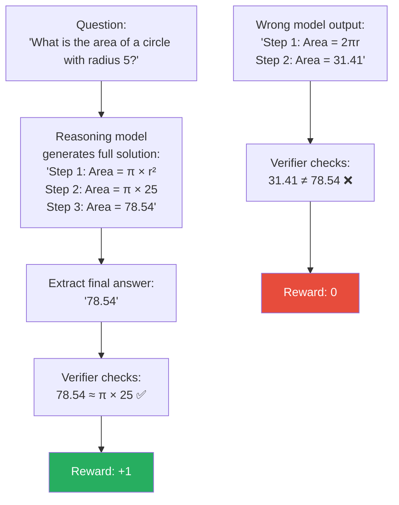
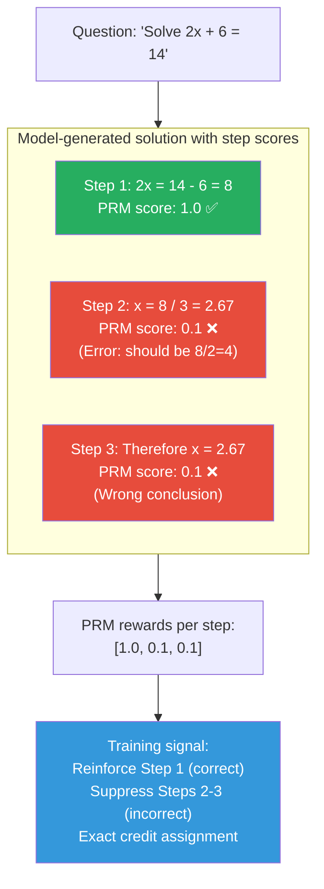
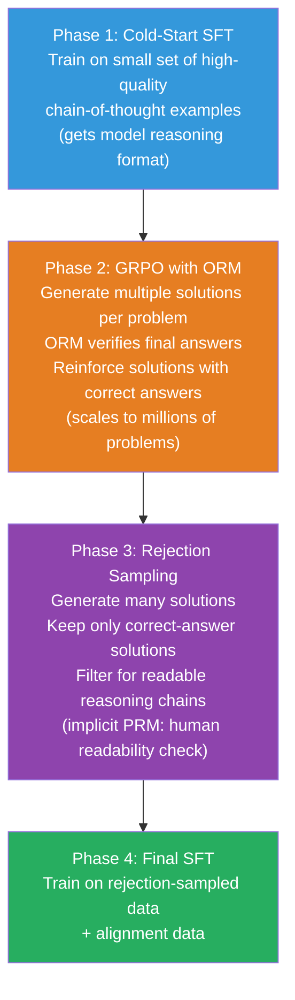

# Supplemental — Process Reward Models vs Outcome Reward Models

> *Lesson 5.3 (reasoning capability training) and Lesson 6.2 (PPO) both reference PRMs and ORMs. This lesson explains what they are, how they differ, and when each is the right tool.*

---

## The Problem: When Is a Reasoning Step Wrong Even If the Answer Is Right?

Consider a student solving a math problem. They write five steps of work, arrive at the correct answer, and get full marks. But if you look closely at step three, you find a logical error — they cancelled out two terms incorrectly but the error happened to cancel itself out in step four. The final answer is right. The reasoning is wrong.

Now imagine you are training a language model to reason. You reward it based on whether it gets the right final answer. The model will eventually learn to game this: it can produce plausible-looking but logically flawed reasoning chains that happen to arrive at correct answers — or it can copy the format of correct reasoning without actually learning the underlying logic.

This is the fundamental tension between **Outcome Reward Models (ORMs)** and **Process Reward Models (PRMs)**. ORMs reward correct final answers. PRMs reward correct reasoning steps. Each solves a different subset of the problem, and each creates different failure modes.

Understanding this distinction is critical for anyone working on reasoning model training — it determines what the model actually learns to optimize for, and whether its "reasoning" is genuine or a sophisticated pattern match.

---

## Outcome Reward Models (ORMs)

### What They Are

An Outcome Reward Model assigns a scalar reward to a (question, solution) pair based solely on the **final answer** — without evaluating how the model arrived at it.

```
ORM score = f(question, final_answer)

For verifiable tasks (math, code):
- Correct final answer → reward = +1
- Incorrect final answer → reward = 0 (or -1)

For open-ended tasks:
- A learned discriminator scores the final response quality
```

For domains with objectively verifiable answers — mathematics, code execution, formal logic — ORM can be as simple as checking if the final answer matches the ground truth. This is called a **rule-based verifier** and requires no learned model at all.

### How ORMs Work in Practice


*ORM evaluation: only the final answer is checked. The quality of intermediate reasoning steps is invisible to the reward.*

### ORM's Key Advantage

ORMs are cheap to build for verifiable domains. You do not need human annotation of reasoning steps — just a ground truth answer. This scales easily to millions of training examples. GRPO (used in DeepSeek-R1) uses pure outcome rewards: generate multiple solutions, check which ones produce correct final answers, train the policy to prefer correct-answer solutions.

### ORM's Failure Mode: Credit Assignment

The core problem: if a solution has five steps and the final answer is wrong, where did the reasoning fail? The ORM reward is -1 for the entire solution, but it does not tell the model which steps were wrong. This is the **credit assignment problem** — the signal is correct but uninformative about which parts of the reasoning to fix.

The model may have four correct steps and one wrong step. A -1 reward at the final step propagates back equally to all tokens in the solution. The model cannot learn "steps 1-4 are fine, step 3 specifically has an error pattern." It can only learn "solutions that look like this overall tend to be wrong."

---

## Process Reward Models (PRMs)

### What They Are

A Process Reward Model assigns a scalar reward to each **intermediate reasoning step**, not just the final answer. It evaluates whether each step in the chain of thought is logically valid — regardless of whether the final answer is correct.

```
PRM score = [r_step1, r_step2, ..., r_stepN, r_final]

Where r_stepᵢ ∈ [0, 1] indicates correctness of step i
```

The PRM is a trained neural network — typically a fine-tuned language model — that takes as input the question, the preceding steps, and the current step, and outputs a probability that the current step is logically correct.

### How PRMs Are Trained

Training a PRM requires **step-level human annotations**: for each training solution, annotators mark each step as correct or incorrect. This is expensive — you need humans who can evaluate mathematical reasoning step by step, not just check final answers.

OpenAI's Math-Shepherd and the PRM800K dataset (OpenAI, 2023) are examples: mathematicians annotated hundreds of thousands of solution steps for correctness, creating training data for a PRM that can evaluate novel solutions step by step.


*PRM evaluation: each step receives an independent reward. The model knows exactly which step failed, enabling precise credit assignment. The error at Step 2 is identified even though Step 1 was correct.*

### Using PRMs for Best-of-N Inference

PRMs are also used at inference time, not just training. A technique called **Best-of-N with PRM scoring**:

1. Generate N different solutions to a problem
2. Score each step of each solution with the PRM
3. Select the solution whose minimum step score is highest (or whose average step score is highest)

This is more powerful than selecting by ORM score alone — a solution that gets the right final answer via a flawed reasoning chain scores lower than a solution that gets the right answer via logically clean steps.

```python
from transformers import AutoModelForSequenceClassification, AutoTokenizer
import torch

class ProcessRewardModel:
    def __init__(self, model_name: str = "peiyi9979/math-shepherd-mistral-7b-prm"):
        self.model = AutoModelForSequenceClassification.from_pretrained(model_name)
        self.tokenizer = AutoTokenizer.from_pretrained(model_name)

    def score_solution(self, question: str, steps: list[str]) -> list[float]:
        """Score each step of a solution. Returns list of step-level scores."""
        scores = []
        context = question

        for step in steps:
            # PRM takes: question + all previous steps + current step
            context += f"\n{step}"
            inputs = self.tokenizer(context, return_tensors="pt", truncation=True)

            with torch.no_grad():
                logits = self.model(**inputs).logits
                # Binary classification: correct (1) vs incorrect (0)
                step_score = torch.softmax(logits, dim=-1)[0, 1].item()

            scores.append(step_score)

        return scores

def best_of_n_with_prm(question: str, solutions: list[list[str]], prm: ProcessRewardModel) -> int:
    """Select best solution using PRM minimum step score."""
    solution_scores = []

    for solution_steps in solutions:
        step_scores = prm.score_solution(question, solution_steps)
        # Use min step score: penalize any incorrect step, not just final answer
        min_score = min(step_scores)
        solution_scores.append(min_score)

    return solution_scores.index(max(solution_scores))  # Index of best solution
```

---

## Side-by-Side Comparison

| | ORM | PRM |
|---|---|---|
| **What is scored** | Final answer only | Each reasoning step |
| **Annotation needed** | Final answer correctness (cheap, often automatic) | Step-level correctness labels (expensive, requires domain experts) |
| **Credit assignment** | Sparse — entire solution gets one signal | Dense — each step gets its own signal |
| **Training stability** | Lower variance per step (one reward) | Higher variance signal per step but more informative |
| **Reward hacking risk** | High — model can produce flawed reasoning that arrives at correct answer | Lower — steps must be individually correct |
| **Inference-time use** | Score final answer → pick best answer | Score each step → pick solution with best step trajectory |
| **Scales with data** | Yes — automatic verification possible | No — needs human step annotation at scale |
| **Best for** | Problems with verifiable final answers (math, code) | Problems where reasoning process matters (multi-step logic, proofs) |
| **Example systems** | DeepSeek-R1 (GRPO with ORM), GPT-4o math | OpenAI o1 (believed to use PRM-based verification) |

> **Interview note:** "In reasoning model training, when would you use a PRM over an ORM?" Weak answer: "When you care about the reasoning steps." Strong answer: "ORMs are cheaper to build — for verifiable domains like math or code, you can automatically check final answer correctness without any annotation. The problem is credit assignment: a -1 reward for an incorrect final answer propagates uniformly back through all steps, so the model cannot identify which specific step failed. PRMs solve this with step-level signals, giving the model precise feedback about where reasoning broke down. But PRMs require expensive human annotation of each step's correctness — PRM800K took mathematicians months to produce. The practical decision: start with ORM because it scales. Add PRM when you have annotation budget and when ORM training produces solutions with correct answers but invalid intermediate reasoning — which you can detect by sampling solutions, checking answers, and manually auditing the steps of correct-answer solutions."

---

## How PRMs and ORMs Work Together: The DeepSeek-R1 Pipeline

DeepSeek-R1 demonstrates that you do not have to choose — you can use both:


*DeepSeek-R1 uses ORM (outcome verification) for scalable RL training, and rejection sampling as a lightweight implicit PRM (keeping only solutions with correct answers and readable reasoning).*

---

## Summary

- ORMs assign reward based solely on the final answer. For verifiable domains (math, code), this can be automated — no learned model needed, just a checker. The weakness is sparse credit assignment: the model cannot learn which specific steps caused a wrong answer.
- PRMs assign reward to each intermediate reasoning step. They require expensive step-level human annotation to train. The benefit: dense credit assignment — the model knows exactly which steps are logically valid and which are flawed.
- At inference, PRMs enable Best-of-N selection based on minimum step score, selecting solutions with logically sound reasoning rather than just correct final answers.
- The practical trade-off: ORM is cheap and scales to millions of examples; PRM is expensive but provides better signal quality. Most production reasoning systems use ORM for RL training at scale, with rejection sampling as a lightweight filter to remove solutions with correct answers but invalid reasoning.
- For tasks where the reasoning process is the deliverable (math tutoring, proof generation, step-by-step problem solving), PRM quality matters. For tasks where only the final answer is evaluated, ORM is usually sufficient.

---
