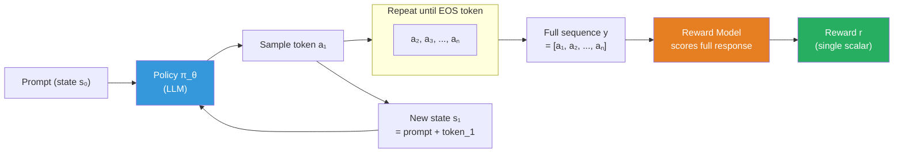
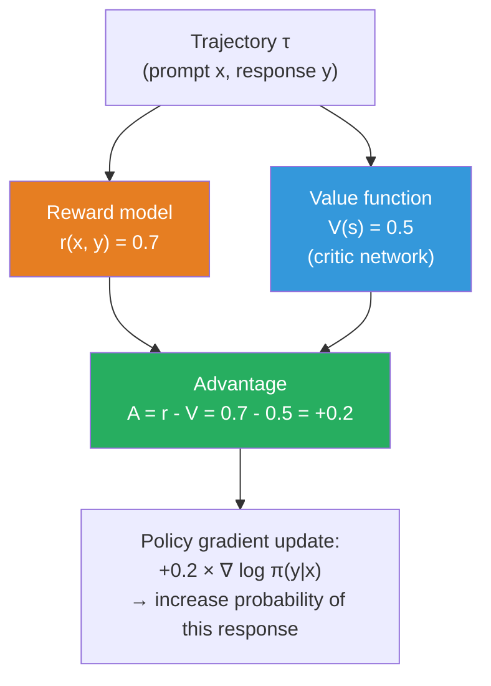
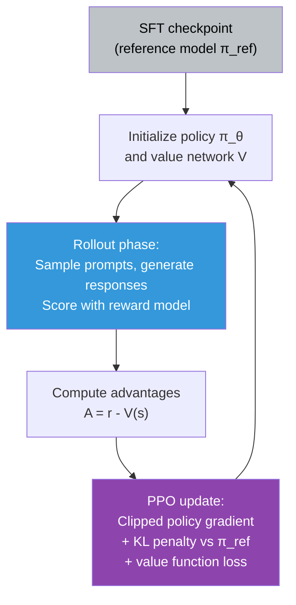

# Supplemental — Reinforcement Learning Fundamentals for LLM Alignment

> *Lesson 6.2 (PPO) and Lesson 5.3 (GRPO, reasoning training) assume you know what a policy, reward, and value function are. This lesson gives you that vocabulary. It is scoped specifically to the RL concepts you need for LLM alignment — not a general RL course.*

---

## The Problem Supervised Learning Cannot Solve

Supervised fine-tuning (SFT) is straightforward: you have a dataset of (prompt, ideal response) pairs, you show them to the model, and you train the model to predict the ideal response. The supervision signal is direct — you know the correct output and compute loss against it.

But "following human intent" cannot be reduced to a fixed dataset of correct answers. Human preferences are contextual, subtle, and sometimes contradictory. Two different ideal responses to the same prompt might both be correct. And more fundamentally: the set of possible model outputs is infinite. You cannot write down the correct output for every possible prompt.

What you can do is have humans look at two model outputs and say which one they prefer. You get a judgment — "this one is better" — without needing to specify exactly what "correct" looks like. This is a much weaker signal, but it is the signal that is actually available at scale.

Reinforcement learning was built for exactly this setting: learning from reward signals rather than correct labels. In RL, an agent takes actions and receives rewards — no ground truth required. The agent learns to take actions that maximize cumulative reward. For LLM alignment, the "agent" is the language model, "actions" are tokens it generates, and "reward" comes from a trained reward model that predicts human preference.

---

## The Core Vocabulary

### Policy

The **policy** π is the function that maps states to actions — or in LLM terms, maps prompts (and previous tokens) to a probability distribution over the next token. Your language model *is* the policy.

```
π_θ(a | s) = probability of taking action a given state s
```

Where θ are the model's parameters. Training RL means updating θ to change which actions the policy assigns high probability to.

### State

The **state** s is everything the agent currently knows about the world that is relevant to its decision. For an autoregressive LLM, the state at each step is the concatenation of the prompt and all tokens generated so far.

```
s_t = [prompt; token_1; token_2; ...; token_{t-1}]
```

### Action

The **action** a is the choice the agent makes. For an LLM, the action at each step is choosing the next token — one of the 32,000+ tokens in the vocabulary.

### Reward

The **reward** r is the feedback signal received after taking an action. For LLM alignment, there are two common reward structures:

- **Dense reward (per-token):** A small reward at each token step. Used in some settings but hard to design.
- **Sparse reward (per-sequence):** A single reward given only at the end of the full generated sequence. A reward model scores the complete response and returns one number. This is the most common setup.


*The RL loop for LLM alignment. The policy generates tokens one by one. A reward model scores the complete sequence. The reward drives parameter updates.*

### Episode

An **episode** is one complete interaction: from receiving a prompt to generating the full response and receiving the reward. In LLM training, one episode = one prompt + one generated response.

### Trajectory

A **trajectory** τ is the full sequence of (state, action) pairs in an episode:

```
τ = [(s₀, a₁), (s₁, a₂), ..., (sₙ₋₁, aₙ)]
```

The return G of a trajectory is the total reward (for sparse reward: just the final reward r).

---

## The Objective: Expected Return

RL training maximizes the **expected return** — the expected reward over all possible trajectories the policy might generate:

```
J(θ) = E_{τ ~ π_θ}[G(τ)] = E_{(x,y) ~ π_θ}[r(x, y)]
```

Where x is the prompt, y is the generated response, and r(x, y) is the reward. The expectation is over all possible responses the policy might generate given the training prompts.

This is different from SFT loss. SFT minimizes cross-entropy on a fixed dataset. RL maximizes a reward by exploring — generating responses and seeing what gets rewarded.

---

## Policy Gradient: How the Gradient Works

The challenge: r(x, y) is not differentiable with respect to θ. The reward model takes text as input; text generation involves discrete sampling (argmax or top-p), which has no gradient. You cannot backpropagate through a sampling step.

The solution is the **policy gradient theorem** (REINFORCE):

```
∇_θ J(θ) = E_{τ ~ π_θ}[ G(τ) · ∇_θ log π_θ(τ) ]
```

In plain English: the gradient of expected reward equals the expected value of (reward × gradient of log probability). Because `log π_θ(τ)` is the log probability of the trajectory, and log probability is differentiable, you can compute gradients.

For an LLM with a per-sequence reward r:

```
∇_θ J(θ) ≈ r(x, y) · Σₜ ∇_θ log π_θ(aₜ | sₜ)
```

**Intuition:** If the reward was high (good response), increase the log probability of every token in the response. If the reward was low (bad response), decrease it. The magnitude of the update is proportional to how good or bad the response was.

This is simple but has high variance — individual reward values are noisy, so updates are noisy.

---

## Baseline and Advantage: Reducing Variance

A response might get a reward of 0.7. Is that good? It depends on whether 0.7 is above or below average. If most responses get 0.8, then 0.7 is actually bad. The raw reward is not informative on its own.

The **advantage** A(s, a) captures this: how much better is this action than the average action in this state?

```
A(s, a) = Q(s, a) - V(s)
```

Where:
- **Q(s, a)** = expected return if you take action a in state s and then follow policy π (the "action-value function")
- **V(s)** = expected return from state s following policy π (the "value function" — the baseline)
- **A(s, a)** = the advantage of this specific action over average behavior

Using advantage instead of raw reward drastically reduces variance in training. A response that gets reward 0.7 when the average is 0.5 has positive advantage (+0.2 — reinforce this). The same response when the average is 0.8 has negative advantage (-0.1 — suppress this). Same raw reward, opposite gradient direction.


*The advantage function tells you how much better this response was than the expected baseline. Only positive-advantage responses get reinforced.*

In PPO, the value function V(s) is a separate "critic" network trained alongside the policy. The critic predicts how much reward the policy will get from the current state — this estimate becomes the baseline.

---

## PPO: Proximal Policy Optimization

PPO (Schulman et al., 2017) is the algorithm used in the original InstructGPT paper and most subsequent RLHF work. It builds on policy gradient with two key additions:

**Problem with vanilla policy gradient:** Large gradient steps can make the policy collapse. If a response happened to get a high reward, the policy strongly reinforces it, potentially over-updating and losing other capabilities.

**PPO's solution — the clipped objective:**

```
L_CLIP(θ) = E[ min( rₜ(θ) · Aₜ,  clip(rₜ(θ), 1-ε, 1+ε) · Aₜ ) ]
```

Where:
- `rₜ(θ) = π_θ(aₜ|sₜ) / π_θ_old(aₜ|sₜ)` is the probability ratio of new policy to old policy
- `ε` is a clipping threshold (typically 0.2)
- The clip prevents the ratio from straying too far from 1.0 — bounding the policy update per step

The clip means: even if the advantage is very high, the policy update is limited. You take many small steps toward the better policy rather than one large step that might overshoot.

**The full PPO-RLHF objective adds the KL penalty:**

```
Objective = E[reward] - β · KL(π_θ || π_ref) - γ · V_loss
```

Where π_ref is the reference model (SFT checkpoint), V_loss trains the value function, and β controls how far the policy can drift.


*The PPO training loop for RLHF. Rollout → compute advantages → clipped update. Repeat for thousands of steps.*

> **Interview note:** "Walk me through the PPO training loop for RLHF." Weak answer: "You use a reward model and update with PPO." Strong answer: "The loop has four phases. First, you sample prompts from a distribution and generate responses using the current policy. Second, you score each (prompt, response) pair with the frozen reward model to get a scalar reward. Third, you compute advantages — the difference between the actual reward and the value function's prediction of expected reward from this state. Fourth, you run a clipped policy gradient update that increases the probability of high-advantage responses while preventing any single update from being too large (the clip). The KL penalty against the reference model is added to the objective to prevent reward hacking. The value network is updated simultaneously. You repeat this rollout-update cycle for typically thousands of steps."

---

## GRPO: Group Relative Policy Optimization

GRPO (used in DeepSeek-R1) simplifies PPO by eliminating the value network. Instead of learning a value function to compute the baseline:

1. For each prompt, generate **G responses** (group) from the current policy
2. Score all G responses with the reward function
3. Use the **mean reward across the group** as the baseline
4. Each response's advantage = its reward − mean reward of the group

```
A_i = (r_i - mean(r_1...r_G)) / std(r_1...r_G)
```

This eliminates the need to train a separate critic network, which is expensive and can be unstable. The baseline is computed empirically from the group of responses. GRPO works especially well when reward is binary (correct/incorrect) or when you have a verifiable reward signal (math problems, code execution).

> **Interview note:** "What is GRPO and how does it differ from PPO?" Strong answer: "GRPO replaces PPO's learned value network with an empirical baseline: generate multiple responses per prompt, use the group's mean reward as the baseline, normalize advantages by the group's standard deviation. This eliminates the critic network entirely, which removes a significant source of instability in PPO training. The trade-off is that GRPO requires multiple rollouts per prompt (sampling G responses) which increases inference cost. It works best for tasks with clear reward signals — math, code, logic — where the group naturally contains some correct and some incorrect responses, making the advantages informative."

---

## Summary

- In supervised learning, you know the correct output. In RL, you only know whether the output was good (reward) — which is the setting for alignment: humans can judge quality without specifying the perfect answer.
- The **policy** is the language model. The **state** is the prompt plus tokens generated so far. The **action** is the next token. The **reward** is a scalar score from a reward model, given after the full response is generated.
- The **policy gradient theorem** enables gradient computation despite discrete sampling: the gradient equals the expected product of reward and log-probability gradient. High-reward responses get their probability increased.
- The **advantage** A = Q - V reduces training variance. Instead of using raw reward, you measure how much better this response was than the expected baseline. Positive advantage → reinforce; negative advantage → suppress.
- **PPO** clips the probability ratio between old and new policy at each update step, preventing large destabilizing updates. The KL penalty against the reference model prevents reward hacking.
- **GRPO** eliminates the value network by using the mean reward of a group of responses per prompt as the baseline. Simpler than PPO, works well for verifiable reward tasks.

---
