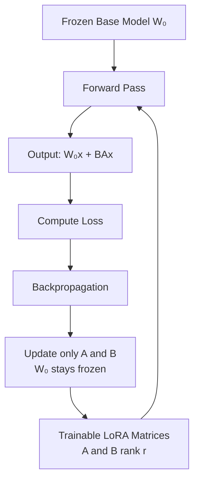

# Lesson Writing Guidelines — Fine-Tuning Chapter

> These guidelines are for any agent or human writing lessons for this chapter.  
> Read this entire document before writing a single line of a lesson.  
> The goal is not to cover a topic. The goal is to make someone genuinely understand it — deeply enough to reason about trade-offs in a live interview.

---

## The Core Philosophy

**Learning over coverage.** Do not write a lesson that lists things. Write a lesson that explains things. There is a fundamental difference:

- Coverage says: "LoRA uses a low-rank decomposition where W = W₀ + BA."
- Learning says: "Here is the problem LoRA is solving, here is the insight that led to the solution, here is why a low-rank decomposition works, and here is what happens when you get the rank wrong."

If you find yourself writing bullet points that describe features without explaining *why*, stop and rewrite as prose.

**Interview depth, not textbook depth.** Every lesson must be written with one mental test: *"If an interviewer asked about this topic, would reading this lesson make the reader able to answer confidently and go deeper when pushed?"* If not, the lesson is not deep enough.

**Concrete over abstract.** Every concept must have at least one concrete example. Abstract explanations without examples are not allowed.

---

## File Location and Naming

- All lessons are `.md` files written in Markdown.
- Place each lesson under its corresponding part folder inside `Fine_Tuning/`.
- Folder naming: `1_Foundations/`, `2_Data_Preparation/`, `3_PEFT_Methods/`, etc.
- File naming: `Lesson_1_1.md`, `Lesson_1_2.md`, `Lesson_3_4.md`, etc. (matches the Index).
- All asset files (images, diagrams exported as PNG) go inside the same folder in an `assets/` subdirectory.

---

## Lesson File Structure

Every lesson must follow this exact section order. Do not skip sections. Do not reorder them.

```
# Lesson X.Y — [Full Lesson Title from Index]

---

## [Opening Problem Section]
## [Core Concept Section(s)]
## [Diagram(s) — where applicable]
## [Concrete Example]
## [Trade-off or Comparison — where applicable]
## [Interview Callout(s)]
## [Summary]

---
```

The exact section names will vary by lesson, but the logical flow must always be:
**Problem → Concept → Visual → Example → Trade-offs → Interview angle → Summary**

---

## Section-by-Section Rules

### 1. Title

```markdown
# Lesson X.Y — [Exact title from Index.md]
```

- Must match the Index exactly.
- Do not add subtitles or taglines.

---

### 2. Opening Problem Section

- **This is the most important section.** Before explaining anything, explain *why it exists* and *what problem it solves*.
- Write it as prose, not as a list.
- Make the reader feel the pain of not having this concept before you give it to them.
- Length: 2–4 paragraphs minimum.

**Bad example (do not do this):**
> "LoRA is a parameter-efficient fine-tuning method. It uses low-rank matrices."

**Good example:**
> "When you want to fine-tune a 7B parameter model with full training, you need to store not just the model's 7 billion weights but also gradients and Adam optimizer states for every single one of them. That math puts you at roughly 112 GB of GPU memory for a model that fits in 14 GB for inference. Most teams simply do not have hardware for that. LoRA was built to solve this gap — to let you fine-tune a 7B model on a single 24 GB consumer GPU without throwing away quality."

---

### 3. Core Concept Sections

- These are the main teaching sections. There can be multiple.
- Each section covers one distinct idea or sub-concept.
- Use `##` headers for major sections, `###` for sub-sections within them.
- Write in prose. Use bullet lists only when you are listing genuinely enumerable things (steps in a process, items in a comparison). Do not use bullets as a substitute for explanation.
- **For anything mathematical:** Do not just write a formula. Write the formula AND explain in plain English what each term means and why it is there.
  
  ```
  W' = W₀ + BA
  
  Where:
  - W₀ is the original frozen weight matrix (not updated during training)
  - B and A are small trainable matrices
  - r (the rank) determines the size of B and A
  
  The key insight: instead of updating all the values in W₀ directly,
  you are learning a low-rank correction on top of it.
  ```

- **For any process or pipeline:** Always show the steps in order and explain what happens at each step, not just what the step is called.

---

### 4. Mermaid Diagrams

**Rule: If a concept has a flow, an architecture, a hierarchy, or a decision tree — it gets a Mermaid diagram.**

Diagrams are mandatory for:
- Any training pipeline (data → training → evaluation flow)
- Any model architecture (where modules sit, how data flows through them)
- Any decision framework (when to use X vs Y)
- Any comparison of approaches side by side
- Any multi-stage process

**How to write the diagram:**
- Use `flowchart TD` for top-down flows (pipelines, training loops)
- Use `flowchart LR` for left-to-right flows (data flows, architecture)
- Use `graph LR` for relationship diagrams
- Use `classDiagram` for architecture component hierarchies
- Label every node clearly — the reader should understand the diagram without reading the surrounding text

**Example — LoRA training flow:**



**Rules for diagrams:**
- Every diagram must have a caption line immediately below it explaining what it shows.
- Use `%%` for Mermaid comments if you need to annotate internally.
- Do not make diagrams too complex — one diagram per concept. If a concept needs three diagrams, split them and caption each.
- Quotes around labels containing parentheses or brackets: `id["Label (detail)"]`

---

### 5. Concrete Example

Every lesson must have at least one concrete, specific example. Not a general description — an actual scenario.

- Name the domain (medical, legal, code, financial, customer support, etc.)
- Walk through the concept applied to that domain step by step
- The example should make the abstract concept feel real

**Template for examples:**

```markdown
## A Concrete Example

Suppose you are fine-tuning a 7B model for a medical Q&A application on a single A100 80GB GPU...

[Walk through exactly what happens, with numbers where possible]
```

---

### 6. Trade-off or Comparison Tables

Whenever a lesson involves a choice between methods, approaches, or configurations — include a comparison table. This is non-negotiable for interview preparation because interviewers almost always ask "why did you choose X over Y?"

**Table format:**

```markdown
| | Method A | Method B | Method C |
|---|---|---|---|
| **Memory cost** | Low | Medium | High |
| **Training speed** | Fastest | Medium | Slowest |
| **Task performance** | Slightly lower | Close to full FT | Best |
| **Inference overhead** | None (merge weights) | Small | None |
| **Best for** | Memory-constrained | Balanced | Maximum quality |
```

- Use **bold** for row headers (the dimension being compared)
- Every row must be a dimension that matters in a real decision
- Add a brief prose paragraph after the table explaining the key insight from it — the table alone is not enough

---

### 7. Interview Callouts

Use blockquote boxes to call out interview-critical points. Every lesson must have at least one. Use them at the exact moment in the text where the insight lands.

**Format:**

```markdown
> **Interview note:** [The exact framing an interviewer will use, and the answer they are looking for.]
```

**Rules:**
- Write the callout as if you are coaching the reader right before they walk into an interview room.
- Do not just repeat what was already explained. Add the framing the interviewer would use and what signals a strong vs weak answer.
- Be specific. "Interviewers often ask about LoRA hyperparameters — if asked about rank, the weak answer is 'I set r=8.' The strong answer explains that rank controls the capacity of the adaptation, low rank (4-8) works for narrow tasks, higher rank (16-64) for broader behavioral changes, and you tune it based on validation loss."

---

### 8. Code Snippets (when applicable)

Include code when:
- The concept is significantly clarified by seeing real implementation (e.g., configuring LoRA with PEFT library, setting up a DPO trainer)
- The lesson covers a practical setup step (e.g., tokenizer configuration, data collator setup)

Do NOT include code:
- Just to show you can code
- For trivial things that are obvious from the prose
- When the code would be so long it distracts from the concept

**Code rules:**
- Always use Python with type hints
- Always add inline comments explaining the non-obvious lines
- Use the actual production libraries: `transformers`, `peft`, `trl`, `datasets`, `deepspeed`, `accelerate`
- Keep snippets focused — only show the relevant part, not 100 lines of boilerplate

**Example snippet format:**

```python
from peft import LoraConfig, get_peft_model

# r=16: rank of the adaptation matrices. Higher = more capacity, more memory.
# alpha=32: scaling factor. A common heuristic is alpha = 2 * r.
# target_modules: which weight matrices to apply LoRA to.
# "q_proj" and "v_proj" are the query and value projections in attention.
config = LoraConfig(
    r=16,
    lora_alpha=32,
    target_modules=["q_proj", "v_proj"],
    lora_dropout=0.05,
    bias="none",
    task_type="CAUSAL_LM"
)

model = get_peft_model(model, config)
model.print_trainable_parameters()
# Output: trainable params: 4,194,304 || all params: 6,742,609,920 || trainable%: 0.0622
```

---

### 9. Summary Section

Every lesson ends with a `## Summary` section. This must be a bulleted list of the key takeaways — but each bullet must be a **complete, self-contained insight**, not a label.

**Bad summary bullet:**
> - LoRA uses low-rank matrices.

**Good summary bullet:**
> - LoRA freezes all original weights and learns a small low-rank correction (W' = W₀ + BA). Because r ≪ d, the total trainable parameters drop from millions to thousands, making 7B model fine-tuning feasible on a single 24GB GPU.

**Rules for the summary:**
- 5–8 bullets maximum
- Each bullet captures one key insight or decision rule
- The summary should be useful as a standalone review sheet before an interview
- Do not introduce new concepts in the summary — only crystallize what was covered

---

## Tone and Style Rules

| Rule | Detail |
|---|---|
| **Voice** | Direct, precise, confident. Teach like a senior engineer explaining to a sharp junior. Not academic, not casual. |
| **Sentences** | Short to medium length. If a sentence has more than two clauses, break it. |
| **Jargon** | Use correct technical terms — do not dumb down. But always explain a term the first time you use it in a lesson. |
| **Opinions** | State them. "This approach is almost always wrong for production" is better than "this approach has some limitations." |
| **Hedging** | Avoid weasel words: "somewhat," "kind of," "in some cases." Be specific about when something applies. |
| **Passive voice** | Avoid. "The model updates the weights" not "the weights are updated." |
| **Length** | A lesson should be as long as the concept requires. Not a word more. Typical range: 600–1500 words of prose, plus diagrams, tables, and code. |

---

## What a Finished Lesson Must Satisfy

Before submitting a lesson, check every item:

- [ ] Opens with the problem the concept solves — not a definition
- [ ] Every concept has a concrete, domain-specific example
- [ ] All pipelines and architectures have a Mermaid diagram
- [ ] All comparative choices have a trade-off table + prose explanation
- [ ] At least one `> **Interview note:**` callout
- [ ] Code snippet included if the concept has a practical implementation detail
- [ ] Summary bullets are self-contained insights, not labels
- [ ] No undefined jargon (every term explained on first use within the lesson)
- [ ] File saved in the correct folder with the correct filename matching the Index

---

## Cross-Referencing Other Lessons

When a lesson depends on a concept covered in another lesson, add a reference at the point where it is needed:

```markdown
> *If you have not read Lesson 3.4 on LoRA, do that first — this lesson builds directly on it.*
```

Or when referring forward:

```markdown
We will cover the exact memory math for this in Lesson 4.3.
```

Do not explain a concept that belongs to another lesson. Reference it and move on.

---

## One Final Rule

**Read your lesson out loud before you finish it.**

If you stumble over a sentence, it is unclear. If a section feels like a list of facts rather than an explanation, rewrite it. If you cannot explain to yourself why you wrote a paragraph, delete it.

The measure of a good lesson is not how much it covers. It is whether someone who reads it walks away with a mental model they can use under pressure.
