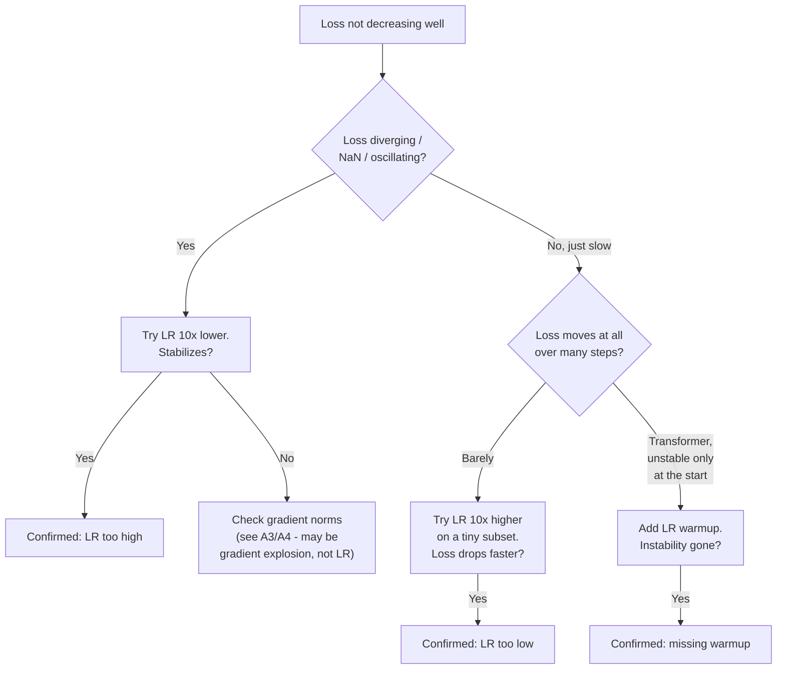
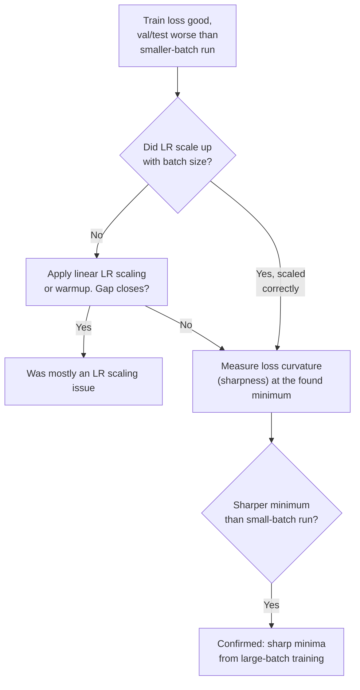
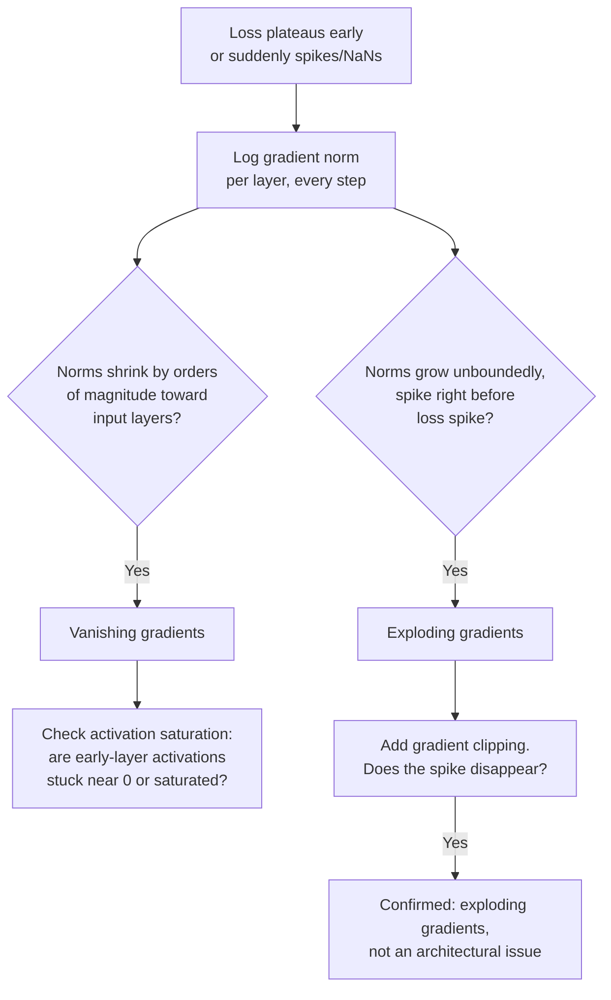
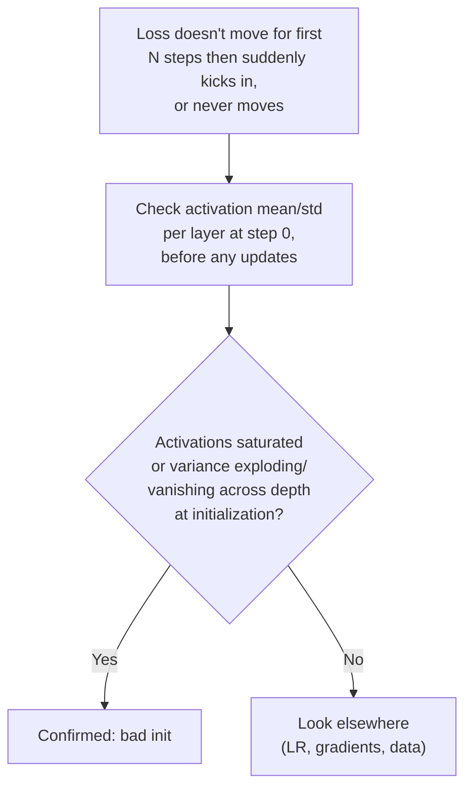
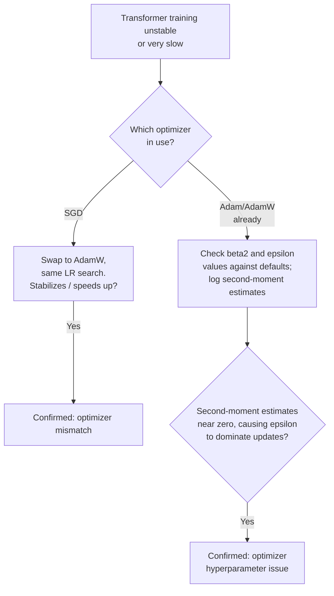
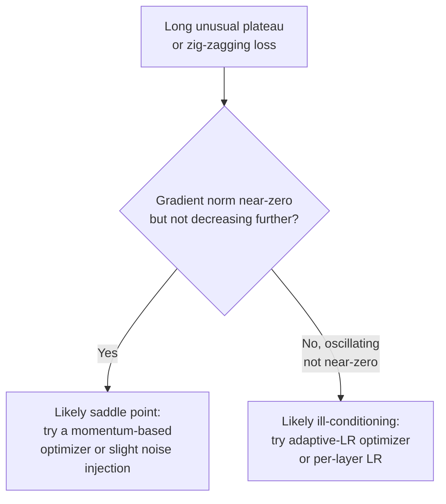
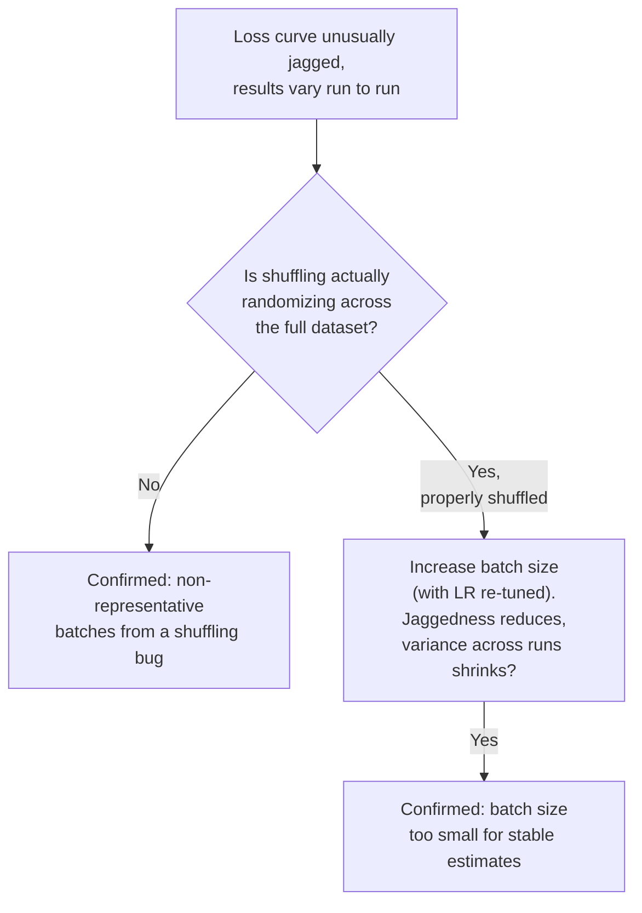

# Chapter A — Optimization & Training Dynamics

These are the issues that live in the training loop itself: the learning rate, the
optimizer, the batch, the gradients. They're usually the *first* place to look
when a model "isn't learning," because they're cheap to check before you suspect
data or architecture.

---

## A1. Learning Rate Misconfiguration

### Intuition
Think of the learning rate as your step size while walking down a foggy hill to find
the lowest point. Too large a step and you overshoot the valley, bouncing between
the walls, maybe launching yourself off a cliff (divergence). Too small a step and
you inch forward so slowly you might as well be standing still — technically
descending, but not within any reasonable time budget.

### Symptom Signatures
- **Too high:** loss oscillates wildly, spikes, or diverges to NaN/Inf; training that
  looked fine for a few steps suddenly blows up.
- **Too low:** loss decreases, but painfully slowly — after many epochs it's barely
  moved, and it looks like the model "can't learn" even though nothing is
  structurally broken.
- **No warmup (transformer-specific):** loss instability specifically in the first
  few hundred/thousand steps, even though the LR value itself would be fine later
  in training.

### Diagnostic Decision Path

### Confirming Experiment
Run the exact same setup on a **small subset of data for a short number of steps**
at 3 learning rates (e.g., current, 10x higher, 10x lower). The LR that shows
healthy, steady loss decrease on this cheap trial is almost always in the right
neighborhood for the full run. This is far cheaper than debugging a stalled/diverged
full-scale run after the fact.

### Fix
- Too high → lower LR, or add gradient clipping as a safety net (see A4).
- Too low → raise LR, or switch to an LR finder (increase LR exponentially over a
  short run and pick the value just before loss starts getting worse).
- Missing warmup → linear warmup for the first 1–10% of training steps before the
  main schedule kicks in — standard for transformer training, prevents early
  instability from large, poorly-conditioned initial gradients.

### Common Misdiagnosis Trap
A too-low learning rate is very often misdiagnosed as "the model doesn't have
enough capacity" or "the data doesn't have signal" — because the symptom (flat,
unmoving loss) looks identical from a distance. Always rule out LR with a cheap
short trial before concluding the model or data is the problem.

---

## A2. Batch Size Effects & Sharp Minima

### Intuition
Picture the loss landscape as terrain with a few wide, flat valleys and many narrow,
steep-walled canyons. Both are "low points," but only the wide valley generalizes —
a slightly different test-time input shifts you a little, and you're still near a
good solution. In a narrow canyon, that same small shift throws you into a
high-loss wall. Large batch sizes produce very consistent, low-noise gradient
estimates every step — consistent enough that the optimizer walks straight into
whichever minimum is nearest, including narrow ones, without the "wobble" that
smaller-batch noise provides to knock it out of narrow basins.

### Symptom Signatures
- Training loss/accuracy looks *great*, sometimes even better than the small-batch
  run (large batches often converge faster in wall-clock terms).
- Validation/test performance is noticeably worse despite equal or better training
  loss — a generalization gap that wasn't there at smaller batch sizes.
- Increasing batch size further (without adjusting LR) makes the validation gap
  worse, not better.

### Diagnostic Decision Path

### Confirming Experiment
Train two runs identical except for batch size (small vs. large), with LR properly
scaled for each (this rules out the common confound of just not adjusting LR).
Measure the **sharpness of the found minimum** — e.g., add small random perturbations
to the trained weights and see how much the loss increases. A sharp minimum shows a
large loss increase for a small perturbation; a flat minimum barely changes. If the
large-batch run is both sharper *and* generalizes worse, that's the confirming
evidence — not just a correlation.

### Fix
- Use LR warmup and linear/square-root LR scaling with batch size (a common rule of
  thumb, not automatic — verify empirically).
- Add mild regularization (weight decay, label smoothing) to counteract sharp
  minima tendency.
- Consider gradient accumulation to simulate a large *effective* batch only when
  needed, while keeping actual per-step batch size (and its beneficial noise)
  smaller.
- Sharpness-aware minimization (SAM) explicitly optimizes for flatter minima if this
  is a persistent issue at your scale.

### Common Misdiagnosis Trap
People often blame "large batch size" outright for any large-batch generalization
gap, without first checking whether the learning rate was scaled to match. Most of
the classic "large batch hurts generalization" gap disappears substantially once LR
scaling and warmup are done correctly — so confirm the LR was actually adjusted
before concluding it's a fundamental sharp-minima problem.

---

## A3 & A4. Vanishing and Exploding Gradients

### Intuition
Backpropagation multiplies gradients through every layer (or every timestep, for
RNNs) on the way back to early parameters. If that multiplicative chain is
consistently built from factors less than 1, the product shrinks toward zero the
further back you go — early layers get a whisper of a signal and barely update
(vanishing). If the factors are consistently greater than 1, the product grows
without bound — weights get slammed by huge updates (exploding). Same mechanism,
opposite direction.

### Symptom Signatures
- **Vanishing:** loss plateaus early and flatlines; early/input-side layers show
  near-zero gradient norms while later/output-side layers look normal; especially
  common in deep RNNs over long sequences, or deep nets with saturating activations
  (sigmoid/tanh).
- **Exploding:** loss suddenly spikes or hits NaN/Inf, sometimes after training
  looked completely normal for a while; weight values grow to extreme magnitudes.

### Diagnostic Decision Path

### Confirming Experiment
Log the **gradient norm at each layer** (not just the global norm) across training
steps. Plot norm vs. layer depth at a fixed step:
- A clean staircase shrinking toward the input = vanishing.
- A spike in the plot right before a loss spike = exploding.
Then run a controlled fix-and-observe test: add gradient clipping (for exploding) or
switch to residual connections / better init (for vanishing) with everything else
held fixed. If the pathology disappears, you've confirmed the cause, not just
correlated with it.

### Fix
- **Exploding:** gradient clipping (by norm — standard and cheap), lower LR, better
  initialization.
- **Vanishing:** switch RNN → LSTM/GRU (gating mechanisms built to mitigate this),
  add residual/skip connections, use non-saturating activations (ReLU/GELU) in deep
  stacks, proper init (Xavier/Glorot for tanh-style, He/Kaiming for ReLU-style), add
  batch/layer normalization to keep activations in a well-conditioned range through
  depth.

### Common Misdiagnosis Trap
A NaN loss is very often blamed on "the data has a bad example" (which does happen —
see chapter B/G) when it's actually a gradient explosion that would have happened
regardless of which specific batch was seen next. Check gradient norms *before*
hunting through the dataset for a corrupt example.

---

## A5. Poor Weight Initialization

### Intuition
Initialization sets the starting activations and gradient scale before any learning
happens. Too large an initial scale and activations saturate or blow up
immediately; too small and signal is too weak to propagate meaningfully through
depth — the network effectively starts "deaf" in its own forward pass, before
training even has a chance to fix anything.

### Symptom Signatures
- Loss doesn't move meaningfully in the first many steps, then (if it moves at all)
  suddenly starts learning once weights randomly walk into a better-conditioned
  region — an oddly delayed "kick-in" point.
- Activation statistics at initialization (before any training) are already
  saturated (all near 0 or all near the extreme of the activation function) or have
  wildly different variance across layers.

### Diagnostic Decision Path

### Confirming Experiment
Forward-pass a batch through the freshly-initialized (untrained) model and log
activation mean/std at every layer. Compare against a known-good init scheme
(Xavier/He) applied to the same architecture. If the current init shows activation
variance collapsing or exploding across depth *before any training has occurred*,
that's a clean, training-independent confirmation — it's not entangled with LR or
data effects.

### Fix
Use initialization matched to your activation function (Xavier/Glorot for
tanh/sigmoid-based networks, He/Kaiming for ReLU/GELU-based networks). For
transformers, follow the specific scaled initialization schemes used by the
architecture family (many transformer implementations scale init variance by depth
specifically to keep residual stream variance stable).

### Common Misdiagnosis Trap
Confused with vanishing gradients (A3) because the surface symptom (early layers not
learning) looks similar. The distinguishing test: bad init shows the problem **at
step 0, before any gradient has been computed**; vanishing gradients is a
*propagation* problem that shows up in the gradient computation itself, and can
exist even with perfect initialization if the architecture is deep enough or the
sequence long enough.

---

## A6. Optimizer Mismatch

### Intuition
Different optimizers make different assumptions about the loss surface. Plain SGD
takes a step purely in the direction of the current gradient; Adam-family optimizers
additionally track per-parameter running estimates of gradient mean and variance,
adapting the effective step size for each parameter individually. Transformers, with
their highly non-uniform gradient scales across layers (embeddings vs. attention vs.
output head), are notoriously hard to train well with vanilla SGD — the per-parameter
adaptivity of Adam/AdamW isn't a minor tweak, it's often load-bearing.

### Symptom Signatures
- Training is unstable or very slow with plain SGD on a transformer, but the same
  architecture trains smoothly with AdamW at a similar effective LR.
- Poorly tuned Adam epsilon/beta values cause subtle instability — e.g., loss spikes
  late in training as gradient estimates become very small and the epsilon term
  starts dominating the update.

### Diagnostic Decision Path

### Confirming Experiment
Swap only the optimizer (keep architecture, data, and LR search space identical) and
re-run a short training trial. If AdamW meaningfully outperforms SGD in stability or
speed on the same architecture, that's a clean confirming signal, since nothing else
changed.

### Fix
Use AdamW (Adam with decoupled weight decay) as the default for transformer training
unless you have a specific, tested reason not to. Tune beta2 and epsilon if training
becomes unstable late in training on very long runs (some large-scale training
recipes lower beta2 or raise epsilon specifically to address this).

### Common Misdiagnosis Trap
Slow/unstable training with the wrong optimizer gets misdiagnosed as an
architecture problem ("maybe this attention variant is unstable") when swapping the
optimizer alone would have fixed it. Optimizer is cheaper to test than architecture —
check it first.

---

## A7. Loss Landscape Pathologies (Saddle Points, Plateaus, Ill-Conditioning)

### Intuition
Not every "stuck" loss is a gradient magnitude problem. A **saddle point** is flat or
even locally optimal-looking in some directions while still having a descent
direction in others — first-order gradient descent can slow to a crawl near these
even though a way down exists. **Ill-conditioning** means the loss surface is shaped
like a long narrow ravine — steep in one direction, nearly flat in another — so a
single learning rate is simultaneously too large for the steep direction and too
small for the flat one, causing zig-zagging instead of direct progress.

### Symptom Signatures
- Loss decreases, then hits a long flat stretch that lasts far longer than typical
  plateaus, before (sometimes) resuming — distinct from a clean convergence plateau
  at the end of training.
- Training oscillates/zig-zags direction step to step, without diverging or clearly
  vanishing — a "twitchy" loss curve rather than a smoothly decreasing one.

### Diagnostic Decision Path

### Confirming Experiment
For suspected saddle points: add momentum (or increase it) and see if the plateau
duration shrinks — momentum specifically helps escape saddle regions that pure
gradient descent gets stuck near. For ill-conditioning: switch from a fixed global
LR to an adaptive per-parameter method (Adam-family) and check whether the
zig-zagging smooths out — adaptivity directly compensates for differing curvature
across directions.

### Fix
- Saddle points: momentum-based optimizers, or mild noise injection (which is part
  of why smaller batch sizes can help here too — see A8).
- Ill-conditioning: adaptive optimizers (Adam/AdamW), or normalization layers that
  reshape the effective loss surface to be better conditioned in the first place.

### Common Misdiagnosis Trap
A long plateau gets frequently misread as "the model has converged" or "the data
has no more signal," when it may simply be a saddle region the optimizer hasn't
escaped yet. Before concluding convergence, try a short burst of higher LR or added
momentum and see if loss moves again.

---

## A8. Gradient Noise from Small or Non-Representative Batches

### Intuition
Every mini-batch is a sample estimate of the true gradient over the full dataset.
Small batches make that estimate noisier — which is a double-edged property: a
little noise helps escape sharp minima and saddle points (see A2, A7), but too much
noise means each step is only weakly correlated with the true descent direction,
and training becomes erratic rather than merely "a bit stochastic."

### Symptom Signatures
- Loss curve is very jagged/spiky step-to-step (more than typical mini-batch noise),
  and doesn't smooth out even on a moving average.
- Different runs with the same hyperparameters but different random batch orderings
  give meaningfully different final results.
- Especially pronounced when batches are drawn from a poorly shuffled dataset (e.g.,
  sorted by class or by document, so consecutive batches are systematically
  non-representative rather than randomly noisy).

### Diagnostic Decision Path

### Confirming Experiment
Inspect actual batch composition mid-training (are consecutive batches suspiciously
similar in label/topic, indicating a shuffling bug rather than true randomness?).
Separately, run the same setup at 2–3 batch sizes with LR re-tuned at each, and
compare loss curve smoothness and run-to-run variance in the final metric — a clean
reduction in variance as batch size grows (up to the point of diminishing returns) is
the confirming signal for true gradient noise, as opposed to a pipeline bug.

### Fix
- If it's a shuffling/pipeline bug: fix the data loader (see chapter G) — this is
  not actually an optimization issue at all, just disguised as one.
- If it's genuine small-batch noise: increase batch size (with LR re-tuned), or use
  gradient accumulation to increase the effective batch size without increasing
  memory footprint, or apply gradient smoothing/EMA of weights (e.g., Polyak
  averaging) to reduce the effect of per-step noise on the final model.

### Common Misdiagnosis Trap
People sometimes chase this by tuning LR schedules extensively, when the actual root
cause is a data loader that isn't shuffling properly — a pipeline bug masquerading
as an optimization instability. Always check the shuffling mechanism directly before
assuming it's fundamental gradient noise.