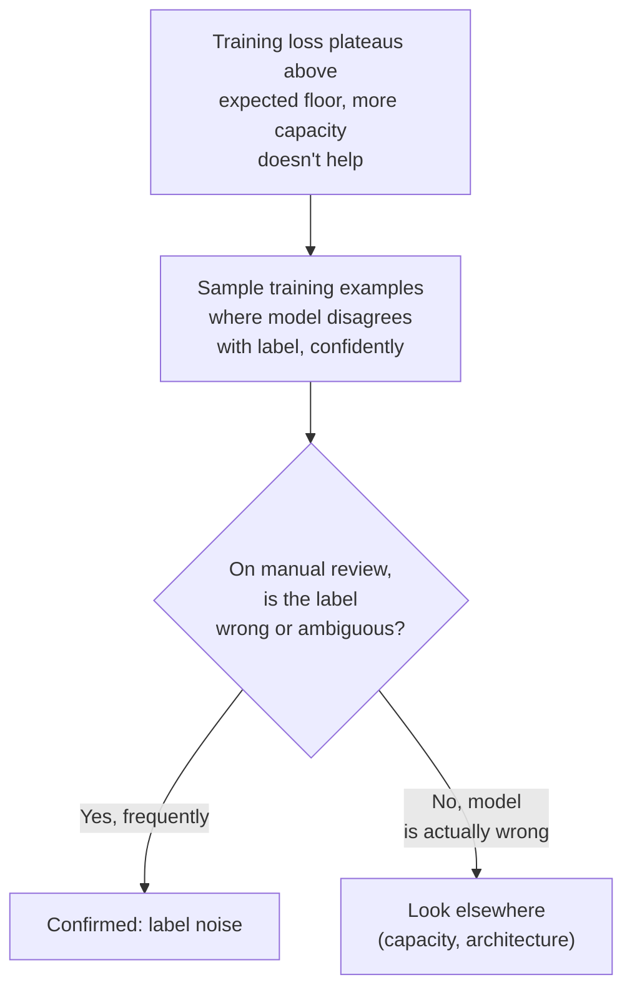
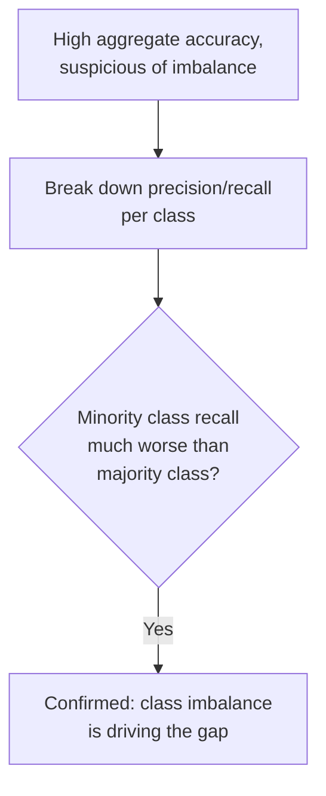
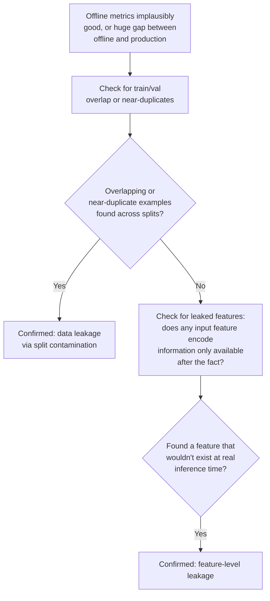
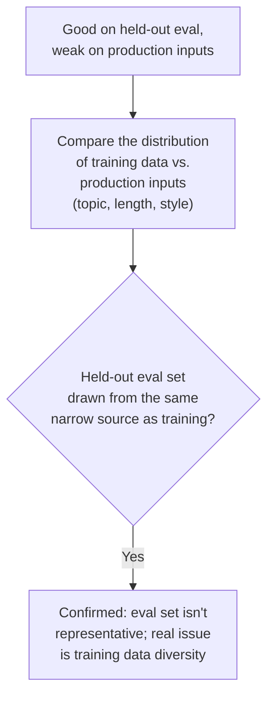
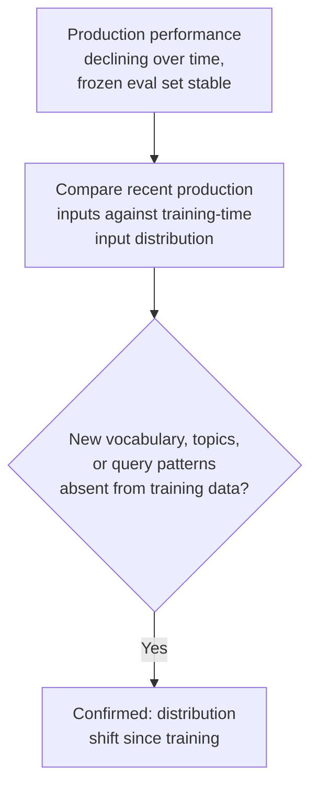
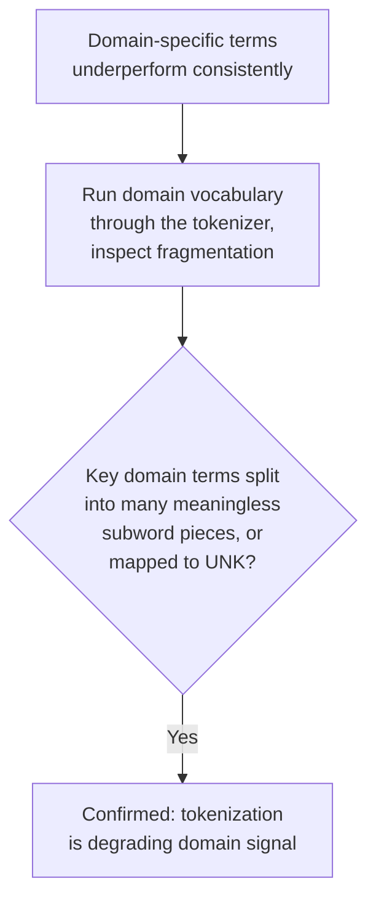
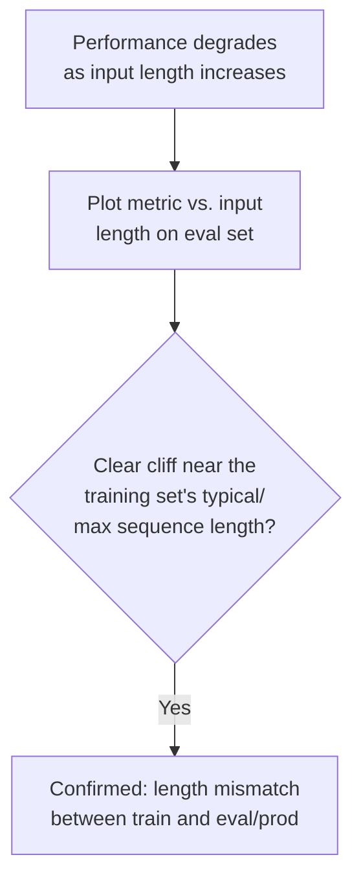

# Chapter B — Data-Related Issues

The training loop can be mathematically perfect and the model will still fail if
what it's learning *from* is wrong, biased, leaking, or mismatched with what it'll
see later. These issues are often more common in practice than optimization bugs,
but get diagnosed less often because people default to blaming the model first.

---

## B1. Label Noise

### Intuition
If a meaningful fraction of your training labels are simply wrong (mislabeled
sentiment, wrong entity tags, incorrect classes), the model is being asked to learn
a function that contradicts itself on similar inputs. It can't perfectly fit
contradictory signals, so it either underperforms overall or overfits to
memorizing the noise (since noise, by definition, doesn't generalize).

### Symptom Signatures
- Training loss plateaus at a value clearly above zero even with a large, flexible
  model that should be able to fit the training set well — a "ceiling" that doesn't
  budge with more capacity or more epochs.
- Manually inspecting the model's most confident wrong predictions on the training
  set reveals the *model's* answer was actually right, and the *label* was wrong.

### Diagnostic Decision Path

### Confirming Experiment
Take the training examples where the model is most confidently *wrong* relative to
the given label, and manually audit a sample of them. If a large fraction turn out
to have incorrect or ambiguous labels (not model failures), that's direct,
unambiguous confirmation — you're looking at the actual noise, not inferring it.

### Fix
- Relabel or filter out identified-bad examples if the noisy subset is
  identifiable and a small fraction of the dataset.
- Use noise-robust training techniques (label smoothing, loss functions robust to
  label noise, or confident-learning-style automated noisy-label detection) if
  relabeling everything isn't feasible.
- If noise is pervasive and systemic (e.g., a labeling pipeline bug), fix the
  pipeline rather than the model.

### Common Misdiagnosis Trap
A non-zero training loss floor is very often misattributed to "the model needs more
capacity" — teams add layers/parameters and see no improvement, when the actual
ceiling is unresolvable label noise that no amount of capacity can fit correctly (by
design, since it's contradictory).

---

## B2. Class Imbalance

### Intuition
If one class/label dominates the training data, a model can achieve deceptively
good aggregate accuracy simply by leaning toward the majority class, without
actually learning to discriminate the minority class at all. The optimization
process has no explicit signal telling it that minority-class errors matter more
than the raw frequency would suggest.

### Symptom Signatures
- High overall accuracy, but very poor recall/precision specifically on minority
  classes (visible only when you break metrics down per class, not in the
  aggregate).
- Confusion matrix shows systematic misclassification of minority classes into the
  majority class.

### Diagnostic Decision Path

### Confirming Experiment
Compute per-class precision/recall/F1 (not just overall accuracy) and compare against
the class frequency distribution in the training set. A strong correlation between
"how rare a class is" and "how poorly the model does on it" is the confirming
pattern — distinguishing this from a class simply being harder to learn for
reasons unrelated to frequency.

### Fix
- Resampling: oversample minority classes or undersample majority classes during
  training.
- Reweighted loss: weight the loss function inversely to class frequency so rare
  classes contribute proportionally more to the gradient.
- Use metrics that reflect the real priority (F1, balanced accuracy, per-class
  recall) both for training-time model selection and for reporting — aggregate
  accuracy alone will keep hiding this.

### Common Misdiagnosis Trap
Teams sometimes conclude "the model can't learn this class" (an architecture/
capacity conclusion) when the real issue is that the class simply never gets enough
gradient signal relative to the majority class. Reweighting or resampling before
concluding a capacity problem is the right order of operations.

---

## B3. Data Leakage

### Intuition
Leakage means information from the test/validation set (or information that
wouldn't be available at real inference time) sneaks into training, directly or
indirectly. The model then appears to perform well during evaluation, but that
performance doesn't reflect what will happen on genuinely unseen data — it's an
illusion created by the evaluation itself being compromised.

### Symptom Signatures
- Validation/test metrics look implausibly good relative to the task's inherent
  difficulty or relative to reasonable baselines.
- A large, hard-to-explain drop in performance the moment the model reaches actual
  production traffic, despite strong offline metrics.
- Near-duplicate examples exist across train and validation splits (common in
  scraped or augmented datasets).

### Diagnostic Decision Path

### Confirming Experiment
Directly search for near-duplicate or overlapping examples between train and
validation/test sets (e.g., via hashing, embedding similarity, or exact-match
checks on key fields). Separately, audit the feature/input pipeline for anything
derived using information that wouldn't exist at the actual moment of inference
(e.g., a field computed using future data, or a summary statistic computed over
the full dataset including the test set). Finding either is direct, non-inferential
confirmation.

### Fix
- Rebuild the train/val/test split to guarantee no overlap — dedupe at the source,
  not just approximately.
- Recompute any preprocessing/feature statistics using only the training split
  (never fit scalers, tokenizer vocabularies, or normalization statistics on data
  that includes validation/test).
- Re-run the full evaluation after the fix and expect metrics to drop — this drop is
  the model's true, honest performance.

### Common Misdiagnosis Trap
Great validation numbers are rarely double-checked because they *look* like good
news. The discipline here is to be suspicious of surprisingly good results, not just
surprisingly bad ones — leakage is one of the few issues where the symptom is
"things look too good," which is easy to just accept and move on from.

---

## B4. Insufficient Data Diversity

### Intuition
A model trained on a narrow slice of the real distribution (e.g., only formal text,
only one writing style, only a handful of scenario types) learns a function that
works well within that slice and poorly outside it — not because it's a bad
learner, but because it was never shown the diversity it's now being asked to
handle.

### Symptom Signatures
- Strong performance on held-out data that comes from the *same* narrow source/style
  as training, but weak performance on real-world/production inputs that are more
  varied.
- Qualitative failures cluster around specific input styles, lengths, or topics that
  were underrepresented in training — not randomly distributed failures.

### Diagnostic Decision Path

### Confirming Experiment
Slice production failure cases by attribute (topic, length, style, source) and check
whether failures cluster in regions underrepresented in the training set. Then,
construct or source a small amount of data specifically from the underrepresented
region, fine-tune briefly, and check whether performance improves specifically on
that slice — a targeted improvement confirms the diversity gap was the cause.

### Fix
- Expand training data to cover underrepresented regions (collect more, or
  augment/synthesize).
- Build evaluation sets that mirror true production distribution, not just an
  easy held-out split from the same narrow source — otherwise this issue will keep
  hiding behind good-looking eval numbers.

### Common Misdiagnosis Trap
This gets confused with a pure capacity or architecture problem ("the model isn't
strong enough for this task"), when the actual issue is that the model was simply
never shown examples resembling the failing cases. Check data coverage before
concluding the architecture itself is insufficient.

---

## B5. Train/Inference Distribution Mismatch (Covariate Shift)

### Intuition
Even without any errors in the training process, if the *distribution* of inputs
at inference time differs systematically from what was seen at training time (new
vocabulary, a product launch introducing new terms, a shift in how users phrase
things), the model is being tested on a distribution it was never optimized for.
This is subtly different from B4 (narrow diversity from the start) — this is
diversity that was fine at training time but has since drifted.

### Symptom Signatures
- A model that performed well at launch degrades gradually over time without any
  code or data pipeline changes.
- Performance on a *fixed, frozen* historical eval set stays stable, while
  real-time production metrics decline — a growing gap between the two.

### Diagnostic Decision Path

### Confirming Experiment
Pull a fresh sample of recent production inputs and compare their vocabulary/topic
distribution against the original training set (e.g., via topic modeling, new-token
rate, or simple keyword frequency drift). A measurable, growing divergence over time
that correlates with the performance decline is the confirming signal.

### Fix
- Periodic retraining/fine-tuning on recent data (see also G — set this up on a
  schedule, don't wait for a complaint).
- Continual monitoring of input distribution statistics as an early-warning signal,
  rather than relying solely on lagging quality metrics.

### Common Misdiagnosis Trap
Gradual degradation over time is sometimes wrongly attributed to "the model
randomly got worse" or blamed on unrelated infra changes, when it's simply the world
changing while the model stayed frozen. Always check for distribution drift before
assuming a regression was introduced by a code change.

---

## B6. Tokenization Issues

### Intuition
The tokenizer is the interface between raw text and the model's actual input space.
If it fragments domain-specific words into meaningless subword pieces, or if the
vocabulary is too small and produces excessive out-of-vocabulary/unknown tokens, the
model receives a systematically degraded signal — no amount of training can fully
recover information that was destroyed at the tokenization step.

### Symptom Signatures
- Domain-specific terms (technical jargon, product names, code identifiers, rare
  entities) consistently underperform compared to common vocabulary, even after
  substantial fine-tuning.
- Inspecting tokenized output shows important domain terms being split into many
  small, semantically meaningless subword fragments.

### Diagnostic Decision Path

### Confirming Experiment
Take a list of important domain terms and run them through the tokenizer directly,
inspecting the resulting token sequences. Excessive fragmentation (many pieces for a
single meaningful term) or frequent mapping to an unknown/UNK token is direct,
observable confirmation — no training run needed to see this.

### Fix
- Extend the vocabulary with domain-specific tokens (many tokenizer libraries
  support adding new tokens, then resizing the model's embedding matrix and doing a
  short continued-training pass to learn good embeddings for them).
- Switch to a tokenizer trained with domain data included, if starting fresh.
- For less severe cases, continued pretraining on domain text lets the model learn
  to compose the existing fragmented subwords more effectively, even without
  vocabulary changes.

### Common Misdiagnosis Trap
Poor domain-term handling gets attributed to "the model doesn't know this domain" (a
knowledge gap, fixed by more training data) when part or all of the problem is
happening at the tokenization layer before any learning even starts. Check
tokenization output directly — it's a five-minute check that can save a lot of
wasted fine-tuning effort.

---

## B7. Sequence Length Mismatch (Train Short, Eval Long — or Vice Versa)

### Intuition
A model's learned representations are shaped by the length distribution it was
trained on. If training data is mostly short sequences and evaluation/production
data is much longer (or the reverse), the model is operating outside the length
regime it was optimized for — this interacts with several other issues (positional
encoding limits in Chapter C, attention pattern behavior) but is worth diagnosing
as its own root cause first.

### Symptom Signatures
- Performance degrades specifically as input length increases past what was common
  in training, even though shorter inputs work fine.
- Plotting an evaluation metric against input length shows a clear decline past a
  specific length threshold — often suspiciously close to the training set's typical
  or maximum sequence length.

### Diagnostic Decision Path

### Confirming Experiment
Bucket the evaluation set by input length and compute the metric per bucket. A sharp
decline that begins right around the training distribution's typical or maximum
length (rather than a smooth, gradual decline across all lengths) is strong,
specific confirmation that this is a length-mismatch issue rather than a general
difficulty or domain-gap issue.

### Fix
- Include longer sequences in training data (even if fewer of them), so the model
  has seen the length regime it will face at inference.
- Chunk long inputs to fit the trained length range rather than feeding
  out-of-distribution lengths directly, if retraining isn't feasible.
- For architectures with known length-extrapolation weaknesses, consider position-
  encoding schemes designed for better length generalization (see Chapter C).

### Common Misdiagnosis Trap
Length-related degradation is sometimes chalked up to "long documents are just
harder" as if it were an inherent difficulty, when the real issue is that the
model simply never saw that length during training — a fixable data-composition
problem, not an unavoidable one.