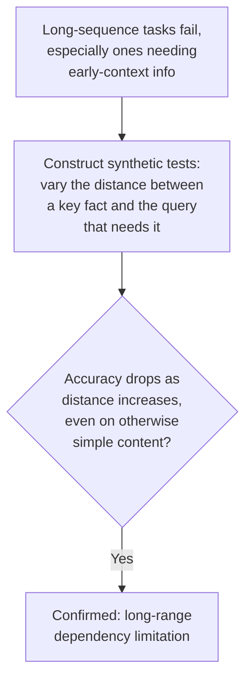
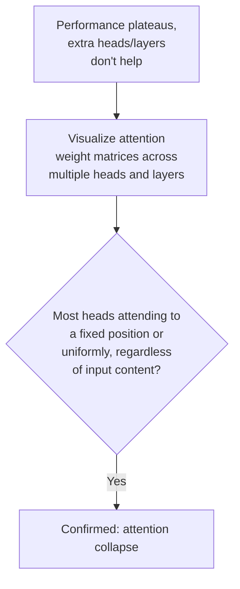
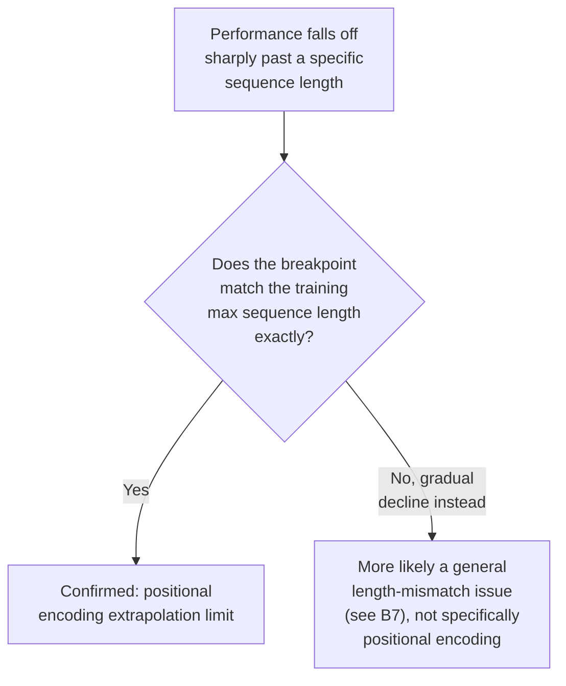
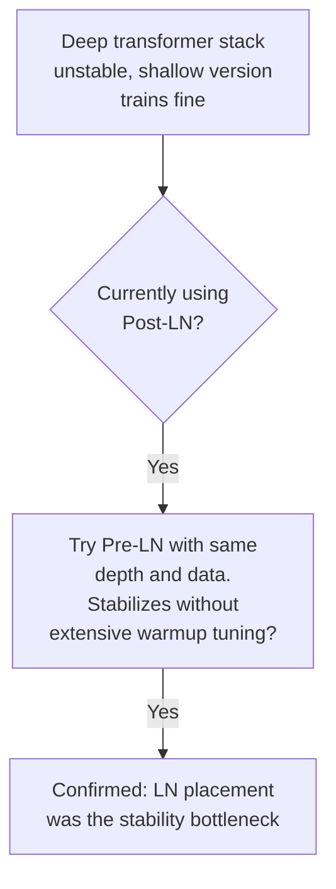
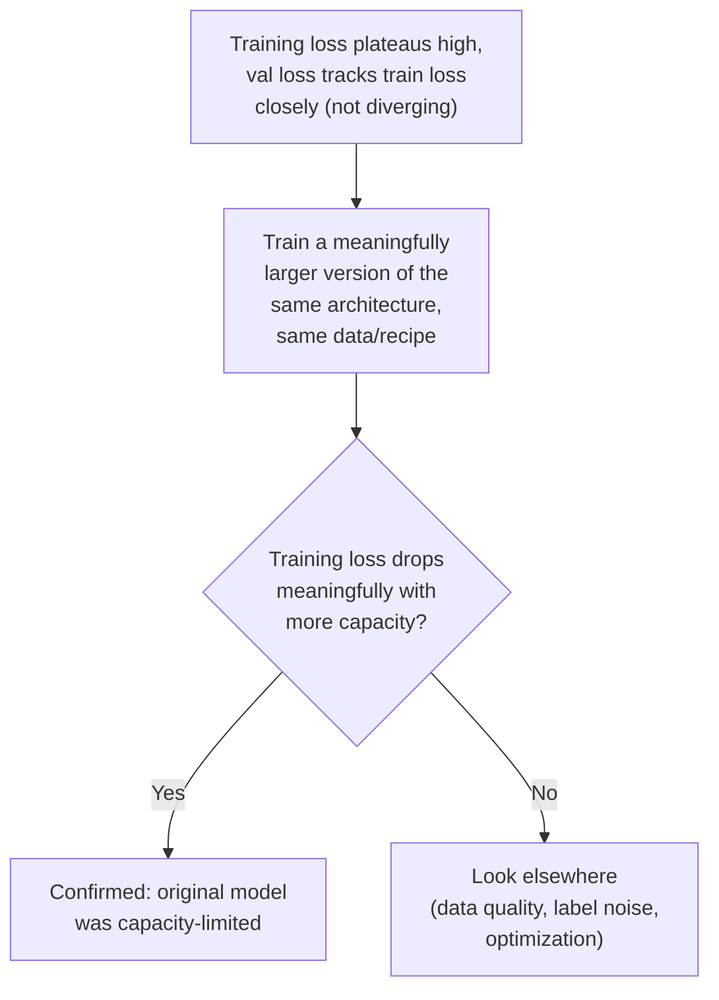
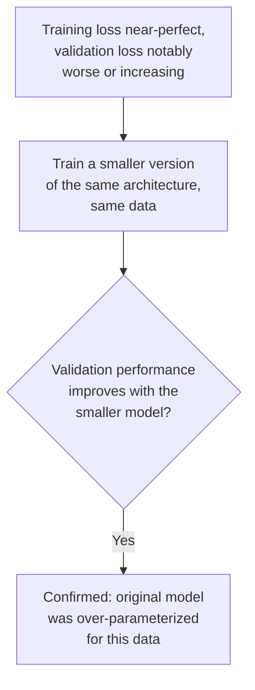

# Chapter C — Architecture-Specific Issues

These issues come from a mismatch between the architecture's structural assumptions
and the task, rather than from the training process or the data itself. The
diagnostic move here is usually the same: isolate whether swapping *just* the
architectural component (while holding data and training fixed) changes the
outcome.

---

## C1. RNN/LSTM Long-Range Dependency Failure

### Intuition
An RNN/LSTM compresses everything it has seen so far into a single fixed-size
hidden state, updated one token at a time. Even with LSTM's gating mechanism
designed to preserve information longer than a vanilla RNN, there's still a finite
amount of "room" in that hidden state — information from far earlier in a long
sequence gets progressively diluted or overwritten as new tokens arrive, no matter
how good the gates are.

### Symptom Signatures
- Performance is fine on short sequences but drops sharply on long ones, and
  specifically drops on tasks that require referencing information from early in a
  long input (e.g., coreference to an entity mentioned far back, or a long-document
  QA question about something stated in paragraph one).
- The model appears to "forget" earlier context progressively as sequence length
  grows, rather than failing randomly.

### Diagnostic Decision Path

### Confirming Experiment
Build a small synthetic probe: place a key fact at varying distances from the point
where it's needed (e.g., "the code is X" near the start, then ask for the code at
the end, varying how much filler text sits in between). If accuracy degrades
smoothly as distance increases — even though the content itself isn't inherently
harder — that isolates the failure to the architecture's memory limitation, not to
task difficulty or vocabulary.

### Fix
- Switch to an attention-based architecture (Transformer), which accesses all
  positions directly rather than through a single compressed hidden state.
- If staying with RNN/LSTM is required, add attention mechanisms on top of the
  recurrent layers, or use hierarchical/chunked processing to reduce the effective
  distance information needs to travel.

### Common Misdiagnosis Trap
Long-document failures get attributed to "the model doesn't understand the content"
(a knowledge/comprehension framing) when a synthetic distance-probe would reveal
it's a structural memory limitation that has nothing to do with content difficulty.

---

## C2. Attention Collapse in Transformers

### Intuition
Attention heads are supposed to learn to focus on different, meaningful parts of
the input depending on context. "Collapse" happens when a head (or many heads)
degenerates into a trivial, context-independent pattern — e.g., always attending
heavily to the first token, or spreading attention almost uniformly regardless of
input — providing little to no useful signal despite technically "running."

### Symptom Signatures
- Visualizing attention weight matrices shows most heads attending overwhelmingly to
  one fixed position (often position 0) or to a near-uniform distribution,
  regardless of the actual input content.
- Model performance plateaus despite adding more layers/heads — extra heads aren't
  contributing distinct information because they've collapsed to redundant or
  trivial patterns.

### Diagnostic Decision Path

### Confirming Experiment
Feed several *different* inputs through the model and visualize the attention
matrices for the same heads across inputs. If a head's attention pattern barely
changes across genuinely different inputs (i.e., it's not conditioning on content at
all), that's direct confirmation of collapse — as opposed to a head that
legitimately, consistently attends to a functionally important token (some
collapse-looking patterns are actually meaningful, so cross-input comparison is the
key check).

### Fix
- Add attention entropy regularization or auxiliary losses that encourage diverse
  attention patterns across heads.
- Check learning rate and initialization first — attention collapse is often
  downstream of an optimization issue (too-high LR causing heads to converge to a
  degenerate shortcut early) rather than a fundamental architectural flaw.
- Consider architectural tweaks known to reduce this (e.g., different normalization
  placement, or auxiliary losses used in some large-scale training recipes
  specifically to prevent head collapse).

### Common Misdiagnosis Trap
Attention collapse is sometimes accepted as "that's just how attention looks" without
comparing across different inputs — some fixed-looking attention patterns are
legitimate (e.g., a head that consistently tracks sentence boundaries), and only
comparing across genuinely varied inputs reveals whether a pattern is meaningfully
adaptive or truly collapsed.

---

## C3. Positional Encoding & Length Extrapolation

### Intuition
Transformers have no inherent sense of token order — position information has to be
explicitly injected via positional encodings. Many older/simpler schemes
(learned absolute positional embeddings, in particular) are only trained on
positions up to the maximum sequence length seen during training — asking the model
to handle a longer sequence means asking it to use position embeddings it never
learned values for.

### Symptom Signatures
- Performance is fine up to the training context length, then falls off a cliff
  right past it — not a gradual decline, but a sharp, specific breakpoint.
- Model performs poorly specifically on the *end* of long sequences beyond the
  training length, even though the local content there isn't inherently different.

### Diagnostic Decision Path

### Confirming Experiment
Compare the exact sequence length where the performance cliff occurs against the
model's documented training context length. A precise match (not just "long
sequences are worse," but a sharp cliff at a specific known number) is the
confirming signature specific to positional encoding, distinguishing it from the
more general, gradual length-mismatch pattern in B7.

### Fix
- Use relative positional encoding schemes (rather than learned absolute ones),
  which are designed to generalize better to unseen lengths.
- Apply position-interpolation or extrapolation techniques designed for extending
  a model's effective context length without retraining from scratch, if switching
  encoding schemes entirely isn't feasible.
- If retraining, include training examples at or near the target maximum length
  directly (overlaps with the B7 fix).

### Common Misdiagnosis Trap
Easily confused with B7 (general train/eval length mismatch) since both show
length-related degradation. The distinguishing test is sharpness: a hard cliff at a
specific, known training-length boundary points to positional encoding
specifically; a smoother decline across a range of lengths points to the more
general data-composition issue in B7.

---

## C4. LayerNorm Placement (Pre-LN vs. Post-LN)

### Intuition
Where normalization sits relative to the residual connection changes how gradients
flow through a deep transformer stack. Post-LN (normalization after the residual
addition, the original Transformer design) tends to produce a less stable gradient
signal in very deep stacks, often requiring careful warmup to train at all. Pre-LN
(normalization before the sublayer, applied inside the residual branch) tends to be
more stable at greater depth, at some cost to final performance ceiling in certain
setups.

### Symptom Signatures
- Very deep transformer stacks fail to train at all (loss stays high or diverges)
  without extremely careful, long warmup schedules — but training becomes far more
  forgiving once switched to a different LN placement.
- Instability that scales specifically with depth — a shallow version of the same
  architecture trains fine, a much deeper version doesn't, with nothing else
  different.

### Diagnostic Decision Path

### Confirming Experiment
Hold depth, data, and optimizer fixed; swap only the normalization placement
(Pre-LN vs. Post-LN) and compare training stability, especially with a shorter or
less carefully-tuned warmup than the original unstable run required. A meaningful
stability improvement with everything else fixed confirms LN placement as the
mechanism.

### Fix
Use Pre-LN for very deep stacks where training stability is the priority, being
aware of the modest performance ceiling tradeoff some research has found relative to
well-tuned Post-LN at moderate depths. Some modern recipes use hybrid or
alternative normalization approaches specifically to get both stability and
performance — check current best practices for your specific architecture family
before assuming the classic Pre-LN/Post-LN tradeoff is the final word.

### Common Misdiagnosis Trap
Instability specific to deep architectures is frequently chased with learning rate
and warmup tuning alone (which can help, up to a point) when the underlying
structural issue is normalization placement — a change that often reduces the need
for delicate warmup tuning in the first place, rather than being a workaround for it.

---

## C5. Insufficient Model Capacity

### Intuition
Sometimes the model architecture is simply too small (too few parameters, too
shallow, too narrow) to represent the function the task actually requires. This is
architectural underfitting — distinct from the training-process underfitting
covered in Chapter D, because here the ceiling exists even under ideal training
conditions.

### Symptom Signatures
- Training loss itself plateaus at a high value even on the training set alone
  (the model can't even memorize/fit its own training data well), with no sign of
  overfitting (val loss isn't diverging from train loss — both are just similarly
  mediocre).
- Increasing model size (with the same data and training recipe) produces a clear,
  meaningful improvement in training loss, not just validation loss.

### Diagnostic Decision Path

### Confirming Experiment
Train a clearly larger version of the same architecture family on the identical
data and recipe. If training loss (not just validation loss) drops meaningfully,
that isolates capacity as the bottleneck — since a data or optimization issue would
typically hurt the larger model too, roughly proportionally.

### Fix
Increase model capacity (width, depth, or both) in a way appropriate to your data
scale — check that data volume can actually support the larger model without
tipping into overfitting (see Chapter D) as capacity grows.

### Common Misdiagnosis Trap
A high training-loss floor is sometimes misattributed to label noise (B1) instead of
capacity. The distinguishing check: label noise creates a ceiling that *doesn't*
move with more capacity (the contradictory labels are still contradictory no matter
how big the model is); a genuine capacity limitation *does* move with more capacity.
Run both checks before concluding which one it is.

---

## C6. Over-Parameterization Without Regularization

### Intuition
The flip side of C5: a model with far more capacity than the data or task
complexity requires can simply memorize the training set (including its noise and
idiosyncrasies) rather than learning the generalizable underlying pattern —
especially without regularization to discourage that memorization.

### Symptom Signatures
- Training loss/accuracy is excellent, near-perfect, while validation loss is
  markedly worse and may even be increasing over training epochs — the classic
  overfitting gap (this connects directly to Chapter D's overfitting lesson, viewed
  here specifically through the architecture-capacity lens).

### Diagnostic Decision Path

### Confirming Experiment
Train a meaningfully smaller version of the same architecture on the identical
data. If validation performance improves (even though training performance may get
slightly worse), that confirms the larger model's capacity was being spent on
memorization rather than useful generalization.

### Fix
- Add or strengthen regularization (dropout, weight decay, data augmentation) rather
  than necessarily shrinking the model outright, if the larger capacity is desired
  for other reasons.
- Increase effective data volume (more data, or augmentation) so the larger model
  has enough signal to justify its capacity.
- See Chapter D for the full regularization toolkit.

### Common Misdiagnosis Trap
This is easy to conflate with plain overfitting from a training-recipe perspective
(Chapter D) rather than an architecture-sizing perspective. Both look identical in
the loss curves — the distinguishing question is whether the fix should be "add
regularization to this architecture" or "use a smaller/differently-sized
architecture," and the smaller-model confirming experiment above helps decide which
lever is actually the highest-leverage one for your case.