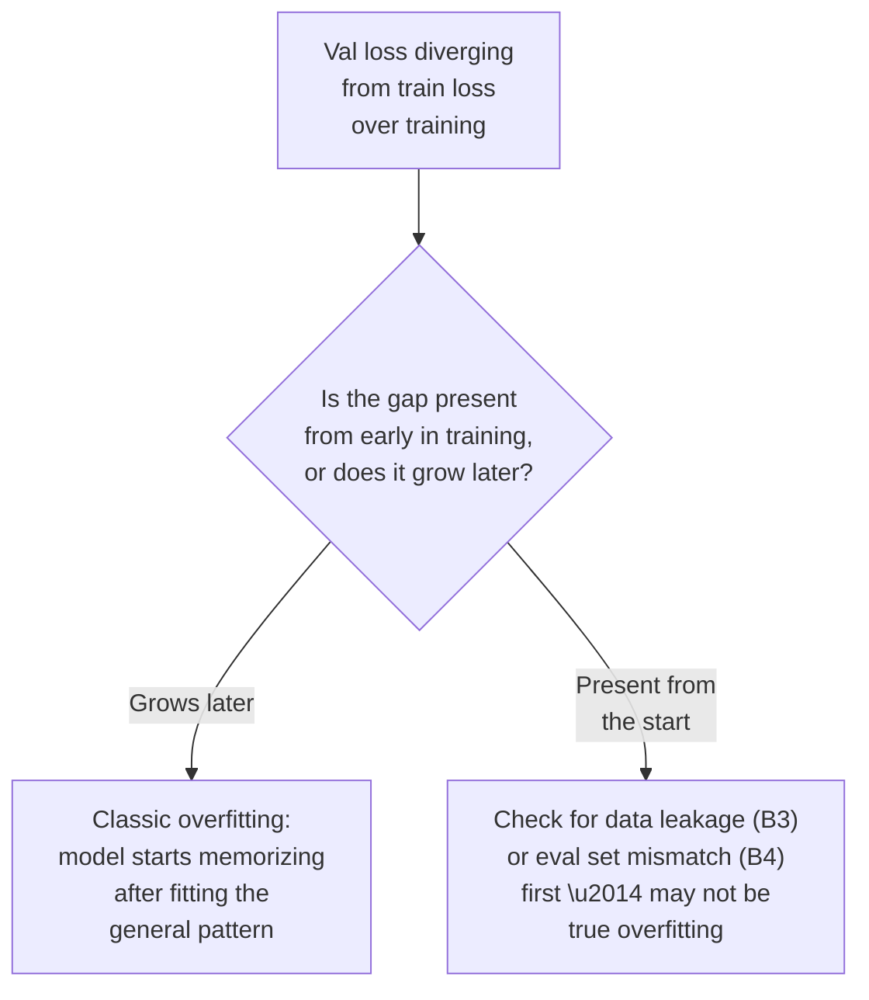
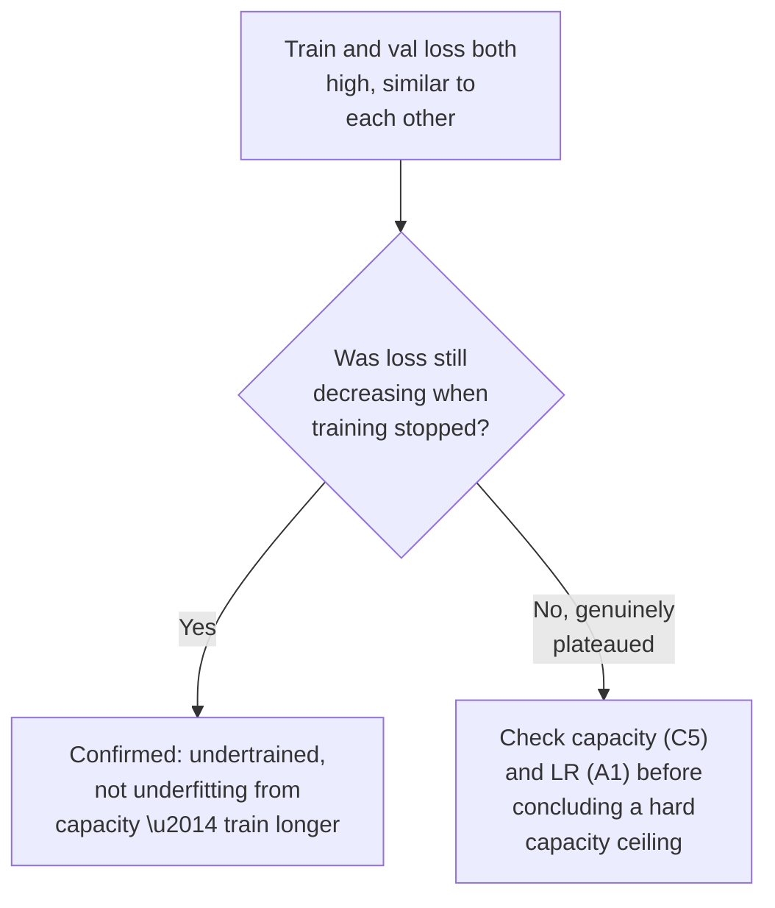
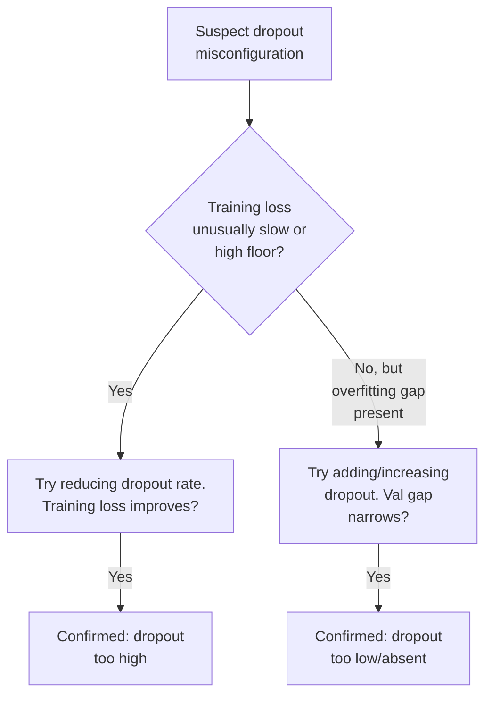
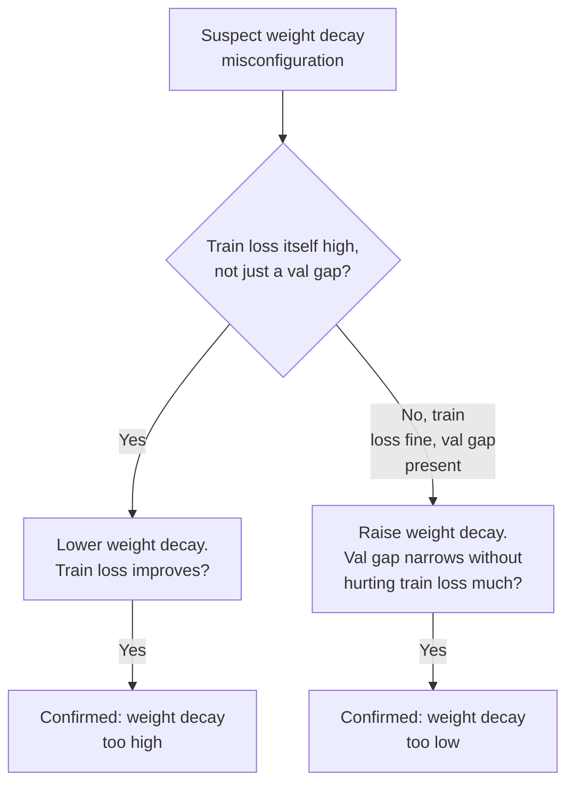
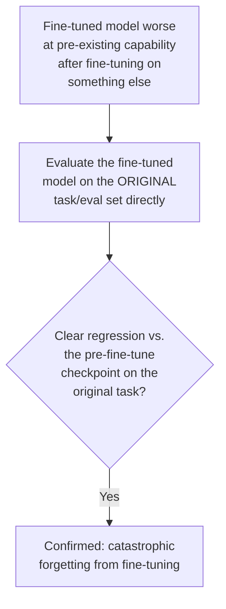

# Chapter D — Regularization & Generalization

Where Chapter C asks "is the architecture the right size for this task," this
chapter asks "given the architecture I have, is the training recipe pushing it
toward memorization or toward genuine generalization." These issues are about the
gap between training performance and real-world performance.

---

## D1. Overfitting

### Intuition
The model has enough capacity and enough training time to start fitting the
idiosyncrasies and noise specific to the training set, rather than only the
general pattern that would transfer to new data. Training performance keeps
improving (or stays excellent) while performance on anything not seen during
training gets worse.

### Symptom Signatures
- A widening gap between training loss (low, still improving) and validation loss
  (flat or increasing) as training continues.
- The model performs suspiciously well on examples that closely resemble training
  data in surface form, but poorly on genuinely novel examples.

### Diagnostic Decision Path

### Confirming Experiment
Plot train and validation loss curves together across training steps/epochs. True
overfitting shows both curves improving together early on, then validation loss
flattening or reversing while training loss keeps improving — a specific *shape*,
not just "validation is worse than training" at a single point in time (which can
have other causes, like a harder validation set or leakage running the other
direction).

### Fix
- Early stopping — stop training at the point validation loss is best, before it
  starts diverging.
- Regularization — dropout, weight decay, data augmentation (see D3, D4).
- More training data, or synthetic augmentation, if data volume is the limiting
  factor relative to model capacity.
- Reduce model capacity if it's disproportionate to the data (see C6).

### Common Misdiagnosis Trap
Any train/val gap gets labeled "overfitting" by default. Always check the *shape*
of the divergence over training time (grows later vs. present from the start)
before concluding it's classic overfitting rather than a data issue (leakage, or a
validation set that isn't actually comparable to training data).

---

## D2. Underfitting

### Intuition
The model fails to capture even the training data's underlying pattern well —
both training and validation performance are poor, without a meaningful gap
between them. This can stem from the training process (too short, too weak a
learning signal) as opposed to a hard architectural capacity ceiling (C5), which is
why it's worth checking training duration/strength before concluding it's a
capacity problem.

### Symptom Signatures
- Both training and validation loss are high and similar to each other — no
  meaningful gap, just uniformly weak performance.
- Loss is still visibly decreasing when training stops — it hasn't plateaued, it
  was simply cut short.

### Diagnostic Decision Path

### Confirming Experiment
Simply extend training for meaningfully longer (more epochs/steps) with everything
else fixed. If loss continues to drop substantially, the issue was insufficient
training, not an inherent capacity or architecture ceiling — this is the single
cheapest check and should be done before any architectural conclusion.

### Fix
- Train longer, or with a better-tuned learning rate/schedule (revisit Chapter A
  first).
- If loss is genuinely plateaued even with ample training, revisit model capacity
  (C5) or check for label noise (B1) creating an unmovable floor.

### Common Misdiagnosis Trap
Underfitting is sometimes prematurely blamed on architecture ("the model isn't
strong enough") when the actual issue is simply that training was stopped too early
or the learning rate schedule wasn't tuned. Always rule out under-training before
concluding a capacity ceiling.

---

## D3. Dropout Misconfiguration

### Intuition
Dropout randomly zeroes out a fraction of activations during training, forcing the
network to not rely too heavily on any single unit — a specific mechanism for
discouraging co-adapted, memorization-prone representations. Too much dropout
removes so much signal each step that the model struggles to learn anything
efficiently; too little (or none, where it's needed) leaves the model free to
overfit.

### Symptom Signatures
- **Too high:** training loss decreases unusually slowly, or plateaus higher than
  expected — the model is effectively being trained on a severely corrupted signal
  each step.
- **Too low/absent:** a large train/validation gap consistent with overfitting (D1)
  in a model that otherwise has the capacity and data volume where dropout would
  normally be expected to help.

### Diagnostic Decision Path

### Confirming Experiment
Sweep the dropout rate (e.g., 0, 0.1, 0.3, 0.5) with everything else fixed, and plot
both training loss and the train/val gap for each. The rate that minimizes
validation loss (not training loss alone — training loss will always look best at
dropout=0) is the one to use; the sweep itself is the confirming experiment, since it
directly shows the tradeoff rather than assuming a fixed textbook value.

### Fix
Tune dropout rate empirically per layer type (attention dropout, feed-forward
dropout, embedding dropout often want different rates) rather than using one global
value everywhere — check the architecture's recommended defaults for a reasonable
starting point, then sweep from there.

### Common Misdiagnosis Trap
A model trained with dropout still turned on during evaluation (rather than
switched to eval/inference mode) will show artificially degraded validation
metrics that look like a training problem but are actually an evaluation-mode bug
— always confirm eval-mode dropout is disabled before concluding the training rate
itself needs adjusting.

---

## D4. Weight Decay Issues

### Intuition
Weight decay penalizes large weight magnitudes, encouraging simpler solutions that
tend to generalize better. Missing or too-low weight decay leaves the model free to
grow large weights that fit training-set idiosyncrasies; excessive weight decay can
constrain the model so much it can't represent the function it needs, functioning
similarly to reduced effective capacity.

### Symptom Signatures
- **Missing/too low:** overfitting-style gap (see D1) even after addressing other
  regularization.
- **Too high:** training loss itself is elevated and doesn't improve much — the
  regularization penalty is dominating over the actual task loss.

### Diagnostic Decision Path

### Confirming Experiment
Sweep weight decay values with everything else fixed and track both training loss
and validation gap, same approach as the dropout sweep — the value that minimizes
validation loss without unnecessarily degrading training loss is the empirically
correct one for this setup.

### Fix
Use decoupled weight decay (as in AdamW, versus L2 regularization folded into the
gradient in plain Adam, which behaves differently) and tune the coefficient
empirically rather than defaulting to a value copied from an unrelated task/paper.

### Common Misdiagnosis Trap
Weight decay tuned for one task/dataset scale is often copied to a different task
without re-tuning, leading to either unnecessary underfitting or missed
regularization benefit — always re-sweep when the data scale or task changes
significantly.

---

## D5. Catastrophic Forgetting

### Intuition
When a model is fine-tuned on a new task or new data, gradient updates optimize for
the new objective without any explicit protection for previously learned
capabilities. If the new fine-tuning signal is strong and the previous capability
isn't reinforced at all during this phase, the weights can shift enough to lose
performance on the original task — the model "forgets" what it used to be able to
do, even though nothing was intentionally removed.

### Symptom Signatures
- After fine-tuning on Task/Domain B, performance on the original Task/Domain A
  (which the base model handled well) drops noticeably, even though B wasn't
  designed to conflict with A.
- The drop is often sharper the smaller and more narrowly-focused the fine-tuning
  dataset is, and the longer/more aggressively fine-tuning is run.

### Diagnostic Decision Path

### Confirming Experiment
Directly evaluate the fine-tuned checkpoint against the pre-fine-tuning checkpoint
on the *original* task's eval set (not just the new task's eval set, which is what
teams usually check). A clear, measurable regression on the original eval is direct
confirmation — many forgetting cases go unnoticed simply because nobody re-runs the
old eval after fine-tuning on something new.

### Fix
- Mix a portion of original-task data into the fine-tuning set (replay/rehearsal),
  so gradient updates continue to reinforce the old capability alongside the new
  one.
- Use a lower learning rate and/or fewer fine-tuning steps/epochs to limit how far
  weights drift from the base model.
- Parameter-efficient fine-tuning (e.g., adapters/LoRA-style approaches) that
  constrain which parameters change, leaving more of the base model's original
  weights untouched.
- Regularize fine-tuning updates to stay close to the original weights (e.g.,
  penalizing divergence from the base model's parameters or output distribution).

### Common Misdiagnosis Trap
Forgetting frequently goes completely undetected because teams only evaluate the
new fine-tuning task's metric, which looks great, and never re-run the original
eval suite. Always maintain and re-run a regression eval suite covering
prior capabilities whenever fine-tuning on something new — this is as much a
process discipline as a technical fix.