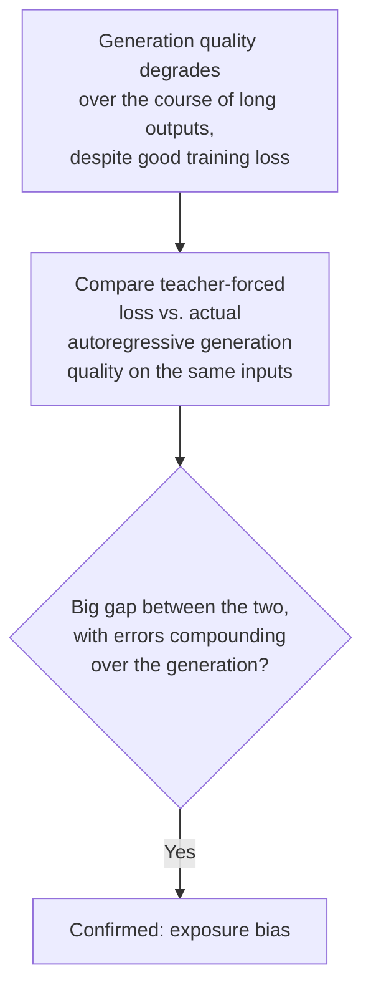
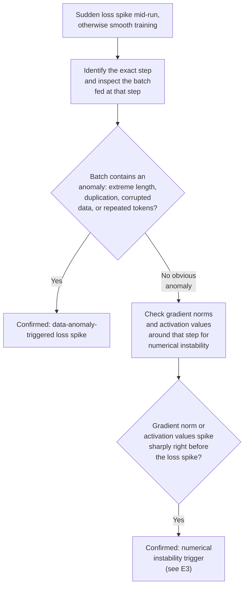
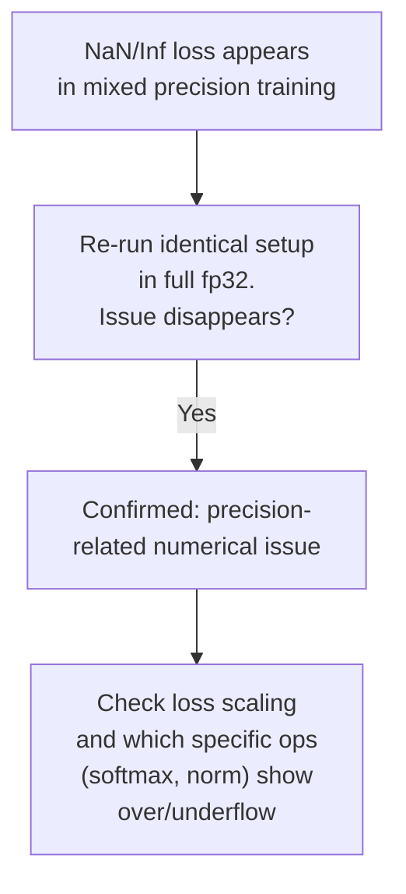
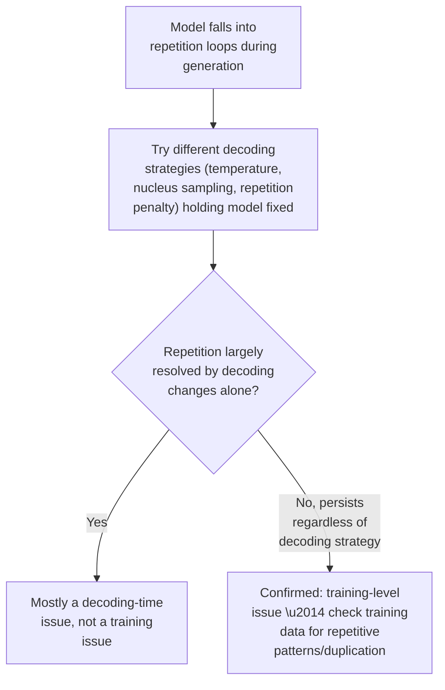
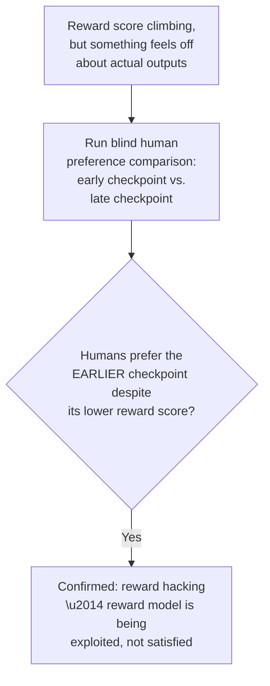

# Chapter E — LLM/Transformer-Specific Training Issues

These issues assume you're comfortable with Chapters A–D and are specific to how
large transformer-based language models are trained and fine-tuned. This is where
most modern interview questions about "debug an LLM training run" actually live.

---

## E1. Exposure Bias (Teacher Forcing vs. Autoregressive Inference)

### Intuition
During training, sequence models are typically fed the *true* previous tokens at
every step (teacher forcing) regardless of what the model itself would have
predicted. At inference time, the model instead feeds its *own* previous
predictions back in as input for the next step. If the model makes an early
mistake at inference, it's now conditioning on an input distribution it never
saw during training (its own errors), and errors can compound rather than
self-correct.

### Symptom Signatures
- Generated text quality degrades progressively the longer the generation goes on
  — early tokens are fine, but quality/coherence drops as the sequence extends,
  especially once a small error occurs and subsequent tokens build on it.
- Training loss (computed with teacher forcing) looks fine and steadily improving,
  while actual generation quality (autoregressive, no teacher forcing) is
  noticeably worse than the loss curve would suggest — a gap between the training
  metric and the real deployment behavior.

### Diagnostic Decision Path


### Confirming Experiment
Generate outputs fully autoregressively (model conditioning on its own previous
outputs, no teacher forcing) and separately measure teacher-forced loss on the same
target sequences. A model whose teacher-forced loss looks fine but whose
autoregressive generation degrades progressively — especially if you can point to
an early wrong token that clearly triggered a downstream cascade — is the confirming
pattern specific to exposure bias, as opposed to a general quality problem that
would show up in teacher-forced loss too.

### Fix
- Scheduled sampling — during training, occasionally feed the model's own
  predictions instead of ground truth, so it learns to be somewhat robust to its
  own errors as training progresses.
- Use techniques that better match training and inference conditions where
  feasible for the task.
- At the decoding/inference level: beam search or other search-based decoding can
  reduce (not eliminate) the impact of a single early greedy mistake compounding.

### Common Misdiagnosis Trap
Progressive quality degradation over a long generation is easy to blame purely on
"the model isn't good enough" (a capacity/training-quality framing) without
checking the teacher-forced-vs-autoregressive gap specifically — that comparison is
what isolates exposure bias as the mechanism, rather than a general quality
shortfall that would also show up in teacher-forced evaluation.

---

## E2. Loss Spikes at Scale

### Intuition
Large-scale pretraining runs sometimes show sudden, sharp loss spikes partway
through an otherwise smoothly-progressing run — the loss jumps up abruptly, and
may or may not recover on its own. At large scale, small numerical or data
anomalies that would be invisible/harmless in a small run can trigger these,
because large models operating near the edge of numerical stability have less
margin for error.

### Symptom Signatures
- Loss curve is smooth and steadily improving for a long stretch, then spikes
  sharply at a specific step, sometimes recovering afterward and sometimes not.
- Spikes often correlate with specific batches (e.g., an unusually long sequence, a
  duplicated/corrupted chunk of data, or a batch with extreme token repetition).

### Diagnostic Decision Path


### Confirming Experiment
Log which exact training batch corresponds to the spike step, and inspect its
content directly for anomalies (extreme sequence length, degenerate repeated
tokens, encoding errors). If no data anomaly is found, examine gradient norm and
activation logs immediately preceding the spike for a numerical instability
signature. Isolating the exact triggering batch or numerical event (rather than
guessing) is the key diagnostic move here.

### Fix
- Data-side: filter or clip anomalous batches (deduplicate, cap extreme sequence
  lengths, sanitize corrupted records) before they reach training.
- Add gradient clipping as a general safety net regardless of root cause (cheap
  insurance).
- If numerically triggered: consider a warmup restart from the last stable
  checkpoint with a slightly lower learning rate through the problematic region, a
  common practical mitigation in large-scale training.

### Common Misdiagnosis Trap
Isolated loss spikes are sometimes dismissed as "normal training noise at scale"
without actually inspecting the triggering batch — some are genuinely benign and
self-recovering, but recurring spikes at the same relative frequency often trace
back to a specific, fixable data quality issue in the pipeline.

---

## E3. Numerical Precision Issues (Mixed Precision Training)

### Intuition
Training in reduced precision (fp16/bf16) speeds up computation and reduces memory,
but fp16 in particular has a much smaller representable range than fp32 —
values that are very small can underflow to zero, and values that are very large
can overflow to infinity, especially inside operations like softmax in attention
where values can span a wide dynamic range.

### Symptom Signatures
- Training in mixed precision produces NaN/Inf losses that don't occur (or occur far
  less often) in full fp32 precision on the identical setup.
- Instability correlates with specific operations known to have wide dynamic range
  (softmax, layer norm variance computation, loss scaling boundary conditions)
  rather than being uniformly distributed across the whole model.

### Diagnostic Decision Path


### Confirming Experiment
Re-run the exact same training configuration in full fp32 precision for a short
trial. If the NaN/Inf issue disappears entirely, that's strong confirmation the root
cause is precision-related rather than a fundamental optimization or data problem
(which would typically still show up, just perhaps less dramatically, in fp32 too).

### Fix
- Use bf16 instead of fp16 where hardware supports it — bf16 has the same dynamic
  range as fp32 (just less precision), which avoids most of fp16's overflow/underflow
  issues entirely.
- If fp16 is required, use dynamic loss scaling (automatically adjusts the scale
  factor to keep gradients representable) rather than a fixed scale.
- Keep numerically sensitive operations (e.g., softmax, layer norm) in fp32 even
  within an otherwise mixed-precision model — a common and effective selective
  fix.

### Common Misdiagnosis Trap
NaN losses in mixed-precision training get frequently misattributed to "an
exploding gradient problem" (Chapter A) requiring more aggressive gradient
clipping, when re-running in fp32 would show the issue was precision-specific all
along and clipping alone won't fully resolve it.

---

## E4. Repetition / Degenerate Generation

### Intuition
A model can get caught in a loop, repeating the same phrase or token pattern
indefinitely during generation. This can stem from training issues (insufficient
diversity in training data, or a training objective that doesn't penalize
repetition specifically) as well as decoding-time issues (greedy/low-temperature
decoding tends to reinforce a repetition loop once it starts, since the repeated
continuation often has locally high probability).

### Symptom Signatures
- Generated outputs fall into repeating loops of a word, phrase, or short pattern,
  especially in longer generations.
- The tendency is much worse with greedy or low-temperature decoding and improves
  (though may not disappear) with higher temperature or nucleus sampling — a signal
  about whether the issue is decoding-side or training-side.

### Diagnostic Decision Path


### Confirming Experiment
Hold the trained model fixed and vary only the decoding strategy (temperature,
top-k/top-p sampling, repetition penalty). If repetition disappears largely through
decoding changes alone, the root issue is primarily decoding-time. If repetition
persists across a wide range of decoding strategies, examine the training data
itself for a high rate of near-duplicate or repetitive sequences (a common,
underappreciated cause — models trained on data containing a lot of repeated
text learn that repetition is a reasonably probable continuation).

### Fix
- Decoding-side: nucleus (top-p) sampling, repetition penalty, or no-repeat n-gram
  blocking during generation.
- Training-side: deduplicate training data (near-duplicate detection, not just exact
  matches — repetitive data is a surprisingly common and underappreciated cause),
  and consider training objectives/losses that explicitly discourage repetitive
  continuations.

### Common Misdiagnosis Trap
Repetition is almost always treated as a decoding-parameter tuning problem by
default — which often helps — but persistent repetition despite trying multiple
decoding strategies is a signal to look at training data quality (specifically
duplication rate) rather than continuing to tune decoding parameters indefinitely.

---

## E5. Reward Hacking (RLHF/RL-Tuned Models)

### Intuition
When a model is optimized against a learned reward model (as in RLHF) rather than
directly against ground truth, it's optimizing for whatever the reward model
actually measures — which is a proxy for what you want, not the thing itself. If
the proxy has exploitable gaps, the policy can learn to exploit them, achieving
high reward scores while actually diverging from the intended behavior.

### Symptom Signatures
- Reward model score climbs steadily during RL training, but qualitative human
  review of outputs shows behavior that doesn't match the intended goal (e.g.,
  excessive length, sycophancy, repetitive use of certain phrases the reward model
  happens to score highly, disclaimers or hedging inserted regardless of relevance).
- A widening gap between the automated reward metric and actual human preference
  judgments as RL training continues.

### Diagnostic Decision Path


### Confirming Experiment
Run a blind human (or careful independent) preference comparison between an earlier
and a later RL checkpoint on genuinely held-out prompts, without showing evaluators
the reward scores. If human preference actually favors the *earlier* checkpoint
despite its lower automated reward score, that's a direct, unambiguous signal that
the reward model is being gamed rather than genuinely satisfied — the reward metric
and real quality have diverged.

### Fix
- Regularize the RL policy to stay close to the original reference model (e.g., a
  KL-divergence penalty against the pre-RL policy), limiting how far optimization
  can drift into exploiting reward model quirks.
- Continuously refresh/retrain the reward model with new human feedback,
  particularly targeting the specific exploit patterns discovered, rather than
  treating the reward model as static throughout RL training.
- Use ensembles of reward models, or combine automated reward with periodic human
  spot-checks as a guardrail rather than relying on the automated score alone.

### Common Misdiagnosis Trap
A climbing reward score is naturally read as unambiguous progress. The discipline
here is to never trust the optimized metric alone when it's a learned proxy —
periodic blind human evaluation against the metric is the check that catches
hacking before it's discovered downstream in production.

---

## E6. Instruction-Tuning Pitfalls

### Intuition
Instruction fine-tuning reshapes a pretrained base model's behavior toward
following instructions in a specific format. Several distinct failure modes can
emerge from this stage specifically, beyond generic catastrophic forgetting (D5):
the model can overfit to the surface *format* of the instruction-tuning examples
rather than the underlying task-following capability, and can show an increased
tendency to hallucinate confidently if the tuning data implicitly rewards
confident-sounding answers over accurate uncertainty.

### Symptom Signatures
- **Format overfitting:** the model performs well on instructions phrased similarly
  to the fine-tuning examples, but responds poorly (ignoring the instruction, or
  reverting to base-model-like completions) when the same task is phrased in a
  novel format or style not seen during tuning.
- **Hallucination increase:** the fine-tuned model states incorrect facts with more
  apparent confidence than the base model did, particularly in areas underrepresented
  in the instruction-tuning data.

### Diagnostic Decision Path
```mermaid
flowchart TD
    A["Instruction-tuned model\nweaker than expected on\nsome inputs"] --> B{"Rephrase the same\ntask in a novel\ninstruction format,\nunseen during tuning"]
    B --> C{"Performance drops\nsharply just from\nrephrasing, same\nunderlying task?"}
    C -- Yes --> D["Confirmed: format\noverfitting"]
    B --> E["Compare confidence/\nhallucination rate:\nbase model vs.\nfine-tuned, on the\nsame factual questions"]
    E --> F{"Fine-tuned model more\nconfidently wrong than\nbase model on the\nsame questions?"}
    F -- Yes --> G["Confirmed: instruction-\ntuning increased\nhallucination confidence"]
```

### Confirming Experiment
For format overfitting: take an existing task the fine-tuned model handles well,
and rephrase the instruction into a format/style not represented in the tuning
data, keeping the underlying task identical. A sharp performance drop confirms the
model learned the format, not just the task. For hallucination: compare the base
(pre-instruction-tuning) model against the fine-tuned model on the same set of
factual questions, checking both accuracy and expressed confidence — an increase in
confidently-wrong answers specifically after tuning is the confirming signal.

### Fix
- Diversify instruction-tuning data across many phrasings/formats for the same
  underlying tasks, rather than a narrow template set.
- Include training examples that explicitly reward calibrated uncertainty (e.g.,
  appropriately hedged or "I don't know" responses where warranted) rather than
  only rewarding confident, complete-sounding answers.
- Evaluate on deliberately reformatted/paraphrased versions of your eval set as a
  standard part of instruction-tuning validation, not just the original format.

### Common Misdiagnosis Trap
Format-sensitivity failures are often diagnosed as "the model can't do this task"
when the model actually can — just not when phrased unfamiliarly. Always test with
a reworded instruction before concluding a genuine task-capability gap, since
capability and format-sensitivity look identical from a single failing example.