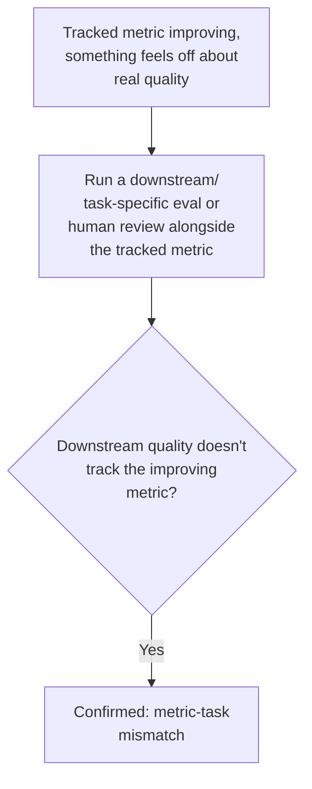
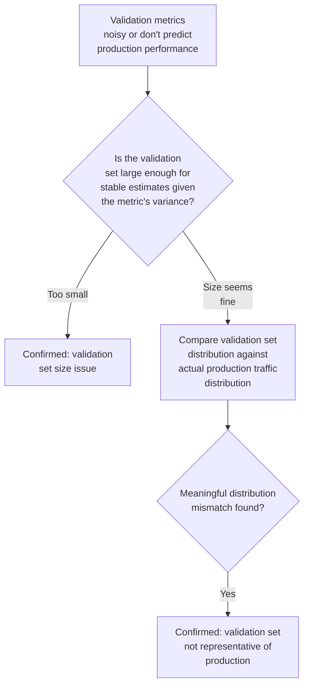

# Chapter F — Evaluation & Measurement Pitfalls

Short chapter, disproportionately important: sometimes the model is fine and the
*measurement* is lying to you. These are the issues most likely to be skipped
entirely by someone eager to jump straight to model fixes.

---

## F1. Metric-Task Mismatch

### Intuition
A metric is a proxy for what you actually care about. If the proxy diverges from
the real goal — a common example being perplexity (how well the model predicts
the next token statistically) not necessarily correlating with actual downstream
task quality (how useful/correct the generated output is for a real user) — you can
optimize and "improve" the metric while real-world quality stays flat or even
worsens.

### Symptom Signatures
- The tracked metric steadily improves during training/tuning, but qualitative
  review or a downstream task-specific evaluation shows no corresponding
  improvement (or a decline).
- Two models with very similar values on the tracked metric show a clear,
  noticeable quality difference to human reviewers.

### Diagnostic Decision Path

### Confirming Experiment
Run both the currently tracked metric and a task-specific or human-judged
evaluation on the same set of checkpoints across training. If the tracked metric
improves while the task-specific/human evaluation stays flat or diverges, that
divergence itself is the confirming evidence — the metric has stopped being a
useful proxy for what actually matters.

### Fix
- Identify or construct a metric (or human evaluation protocol) that more directly
  measures the actual downstream goal, and use it — at minimum alongside, ideally
  in place of — the proxy metric for model selection decisions.
- If a proxy metric must be used for practical reasons (e.g., cost, speed), validate
  periodically that it still correlates with the real goal on a held-out
  human-judged sample, rather than assuming the correlation holds indefinitely.

### Common Misdiagnosis Trap
Teams sometimes chase a metric long after it has stopped being a useful signal,
because it's the number that's easy to track automatically — the discipline is to
periodically sanity-check the metric against real quality, not just trust it by
default because it's quantitative.

---

## F2. Improper Validation Set Design

### Intuition
A validation set is only useful insofar as it represents the distribution you
actually care about performing well on. A validation set that's too small, drawn
from a narrow/unrepresentative slice, or accidentally correlated with the training
set (partial leakage) gives you a number that looks like ground truth but isn't
trustworthy.

### Symptom Signatures
- Validation metrics are noisy/unstable across similar training runs — different
  random seeds giving noticeably different validation scores, more than expected
  from genuine model variance (a signal the validation set may be too small).
- Validation performance doesn't predict actual production performance well —
  models that look best on validation don't consistently look best in production
  (a signal the validation distribution doesn't match production).

### Diagnostic Decision Path

### Confirming Experiment
Run the same training configuration with several different random seeds and
measure the spread of validation metric outcomes. A spread that's large relative to
typical reported model improvements suggests the validation set is too small or too
noisy to reliably distinguish models — a direct, quantifiable check rather than a
guess. Separately, compare validation set characteristics (topic, length, source)
against a recent production sample to check representativeness.

### Fix
- Increase validation set size if variance across seeds is too high relative to the
  differences you're trying to detect.
- Rebuild the validation set to be a genuinely representative sample of the
  real target distribution (stratified sampling from actual production traffic
  where possible), rather than a convenient but narrow slice.
- Report metric variance (e.g., across seeds or bootstrap resampling) alongside
  point estimates, so small differences aren't mistaken for real improvements.

### Common Misdiagnosis Trap
Small validation-set noise gets mistaken for genuine model improvement or
regression — a new checkpoint "beating" the previous one by a small margin on a
noisy validation set may just be noise, not a real difference. Always consider
whether the observed difference is larger than the set's inherent variance before
concluding anything changed.