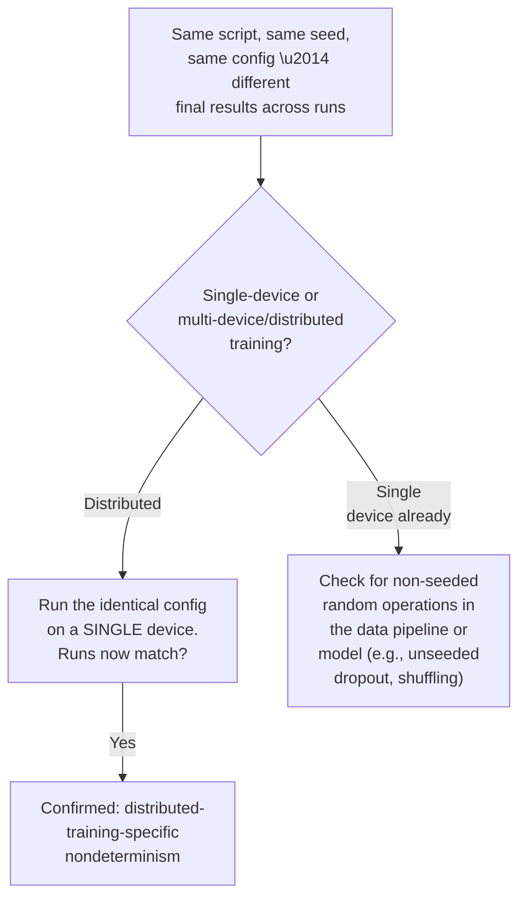
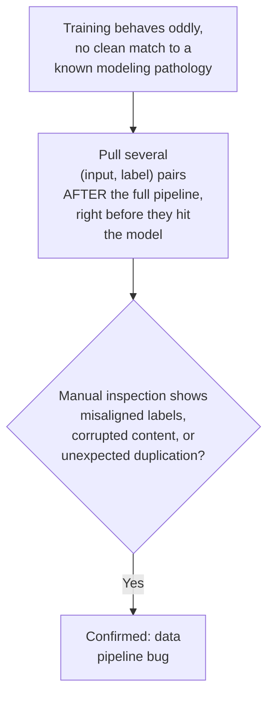
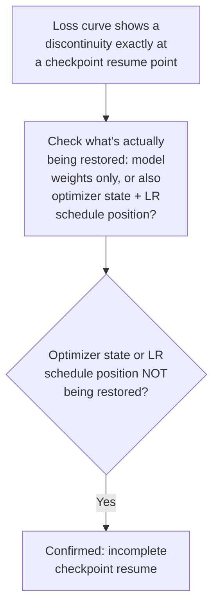

# Chapter G — Infra & Reproducibility Issues

The least glamorous chapter and the one most likely to be skipped when debugging —
which is exactly why interviewers sometimes love asking about it. Not every "model"
problem is a modeling problem; some are plumbing problems wearing a modeling
costume.

---

## G1. Non-Deterministic Training / Distributed Bugs

### Intuition
Distributed training (multiple GPUs/nodes) introduces sources of nondeterminism
that don't exist in single-device training: race conditions in gradient
synchronization, non-deterministic reduction order in floating-point summation
(which is not associative — summing the same numbers in a different order can give
a slightly different result), and asynchronous data loading across workers. Small
differences compound over a long training run into meaningfully different final
models.

### Symptom Signatures
- Rerunning the exact same training script, same seed, same data, same
  hyperparameters produces meaningfully different final metrics across runs.
- The divergence between runs grows over the course of training rather than staying
  at a tiny, negligible floating-point-level difference — small early differences
  compound.

### Diagnostic Decision Path

### Confirming Experiment
Run the identical configuration on a single device (no distributed training) with a
fixed seed multiple times. If single-device runs match exactly (or nearly exactly)
but multi-device runs diverge, that isolates the nondeterminism to the distributed
training mechanism specifically, rather than to the model or data pipeline itself.

### Fix
- Set deterministic flags/algorithms where the framework supports them (accepting
  the usual speed tradeoff), particularly for cases where exact reproducibility
  matters (debugging, research comparisons).
- Fix all relevant random seeds explicitly (data shuffling, dropout, initialization,
  and any augmentation) across all workers, not just a single global seed that
  doesn't propagate everywhere it needs to.
- For cases where perfect determinism isn't required in production, at minimum
  document and expect a normal variance range across runs, so it isn't repeatedly
  mistaken for a real regression each time (ties back to F2).

### Common Misdiagnosis Trap
Run-to-run variance in distributed training is sometimes mistaken for a real
regression introduced by a code change ("someone must have broken something"), when
comparing two runs from *before* any code change would show similar variance —
always establish the baseline noise floor before attributing a difference to a
specific change.

---

## G2. Data Pipeline Bugs

### Intuition
Bugs in the data loading/preprocessing pipeline — off-by-one errors misaligning
inputs and labels, a shuffle operation that doesn't actually randomize, silently
corrupted or truncated records, incorrect train/val split logic — corrupt what the
model is learning from, and look exactly like a modeling problem from the outside
because the loss curves and metrics are the only visible signal.

### Symptom Signatures
- Training behaves strangely in ways that don't match any known modeling
  pathology cleanly (e.g., loss that's suspiciously bounded at a specific
  value, or accuracy stuck near what random guessing would produce).
- Manually inspecting a handful of raw (input, label) pairs as they're actually fed
  to the model — not as stored in the source dataset, but post-pipeline — reveals a
  mismatch (wrong label attached to an input, corrupted/truncated content,
  duplicated records).

### Diagnostic Decision Path

### Confirming Experiment
This is one of the few issues where **direct inspection is the confirming
experiment** — pull a handful of examples exactly as they exist right before
entering the model (post-tokenization, post-augmentation, post-batching) and
manually verify input-label correspondence and content integrity by eye. Most
pipeline bugs are caught this way faster than through any statistical test.

### Fix
Fix the specific pipeline bug identified (correct the off-by-one, fix the shuffle
implementation, fix the split logic, add data validation/sanity checks that run
automatically before every training job as a standing safeguard against
recurrence).

### Common Misdiagnosis Trap
Odd training behavior gets attributed to the model/architecture/optimization far
more often than it gets attributed to the data pipeline, simply because the
pipeline is assumed to be correct without being directly inspected. A five-minute
manual spot-check of post-pipeline examples should be one of the very first steps
for any confusing training behavior, not a last resort.

---

## G3. Checkpoint/Resume Bugs

### Intuition
Resuming training from a checkpoint requires restoring not just model weights, but
also optimizer state (momentum buffers, Adam's running estimates), the learning
rate schedule's position, and the data loader's position in the dataset. Missing
any of these on resume silently puts training into a different, often worse,
effective state than if it had run continuously.

### Symptom Signatures
- A visible discontinuity in the loss curve exactly at the point where training was
  resumed from a checkpoint (a spike, a sudden slope change, or a reset-looking
  jump) — training before and after the resume point don't connect smoothly.
- Final performance after a resumed run is consistently worse than an otherwise
  identical run that never needed to stop/resume.

### Diagnostic Decision Path

### Confirming Experiment
Inspect the checkpoint save/load code directly to see exactly what state is
serialized and restored. If optimizer state or the learning rate schedule's step
counter is missing from the checkpoint (only model weights are saved/restored),
that's a direct, code-level confirmation — no need to infer it purely from loss
curve shape, though the discontinuity is a strong corroborating signal.

### Fix
Save and restore the complete training state on every checkpoint: model weights,
optimizer state, learning rate scheduler state, and the data loader's position
(epoch/step counter, and ideally the exact shuffling state) — not just model
weights alone. Test the resume path explicitly (stop and resume a short training
run deliberately) as part of standard pipeline validation, rather than only
discovering gaps when a real long-running job needs to resume.

### Common Misdiagnosis Trap
A loss discontinuity at a resume point is sometimes shrugged off as "normal
restart noise" rather than investigated, when it's often a clear, fixable signal of
incomplete state restoration — and left unfixed, it silently degrades every future
run that needs to resume from a checkpoint, not just the one where it was first
noticed.