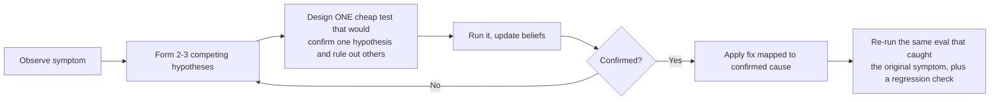

# ML Model Training Failure Modes — Debugging Field Notes

A study system for one purpose: when someone describes a symptom ("the model isn't
learning," "quality dropped at scale," "it forgets what it used to know"), you should
be able to **narrow down the cause through a short sequence of targeted checks** —
not recite a definition.

## How to use these notes

Every lesson follows the same six-part shape, on purpose — so that during real
debugging (or an interview), your brain jumps to the same checklist every time
instead of re-deriving it from scratch:

1. **Intuition** — the mental model, in one analogy or diagram. Skip this and
   everything after it is just memorized trivia.
2. **Symptom Signatures** — what you'd actually observe (loss curves, metrics,
   qualitative outputs) if this is the issue.
3. **Diagnostic Decision Path** — a small flowchart: given the symptom, what do you
   check first, second, third, to either confirm or rule this out.
4. **Confirming Experiment** — the one controlled test that proves it's *this* issue
   and not a lookalike.
5. **Fix** — mapped to the confirmed cause, not a generic bag of tricks.
6. **Common Misdiagnosis Trap** — what people wrongly blame instead, and why it's
   tempting. This is usually the difference between a junior and a senior answer.

The final chapter breaks this pattern deliberately: it gives you **only a symptom**,
the way a real interviewer or a real on-call page would, across multiple plausible
root causes. Try to reason through it yourself (cover the "Reasoning Walkthrough"
section) before reading the answer.

## Table of Contents

| Chapter | Focus | File |
|---|---|---|
| A | Optimization & Training Dynamics | `01-chapter-a-optimization-dynamics.md` |
| B | Data-Related Issues | `02-chapter-b-data-issues.md` |
| C | Architecture-Specific Issues | `03-chapter-c-architecture-issues.md` |
| D | Regularization & Generalization | `04-chapter-d-regularization-generalization.md` |
| E | LLM/Transformer-Specific Training Issues | `05-chapter-e-llm-transformer-specific.md` |
| F | Evaluation & Measurement Pitfalls | `06-chapter-f-evaluation-measurement.md` |
| G | Infra & Reproducibility Issues | `07-chapter-g-infra-reproducibility.md` |
| Capstone | Applied Debugging Scenarios (mixed, symptom-only) | `08-capstone-applied-debugging-scenarios.md` |

## Suggested reading order

Chapters A → D build on each other (optimization → data → architecture →
generalization are the classical ML training pipeline, in the order a bug would
typically enter it). Chapter E assumes you're comfortable with A–D and is where most
modern LLM-specific interview questions live. F and G are short but are exactly the
chapters people forget — "the model is fine, your evaluation or your infra is lying
to you" is a real and common answer.

Do the Capstone chapter last, and more than once — the value is in re-attempting the
scenarios cold after a few days, not just reading the answers once.

## A note on debugging philosophy (read this once, apply it everywhere)

Across every chapter, the same three-step discipline repeats:

The failure mode to avoid: jumping straight from symptom to fix ("loss isn't going
down → lower the learning rate") without a confirming test. It's often right by luck,
but it's not a debugging process, and it falls apart the moment two issues look
similar on the surface.