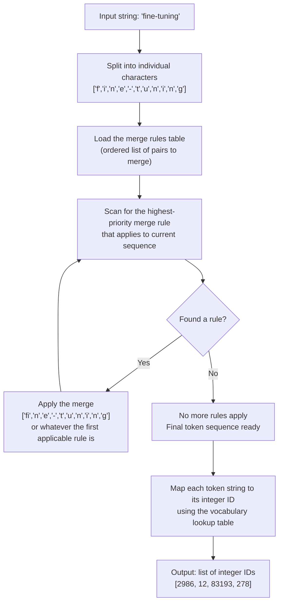
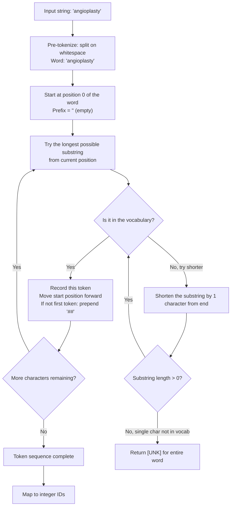
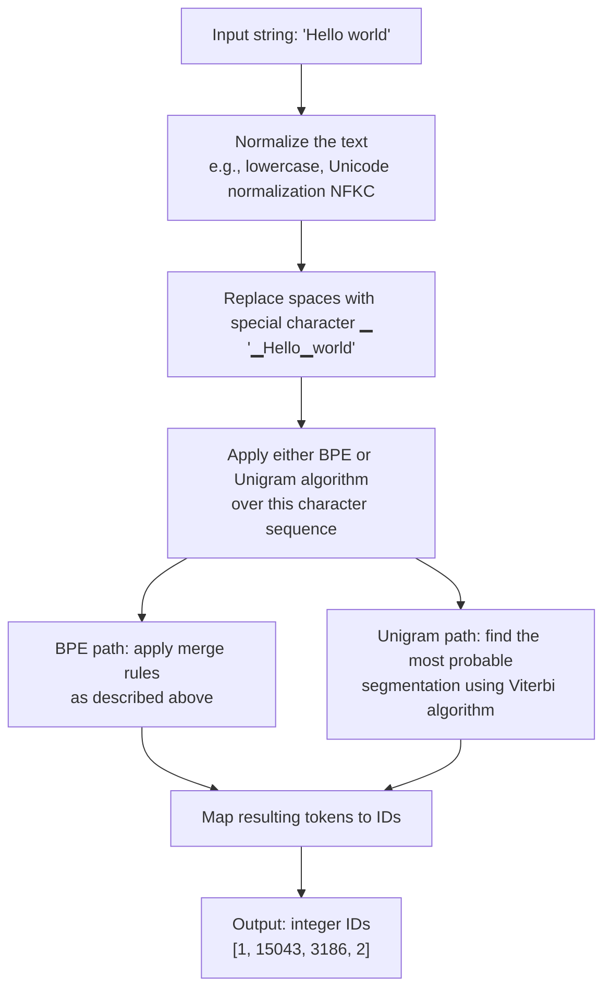
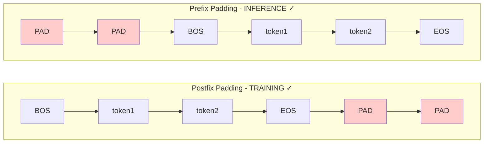
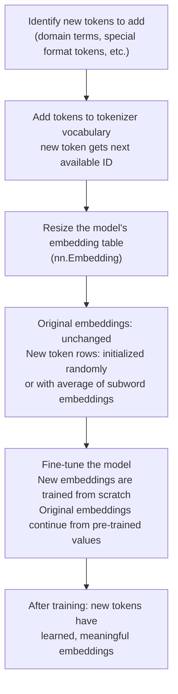
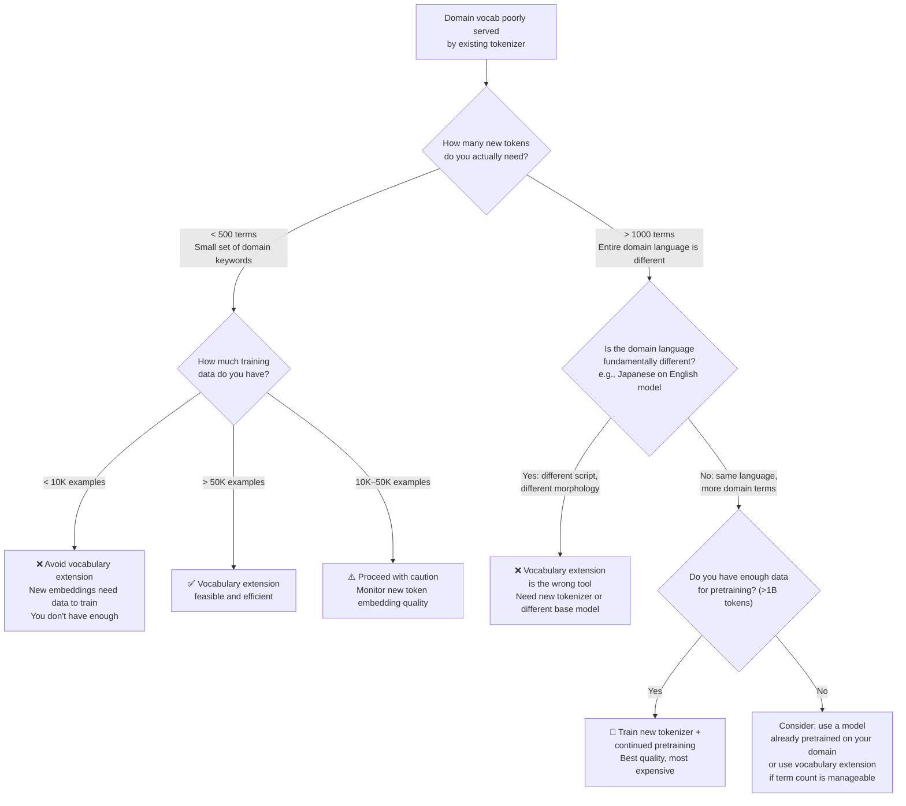

# Chapter 1 — Supplementary Notes
## Deep Dives: Tokenization Internals, Padding Strategy & Vocabulary Extension

> **How this file fits:** These are additional chunks that extend Chapter 1.
> Read them after completing Lesson 1.1 but before moving to Lesson 1.2.
> They go deeper on topics that Lesson 1.1 introduced but did not fully explain.

---

# Part A — How to Write Experiment Observations (Read This First)

Before anything else, we need to fix a structural gap from Chapter 1: the experiments had no observation framework. This section gives you a reusable format. Apply it to every experiment you run from now on — in this chapter and every chapter after.

---

## The Experiment Log Format

Every time you run an experiment, fill in this structure. It does not need to be long. It needs to be honest and specific.

```
════════════════════════════════════════════════════════
EXPERIMENT LOG
════════════════════════════════════════════════════════

ID:         [e.g., EXP-1.1.A]
Date:       [date you ran it]
Lesson:     [e.g., 1.1 — Tokenization]
Goal:       [one sentence — what were you trying to learn or observe?]

────────────────────────────────────────────────────────
SETUP
────────────────────────────────────────────────────────
Model / tokenizer used:
Dataset or input used:
Code change or variable you manipulated:

────────────────────────────────────────────────────────
RAW OBSERVATIONS  (just facts, no interpretation yet)
────────────────────────────────────────────────────────
[Write what you actually saw. Numbers, outputs, shapes.
 Do NOT interpret yet. Just describe.]

Example:
- "नमस्ते" produced 6 tokens: ['▁न', 'म', 'स', '्', 'त', 'े']
- "hello" produced 1 token: ['▁hello']
- Average tokens per example in Alpaca dataset: 47.3
- 12% of examples exceeded 512 tokens

────────────────────────────────────────────────────────
WHAT SURPRISED ME
────────────────────────────────────────────────────────
[Write anything that did not match your expectation.
 Even small surprises. Especially small surprises.
 "I expected X but got Y" is the most valuable sentence
 you can write in an experiment log.]

────────────────────────────────────────────────────────
INTERPRETATION  (now you explain what the observations mean)
────────────────────────────────────────────────────────
[Connect your raw observations to the concept you are studying.
 Why did you see what you saw?
 What does this tell you about how the system works?]

────────────────────────────────────────────────────────
IMPLICATIONS FOR FINE-TUNING
────────────────────────────────────────────────────────
[This column is required. Every observation must connect
 back to the goal: fine-tuning mastery.
 Ask yourself: "If I were about to start a fine-tuning project,
 what would this observation change about my decisions?"]

────────────────────────────────────────────────────────
OPEN QUESTIONS
────────────────────────────────────────────────────────
[Write questions this experiment raised that you have not
 answered yet. These become your next experiments or
 things to research. This is how real engineers think.]

────────────────────────────────────────────────────────
NEXT STEP
────────────────────────────────────────────────────────
[One concrete action based on what you learned.
 Could be: run another experiment, read a specific paper,
 try a different setting, or just "this confirms my
 understanding, move on."]

════════════════════════════════════════════════════════
```

---

## Filled Example: EXP-1.1.A — Token Efficiency Audit

Here is what a completed experiment log looks like for Experiment 1.1.A from Lesson 1.1. Use this as your reference for quality.

```
════════════════════════════════════════════════════════
EXPERIMENT LOG
════════════════════════════════════════════════════════

ID:         EXP-1.1.A
Date:       2025-06-15
Lesson:     1.1 — Tokenization
Goal:       Understand how token counts are distributed across the Alpaca
            dataset and how efficiently my tokenizer handles the data.

────────────────────────────────────────────────────────
SETUP
────────────────────────────────────────────────────────
Model / tokenizer:  microsoft/phi-3-mini-4k-instruct
Dataset:            tatsu-lab/alpaca, first 100 examples
                    (instruction + output concatenated)
Code change:        No variable manipulation — baseline audit

────────────────────────────────────────────────────────
RAW OBSERVATIONS
────────────────────────────────────────────────────────
- Average tokens per example: 113.4
- Min: 18 tokens, Max: 891 tokens
- Std deviation: 124.7  (very high — wide spread)
- 3% of examples exceeded 512 tokens
- 1% of examples exceeded 1024 tokens
- Top 3 most frequent tokens:
    '.' (period)  → 612 times
    '\n' (newline) → 441 times
    'the'         → 387 times
- Token-to-character ratio: approximately 1 token per 3.1 characters

────────────────────────────────────────────────────────
WHAT SURPRISED ME
────────────────────────────────────────────────────────
- I expected "the" to be the top token, but punctuation and
  newlines beat it. This makes sense in retrospect since
  instruction data has lots of list formatting.
- The standard deviation (124.7) is larger than the mean (113.4).
  This means the distribution is very skewed — most examples
  are short but a few are extremely long. I did not expect this.
- 1 token ≈ 3.1 characters is higher than I expected. I assumed
  closer to 4-5 characters per token from reading about BPE.

────────────────────────────────────────────────────────
INTERPRETATION
────────────────────────────────────────────────────────
The high standard deviation tells me that using a fixed max_length
of 512 would cut off ~3% of examples. If those long examples contain
important patterns, truncating them could hurt training.

The 1 token ≈ 3.1 character ratio for this English instruction
dataset is efficient. If I were fine-tuning on code or non-English
text, this ratio would likely be worse (more characters per token
for the same information content).

The dominance of punctuation and formatting tokens in the top 20
suggests the model will see a lot of structural tokens. If my
fine-tuning task has different structural patterns, I should check
whether the tokenizer handles my format's special characters well.

────────────────────────────────────────────────────────
IMPLICATIONS FOR FINE-TUNING
────────────────────────────────────────────────────────
1. For this dataset, max_length=512 is safe (only 3% truncated).
   I would use max_length=1024 to be conservative.

2. If fine-tuning on a multilingual or code dataset, I must redo
   this audit — the token counts could be 3-4x higher.

3. The high variance means packing (concatenating examples) would
   be efficient here — short examples waste a lot of padding space
   without packing.

────────────────────────────────────────────────────────
OPEN QUESTIONS
────────────────────────────────────────────────────────
- What does the token distribution look like for a Hindi dataset?
  How much worse is the token-to-character ratio?
- If I pack examples, how does it affect loss computation?
  (Do I need to mask cross-example attention? → check Chapter 3)
- The top tokens are generic. Are there task-specific tokens
  in the top 100 that reveal something about this dataset's domain?

────────────────────────────────────────────────────────
NEXT STEP
────────────────────────────────────────────────────────
Run the same audit on a Hindi dataset and a Python code dataset.
Compare the three token-to-character ratios side by side.
This will directly inform my max_length decisions in real projects.

════════════════════════════════════════════════════════
```

This is the standard. A log like this takes 15–20 minutes to write. It is not optional. It is where your learning actually happens — and it is the source of the "I experimented with this" stories you will tell in interviews.

---

---

# Part B — Limitations of BPE and WordPiece

---

## Why This Matters

Lesson 1.1 taught you what BPE and WordPiece are. But every design decision has tradeoffs. In practice, when you are:
- Choosing a base model to fine-tune for a specialized domain
- Debugging why your model produces garbled output on certain inputs
- Deciding whether you need vocabulary extension

...you need to know where these tokenizers *fail*, not just how they work when they succeed.

---

## Limitation 1: Vocabulary Bias Toward Pre-training Distribution

**What it is:**

BPE builds its vocabulary by merging the most frequent token pairs in the *training corpus*. WordPiece does the same with a likelihood criterion. The key word is: *training corpus*.

If the pre-training corpus was 90% English text, the resulting vocabulary will have efficient representations for English words and inefficient ones for everything else.

```
English word "running" → 1 token  (appears millions of times in training)
Hindi word "दौड़ना"   → 6 tokens  (appears rarely in training)
Python code "__init__" → 3 tokens  (moderate frequency)
Medical term "angioplasty" → 4-5 tokens
```

This is not a bug. It is a direct consequence of how frequency-based vocabulary building works. The tokenizer is most efficient at representing things that appeared most frequently in training.

**Why it hurts fine-tuning:**

1. **Sequence length blows up.** If a Hindi sentence takes 4x more tokens than its English equivalent, you can fit 4x fewer examples in each batch. Your training is less efficient for the same GPU memory and time.

2. **Meaning fragmentation.** When a domain-specific term like `angioplasty` gets split into `['ang', 'io', 'plas', 'ty']`, the model has to learn that these four meaningless pieces together represent a specific medical procedure. This is learnable but much harder than if it were one token.

3. **Morphological damage.** In agglutinative languages (Turkish, Finnish, Swahili, Hindi), words are built by attaching morphemes. BPE often splits these at arbitrary positions, not respecting morpheme boundaries. The model gets fragments that do not correspond to linguistic units.

```
Turkish: "evlerinizden" (from your houses) — 1 word, 1 meaning
BPE:     ["ev", "ler", "iniz", "den"]     — 4 tokens, morpheme boundaries respected here
         or
BPE:     ["evl", "erin", "izden"]          — arbitrary splits that break morpheme boundaries
```

---

## Limitation 2: Fixed Vocabulary Cannot Adapt to New Domains

**What it is:**

Once a tokenizer is trained and frozen, its vocabulary does not change. This means:

- New terminology invented after training is not in the vocabulary
- Domain-specific terms that were rare in pre-training data are fragmented
- Technical jargon, product names, scientific nomenclature — all treated as unknown combinations of subwords

**Examples of domain vocabulary mismatch:**

| Domain | Term | Likely tokenization |
|--------|------|---------------------|
| Medical | `metformin` | `['met', 'form', 'in']` |
| Legal | `indemnification` | `['ind', 'em', 'nif', 'ication']` |
| Finance | `EBITDA` | `['EB', 'IT', 'DA']` or character-by-character |
| Code | `__init__` | `['__', 'init', '__']` |
| Chemistry | `CH3COOH` | character-by-character |

For casual conversation, these fragmented representations are fine — the model rarely encounters them. For a medical fine-tuning task where `metformin` appears in every third sentence, this is a meaningful inefficiency.

---

## Limitation 3: Tokenization Inconsistency at Word Boundaries

**What it is:**

BPE is sensitive to surrounding context in an unexpected way. The same word can tokenize differently depending on what comes before it.

```python
tokenizer.encode("king")       → [4873]           # 1 token
tokenizer.encode(" king")      → [6249]            # different token ID!
tokenizer.encode("The king")   → [450, 6249]       # "king" with space prefix
tokenizer.encode("king of")    → [4873, 310]       # "king" without space prefix
```

The space before a word is often merged into the word token itself. This means `"king"` and `" king"` are different tokens, and the same word at the start vs middle of a sentence tokenizes differently.

This matters for fine-tuning because:
- Your data formatting (how you add spaces, newlines, tabs) affects tokenization
- A subtle formatting inconsistency between training data and inference prompt can cause different tokenizations of the same words
- The model sees a slightly different "picture" of the text

---

## Limitation 4: Numbers and Arithmetic are Poorly Handled

**What it is:**

BPE typically tokenizes numbers character by character or in small chunks:

```
"1234567" → ['1', '23', '456', '7']  or  ['123', '456', '7']
```

The tokenizer may have trained on "1234" as a single token but not "12345". There is no consistent tokenization for numbers. Each digit or small group is treated independently.

**Why this matters:**

Arithmetic and numerical reasoning require the model to understand positional value in numbers. If "1234" is tokenized as `['12', '34']` (two tokens), the model needs to learn that these together represent a four-digit number where "12" is the hundreds and "34" is the units. This is learnable but not efficient.

This is one reason LLMs historically struggle with arithmetic — the numerical representation is fragmented at the token level before the model even starts "thinking." Models like LLaMA-3 with larger vocabularies (128K tokens) can represent more numbers as single tokens, improving arithmetic slightly.

---

## Limitation 5: BPE is Greedy and Not Unique

**What it is:**

Standard BPE is a greedy algorithm — at each step it applies the highest-priority merge rule it finds, in order. This means the same string can technically have multiple valid tokenizations, but BPE always picks one deterministic path.

The problem: that deterministic path is not always the most linguistically meaningful one. BPE merges based on frequency in training data, which may split words at arbitrary positions that do not correspond to meaning-bearing units.

```
"misspelling" might become:
['miss', 'pelling']   — bad split, "pelling" is not a morpheme
['mis', 'spelling']   — better split, respects prefix "mis-"
```

BPE has no awareness of morphology or meaning. It just counts pairs.

---

## Limitation 6: WordPiece-Specific — The `##` Continuation Marker

**What it is:**

WordPiece uses `##` to mark tokens that are continuations of a word (not a new word). This is a design choice, not a flaw, but it has a specific limitation: **it requires pre-tokenization** (splitting on spaces first).

```
"fine-tuning" →
Step 1 (pre-tokenize on spaces): ["fine-tuning"]
Step 2 (WordPiece):              ["fine", "-", "##tun", "##ing"]
```

Because WordPiece needs to identify word boundaries first (to know where `##` should or should not appear), it depends on a whitespace-based word segmentation step before the actual subword tokenization.

**Why this is a limitation:**

- Languages without spaces (Chinese, Japanese written without spaces, some Thai writing) cannot use WordPiece's word-level pre-tokenization directly
- Code with unusual whitespace usage may pre-tokenize differently than intended
- This is why SentencePiece (and its use of `▁`) was developed — it treats the raw text as a character stream without needing a word-level pre-tokenization step

---

## Summary Table

```
┌─────────────────────────────┬──────────┬───────────┬───────────────┐
│ Limitation                  │ BPE      │ WordPiece │ SentencePiece │
├─────────────────────────────┼──────────┼───────────┼───────────────┤
│ Vocabulary bias to training │    ✗     │     ✗     │      ✗        │
│ data distribution           │          │           │               │
├─────────────────────────────┼──────────┼───────────┼───────────────┤
│ Fixed vocab, no adaptation  │    ✗     │     ✗     │      ✗        │
├─────────────────────────────┼──────────┼───────────┼───────────────┤
│ Space-sensitive tokenization│    ✗     │     ✗     │   Handled ✓   │
│ (same word, different token)│          │           │  (▁ prefix)   │
├─────────────────────────────┼──────────┼───────────┼───────────────┤
│ Poor number handling        │    ✗     │     ✗     │      ✗        │
├─────────────────────────────┼──────────┼───────────┼───────────────┤
│ Greedy, non-morphological   │    ✗     │  Better ✓ │    Better ✓   │
│ splitting                   │          │(likelihood)│(unigram LM)  │
├─────────────────────────────┼──────────┼───────────┼───────────────┤
│ Requires word pre-          │    No    │    Yes ✗  │     No ✓      │
│ tokenization                │          │           │               │
└─────────────────────────────┴──────────┴───────────┴───────────────┘
✗ = has this limitation    ✓ = handles better than alternative
```

---

---

# Part C — How BPE, WordPiece, and SentencePiece Work at Inference Time

---

## The Key Distinction: Training vs Inference for Tokenizers

When people say "training" in the context of tokenizers, they mean building the vocabulary — deciding which subwords get their own token IDs. This is a one-time process done before the language model is trained.

At **inference time** (when you tokenize input to feed to the model), the vocabulary is already built and frozen. The tokenizer is now just *applying* the rules to new text.

---

## BPE at Inference Time



**Step by step:**

1. Take the raw input string
2. Pre-tokenize: split on whitespace (and optionally punctuation) to get individual words
3. For each word: start with a sequence of individual characters
4. Load the merge table (this was built during tokenizer training, ordered by merge priority)
5. Apply merge rules greedily: scan for the highest-priority pair that exists in the current sequence, merge it, repeat
6. Stop when no more merge rules apply
7. Map each resulting subword string to its integer ID using the vocabulary dictionary

**The merge table is deterministic.** Given the same input, BPE always produces the same output. There is no randomness at inference time (unless you use BPE dropout, a regularization technique discussed below).

**What the merge table looks like (simplified):**

```
Priority 1:  ('t', 'h') → 'th'
Priority 2:  ('th', 'e') → 'the'
Priority 3:  ('i', 'n') → 'in'
Priority 4:  ('in', 'g') → 'ing'
...
Priority 8432: ('fin', 'e') → 'fine'
...
```

These rules were learned by counting pair frequencies in the training corpus during tokenizer training.

**BPE Dropout (bonus concept):**

A regularization technique where merge rules are randomly skipped during training with probability p. This means the same word gets tokenized differently on different training steps. The model becomes more robust to tokenization variations. This is only used during model training, not inference.

---

## WordPiece at Inference Time

WordPiece inference is different from BPE inference in an important way: **it uses a longest-match-first (greedy longest prefix) algorithm**, not the merge rule table approach.



**The difference from BPE:**

BPE starts from characters and builds up by applying merge rules. WordPiece starts from the full word and tries to greedily match the longest possible vocabulary entry, then handles the remainder.

**Example walkthrough:**

```
Word: "angioplasty"

Try: "angioplasty" → not in vocabulary
Try: "angioplas"   → not in vocabulary
Try: "angio"       → found! Record token "angio", remaining = "plasty"

Now remaining = "plasty" (with ## prefix for continuations)
Try: "##plasty"    → not in vocabulary
Try: "##plast"     → not in vocabulary
Try: "##plas"      → found! Record "##plas", remaining = "ty"

Now remaining = "ty"
Try: "##ty"        → found! Record "##ty"

Final tokens: ["angio", "##plas", "##ty"]
```

**The `[UNK]` handling:**

If any substring — even a single character — is not found in the vocabulary, WordPiece returns `[UNK]` for the entire word. This is rare in modern models (most have byte fallback), but in older BERT-style models it could happen for unusual Unicode characters.

---

## SentencePiece at Inference Time

SentencePiece is fundamentally different because it operates on the raw byte stream — there is no whitespace-based pre-tokenization step.



**The ▁ (underscore) character:**

This is the key innovation. SentencePiece encodes the space before a word as a special underscore character `▁` prepended to the token. This means:

```
"Hello world" → ["▁Hello", "▁world"]
"Hello" at start → ["▁Hello"]
"Hello" in middle → ["▁Hello"]
"hello" lowercase → ["▁hello"]  (different token!)
```

Unlike WordPiece's `##` suffix (which marks continuation tokens), SentencePiece's `▁` marks tokens that start with a space — i.e., tokens that begin a new word. This approach works for any language or script, including those without spaces.

**SentencePiece with Unigram Language Model:**

Many SentencePiece implementations use the Unigram algorithm instead of BPE. The difference at inference time:

- BPE inference: deterministic, apply merge rules in order
- Unigram inference: probabilistic — finds the segmentation that maximizes the product of token probabilities using the Viterbi algorithm (dynamic programming)

The Viterbi algorithm is the same algorithm used in Hidden Markov Models. It efficiently finds the sequence of tokens with the highest joint probability, considering all possible segmentations simultaneously.

```
"running" possible segmentations:
["running"]          → probability: 0.73
["run", "ning"]      → probability: 0.18
["runn", "ing"]      → probability: 0.07
["r", "un", "ning"]  → probability: 0.02

Viterbi picks: ["running"]  (highest probability)
```

This makes Unigram tokenization linguistically more principled than greedy BPE — it considers all possibilities and picks the globally optimal one, not just the locally greedy one.

**At inference, SentencePiece can also produce multiple segmentations (sampling):** like BPE dropout, SentencePiece supports sampling from the distribution of possible segmentations during training for regularization. At inference, it always uses the most probable (Viterbi) segmentation.

---

---

# Part D — Padding: Prefix vs Postfix (Left vs Right)

---

## Why Padding Exists

Neural networks process batches — multiple examples at once. To do this, all examples in a batch must have the same length. But natural text has variable length.

Padding solves this by adding a special `[PAD]` token to shorter sequences until they match the length of the longest sequence in the batch.

```
Example 1: "Hi"          → [BOS, 15, EOS]              → length 3
Example 2: "Hello there" → [BOS, 9906, 1070, EOS]      → length 4

After padding to length 4:
Example 1: [BOS, 15, EOS, PAD]
Example 2: [BOS, 9906, 1070, EOS]
```

The attention mask tells the model which positions are real (1) and which are padding (0):
```
Example 1 mask: [1, 1, 1, 0]
Example 2 mask: [1, 1, 1, 1]
```

---

## Postfix Padding (Right Padding)

**What it is:**

Padding tokens are added to the **right** (end) of the sequence.

```
"Hi"          → [BOS, 15, EOS, PAD, PAD]
"Hello there" → [BOS, 9906, 1070, EOS, PAD]
"A long sent" → [BOS, 362, 1472, 3265, EOS]
```

**When to use:**

Postfix padding is used for **training** in most fine-tuning scenarios.

**Why:** During training with causal language models (GPT-style), the model reads left to right. The loss is computed on the real tokens (before the padding). If PAD tokens are at the right, the loss computation (which shifts labels left by one) naturally avoids them — PAD positions can be masked with label=-100 (PyTorch's `ignore_index`).

```python
# In training, labels at PAD positions are set to -100
# Cross-entropy ignores positions where label == -100
labels = input_ids.clone()
labels[labels == tokenizer.pad_token_id] = -100
```

---

## Prefix Padding (Left Padding)

**What it is:**

Padding tokens are added to the **left** (beginning) of the sequence.

```
"Hi"          → [PAD, PAD, BOS, 15, EOS]
"Hello there" → [PAD, BOS, 9906, 1070, EOS]
"A long sent" → [BOS, 362, 1472, 3265, EOS]
```

**When to use:**

Prefix padding is used for **inference/generation**.

**Why this matters critically:**

In autoregressive generation, the model generates tokens starting from the last real position in the sequence. With postfix padding during generation:

```
Postfix-padded at inference: [BOS, "Hello", "world", PAD, PAD]
                                                        ↑
                           Model generates starting here — but this is a PAD token position!
```

The model would start generating from the wrong position — it sees PAD tokens and tries to continue from them.

With prefix padding:
```
Prefix-padded at inference: [PAD, PAD, BOS, "Hello", "world"]
                                                              ↑
                          Model generates starting here — correct!
```

The real content is always at the right end of the sequence. Generation always starts after the last real token, regardless of how much padding was added to the left.



---

## The Tradeoffs

| Aspect | Postfix (Right) Padding | Prefix (Left) Padding |
|--------|------------------------|----------------------|
| **Generation** | ❌ Broken — model generates from wrong position | ✅ Correct — model generates from last real token |
| **Training** | ✅ Natural — PAD tokens at end, easily masked | ⚠️ Works but less natural for causal LMs |
| **Loss computation** | ✅ Easy to mask with label=-100 | ✅ Also maskable but requires care |
| **Attention mask** | ✅ Straightforward | ✅ Straightforward |
| **KV cache efficiency** | ✅ Real tokens fill left part of cache | ⚠️ Padding occupies left part of cache |
| **Batch generation** | ❌ Problematic | ✅ Works correctly |

---

## How HuggingFace Handles This

The `transformers` library handles padding side via the tokenizer:

```python
# For training:
tokenizer.padding_side = "right"  # default for most tokenizers

# For inference/generation:
tokenizer.padding_side = "left"
```

**This is a common source of bugs.** If you forget to switch padding_side when going from training to inference, your batch generation will produce incorrect results. The first example in the batch (which typically has the most padding) will be affected most severely.

```python
# Example of the correct pattern in a training script
tokenizer.padding_side = "right"
train_dataset = tokenize_function(raw_dataset)

# When running batch inference after training:
tokenizer.padding_side = "left"
outputs = model.generate(batch_inputs)
```

---

## Flash Attention and Padding

A practical note for when you reach Chapter 4 and 5: Flash Attention (the optimized attention kernel used in modern fine-tuning) handles padding slightly differently. Flash Attention can use "variable length" mode, which processes each example in the batch as if it has no padding — this is more efficient but requires the sequences to be packed in memory. The details of this will be covered when we reach gradient checkpointing and memory optimization.

---

---

# Part E — Vocabulary Extension

---

## What Is Vocabulary Extension?

Vocabulary extension is the process of adding new tokens to an existing tokenizer's vocabulary while keeping all the original tokens intact. The new tokens are then added as new rows in the model's embedding table, initialized with random or computed vectors.

Before understanding when to do this, you need to understand why you might want to.

---

## Why Vocabulary Extension Exists: The Problem It Solves

Consider fine-tuning LLaMA-3 for a chemistry application. The model was trained on general internet text. Chemistry terminology appears infrequently in that corpus.

Without vocabulary extension:
```
"methylenedioxymethamphetamine" → 12 tokens (each fragment meaningless alone)
```

With vocabulary extension (after adding chemistry terms):
```
"methylenedioxymethamphetamine" → 1 token (model can learn a single embedding for this concept)
```

For a model that will see this term in hundreds of thousands of training examples, having a dedicated embedding for it could improve efficiency and potentially quality.

---

## How Vocabulary Extension Works



**The code:**

```python
from transformers import AutoTokenizer, AutoModelForCausalLM

tokenizer = AutoTokenizer.from_pretrained("meta-llama/Meta-Llama-3-8B")
model = AutoModelForCausalLM.from_pretrained("meta-llama/Meta-Llama-3-8B")

# Add new tokens
new_tokens = ["<|medical|>", "<|diagnosis|>", "metformin", "angioplasty"]
num_added = tokenizer.add_tokens(new_tokens)
print(f"Added {num_added} tokens")

# Resize model's embedding table
# Old size: (32000, 4096) → New size: (32004, 4096)
model.resize_token_embeddings(len(tokenizer))

print(f"Embedding table shape: {model.model.embed_tokens.weight.shape}")
# → torch.Size([32004, 4096])
```

**Initialization of new token embeddings:**

By default, `resize_token_embeddings` initializes new embeddings randomly (small random values). A smarter strategy:

```python
import torch

# Initialize new token embedding as average of its subword tokens
# Example: initialize "metformin" embedding as average of
# embeddings for ["met", "form", "in"]
def initialize_new_token(model, tokenizer, new_token, subwords):
    new_token_id = tokenizer.convert_tokens_to_ids(new_token)
    subword_ids = tokenizer.convert_tokens_to_ids(subwords)

    # Get embeddings of the subwords
    subword_embeddings = model.model.embed_tokens.weight[subword_ids]

    # Average them
    avg_embedding = subword_embeddings.mean(dim=0)

    # Set as initialization for new token
    with torch.no_grad():
        model.model.embed_tokens.weight[new_token_id] = avg_embedding

initialize_new_token(model, tokenizer, "metformin", ["met", "form", "in"])
```

This gives the new token a more informed starting point than pure random initialization — it starts with a meaning close to the combination of its parts, which should train faster.

---

## The Central Decision: Vocabulary Extension vs Retrain Tokenizer

This is where real judgment is required. You have two options when your domain has vocabulary that is poorly served by the existing tokenizer:

**Option A: Vocabulary Extension**
Add new tokens to the existing tokenizer, resize the embedding table, and fine-tune.

**Option B: Train a New Tokenizer + Retrain the Model**
Build a new tokenizer on your domain data, resize/replace the entire embedding table, and fine-tune the model — effectively doing continued pre-training with a new vocabulary.

---

## Decision Framework



---

## When to Use Vocabulary Extension

Use vocabulary extension when **all** of these are true:

**1. The new vocabulary set is small and well-defined**

You know exactly which terms matter and can enumerate them. This is common in:
- Adding special format tokens for a chat format (`<|system|>`, `<|user|>`, `<|assistant|>`)
- Adding domain entity markers (`<company>`, `</company>`)
- A controlled set of technical terms (100–500 terms)

If you cannot enumerate the vocabulary cleanly, vocabulary extension is the wrong tool.

**2. You have enough training data to learn the new embeddings**

New token embeddings are initialized randomly or from subword averages. The model has never seen these tokens before — there is no pre-trained knowledge to fall back on. Training a meaningful embedding from scratch requires the token to appear thousands of times in your training data.

Rule of thumb: each new token should appear at least 1,000–5,000 times in your training corpus. If you have 100 new tokens and your dataset has 10,000 examples where each token appears maybe 50 times, the new embeddings will not train meaningfully.

**3. The underlying language structure is the same**

You are working in the same language (or a language well-represented in the tokenizer). The fundamental grammar, morphology, and vocabulary structure matches what the tokenizer was built for.

**4. The existing tokenizer's handling of the new terms is actually a problem**

Run the token efficiency audit (EXP-1.1.A) on your domain data. How many tokens does the average domain-specific term take? If domain terms take 2–3 tokens on average, vocabulary extension may not be worth the complexity. If they take 6–10 tokens each and these terms appear constantly, the inefficiency is real.

---

## When NOT to Use Vocabulary Extension — Use a Different Base Model or Retrain

**Do NOT use vocabulary extension when:**

**1. The domain language is fundamentally different**

If you are building a Japanese model on top of a primarily English LLaMA, vocabulary extension is not the solution. A single Japanese sentence uses hundreds of characters that are either absent from the vocabulary or covered by a character-level fallback. You need either:
- A model pre-trained on Japanese (e.g., Japanese-LLaMA, Qwen for Chinese)
- A completely new tokenizer trained on your language + continued pre-training

Adding a few hundred Japanese tokens as vocabulary extension while the rest of the Japanese vocabulary is still fragmented gives you the worst of both worlds.

**2. You do not have enough training data**

If you have fewer than 10,000 training examples and want to add 200 new tokens, each new token will appear on average 50–100 times in training. This is not enough to train meaningful embeddings from scratch. The new tokens will likely converge to poor representations, and the model may actually perform worse than using the fragmented subword representations.

In this scenario: just use the existing tokenizer with its inefficient subword representations. The model can still learn; it just needs to see the pattern enough times.

**3. You need maximum quality and have the resources**

If you have millions of domain-specific documents (say, a medical records corpus of 1 billion tokens), the right answer is:
1. Train a new tokenizer on your domain data (SentencePiece or BPE trained specifically on medical text)
2. Initialize the model with the pre-trained weights, mapping old token embeddings to new tokens using the subword averaging trick
3. Do continued pre-training on your domain data with the new tokenizer
4. Then do task-specific fine-tuning

This is what models like BioGPT, CodeLlama, and MedPaLM do — they start from a general model but adapt the vocabulary and pre-training to the domain. It is expensive but produces the best results.

---

## The Trade-off Summary

| | Vocabulary Extension | New Tokenizer + Retrain |
|-|---------------------|------------------------|
| **Compute cost** | Low (only fine-tuning) | Very High (continued pretraining) |
| **Data requirement** | Medium (1K+ appearances per token) | Very High (1B+ tokens) |
| **Quality gain** | Moderate | High |
| **Complexity** | Medium | Very High |
| **When it works well** | Small, enumerable term set | Entire domain language differs |
| **Risk** | Poor new embeddings if data is small | Catastrophic forgetting if not done carefully |

---

## Practical Code: Checking If Vocabulary Extension Is Worth It

Run this before deciding to extend vocabulary:

```python
from transformers import AutoTokenizer
from collections import defaultdict
import numpy as np

tokenizer = AutoTokenizer.from_pretrained("microsoft/phi-3-mini-4k-instruct")

# Your domain-specific terms
domain_terms = [
    "metformin", "angioplasty", "myocardial", "infarction",
    "hypertension", "cardiomyopathy", "echocardiogram"
]

print("Domain Vocabulary Audit")
print("=" * 60)

token_counts = []
for term in domain_terms:
    # Encode without special tokens to see raw subword count
    ids = tokenizer.encode(term, add_special_tokens=False)
    tokens = tokenizer.convert_ids_to_tokens(ids)
    token_counts.append(len(ids))
    print(f"  '{term}'")
    print(f"    Tokens ({len(ids)}): {tokens}")
    print()

avg_tokens = np.mean(token_counts)
print(f"Average tokens per domain term: {avg_tokens:.1f}")

if avg_tokens <= 2.5:
    print("→ Tokenizer handles domain terms reasonably well.")
    print("  Vocabulary extension likely not worth the complexity.")
elif avg_tokens <= 4.0:
    print("→ Moderate fragmentation. Consider vocabulary extension")
    print("  if these terms appear very frequently in your data.")
else:
    print("→ High fragmentation. Vocabulary extension likely beneficial")
    print("  IF you have sufficient training data (1K+ per new token).")
```

---

## A Note on Special Format Tokens

One valid and low-risk use of vocabulary extension is adding special format tokens that do not exist in the tokenizer:

```python
# Common legitimate use: add custom chat format tokens
special_tokens = {
    "additional_special_tokens": [
        "<|im_start|>", "<|im_end|>",
        "<|system|>", "<|user|>", "<|assistant|>"
    ]
}
tokenizer.add_special_tokens(special_tokens)
model.resize_token_embeddings(len(tokenizer))
```

These tokens:
- Have well-defined roles (not domain vocabulary, but structural markers)
- Appear in every training example (easy to learn)
- Often only need the model to learn "start generating after this token" or "stop here"

The embedding for a structural token does not need to encode rich semantic meaning — it just needs to reliably trigger the right behavior. This is achievable even with moderate amounts of data (10,000+ examples).

---

---

# Summary of This Supplementary File

| Part | Key Takeaway |
|------|-------------|
| A — Experiment Log | Every experiment gets a written log. Observations → interpretation → implications → next step. Use the format every time. |
| B — BPE/WordPiece Limitations | Vocabulary bias, fixed vocab, space sensitivity, number fragmentation, greedy splitting. Know the failure modes before the interview. |
| C — Inference Mechanics | BPE = apply merge rules greedily. WordPiece = longest prefix match with `##`. SentencePiece = optional Viterbi + ▁ instead of space pre-tokenization. |
| D — Padding | Right padding for training. Left padding for inference/generation. Forgetting to switch is a real bug. |
| E — Vocabulary Extension | Add tokens for small, enumerable sets with sufficient data. Use different base model or retrain tokenizer for fundamentally different domains. |

---

*This file is a supplement to Chapter 1, Lesson 1.1.*
*Read it before moving to Lesson 1.2.*
*Experiment log format applies to all experiments in all future chapters.*