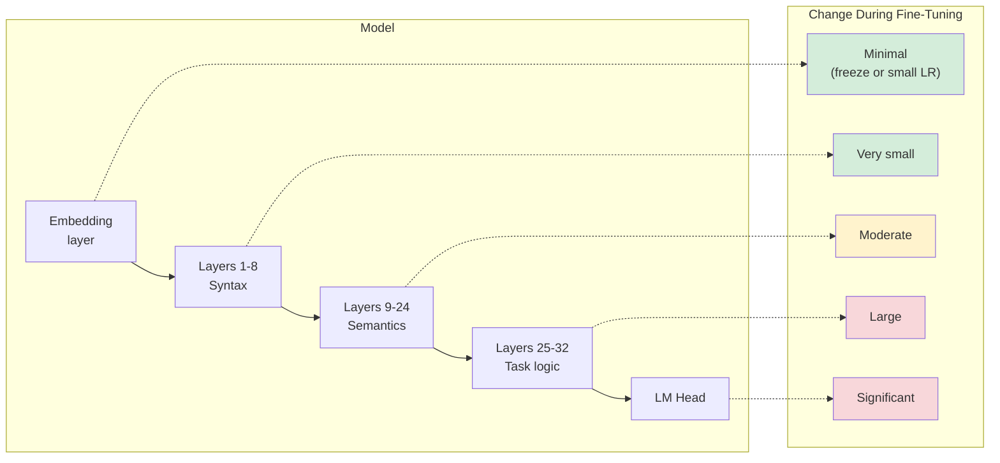

# Lesson 2.3 — What Weights Actually Change During Fine-Tuning
### Chapter 2: What Fine-Tuning Actually Does to a Model

---

## The Problem Story

Nikhil trained a LLaMA-2 7B model for customer support in the fintech domain. It worked beautifully in testing. Three months later, he added more fine-tuning data and retrained. The model started making spelling mistakes and mixing in unrelated topics.

What happened? He fine-tuned too aggressively without enough regularization. The model "forgot" things it learned during the first fine-tuning. This is catastrophic forgetting — and it does not just destroy previous fine-tuning. Done badly enough, it can destroy pre-trained capabilities too.

His second mistake: he assumed the model was uniformly updating all layers equally during fine-tuning. He had no mental model for where the changes were concentrated or why. If he had, he would have known to freeze certain layers and use a much lower learning rate.

This lesson gives you that mental model.

---

## The Concept

### What is "Stored" in Each Part of the Network?

Before understanding what changes during fine-tuning, you need to know what is stored where.

**Embedding layer:**
Stores a learned vector representation for each token. Each row in the embedding table is the model's compressed "understanding" of that token's meaning based on every context it appeared in during pre-training.

During fine-tuning: usually kept frozen or updated very slightly. The embedding table contains fundamental linguistic knowledge about tokens. Drastically changing it would break the model's understanding of language.

**Early transformer layers (layers 1–8 in a 32-layer model):**
Research consistently shows early layers encode low-level syntactic features:
- Part-of-speech patterns (is this word a noun? a verb?)
- Sentence structure (is this the start of a clause?)
- Token-level co-occurrence patterns

These are domain-agnostic — grammar works the same way in medical text as in legal text. Early layers barely change during fine-tuning unless you are doing something fundamentally different from what the model pre-trained on.

**Middle layers (layers 9–24 approximately):**
These handle semantic relationships:
- Entity recognition (what type of thing is this?)
- Coreference resolution (what does "it" refer to?)
- Basic factual associations

During fine-tuning for domain adaptation, these layers change more as the model learns domain-specific semantic relationships.

**Late layers (layers 25–32 in a 32-layer model):**
These handle the most task-specific processing:
- Task format and structure
- Output generation patterns
- High-level reasoning for the specific task

Late layers change the most during fine-tuning. When you fine-tune a model to follow instructions, the behavioral changes concentrate here.

**LM head:**
The final projection from hidden states to vocabulary probabilities. During task-specific fine-tuning, this layer adapts significantly to the output distribution of your task.



---

### The FFN as a Factual Memory Store

A 2022 paper "Locating and Editing Factual Associations in GPT" (Meng et al.) demonstrated empirically what researchers had hypothesized: factual associations are stored primarily in the **feed-forward network (FFN) layers** of middle-to-late transformer layers.

They showed that the association "The Eiffel Tower is in Paris" could be localized to specific MLP layers and weight values. Editing those weights changed the model's factual beliefs.

**Implications for fine-tuning:**

If you want your model to learn new factual knowledge about your domain, you need the FFN weights to update. If you apply LoRA only to attention matrices (q_proj, v_proj) and freeze FFN layers, you may successfully change the model's behavior and output format but struggle to implant new factual knowledge.

For many fine-tuning tasks (instruction following, style adaptation), updating attention is sufficient. For tasks requiring deep domain factual knowledge, targeting FFN layers as well is important.

---

### Catastrophic Forgetting: The Core Problem

**What it is:**

Catastrophic forgetting (also called catastrophic interference) is when a neural network "forgets" previously learned capabilities as it learns new ones. The gradient updates that push the model toward the new task simultaneously push it away from the representations required for the old task.

**Why it happens:**

Neural networks store knowledge in weight values. When you update weights to minimize loss on new data, you are moving the weights away from the values that were optimal for the old data. The parameters that were encoding "how to do task A" are now encoding something different.

**In the fine-tuning context, catastrophic forgetting has two forms:**

1. **Forgetting pre-trained knowledge:** Fine-tuning on a narrow domain causes the model to lose general capabilities — math reasoning, common knowledge, language fluency in non-domain text. The more aggressive the fine-tuning (higher LR, more epochs, smaller dataset), the more this happens.

2. **Forgetting earlier fine-tuning:** If you fine-tune a model in two stages (stage 1: general instruction following, stage 2: domain-specific), stage 2 can partially overwrite what stage 1 taught. This is the "continual learning" problem.

**Why it matters in interviews:**

A common interview question is: "How do you prevent catastrophic forgetting during fine-tuning?" Having a concrete answer shows you understand the optimization dynamics, not just the API.

---

### How to Mitigate Catastrophic Forgetting

**Method 1: Low learning rate**

The smaller the weight updates, the less the model deviates from pre-trained representations. This is the simplest and most important mitigation.

Rule: Use the lowest learning rate that still produces meaningful task improvement within your training budget.

**Method 2: PEFT methods (LoRA, QLoRA)**

By freezing the base model weights and only training adapter layers, PEFT inherently prevents catastrophic forgetting of the base model. The frozen weights cannot change. This is one of the key advantages of LoRA beyond just memory efficiency.

However: LoRA can still cause catastrophic forgetting of one fine-tuning in a second fine-tuning (if the second fine-tuning replaces the adapter from the first).

**Method 3: Regularization techniques**

- **Elastic Weight Consolidation (EWC):** Computes which weights were most important for the original task and adds a regularization term that penalizes changing those weights. Elegant in theory, expensive to compute at scale.

- **L2 regularization toward the pre-trained model:** Instead of penalizing weight magnitude (standard weight decay), penalize deviation from the pre-trained weights:

```
loss_total = loss_task + λ × ||W - W_pretrained||²
```

This keeps the fine-tuned weights close to the pre-trained initialization. Computationally cheap and often effective.

**Method 4: Data mixing**

Mix your fine-tuning data with a small percentage of general-purpose data from the pre-training distribution. This ensures the model continues to "practice" general capabilities even as it learns the new task.

Common ratio: 5–10% general data in fine-tuning batches.

**Method 5: Layer freezing**

Freeze early layers entirely. Only update middle and late layers. This preserves the fundamental linguistic representations stored in early layers while allowing behavioral adaptation in later layers.

```python
# Freeze the first N layers
for i in range(8):  # freeze first 8 layers
    for param in model.model.layers[i].parameters():
        param.requires_grad = False
```

---

### Weight Initialization: Why Starting from Pre-Trained Weights is Powerful

When you fine-tune, you start from the pre-trained weights, not from random initialization.

**What this gives you:**

The pre-trained model has already solved the hard problems:
- It understands language structure (syntax, morphology)
- It has world knowledge (facts, relationships)
- It can reason to some degree
- Its weights are in a region of the loss landscape where useful representations exist

Fine-tuning just needs to navigate from this good starting point to a slightly different point that is better for your task.

**The alternative (training from scratch):**

Starting from random weights means solving all of those problems from scratch with your (tiny by comparison) dataset. A fine-tuning dataset of 10,000 examples cannot teach a model to understand language — pre-training on trillions of tokens did that. Fine-tuning leverages all of that previous learning.

**The mathematical view:**

The pre-trained weights represent a point in the loss landscape that has very low loss on the pre-training distribution. Fine-tuning moves the weights from this point to another point with low loss on your task distribution. The key insight from empirical research is that these two points are relatively close in weight space — you do not need to travel far. This is why fine-tuning works with small datasets and low learning rates.

---

### Measuring What Actually Changed

After fine-tuning, you can quantitatively measure which weights changed most:

```
change_magnitude(layer) = ||W_finetuned - W_pretrained|| / ||W_pretrained||
```

This relative change ratio tells you which layers the gradient was most active in. In practice, you consistently observe:
- Early layers: change ratio < 0.001 (very small)
- Middle layers: change ratio 0.001–0.01
- Late layers: change ratio 0.01–0.1
- LM head: change ratio up to 0.5 in some tasks

This is not just an academic observation. It informs decisions like: if you are doing a very different task that requires large behavioral changes, you may need more epochs and a slightly higher LR for later layers. If early layers are changing a lot, something is wrong — your LR might be too high.

---

## The Intuition Bridge

**Pre-trained weights as a mountain pass:**

Pre-training is like climbing a mountain range and discovering a high pass — a position where the terrain (loss) is locally low and you can see clearly in all directions (general capabilities). This took enormous effort (trillions of tokens, months of compute).

Fine-tuning is like setting up camp near this pass and making small exploratory trips in the direction of a specific valley (your task). You don't need to re-climb the mountain — you just take measured steps from the pass.

Catastrophic forgetting is what happens when you hike too far in one direction — you descend into your task valley but can no longer see the pass you came from (you've lost the general capabilities).

**Layer depth as abstraction level:**

Early layers see the raw signal — the pixel-level details of language (which words appear, what characters they use). Late layers see the abstract meaning — what is this conversation about, what is the intent, what should I produce next.

Fine-tuning targets the abstract levels (late layers) for task adaptation while leaving the signal-processing levels (early layers) untouched. This is why you can teach a model to be a customer service agent without re-teaching it English.

---

## Why This Matters for Fine-Tuning

**LoRA target module selection becomes principled:**

Now that you know late layers change more and FFN stores factual knowledge while attention handles routing — you can reason about which modules to include in LoRA. For behavioral adaptation (output format, response style): attention matrices in later layers. For factual domain knowledge: include FFN matrices (gate, up, down projections) especially in middle-to-late layers.

**Hyperparameter choices become reasoned:**

Low learning rate prevents catastrophic forgetting. More epochs on a small dataset risks forgetting. Layer freezing can protect fundamental linguistic capabilities. These are not arbitrary choices — they follow directly from understanding what weights store what.

**Debugging becomes possible:**

If fine-tuning causes the model to lose math reasoning, you now know why: the weight changes in the layers encoding mathematical reasoning patterns exceeded the beneficial changes from your task data. The fix is reducing LR, adding math data to your training mix, or using PEFT to freeze the base model entirely.

---

## The Code

```python
import torch
from transformers import AutoModelForCausalLM, AutoTokenizer
from peft import get_peft_model, LoraConfig, TaskType
import copy

model_name = "microsoft/phi-3-mini-4k-instruct"
tokenizer = AutoTokenizer.from_pretrained(model_name)
tokenizer.pad_token = tokenizer.eos_token

model = AutoModelForCausalLM.from_pretrained(
    model_name,
    torch_dtype=torch.float32,
    device_map="auto"
)

# ── 1. Save a snapshot of pre-trained weights ───────────────────

pretrained_weights = {}
for name, param in model.named_parameters():
    pretrained_weights[name] = param.data.clone()

print(f"Saved {len(pretrained_weights)} pre-trained weight tensors")

# ── 2. Run a few gradient steps (simulate fine-tuning) ──────────

from torch.optim import AdamW

optimizer = AdamW(model.parameters(), lr=5e-5)
model.train()

training_texts = [
    "In machine learning, gradient descent is a first-order optimization algorithm.",
    "Transformers revolutionized natural language processing through attention mechanisms.",
    "Fine-tuning adapts pre-trained language models to downstream tasks.",
]

for text in training_texts:
    inputs = tokenizer(text, return_tensors="pt").to(model.device)
    outputs = model(**inputs, labels=inputs["input_ids"])
    loss = outputs.loss
    optimizer.zero_grad()
    loss.backward()
    torch.nn.utils.clip_grad_norm_(model.parameters(), max_norm=1.0)
    optimizer.step()

print(f"Completed {len(training_texts)} training steps")

# ── 3. Measure weight changes per layer ─────────────────────────

print("\n── Weight Change Analysis ──")
print(f"{'Layer Component':<50} {'Relative Change':>15}")
print("-" * 70)

layer_changes = {}
for name, param in model.named_parameters():
    if name in pretrained_weights:
        diff = (param.data - pretrained_weights[name]).abs()
        relative_change = (diff.mean() / pretrained_weights[name].abs().mean()).item()
        layer_changes[name] = relative_change

# Sort by layer index to see pattern
import re
def layer_sort_key(name):
    match = re.search(r'layers\.(\d+)', name)
    return int(match.group(1)) if match else -1

sorted_changes = sorted(layer_changes.items(), key=lambda x: layer_sort_key(x[0]))

# Print selected layers to see pattern
prev_layer = -1
for name, change in sorted_changes:
    match = re.search(r'layers\.(\d+)', name)
    layer_num = int(match.group(1)) if match else -1

    # Print first occurrence of each layer, and embedding/lm_head
    if layer_num != prev_layer or layer_num == -1:
        if "embed" in name or "lm_head" in name:
            print(f"{name:<50} {change:>14.8f}")
        elif "q_proj" in name:
            print(f"Layer {layer_num:2d} q_proj                              {change:>14.8f}")
        elif "mlp.gate_proj" in name:
            print(f"Layer {layer_num:2d} mlp.gate_proj                        {change:>14.8f}")
        prev_layer = layer_num

# ── 4. Which component changed most within one layer? ───────────

print("\n── Component-level change in Layer 15 (middle) vs Layer 30 (late) ──")
for layer_idx in [0, 15, 30]:
    try:
        layer = model.model.layers[layer_idx]
        components = {
            "q_proj": layer.self_attn.q_proj.weight,
            "k_proj": layer.self_attn.k_proj.weight,
            "v_proj": layer.self_attn.v_proj.weight,
            "o_proj": layer.self_attn.o_proj.weight,
            "gate_proj": layer.mlp.gate_proj.weight,
            "up_proj": layer.mlp.up_proj.weight,
            "down_proj": layer.mlp.down_proj.weight,
        }
        print(f"\nLayer {layer_idx}:")
        for comp_name, weight in components.items():
            key = f"model.layers.{layer_idx}.self_attn.{comp_name}.weight"
            if "mlp" in comp_name:
                key = f"model.layers.{layer_idx}.mlp.{comp_name}.weight"
            if key in pretrained_weights:
                diff = (weight.data - pretrained_weights[key]).abs().mean()
                rel = diff / pretrained_weights[key].abs().mean()
                bar = "█" * min(int(rel.item() * 10000), 30)
                print(f"  {comp_name:<12}: rel_change={rel.item():.8f}  {bar}")
    except (IndexError, AttributeError):
        pass

# ── 5. Demonstrate layer freezing ──────────────────────────────

print("\n── Layer Freezing ──")
# Freeze first 8 layers
for i in range(min(8, len(model.model.layers))):
    for param in model.model.layers[i].parameters():
        param.requires_grad = False

total = sum(p.numel() for p in model.parameters())
trainable = sum(p.numel() for p in model.parameters() if p.requires_grad)
frozen = total - trainable

print(f"Total parameters:    {total:,}")
print(f"Trainable:           {trainable:,} ({100*trainable/total:.1f}%)")
print(f"Frozen:              {frozen:,} ({100*frozen/total:.1f}%)")

# ── 6. L2 regularization toward pre-trained weights ─────────────

print("\n── L2 Regularization Toward Pre-trained Weights ──")
# This is the custom loss term that prevents catastrophic forgetting
lambda_reg = 0.01

# Re-enable all gradients
for param in model.parameters():
    param.requires_grad = True

inputs_reg = tokenizer("Language models are trained on text.",
                        return_tensors="pt").to(model.device)
outputs_reg = model(**inputs_reg, labels=inputs_reg["input_ids"])
task_loss = outputs_reg.loss

# Regularization term: penalize deviation from pre-trained weights
reg_loss = torch.tensor(0.0, device=model.device)
for name, param in model.named_parameters():
    if name in pretrained_weights:
        pt_weight = pretrained_weights[name].to(param.device)
        reg_loss += ((param - pt_weight) ** 2).mean()

total_loss = task_loss + lambda_reg * reg_loss
print(f"Task loss:           {task_loss.item():.4f}")
print(f"Regularization loss: {(lambda_reg * reg_loss).item():.4f}")
print(f"Total loss:          {total_loss.item():.4f}")
```

---

## The Experiment

**EXP-2.3.A — Layer-by-Layer Change Heatmap**

Run the weight change analysis from the code above. Then build a visualization of which layers changed most.

```python
# After running the code above, build this visualization:
import matplotlib.pyplot as plt
import numpy as np

# Collect per-layer average relative change for attention and FFN separately
num_layers = len(model.model.layers)
attn_changes = []
ffn_changes = []

for i in range(num_layers):
    try:
        attn_names = [
            f"model.layers.{i}.self_attn.q_proj.weight",
            f"model.layers.{i}.self_attn.v_proj.weight",
        ]
        ffn_names = [
            f"model.layers.{i}.mlp.gate_proj.weight",
            f"model.layers.{i}.mlp.down_proj.weight",
        ]

        attn_change = np.mean([
            (model.state_dict()[n] - pretrained_weights[n]).abs().mean().item()
            / pretrained_weights[n].abs().mean().item()
            for n in attn_names if n in pretrained_weights
        ])
        ffn_change = np.mean([
            (model.state_dict()[n] - pretrained_weights[n]).abs().mean().item()
            / pretrained_weights[n].abs().mean().item()
            for n in ffn_names if n in pretrained_weights
        ])
        attn_changes.append(attn_change)
        ffn_changes.append(ffn_change)
    except:
        attn_changes.append(0)
        ffn_changes.append(0)

# Plot
fig, axes = plt.subplots(2, 1, figsize=(14, 6))
x = range(num_layers)
axes[0].bar(x, attn_changes, color='steelblue', alpha=0.8)
axes[0].set_title('Attention Weight Change by Layer')
axes[0].set_xlabel('Layer Index')
axes[0].set_ylabel('Relative Change')
axes[1].bar(x, ffn_changes, color='darkorange', alpha=0.8)
axes[1].set_title('FFN Weight Change by Layer')
axes[1].set_xlabel('Layer Index')
axes[1].set_ylabel('Relative Change')
plt.tight_layout()
plt.savefig('layer_change_heatmap.png', dpi=150)
print("Saved: layer_change_heatmap.png")
```

Fill your experiment log. Key questions to answer in your log:
- Do early layers change less than late layers? How much less?
- Do attention weights or FFN weights change more?
- What does this tell you about which layers are most "plastic" (changeable) during fine-tuning?

---

## Interview Checkpoint

**Q: What is catastrophic forgetting and how do you prevent it during fine-tuning?**

> A: Catastrophic forgetting is when fine-tuning on a new task causes the model to lose previously learned capabilities. It happens because gradient updates that push weights toward the new task simultaneously move them away from the representations needed for the old task. Prevention strategies: (1) Low learning rate — smaller updates mean less displacement from pre-trained representations. (2) PEFT methods like LoRA — by freezing the base model, you cannot overwrite pre-trained knowledge; the adapters learn task-specific behavior on top of the frozen base. (3) L2 regularization toward pre-trained weights — adding a penalty term that penalizes deviation from the initial weights. (4) Data mixing — including a fraction of general-purpose data in fine-tuning batches so the model continues to practice general capabilities. In practice, LoRA with a reasonable learning rate is the most common solution because it addresses forgetting and memory efficiency simultaneously.

**Q: Which layers change the most during fine-tuning, and what does that tell you?**

> A: Late layers (closer to the output) change most during fine-tuning, and early layers change least. This reflects what each layer stores: early layers encode low-level syntactic patterns that are domain-agnostic, while late layers handle task-specific reasoning and output generation. The practical implication is that if you need to save compute or reduce forgetting, freezing early layers loses very little fine-tuning performance but significantly reduces the parameter count being updated. Research also shows that FFN layers in the middle-to-late range store factual knowledge, while attention matrices handle routing and relational reasoning — so the choice of which components to target with LoRA should depend on whether you need behavioral adaptation (attention) or factual knowledge injection (FFN as well).

**Q: Why does starting from pre-trained weights make fine-tuning possible with small datasets?**

> A: The pre-trained model has already learned the fundamental structure of language through exposure to trillions of tokens — grammar, common sense, world knowledge, reasoning patterns. Fine-tuning does not need to re-learn these. It only needs to adapt the model's behavior toward the specific task, which requires much less data. Empirically, the fine-tuned weights are relatively close to the pre-trained weights in parameter space, which means the optimization problem is much simpler: you start in a good region of the loss landscape and only need to take small steps toward a nearby task-specific region.

---

## Common Mistakes & Misconceptions

❌ **"All layers change equally during fine-tuning."**
Early layers change minimally; late layers change significantly. This is not a random pattern — it reflects the hierarchical nature of representations in deep networks. Understanding this informs which layers to freeze, which to target with LoRA, and what learning rate to use.

❌ **"Catastrophic forgetting only matters for sequential learning."**
Catastrophic forgetting can happen within a single fine-tuning run. If you use too high a learning rate or train for too many epochs on a small dataset, the model can "forget" pre-trained capabilities even on the first fine-tuning. It is not limited to the scenario where you fine-tune multiple times.

❌ **"PEFT completely prevents catastrophic forgetting."**
PEFT prevents forgetting of the frozen base model. But if your deployment system loads the fine-tuned adapter and you later train a second adapter on the same base, the second adapter can interfere with the first. PEFT prevents forgetting of pre-trained weights; it does not automatically prevent forgetting between successive fine-tuning runs.

❌ **"The LM head is not important in fine-tuning."**
The LM head (the final projection to vocabulary probabilities) is often one of the highest-change components during fine-tuning. It directly controls the output distribution. For tasks with specific output patterns (JSON, structured text, domain vocabulary), the LM head adapts significantly. Freezing it would directly harm task-specific output quality.