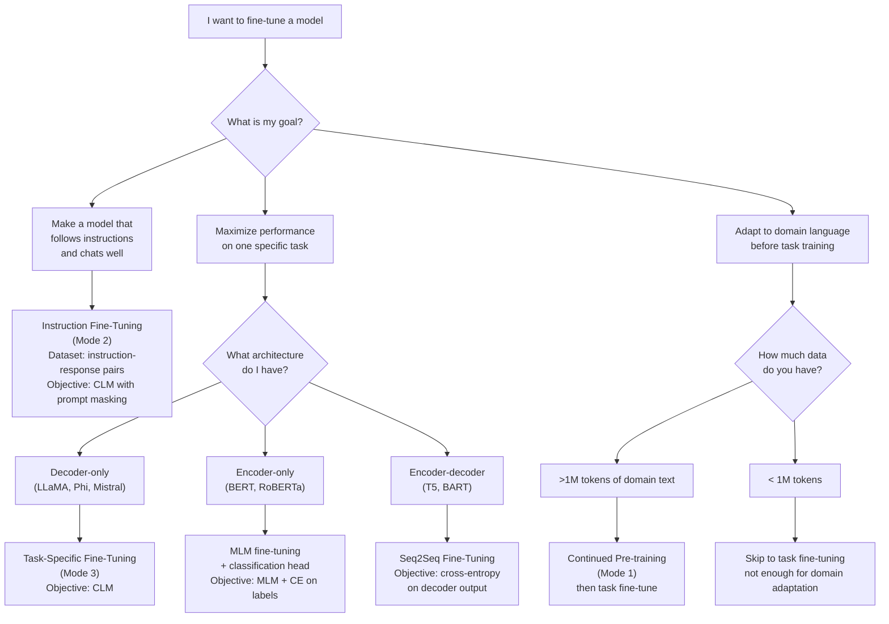

# Lesson 2.4 — Types of Fine-Tuning Objectives
### Chapter 2: What Fine-Tuning Actually Does to a Model

---

## The Problem Story

Arun's team was fine-tuning a model to classify customer emails into five categories. His colleague suggested using a BERT-style model with a classification head. Arun argued for using a decoder-only GPT-style model and fine-tuning it to generate the category label as text.

Both were technically valid. But neither of them could explain why one would be better for this use case, what the actual difference in the training objective was, or what would happen if you applied the wrong objective to the wrong model type.

Then a different question came up: should they do task-specific fine-tuning, or continued pre-training on their email domain first, then task-specific fine-tuning? They had no framework to decide.

This lesson gives you a clear map of what the different fine-tuning objectives are, what each one does, and when to use which.

---

## The Concept

### The Two Fundamental Model Architectures

Before the objectives, you need to understand the two model architectures because the training objective is different for each.

**Encoder-only (BERT-style):**

The model reads the entire input bidirectionally — each token attends to all other tokens in both directions. There is no autoregressive generation. The model produces a hidden representation of the input.

```
Input:  [CLS] "The cat sat on the" [MASK] [SEP]
           ↕       ↕      ↕    ↕     ↕     ↕
        [All tokens attend to all other tokens bidirectionally]
           ↓
Output: hidden representation at each position
```

Used for: classification, NER, question answering (extractive), sentence similarity.

**Decoder-only (GPT-style):**

The model reads input left to right with causal masking — each token can only attend to previous tokens. The model generates the next token autoregressively.

```
Input:  "The cat sat on the"
        [token 1 sees only itself]
        [token 2 sees tokens 1-2]
        [token 3 sees tokens 1-3]
           ↓
Output: probability distribution over next token at each position
```

Used for: text generation, instruction following, chat, code generation.

**Encoder-decoder (T5-style):**

Two stacks. The encoder reads the full input bidirectionally. The decoder generates the output autoregressively, attending to both its own previous outputs (causal) and the full encoder output (cross-attention).

```
Input (encoder):  "Translate to French: The cat sat"
                  [bidirectional attention over full input]
                       ↓
Output (decoder): "Le chat" → "s'est" → "assis" → [EOS]
                  [causal attention + cross-attention to encoder]
```

Used for: translation, summarization, question answering (generative).

---

### Objective Type 1: Causal Language Modeling (CLM)

This is the standard fine-tuning objective for decoder-only models like LLaMA, Phi, Mistral, GPT.

**The objective:**

At every position, predict the next token. Loss is cross-entropy between predicted probability distribution and the one-hot true next token.

```
Input sequence: [t₁, t₂, t₃, t₄, t₅]

Predictions:
  Position 1: P(t₂ | t₁)
  Position 2: P(t₃ | t₁, t₂)
  Position 3: P(t₄ | t₁, t₂, t₃)
  Position 4: P(t₅ | t₁, t₂, t₃, t₄)

Loss = average cross-entropy over all positions
```

Every token is both input and label (shifted by one position). No special annotation is needed — any text sequence is a valid training example.

**What CLM fine-tuning teaches:**

The model learns the joint probability distribution of your training sequences. It becomes better at generating text that looks like your training data, completing sentences in your domain's style, and producing outputs in your data's format.

**Data format for CLM:**

```python
# For pure language modeling (domain adaptation):
text = "The patient presented with acute myocardial infarction..."

# Tokenize and use as both input and label
inputs = tokenizer(text, return_tensors="pt")
labels = inputs["input_ids"].clone()
# Loss computed at all positions
```

---

### Objective Type 2: Masked Language Modeling (MLM)

Used for encoder-only models (BERT, RoBERTa, DeBERTa).

**The objective:**

Randomly mask some percentage (typically 15%) of input tokens. Predict the masked tokens given all other tokens (including those to the right of the mask).

```
Original: "The cat sat on the mat"
Masked:   "The cat [MASK] on the mat"

Model must predict: "sat" using context from both sides
```

**What MLM learns:**

Deep bidirectional representations of text. Because the model sees both left and right context, it learns rich semantic relationships that are better for understanding tasks (classification, NER) than for generation.

**Why MLM is better for encoding than CLM:**

CLM can only see the left context when processing each token. Its representations of a token encode "everything that comes before this token." MLM sees both sides, so its representations encode "what this token means in this full context" — richer for understanding but impossible to use for generation (you would need to know the right context before generating it).

**Data format for MLM:**

```python
from transformers import DataCollatorForLanguageModeling

# The data collator handles masking automatically
collator = DataCollatorForLanguageModeling(
    tokenizer=tokenizer,
    mlm=True,
    mlm_probability=0.15  # mask 15% of tokens
)

# Input is regular text; masking is applied dynamically during training
```

**When to use MLM fine-tuning:**

- You are working with a BERT-style model and want to adapt it to your domain
- Your task is classification, NER, similarity — not generation
- You want to improve domain understanding before fine-tuning on the classification head

MLM fine-tuning on domain text is called **domain-adaptive pre-training (DAPT)** in the BERT world.

---

### Objective Type 3: Sequence-to-Sequence (Seq2Seq)

Used for encoder-decoder models (T5, BART, Flan-T5).

**The objective:**

The encoder reads the full input, the decoder generates the target output token by token.

```
Encoder input: "Summarize: [long document text]"
Decoder target: "The document discusses..."
```

Loss is computed only on the decoder's output tokens. The encoder input is never the target.

**What Seq2Seq fine-tuning teaches:**

A mapping from input sequences to output sequences. The model learns to transform the input into a specific output, not just to continue it.

**Data format:**

```python
# Seq2Seq uses separate input and target
encoding = tokenizer(
    text="Summarize: " + article_text,
    target=summary_text,
    return_tensors="pt",
    max_length=512,
    max_target_length=128,
)
```

**When to use Seq2Seq:**

- Translation
- Summarization where input and output are structurally distinct
- When you want a clean separation between "reading" (encoder) and "writing" (decoder)

---

### The Three Modes of Fine-Tuning (Not Objective Types, But Strategy Types)

These are distinct from the objective type (CLM/MLM/Seq2Seq). They describe *what you are teaching the model to do*, not how the loss is computed.

**Mode 1: Continued Pre-training (Domain Adaptation)**

You continue the pre-training objective (CLM or MLM) on your domain data without structured input-output pairs.

```
Data format: raw domain text (no instruction-response structure)
             "The patient's echocardiogram revealed ejection fraction of 35%..."
             "Dosing of metformin should be adjusted for renal function..."
Objective: CLM on raw text
Goal: teach the model the vocabulary, style, and factual patterns of your domain
When: you have large amounts of unlabeled domain text (>1M tokens)
      and the domain is quite different from pre-training distribution
```

This is done before task-specific fine-tuning in a two-stage pipeline:
1. Continued pre-training: learn domain language
2. Task-specific fine-tuning: learn to perform tasks in that domain

Models like BioGPT, CodeLlama, and LegalBERT were created this way.

**Mode 2: Instruction Fine-Tuning (Behavioral Alignment)**

Teaching the model to follow natural language instructions in a conversational format.

```
Data format: instruction-response pairs in chat template
User:      "Explain gradient descent in simple terms"
Assistant: "Gradient descent is an optimization algorithm..."
Objective: CLM with loss masking on instruction tokens
Goal: teach the model to understand instructions and produce helpful responses
When: you want to make a base model into a chat/assistant model
```

This is what turns a raw "base model" into a "chat model" or "instruct model." The Alpaca, Vicuna, and OpenHermes datasets were created for this purpose.

**Mode 3: Task-Specific Fine-Tuning**

Teaching the model to perform a specific, well-defined task with a fixed input-output structure.

```
Data format: specific input format → specific output format
Input:  "Classify: [customer email text]"
Output: "COMPLAINT" or "INQUIRY" or "BILLING_ISSUE" etc.

Input:  "[medical note] Extract: medications"
Output: "metformin 500mg, lisinopril 10mg"
Objective: CLM with loss only on the output portion
Goal: maximize performance on one specific task
When: you have labeled data for a well-defined task
```

---

### Choosing the Right Mode: A Decision Framework



---

### What Changes in Data Format Between Modes

The same underlying text can be formatted very differently depending on the mode:

**Raw text (Mode 1 — continued pre-training):**
```
"Metformin is a biguanide antihyperglycemic agent used in the management of type 2 diabetes mellitus. It reduces hepatic glucose production..."
```
No structure. Just the domain text. Loss computed over everything.

**Instruction format (Mode 2 — instruction fine-tuning):**
```
<|system|>You are a medical information assistant.
<|user|>What is metformin used for?
<|assistant|>Metformin is used to manage type 2 diabetes mellitus. It works primarily by reducing hepatic glucose production...
```
Structured with roles. Loss only on `<|assistant|>` portion.

**Task format (Mode 3 — task-specific):**
```
Drug: metformin
Indication: [MODEL PREDICTS THIS]
```
Minimal structure. Fixed schema. Loss only on the prediction portion.

The same underlying knowledge (what metformin does) appears in all three formats. The difference is what the model is being trained to do with that knowledge.

---

## The Intuition Bridge

**Think of the three modes as different types of training programs:**

**Continued pre-training** is immersion. You drop the model into your domain and let it absorb everything — vocabulary, writing style, common concepts, even subtle domain norms. No explicit instruction. Like learning a new language by living in the country.

**Instruction fine-tuning** is etiquette school. The model already speaks the language. Now you teach it how to behave in conversation — how to respond to requests, maintain a helpful tone, follow format expectations. Like training a new employee on customer service norms.

**Task-specific fine-tuning** is job training. The employee already knows the language and has good manners. Now you drill them on one specific skill — filling out a specific form, classifying a specific type of document, answering questions in a specific format. Like training someone specifically for intake processing at a hospital.

Real production systems often combine all three:
1. Start with a base model (pre-trained on general internet text)
2. Domain adaptation: continued pre-training on domain text
3. Instruction tuning: teach instruction following behavior
4. Task-specific tuning: optimize for the exact task

Each stage builds on the previous one. You should not skip stage 2 if your domain is very different from internet text, and you should not skip stage 3 if you need reliable instruction following before task training.

---

## Why This Matters for Fine-Tuning

**Choosing the wrong mode wastes data:**

If you have 500K tokens of raw medical text and you try to do task-specific fine-tuning with it (forcing it into Q&A pairs), you are creating an awkward format and wasting the natural structure of the data. Continued pre-training on raw text uses it more efficiently.

**Choosing the wrong objective can hurt performance:**

Using CLM fine-tuning on BERT (an encoder-only model) is the wrong objective for that architecture — BERT was designed for bidirectional representations. Using MLM fine-tuning on LLaMA (a decoder-only model) would require architectural changes (removing the causal mask) and fundamentally changes what the model is.

**Loss masking is mode-specific:**

Continued pre-training: loss on everything (raw text, no masking)
Instruction fine-tuning: loss only on assistant responses (mask the instruction)
Task-specific: loss only on the output portion (mask the input)

Getting loss masking wrong is the most common data preparation mistake in fine-tuning. We cover it in full in Lesson 2.5.

---

## The Code

```python
from transformers import (
    AutoTokenizer, AutoModelForCausalLM,
    AutoModelForMaskedLM, DataCollatorForLanguageModeling
)
import torch
import torch.nn.functional as F

# ── 1. CLM (decoder-only) — raw text objective ──────────────────

print("=" * 60)
print("OBJECTIVE 1: Causal Language Modeling (CLM)")
print("=" * 60)

clm_tokenizer = AutoTokenizer.from_pretrained("microsoft/phi-3-mini-4k-instruct")
clm_model = AutoModelForCausalLM.from_pretrained(
    "microsoft/phi-3-mini-4k-instruct",
    torch_dtype=torch.float16,
    device_map="auto"
)

clm_text = "The transformer architecture uses self-attention to process sequences."
clm_inputs = clm_tokenizer(clm_text, return_tensors="pt").to(clm_model.device)

with torch.no_grad():
    clm_output = clm_model(**clm_inputs, labels=clm_inputs["input_ids"])

print(f"Input text: '{clm_text}'")
print(f"Input tokens: {clm_inputs['input_ids'].shape[1]}")
print(f"CLM Loss (all positions): {clm_output.loss.item():.4f}")
print("→ Loss computed over ALL token positions")

# ── 2. CLM with prompt masking (instruction fine-tuning style) ──

print("\n" + "=" * 60)
print("OBJECTIVE 2: CLM with Prompt Masking (Instruction FT style)")
print("=" * 60)

instruction = "What is self-attention?"
response = "Self-attention is a mechanism that allows each token to attend to all other tokens."

full_text = f"<|user|>{instruction}<|assistant|>{response}"
full_inputs = clm_tokenizer(full_text, return_tensors="pt").to(clm_model.device)
input_ids = full_inputs["input_ids"]

# Find where the assistant response starts
assistant_start_text = f"<|user|>{instruction}<|assistant|>"
assistant_start_ids = clm_tokenizer(assistant_start_text, return_tensors="pt")["input_ids"]
n_prompt_tokens = assistant_start_ids.shape[1]

# Create labels: -100 for prompt, actual IDs for response
labels = input_ids.clone()
labels[0, :n_prompt_tokens] = -100  # mask the prompt

print(f"Full sequence length: {input_ids.shape[1]} tokens")
print(f"Prompt length: {n_prompt_tokens} tokens (masked, label=-100)")
print(f"Response length: {input_ids.shape[1] - n_prompt_tokens} tokens (trained on)")

with torch.no_grad():
    masked_output = clm_model(input_ids=input_ids, labels=labels)
    full_output   = clm_model(input_ids=input_ids, labels=input_ids)

print(f"\nLoss (response only, masked):  {masked_output.loss.item():.4f}")
print(f"Loss (full sequence, unmasked): {full_output.loss.item():.4f}")
print("→ Masked loss is higher because it only measures quality on the harder part (response)")
print("→ Unmasked loss is diluted by the easy-to-predict prompt tokens")

# ── 3. MLM objective illustration (conceptual) ──────────────────

print("\n" + "=" * 60)
print("OBJECTIVE 3: Masked Language Modeling (MLM, BERT-style)")
print("=" * 60)
print("Note: This uses a BERT-style tokenizer to illustrate the concept")

# Simulate MLM data collator behavior
from transformers import AutoTokenizer

bert_tokenizer = AutoTokenizer.from_pretrained("bert-base-uncased")
mlm_collator = DataCollatorForLanguageModeling(
    tokenizer=bert_tokenizer,
    mlm=True,
    mlm_probability=0.15
)

mlm_texts = [
    "The transformer architecture revolutionized natural language processing.",
    "Self-attention allows models to weigh the importance of different tokens.",
]

# Tokenize
tokenized = bert_tokenizer(mlm_texts, return_tensors="pt", padding=True, truncation=True)
batch = [{"input_ids": tokenized["input_ids"][i]} for i in range(len(mlm_texts))]

# Apply masking (this is what happens during MLM training)
masked_batch = mlm_collator(batch)

print(f"Original input IDs (example 1): {tokenized['input_ids'][0].tolist()}")
print(f"Masked input IDs  (example 1):  {masked_batch['input_ids'][0].tolist()}")
print(f"Labels (example 1):              {masked_batch['labels'][0].tolist()}")
print()
print("In labels: -100 means 'not masked, do not compute loss here'")
print("In labels: actual ID means 'this token was masked, compute loss here'")

# Show which tokens were masked
original_tokens = bert_tokenizer.convert_ids_to_tokens(tokenized["input_ids"][0])
masked_tokens = bert_tokenizer.convert_ids_to_tokens(masked_batch["input_ids"][0])
labels_list = masked_batch["labels"][0].tolist()

print("\nToken comparison (original vs masked):")
for orig, mask, lbl in zip(original_tokens, masked_tokens, labels_list):
    if lbl != -100:
        print(f"  '{orig}' → '[MASK]' (label={lbl}, target token to predict)")

# ── 4. Show data format differences ─────────────────────────────

print("\n" + "=" * 60)
print("DATA FORMAT COMPARISON: Same content, three modes")
print("=" * 60)

content = "Metformin reduces hepatic glucose production."

print("\nMode 1 (Continued Pre-training) — raw text:")
print(f"  Input:  '{content}'")
print(f"  Labels: '{content}'  (same as input, shifted by 1)")
print(f"  Loss:   Computed over ALL tokens")

print("\nMode 2 (Instruction Fine-Tuning) — structured prompt:")
instruction_text = f"<|user|>What does metformin do?<|assistant|>{content}"
print(f"  Input:  '{instruction_text}'")
print(f"  Labels: '-100 -100 ... {content}'  (mask the instruction)")
print(f"  Loss:   Computed ONLY over response tokens")

print("\nMode 3 (Task-Specific) — rigid schema:")
task_text = f"Drug: Metformin. Mechanism: {content}"
print(f"  Input:  '{task_text}'")
print(f"  Labels: '-100 -100 ... {content}'  (mask the input schema)")
print(f"  Loss:   Computed ONLY over the output portion")
```

---

## The Experiment

**EXP-2.4.A — Loss Masking Impact**

Run the same instruction fine-tuning example with and without loss masking. Compare:
1. The loss values
2. After 10 gradient steps each, which model better generates the response (vs the full sequence)?

```
════════════════════════════════════════════════════════
EXPERIMENT LOG
════════════════════════════════════════════════════════
ID:       EXP-2.4.A
Lesson:   2.4 — Types of Fine-Tuning Objectives
Goal:     Understand the impact of loss masking
          on what the model actually learns

SETUP
Use the code from section 2 above (CLM with prompt masking)
Compare: masked vs unmasked training for 10 steps
Text: [choose an instruction-response pair]

RAW OBSERVATIONS
Loss (masked, response only):   ___
Loss (unmasked, full sequence): ___
Ratio (masked/unmasked):        ___

After 10 steps of masked training:
  → Does the model generate the correct response?
  → Does it also regenerate the instruction format correctly?

After 10 steps of unmasked training:
  → Same questions

WHAT SURPRISED ME
[Is the loss ratio what you expected?]
[Can either model generate the response after just 10 steps?]

INTERPRETATION
[Why is masked loss higher than unmasked loss in absolute terms?]
[What is the model learning in each case?]
[Does training on the instruction tokens help or hurt response quality?]

IMPLICATIONS FOR FINE-TUNING
[Should you always mask the instruction?]
[Are there cases where training on the instruction is useful?]

OPEN QUESTIONS
[Fill]

NEXT STEP
[This directly connects to Lesson 2.5 which covers this in full.
 Note what remaining questions you want answered there.]
════════════════════════════════════════════════════════
```

---

## Interview Checkpoint

**Q: What is the difference between continued pre-training and instruction fine-tuning?**

> A: Continued pre-training uses the same objective as pre-training (next-token prediction on raw text) but applied to domain-specific text without structured input-output pairs. The goal is domain adaptation — teaching the model the vocabulary, statistics, and factual patterns of a specific domain. Instruction fine-tuning uses structured instruction-response pairs in a chat template, with loss computed only on the response tokens. The goal is behavioral alignment — teaching the model to understand instructions and produce helpful responses. In a production pipeline, continued pre-training comes first (if the domain is sufficiently different) to build domain language understanding, followed by instruction fine-tuning to teach task behavior within that domain.

**Q: Why is MLM used for encoder models and CLM for decoder models? Could you swap them?**

> A: MLM and CLM are designed to match the architectural capabilities of each model type. Encoder-only models (BERT) use bidirectional attention — every token sees all others. MLM exploits this by requiring the model to predict masked tokens using both left and right context, which is impossible to do well without bidirectional attention. Decoder-only models (GPT) use causal attention — each token only sees previous tokens. CLM matches this by requiring left-to-right next-token prediction. You could technically modify an encoder model to use CLM by adding a causal mask, but you would lose the bidirectional attention that makes encoders powerful. Similarly, you cannot use standard MLM on a decoder model without removing the causal mask, fundamentally changing the model.

**Q: When would you choose a two-stage fine-tuning pipeline (domain adaptation then task tuning) over a single stage?**

> A: Two-stage is worth the extra compute when the target domain is substantially different from the pre-training distribution, and you have enough domain text to make the first stage worthwhile (typically >1 million tokens). If you only have a small amount of labeled task data but lots of unlabeled domain text, stage 1 efficiently uses that unlabeled data to build domain representations, making stage 2 more effective with less labeled data. If your domain is well-represented in pre-training data (e.g., fine-tuning for general code generation on a model already trained on GitHub), a single stage is typically sufficient.

---

## Common Mistakes & Misconceptions

❌ **"All fine-tuning is the same — just train on your data."**
The objective, data format, and loss masking strategy are fundamentally different across modes. Using the wrong format (e.g., raw text format when you want instruction following) means the model learns the wrong thing even with correct data.

❌ **"Continued pre-training always helps before task fine-tuning."**
Continued pre-training is valuable when the domain is significantly different from pre-training data and you have enough unlabeled domain text (>1M tokens). For domains already well-represented in the base model, continued pre-training may make little difference or even hurt (by pushing the model's general representations in a direction that does not help the specific task).

❌ **"You need a BERT model for classification tasks."**
Modern decoder-only models (GPT-style) can perform classification effectively by generating the class label as text. In many benchmarks, instruction-tuned LLMs outperform BERT-style models on classification through text generation, especially in few-shot settings. BERT is still preferable when you need bidirectional representations (e.g., sentence similarity, NER) or when latency is critical (BERT is much faster than 7B LLaMA for classification).

❌ **"The masking in MLM and the masking in 'loss masking for instruction tuning' are the same thing."**
They are completely different. MLM masking replaces input tokens with [MASK] to create the learning signal for BERT. Loss masking for instruction tuning sets label values to -100 so the cross-entropy loss ignores certain positions (the instruction tokens) — the input tokens are unchanged. One changes the input; the other changes what the loss is computed over.