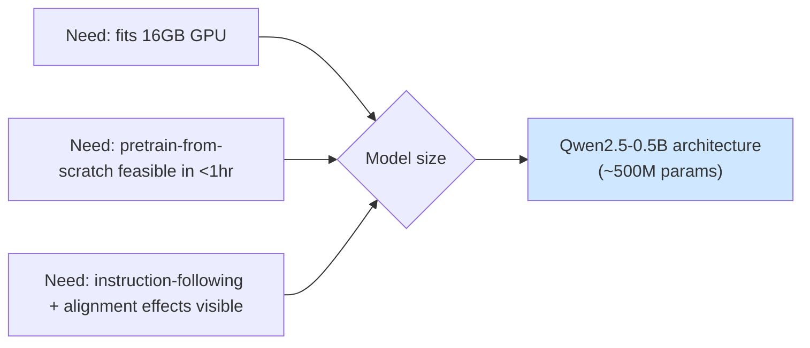

# 01 — Foundations & Setup

> Stage type: Setup (no training yet)
> Used by: every later stage — read this once, keep it open as reference.

---

## 1. Theory: what decisions are we locking in, and why

Before writing any training code, four decisions determine whether everything downstream actually runs on Colab/Kaggle. Get these wrong and stage 02 silently fails (OOM) or stage 08 takes 6 hours and your session dies at hour 2.

### 1.1 Colab/Kaggle constraints — and how this tutorial is shaped around them

| Constraint | Colab (free) | Colab Pro | Kaggle (free) | What we do about it |
|---|---|---|---|---|
| GPU | T4 (16GB), sometimes none | T4/L4/A100 (40GB) | P100 (16GB) or T4x2 | All code defaults to **fit-in-16GB**; A100 users just get faster runs, not different code |
| Session length | ~12h, idle-disconnects ~90min | longer, still disconnects | ~12h/session, 30h/week quota | Every stage **checkpoints to disk every N steps**, so a disconnect loses ≤N steps, not the run |
| Storage | Ephemeral (`/content`) wiped on disconnect | Same | `/kaggle/working` ephemeral, `/kaggle/input` read-only | We **mount Google Drive** (Colab) or use **Kaggle Datasets/Output** to persist checkpoints and final models |
| Pre-installed libs | Old `transformers`/`peft`/`trl` versions | Same | Similar | Stage 01 includes a **pinned-version install cell** to run first, every notebook |

**Practical rule used throughout this series:** every stage's code starts with the same install + environment cell (below), and every training loop saves to a `checkpoints/` folder that you point at Drive/Kaggle Output, not just local disk.

### 1.2 Model choice

We need a model small enough to pre-train *from scratch* in stage 02 within a Colab session, yet realistic enough that instruction-tuning/DPO behavior in later stages is genuinely visible (a 10M-param toy model won't show interesting RLHF behavior).



We use **`Qwen2.5-0.5B`** (or its architecture) for two reasons:
- It's small enough that a **from-scratch pre-training run** on a tiny corpus finishes in well under an hour on a T4, so stage 02 is honest (you watch loss actually drop from random-init), not just a rebrand of "load a pretrained checkpoint."
- At 500M params it's still large enough to show real instruction-following and DPO preference-shift behavior — sub-100M models often just produce noise regardless of training stage, which would make stages 04–08 unconvincing.

If you have **less than 16GB** (older T4 shared, or Kaggle P100 contention): switch to `Qwen2.5-0.5B` with 4-bit loading from stage 03 onward — this is flagged again in each stage's hyperparameter section.
If you have **40GB+ (A100)**: everything still works identically; you can simply raise batch size — flagged per stage.

### 1.3 Data choice (deferred dataset creation, per your note)

We are **not building data pipelines**. We use small, ready-made, permissively-licensed datasets at each stage:

| Stage | Dataset | Size used | Why this one |
|---|---|---|---|
| 02 Pre-training | `codeparrot/github-code` (Python subset) or `roneneldan/TinyStories` mixed with a Python slice | ~5–20M tokens (subsampled) | Small enough to iterate multiple epochs in minutes; Python content sets up later coding-assistant behavior |
| 03 SFT | `iamtarun/python_code_instructions_18k_alpaca` (used in *raw* completion form, no instruct format yet) | 2–3k examples | Real beginner-level Python tasks |
| 04 Instruction tuning | Same dataset, reformatted with chat template | Same 2–3k | Avoids the "different task = can't compare stages" trap |
| 08 DPO | A small hand-curated preference subset (chosen=clear beginner-friendly explained answer, rejected=terse/risky answer) built from ~200–300 prompts, *not generated as a new task* | 200–300 pairs | Enough to see real reward-margin movement, small enough to build by lightly relabeling SFT outputs rather than authoring a dataset pipeline |

### 1.4 Why one consistent eval harness matters

Every stage will report different *metrics*, but they should all run through the **same loading/generation utility code**, otherwise you can't trust that a metric difference between stage 3 and stage 4 reflects the model and not a prompting inconsistency. We build that shared harness here, once.

---

## 2. Code: the cell you run first, every notebook, every stage

### 2.1 Environment + pinned installs (Colab and Kaggle both)

```python
# ============================================================
# CELL 1 — run this first in EVERY notebook in this series
# ============================================================
import sys, os

IN_COLAB = "google.colab" in sys.modules
IN_KAGGLE = os.path.exists("/kaggle/working")

print(f"Colab: {IN_COLAB} | Kaggle: {IN_KAGGLE}")

# Pinned versions — avoids the "Colab ships an old transformers" trap.
# These versions are known-compatible with each other as of this tutorial.
!pip install -q -U \
    "transformers==4.46.3" \
    "datasets==3.1.0" \
    "accelerate==1.1.1" \
    "peft==0.13.2" \
    "trl==0.12.1" \
    "bitsandbytes==0.44.1" \
    "evaluate==0.4.3" \
    "sentencepiece" \
    "flash-attn --no-build-isolation" 2>/dev/null || \
    print("flash-attn install skipped (fine on T4 — not always supported; we fall back to SDPA attention)")

import torch
print("CUDA available:", torch.cuda.is_available())
if torch.cuda.is_available():
    print("GPU:", torch.cuda.get_device_name(0))
    print("VRAM (GB):", round(torch.cuda.get_device_properties(0).total_memory / 1e9, 1))
```

**Interpretation of this cell's output:** if `CUDA available: False`, stop — go to `Runtime > Change runtime type > GPU` (Colab) or `Settings > Accelerator > GPU` (Kaggle) before continuing. If VRAM reports ~15GB, you're on a T4 — every later stage's "if you have less" branch applies to you.

### 2.2 Persistent storage — mount once, use everywhere

```python
# ============================================================
# CELL 2 — persistent storage setup
# ============================================================
if IN_COLAB:
    from google.colab import drive
    drive.mount('/content/drive')
    PERSIST_DIR = "/content/drive/MyDrive/llm_tutorial"
elif IN_KAGGLE:
    # Kaggle: /kaggle/working persists for the session and can be saved as
    # Kaggle Output when you "Save Version" — good enough for this tutorial.
    PERSIST_DIR = "/kaggle/working/llm_tutorial"
else:
    PERSIST_DIR = "./llm_tutorial"

os.makedirs(PERSIST_DIR, exist_ok=True)
os.makedirs(f"{PERSIST_DIR}/checkpoints", exist_ok=True)
os.makedirs(f"{PERSIST_DIR}/eval_logs", exist_ok=True)
print("Persisting to:", PERSIST_DIR)
```

**Why this matters concretely:** in stage 02 you'll set `save_strategy="steps", save_steps=200, output_dir=f"{PERSIST_DIR}/checkpoints/pretrain"`. If Colab disconnects at minute 47, you `drive.mount` again, point `resume_from_checkpoint=True` at the same path, and lose at most 200 steps — not the whole run.

### 2.3 Shared model/tokenizer loader (used identically in stages 02–08)

```python
# ============================================================
# CELL 3 — shared loader, import this pattern in every stage
# ============================================================
from transformers import AutoModelForCausalLM, AutoTokenizer, BitsAndBytesConfig
import torch

BASE_MODEL = "Qwen/Qwen2.5-0.5B"  # architecture/tokenizer source; stage 02 trains weights from scratch

def load_tokenizer(model_name=BASE_MODEL):
    tok = AutoTokenizer.from_pretrained(model_name)
    if tok.pad_token is None:
        tok.pad_token = tok.eos_token  # causal LMs often lack a pad token by default
    return tok

def load_model(model_name=BASE_MODEL, from_scratch=False, four_bit=False, dtype=torch.bfloat16):
    """
    from_scratch=True  -> random-init weights with the same config (stage 02 pre-training)
    from_scratch=False -> load actual pretrained weights (stages 03+, after you have your own checkpoint)
    four_bit=True       -> QLoRA-style loading (stage 05+), needed if VRAM < 16GB
    """
    if from_scratch:
        from transformers import AutoConfig
        config = AutoConfig.from_pretrained(model_name)
        model = AutoModelForCausalLM.from_config(config, torch_dtype=dtype)
        return model

    quant_config = None
    if four_bit:
        quant_config = BitsAndBytesConfig(
            load_in_4bit=True,
            bnb_4bit_quant_type="nf4",
            bnb_4bit_compute_dtype=dtype,
            bnb_4bit_use_double_quant=True,
        )

    model = AutoModelForCausalLM.from_pretrained(
        model_name,
        quantization_config=quant_config,
        torch_dtype=dtype if quant_config is None else None,
        device_map="auto",
        attn_implementation="sdpa",  # falls back safely if flash-attn isn't installed
    )
    return model
```

### 2.4 Shared evaluation harness skeleton

Each stage adds *stage-specific* metrics on top of this, but generation should always go through one function so prompts/sampling params are identical across comparisons.

```python
# ============================================================
# CELL 4 — shared generation utility (extended per-stage later)
# ============================================================
@torch.no_grad()
def generate(model, tokenizer, prompt, max_new_tokens=200, temperature=0.7, do_sample=True):
    model.eval()
    inputs = tokenizer(prompt, return_tensors="pt").to(model.device)
    out = model.generate(
        **inputs,
        max_new_tokens=max_new_tokens,
        temperature=temperature,
        do_sample=do_sample,
        pad_token_id=tokenizer.pad_token_id,
    )
    return tokenizer.decode(out[0][inputs["input_ids"].shape[1]:], skip_special_tokens=True)

# A fixed, small set of eval prompts reused across ALL stages so you can
# diff outputs side-by-side as the same model moves through the pipeline.
EVAL_PROMPTS = [
    "Write a function that checks if a number is prime.",
    "How do I read a CSV file in Python?",
    "Explain what a list comprehension is.",
    "Write a function to reverse a string without using [::-1].",
    "What's the difference between a tuple and a list?",
]
```

Save this as `EVAL_PROMPTS` in every stage's notebook unchanged — stage 10 (evaluation playbook) shows how to diff outputs across all 5 stages side by side.

---

## 3. Hyperparameter exploration: not yet — but here's the meta-decision

There's one setup-level "hyperparameter" worth deciding now because it affects every later stage: **precision**.

| Choice | VRAM use | Speed | Stability | Verdict for this series |
|---|---|---|---|---|
| fp32 | highest | slowest | most stable | ❌ wastes T4/Colab budget for no real benefit at 0.5B scale |
| fp16 | ~half of fp32 | fast | can overflow (needs loss scaling) | Usable, but bf16 is strictly easier on Ampere+ (A100/L4/T4-Ampere) |
| bf16 | ~half of fp32 | fast | very stable (same exponent range as fp32) | ✅ **default throughout this series** |

We default to **bf16** everywhere a GPU supports it (T4 does support bf16 compute, just slightly slower than fp16 — stability wins). This choice is revisited with actual throughput numbers in stage 06 (fast fine-tuning techniques), where mixed precision is a first-class topic.

---

## 4. Evaluation: nothing to evaluate yet

This stage produces no model, so no metrics — but confirm your setup is correct before moving on:

```python
# ============================================================
# Sanity check — run once, confirms stages 02+ will work
# ============================================================
tok = load_tokenizer()
model = load_model(from_scratch=True)  # tiny smoke test: random-init forward pass
inputs = tok("def add(a, b):", return_tensors="pt").to(model.device if torch.cuda.is_available() else "cpu")
with torch.no_grad():
    out = model(**inputs)
print("Logits shape:", out.logits.shape)  # expect [1, seq_len, vocab_size]
print("Setup OK" if out.logits.shape[-1] == tok.vocab_size else "Vocab mismatch — check tokenizer/model pairing")
```

If this prints `Setup OK`, you're ready for stage 02.

---

## 5. Pitfalls specific to Colab/Kaggle (read before stage 02)

- **Disconnect = lost local files.** Anything not under `PERSIST_DIR` (Drive/Kaggle Output) is gone on disconnect. Always write checkpoints there, not to `/content` or `/kaggle/working` root directly.
- **`pip install` runs every fresh session.** Don't assume a library persists — Cell 1 is meant to be re-run at the start of every session, not just once.
- **Free-tier GPU type is not guaranteed.** Colab free tier may hand you a T4 one day and nothing the next; Cell 1's VRAM print is there so every later stage's "if VRAM < 16GB" branches can be checked live rather than assumed.
- **Kaggle internet access:** off by default in some notebook settings — turn on "Internet" in notebook settings or `pip install` and `from_pretrained` downloads will fail silently with a network error.
- **Background execution:** Colab free tier kills idle sessions (~90 min of no interaction) even mid-training — for long stages (PPO theory aside, DPO in stage 08 is the longest hands-on run), keep the tab active or use Colab Pro's background execution if available.

---

### Next: `02_pretraining.md` — training the 0.5B model from random initialization on a small Python/text corpus, with full loss-curve theory and perplexity evaluation.