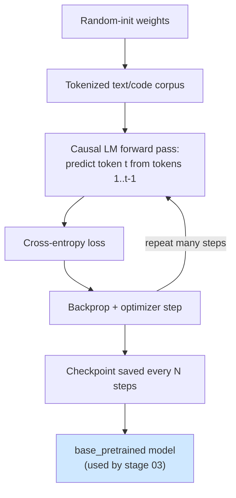
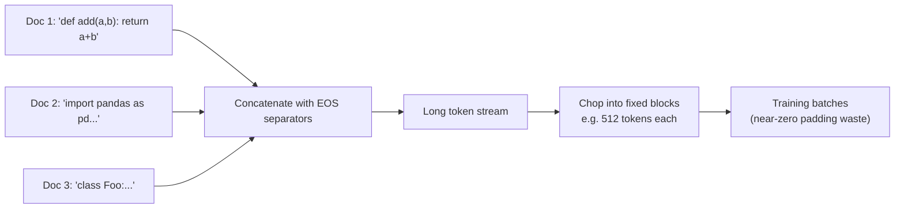

# 02 — Pre-training

> Stage type: Pre-training (causal language modeling from random initialization)
> Builds on: `01_foundations_and_setup.md` (run Cells 1–4 first, every session)
> Produces: `base_pretrained` checkpoint, used as the starting point for stage 03

---

## 1. Theory

### 1.1 What pre-training actually optimizes

Pre-training trains a model with **no task-specific labels** — just raw text — using the **causal language modeling (CLM) objective**: predict the next token given all previous tokens.

For a sequence of tokens $x_1, x_2, \ldots, x_T$, the model learns parameters $\theta$ that minimize:

$$
\mathcal{L}(\theta) = -\frac{1}{T}\sum_{t=1}^{T} \log P_\theta(x_t \mid x_1, \ldots, x_{t-1})
$$

This is just **cross-entropy loss** between the predicted next-token distribution and the actual next token, averaged over every position in every sequence in the batch. Nothing about "instructions" or "tasks" exists yet — the model is purely learning the statistics of language (and in our case, Python code) so that later stages have something to fine-tune.

### 1.2 Why this stage matters even though most people skip it

Almost nobody pre-trains from scratch in practice (it's why HF Hub exists) — but doing it once, even tiny-scale, makes every later concept concrete:
- You'll *see* loss start near $\ln(\text{vocab\_size})$ (random-guessing baseline) and watch it fall — this is the only stage where that's true.
- Perplexity, which gets reused as a sanity-check metric in stages 3–4, only makes intuitive sense once you've watched it move from "random" to "learned" with your own eyes.



### 1.3 Data packing (why we don't just pad every example)

Most pre-training sequences are shorter than the model's context window. Padding each one wastes huge amounts of compute on `[PAD]` tokens contributing nothing to the loss. Instead, we **concatenate and pack**: join many documents end-to-end (separated by EOS tokens) and chop into fixed-length blocks. This keeps the GPU doing useful work on (almost) every token.



---

## 2. Code

### 2.1 Load and prepare a small corpus

We mix two sources to give the model both general language fluency and Python code patterns, since the end goal (stage 11) is a Python coding assistant.

```python
# ============================================================
# Run Cells 1-4 from 01_foundations_and_setup.md first
# ============================================================
from datasets import load_dataset, concatenate_datasets

# Small slice of Python code (real-world code structure/style)
code_ds = load_dataset("codeparrot/github-code", streaming=True, split="train",
                        languages=["Python"], licenses=["mit", "apache-2.0"])
code_examples = []
for i, ex in enumerate(code_ds):
    if i >= 4000:  # small subsample — this is pre-training for CONCEPT, not for SOTA
        break
    if 50 < len(ex["code"]) < 4000:  # skip tiny/huge files
        code_examples.append({"text": ex["code"]})

# Small slice of general English text (so the model isn't ONLY code)
text_ds = load_dataset("roneneldan/TinyStories", split="train[:4000]")
text_examples = [{"text": ex["text"]} for ex in text_ds]

from datasets import Dataset
raw_dataset = Dataset.from_list(code_examples + text_examples).shuffle(seed=42)
print(f"Total raw examples: {len(raw_dataset)}")
print(raw_dataset[0]["text"][:200])
```

**Why this mix:** ~50/50 code/text at this tiny scale. Real pre-training corpora are >90% diverse text with code as a smaller slice, but since our *downstream goal* is a coding assistant and our corpus is intentionally tiny, we skew toward code so stage 02's effects are visible in code-completion behavior by stage 03.

### 2.2 Tokenize and pack

```python
tok = load_tokenizer()
BLOCK_SIZE = 512  # context length used for packing — see hyperparameter section for why 512

def tokenize_fn(examples):
    return tok(examples["text"])

tokenized = raw_dataset.map(tokenize_fn, batched=True, remove_columns=["text"])

def pack_fn(examples):
    # Concatenate all token lists in this batch into one long stream
    concatenated = sum(examples["input_ids"], [])
    total_len = (len(concatenated) // BLOCK_SIZE) * BLOCK_SIZE  # drop remainder
    result = {
        "input_ids": [concatenated[i:i+BLOCK_SIZE] for i in range(0, total_len, BLOCK_SIZE)]
    }
    result["labels"] = result["input_ids"].copy()  # CLM: labels = inputs shifted internally by the model
    return result

packed = tokenized.map(pack_fn, batched=True, batch_size=1000, remove_columns=tokenized.column_names)
print(f"Packed into {len(packed)} blocks of {BLOCK_SIZE} tokens "
      f"({len(packed) * BLOCK_SIZE / 1e6:.2f}M tokens total)")
```

### 2.3 Training loop

```python
from transformers import TrainingArguments, Trainer, DataCollatorForLanguageModeling

model = load_model(from_scratch=True)  # random-init weights, Qwen2.5-0.5B architecture
model.gradient_checkpointing_enable()  # trade compute for memory — detailed in stage 06

collator = DataCollatorForLanguageModeling(tokenizer=tok, mlm=False)  # mlm=False = causal LM, not masked LM

training_args = TrainingArguments(
    output_dir=f"{PERSIST_DIR}/checkpoints/pretrain",
    per_device_train_batch_size=8,
    gradient_accumulation_steps=4,   # effective batch = 8*4 = 32 — see hyperparameter section
    learning_rate=3e-4,              # high LR is typical/expected for from-scratch pretraining
    warmup_ratio=0.05,
    num_train_epochs=3,
    bf16=True,
    logging_steps=20,
    save_strategy="steps",
    save_steps=200,
    save_total_limit=3,
    report_to="none",
)

trainer = Trainer(
    model=model,
    args=training_args,
    train_dataset=packed,
    data_collator=collator,
)

train_result = trainer.train()  # resume_from_checkpoint=True if continuing after a disconnect
trainer.save_model(f"{PERSIST_DIR}/checkpoints/pretrain/final")
tok.save_pretrained(f"{PERSIST_DIR}/checkpoints/pretrain/final")
```

**What to watch live:** the loss printed every 20 steps. At `vocab_size≈150k` for Qwen's tokenizer, random-guess loss is $\ln(150000) \approx 11.9$. You should see it start somewhere in that neighborhood (slightly lower since punctuation/common tokens are skewed) and drop sharply in the first ~50 steps, then more slowly.

---

## 3. Hyperparameter exploration

This is the first stage with real hyperparameters to reason about — not just "use these values," but **what each one controls and what breaks at the extremes**.

### 3.1 Learning rate

| LR | What happens | How to recognize it |
|---|---|---|
| Too high (e.g. 1e-2) | Loss spikes or diverges to NaN | Loss curve jumps up sharply or becomes `nan` within first 50 steps |
| Too low (e.g. 1e-6) | Loss barely moves | After 200 steps, loss is still near the random-init value |
| Right range (3e-4 to 5e-4 for a 0.5B model, AdamW) | Steady, smooth decrease | Loss drops noticeably within first 100 steps, then decelerates |

**Why 3e-4 specifically:** smaller models pre-trained from scratch tolerate (and need) higher LR than fine-tuning does, because there's no existing structure to disturb. As a rule of thumb across the literature, LR scales roughly *inversely* with model size for from-scratch training — 0.5B models commonly use 3e-4 to 6e-4, while multi-billion param models use 1e-4 to 2e-4.

**Run this sweep yourself** (cheap — 100 steps each is enough to see divergence vs. convergence):

```python
import matplotlib.pyplot as plt

def quick_lr_probe(lr, max_steps=100):
    m = load_model(from_scratch=True)
    args = TrainingArguments(
        output_dir="/tmp/lr_probe", per_device_train_batch_size=8,
        gradient_accumulation_steps=4, learning_rate=lr, max_steps=max_steps,
        bf16=True, logging_steps=10, report_to="none", save_strategy="no",
    )
    tr = Trainer(model=m, args=args, train_dataset=packed.select(range(2000)), data_collator=collator)
    tr.train()
    return [log["loss"] for log in tr.state.log_history if "loss" in log]

results = {}
for lr in [1e-2, 3e-4, 1e-5]:
    print(f"--- LR={lr} ---")
    results[lr] = quick_lr_probe(lr)

for lr, losses in results.items():
    plt.plot(losses, label=f"lr={lr}")
plt.xlabel("logged step (x10)"); plt.ylabel("loss"); plt.legend(); plt.title("LR sweep")
plt.savefig(f"{PERSIST_DIR}/eval_logs/lr_sweep.png")
plt.show()
```

**Reading the plot:** the `1e-2` line should be erratic or flat-at-high-loss (too unstable to descend); `1e-5` should be a nearly flat line near the starting loss; `3e-4` should show the clearest steady downward slope. Whichever curve is *lowest and still smooth* by step 100 is your pick.

### 3.2 Batch size (and why we use gradient accumulation)

A T4's 16GB can't fit a large batch at 512 tokens/sequence with gradient checkpointing off. We use **gradient accumulation** to simulate a larger effective batch:

$$
\text{effective batch size} = \text{per\_device\_batch} \times \text{grad\_accum\_steps} \times \text{num\_GPUs}
$$

Here: $8 \times 4 \times 1 = 32$. Larger effective batch → smoother gradient estimates → can tolerate higher LR → faster wall-clock convergence *if* memory allows it directly; accumulation gets you the smoothing benefit without the memory cost, at the price of more forward/backward passes per optimizer step (slower wall-clock per step, but more stable).

**Failure modes:**
- Effective batch too small (e.g. 4): noisy loss curve, bounces around a lot, slower real convergence.
- Effective batch too large for the LR you're using: can actually *slow* convergence (each step moves "more correctly" but you take fewer steps per epoch) — batch size and LR are coupled, which is why the **linear scaling rule** (double batch size → roughly double LR, within reason) is a common heuristic.

### 3.3 Context length (`BLOCK_SIZE`)

| Block size | VRAM impact | Effect |
|---|---|---|
| 256 | Lower | More blocks per epoch, less long-range context per example |
| 512 (our choice) | Moderate | Good balance for code (most functions fit), fits T4 comfortably |
| 1024+ | Higher (attention is $O(n^2)$) | Better long-range learning, risks OOM on T4 with batch=8 |

We chose 512 because most individual Python functions/classes in our corpus comfortably fit, and it keeps memory low enough to use a reasonable batch size on a T4.

---

## 4. Evaluation

### 4.1 Why perplexity is *the* metric here (and won't be later)

**Perplexity** is the exponentiated average negative log-likelihood:

$$
\text{PPL} = \exp\left(-\frac{1}{T}\sum_{t=1}^{T} \log P_\theta(x_t \mid x_{<t})\right) = \exp(\mathcal{L})
$$

It directly measures "how surprised is the model by real text" — exactly what CLM pre-training optimizes. This is **the right metric here** because pre-training has no notion of "correct answer" beyond next-token likelihood. It becomes a *weaker* signal later (stage 04+) because a model can have great perplexity while still giving unhelpful or unsafe answers — perplexity says nothing about instruction-following or preference alignment, which is why stages 4 and 8 introduce different metrics.

### 4.2 Compute held-out perplexity

```python
import math

def compute_perplexity(model, tokenizer, dataset, block_size=512, n_blocks=200):
    model.eval()
    losses = []
    for i in range(min(n_blocks, len(dataset))):
        input_ids = torch.tensor([dataset[i]["input_ids"]]).to(model.device)
        with torch.no_grad():
            out = model(input_ids=input_ids, labels=input_ids)
        losses.append(out.loss.item())
    mean_loss = sum(losses) / len(losses)
    return math.exp(mean_loss), mean_loss

# Use a held-out slice not seen during training
held_out = packed.select(range(len(packed) - 200, len(packed)))
ppl, mean_loss = compute_perplexity(model, tok, held_out)
print(f"Held-out perplexity: {ppl:.2f} (mean loss: {mean_loss:.3f})")
```

### 4.3 Bits-per-byte (a fairer cross-tokenizer metric)

Perplexity is tokenizer-dependent (different vocab sizes make raw PPL numbers incomparable across models). **Bits-per-byte (BPB)** normalizes by actual UTF-8 byte length instead, making it the metric of choice if you ever compare against a different tokenizer's model:

$$
\text{BPB} = \frac{\mathcal{L} \times \text{num\_tokens}}{\text{num\_bytes} \times \ln(2)}
$$

```python
def compute_bpb(model, tokenizer, dataset, n_blocks=200):
    total_loss_nats, total_tokens, total_bytes = 0, 0, 0
    model.eval()
    for i in range(min(n_blocks, len(dataset))):
        ids = dataset[i]["input_ids"]
        input_ids = torch.tensor([ids]).to(model.device)
        with torch.no_grad():
            out = model(input_ids=input_ids, labels=input_ids)
        total_loss_nats += out.loss.item() * len(ids)
        total_tokens += len(ids)
        total_bytes += len(tokenizer.decode(ids).encode("utf-8"))
    bpb = total_loss_nats / (total_bytes * math.log(2))
    return bpb

bpb = compute_bpb(model, tok, held_out)
print(f"Bits-per-byte: {bpb:.3f}")
```

### 4.4 Interpretation guide — "loss=2.1, is that good?"

There's no universal good/bad threshold — it depends on data difficulty and model size. What *does* generalize:

- **Random-init baseline**: $\text{loss} \approx \ln(\text{vocab\_size})$. For our ~150k vocab, that's ~11.9. Anything meaningfully below this means the model learned *something*.
- **Train vs. held-out gap**: if train loss keeps falling but held-out loss flattens or rises, that's **overfitting** — expected risk given our tiny corpus and 3 epochs. A gap of a few tenths of a nat is normal at this scale; a large, growing gap means stop training earlier or use less data repetition.
- **Qualitative check matters as much as the number** at this scale — generate completions and read them:

```python
test_prompts = ["def fibonacci(n):", "import numpy as np\n\ndef", "Once upon a time"]
for p in test_prompts:
    print(f"PROMPT: {p}")
    print(f"OUTPUT: {generate(model, tok, p, max_new_tokens=40, temperature=0.7)}")
    print("---")
```

At this stage, "good" looks like *plausible Python-like syntax and English-like grammar*, not correct or sensible logic — that's what stages 3–4 are for. If output is still gibberish/repetitive after the full training run, that's a real signal (see pitfalls below), not something later stages will magically fix.

---

## 5. Interpretation / common pitfalls

- **Loss plateaus immediately near the random baseline:** usually an LR-too-low or LR-too-high (diverging-then-flat) issue — rerun the LR probe in §3.1 before assuming the data or architecture is the problem.
- **Loss looks great but generations are repetitive ("the the the the...")**: classic symptom of greedy/low-temperature decoding combined with an undertrained model — try `temperature=0.8-1.0` and check whether it's a generation-config issue vs. a real training issue by checking held-out loss first.
- **`nan` loss appearing after some steps, not immediately:** often gradient explosion later in training — add `max_grad_norm=1.0` (gradient clipping) to `TrainingArguments` if not already implicitly applied (it's `1.0` by default in HF `Trainer`, so check you haven't overridden it).
- **OOM on a T4:** reduce `per_device_train_batch_size` to 4 and raise `gradient_accumulation_steps` to 8 (same effective batch, less peak memory) — covered with more nuance in stage 06.
- **Treating pre-training perplexity as a proxy for "the model is good now":** it is **not** a proxy for usefulness — it only says the model has learned the statistics of your tiny corpus. Resist the urge to chase a lower PPL by training more epochs on this same small corpus; you'll just overfit it. The real payoff arrives once SFT (stage 03) gives the model task structure.

---

### Next: `03_supervised_finetuning_sft.md` — full-parameter fine-tuning on real Python task data (plain completion format, no instructions yet), comparing against this pre-trained baseline with task-specific metrics.