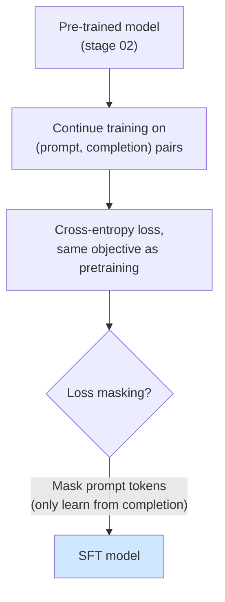

# 03 — Supervised Fine-tuning (SFT)

> Stage type: Fine-tuning (full-parameter, plain task format — no instruction template yet)
> Builds on: `02_pretraining.md` checkpoint at `{PERSIST_DIR}/checkpoints/pretrain/final`
> Produces: `sft_model` checkpoint, used as the baseline for stage 04 (instruction tuning) and stage 05 (PEFT comparison)

---

## 1. Theory

### 1.1 What changes vs. pre-training, and what doesn't

The **objective function is identical** to stage 02 — still cross-entropy next-token prediction. What changes is the **data distribution** and **starting point**:

| | Pre-training (stage 02) | SFT (this stage) |
|---|---|---|
| Starting weights | Random init | Pre-trained checkpoint |
| Data | Raw, unstructured text/code | Curated (prompt, completion) pairs, task-relevant |
| Goal | Learn general language/code statistics | Specialize toward a specific task distribution |
| Format | No structure (packed raw text) | Structured pairs, **not yet** instruction-templated |

This stage deliberately stays in **plain completion form** — given a function signature, complete the function body — *without* wrapping it in chat/instruction format yet. That's stage 04's job. Splitting these two lets you isolate two separate effects later: "did fine-tuning on task data help?" (this stage) vs. "did adding instruction structure help on top of that?" (stage 04).



### 1.2 The one new mechanic: loss masking

In stage 02, every token contributed to the loss equally (we were learning *everything*). In SFT, we usually only want the model to be penalized for getting the **completion** wrong, not for "failing to predict" the prompt (which it didn't generate — it was given). This is done by setting `labels = -100` for prompt tokens, since HF's cross-entropy loss ignores any label equal to `-100`.


**Why this matters:** without masking, the model spends gradient budget "learning" to predict prompt text it never has to generate at inference time — diluting the signal that actually shapes its completion behavior. This is a small code change with an outsized effect on SFT quality, and it's the kind of detail tutorials often skip.

### 1.3 Full fine-tuning vs. PEFT — why we do full FT here first

This stage does **full-parameter** fine-tuning (every weight updates) deliberately, even though stage 05 will show PEFT (LoRA) doing something similar far more cheaply. The reason: you need a **full-FT reference point** to honestly evaluate whether PEFT in stage 05 is "almost as good for a fraction of the cost" or "noticeably worse." Skipping straight to LoRA would mean taking that claim on faith instead of measuring it yourself.

---

## 2. Code

### 2.1 Load and format data (plain completion, no instruction wrapper)

```python
# ============================================================
# Run Cells 1-4 from 01_foundations_and_setup.md first
# ============================================================
from datasets import load_dataset

raw = load_dataset("iamtarun/python_code_instructions_18k_alpaca", split="train")
raw = raw.shuffle(seed=42).select(range(3000))  # small slice — fast iteration, per your time constraint

# We deliberately STRIP the instruction framing for this stage and keep
# only a function-signature -> body completion shape, i.e. plain code completion.
def to_plain_completion(ex):
    # dataset has 'instruction', 'input', 'output' columns (Alpaca-style)
    # we use only 'output' (the code) and synthesize a simple completion split:
    code = ex["output"].strip()
    lines = code.split("\n")
    split_point = max(1, len(lines) // 3)  # first third = "prompt", rest = "completion"
    prompt = "\n".join(lines[:split_point])
    completion = "\n".join(lines[split_point:])
    return {"prompt": prompt, "completion": completion}

formatted = raw.map(to_plain_completion, remove_columns=raw.column_names)
formatted = formatted.filter(lambda ex: len(ex["completion"].strip()) > 0)
print(formatted[0])
```

### 2.2 Tokenize with loss masking

```python
tok = load_tokenizer()
MAX_LEN = 512

def tokenize_with_masking(ex):
    prompt_ids = tok(ex["prompt"], add_special_tokens=False)["input_ids"]
    completion_ids = tok(ex["completion"] + tok.eos_token, add_special_tokens=False)["input_ids"]

    input_ids = prompt_ids + completion_ids
    labels = [-100] * len(prompt_ids) + completion_ids  # mask prompt, learn only completion

    input_ids = input_ids[:MAX_LEN]
    labels = labels[:MAX_LEN]

    return {
        "input_ids": input_ids,
        "labels": labels,
        "attention_mask": [1] * len(input_ids),
    }

tokenized = formatted.map(tokenize_with_masking, remove_columns=formatted.column_names)
```

### 2.3 Data collator (handles padding + label masking together)

```python
from transformers import DataCollatorForSeq2Seq

# DataCollatorForSeq2Seq pads input_ids with pad_token and labels with -100
# (NOT pad_token id) — using DataCollatorForLanguageModeling here would
# incorrectly compute loss on padding positions.
collator = DataCollatorForSeq2Seq(tokenizer=tok, padding=True, label_pad_token_id=-100)
```

### 2.4 Training loop

```python
from transformers import TrainingArguments, Trainer

model = load_model(model_name=f"{PERSIST_DIR}/checkpoints/pretrain/final")  # start from stage 02's output
model.gradient_checkpointing_enable()

training_args = TrainingArguments(
    output_dir=f"{PERSIST_DIR}/checkpoints/sft",
    per_device_train_batch_size=4,
    gradient_accumulation_steps=8,   # effective batch 32 — smaller per-device since sequences are longer/varied now
    learning_rate=2e-5,              # MUCH lower than pretraining's 3e-4 — see hyperparameter section
    warmup_ratio=0.03,
    num_train_epochs=3,
    bf16=True,
    logging_steps=10,
    save_strategy="epoch",
    save_total_limit=2,
    report_to="none",
)

trainer = Trainer(model=model, args=training_args, train_dataset=tokenized, data_collator=collator)
trainer.train()
trainer.save_model(f"{PERSIST_DIR}/checkpoints/sft/final")
tok.save_pretrained(f"{PERSIST_DIR}/checkpoints/sft/final")
```

---

## 3. Hyperparameter exploration

### 3.1 Learning rate — why it drops by ~10-15x from pre-training

| Stage | Typical LR (0.5B model) | Why |
|---|---|---|
| Pre-training (stage 02) | 3e-4 | Starting from random weights — large updates are safe and necessary |
| SFT (this stage) | 1e-5 to 3e-5 | Starting from a model that **already knows language/code** — large updates risk **catastrophic forgetting** |

**Catastrophic forgetting** is the key new failure mode here: too-high an LR during fine-tuning doesn't just fail to converge, it actively *destroys* general capability the pre-trained model already had, overwriting it with narrow task behavior. This is qualitatively different from stage 02's "too high = diverges" — here, too high can look like it's converging fine on the *fine-tuning* loss while quietly wrecking everything else.

**Run this comparison yourself:**

```python
def sft_probe(lr, max_steps=80):
    m = load_model(model_name=f"{PERSIST_DIR}/checkpoints/pretrain/final")
    args = TrainingArguments(
        output_dir="/tmp/sft_probe", per_device_train_batch_size=4,
        gradient_accumulation_steps=8, learning_rate=lr, max_steps=max_steps,
        bf16=True, logging_steps=10, report_to="none", save_strategy="no",
    )
    tr = Trainer(model=m, args=args, train_dataset=tokenized.select(range(1000)), data_collator=collator)
    tr.train()
    return m, [log["loss"] for log in tr.state.log_history if "loss" in log]

for lr in [5e-4, 2e-5, 1e-6]:
    print(f"=== LR={lr} ===")
    m, losses = sft_probe(lr)
    print("Final task loss:", losses[-1])
    print("Generic capability check (NOT a fine-tuning prompt):")
    print(generate(m, tok, "The capital of France is", max_new_tokens=15))
    print()
```

**Reading this:** at `lr=5e-4`, watch for the generic-capability output degrading into nonsense even if task loss looks low — that's forgetting in action. At `lr=1e-6`, task loss barely moves. `lr=2e-5` should show task loss dropping steadily while the generic-capability completion stays coherent.

### 3.2 Number of epochs — the overfitting tradeoff at small data scale

With only 3000 examples, multiple epochs means repeated exposure to the exact same examples — risk of memorizing surface patterns rather than generalizing.

```python
# Track train loss across epochs and eval on a small held-out split each epoch
from sklearn.model_selection import train_test_split
train_idx, val_idx = train_test_split(range(len(tokenized)), test_size=0.1, random_state=42)
train_split = tokenized.select(train_idx)
val_split = tokenized.select(val_idx)

training_args_epoch_sweep = TrainingArguments(
    output_dir="/tmp/epoch_sweep",
    per_device_train_batch_size=4, gradient_accumulation_steps=8,
    learning_rate=2e-5, num_train_epochs=6,  # deliberately over-train to see the curve bend
    eval_strategy="epoch", bf16=True, logging_steps=20, report_to="none", save_strategy="no",
)
m = load_model(model_name=f"{PERSIST_DIR}/checkpoints/pretrain/final")
tr = Trainer(model=m, args=training_args_epoch_sweep, train_dataset=train_split,
             eval_dataset=val_split, data_collator=collator)
tr.train()

import pandas as pd
hist = pd.DataFrame(tr.state.log_history)
print(hist[hist["epoch"].notna()][["epoch", "loss", "eval_loss"]].dropna(how="all", subset=["loss","eval_loss"]))
```

**Reading this table:** find the epoch where `eval_loss` stops decreasing (or starts rising) while `loss` (train) keeps falling — that gap is overfitting onset. Pick `num_train_epochs` at or just before that point for the real run. With 3000 examples, this is commonly somewhere around epoch 2-4, not 6+.

### 3.3 Effective batch size at this stage

Same mechanism as stage 02 (`per_device_batch × grad_accum_steps`), but note we *lowered* per-device batch (8→4) here because completion sequences from real task data vary more in length than our packed pre-training blocks, so peak memory per batch is less predictable — safer to use a smaller per-device batch with more accumulation steps for the same effective batch of 32.

---

## 4. Evaluation

### 4.1 Two complementary metrics: perplexity (general) + task-specific (specific)

Perplexity alone is now **insufficient** — a model can have great perplexity on held-out task data while still writing code that's syntactically fluent but functionally wrong. We need a metric that checks *correctness*, not just *likelihood*.

### 4.2 Perplexity delta vs. the stage-02 base model

```python
held_out_tok = tokenized.select(val_idx[:100])  # reuse the held-out split from 3.2

def compute_ppl_seq2seq(model, dataset, n=100):
    model.eval()
    losses = []
    for i in range(min(n, len(dataset))):
        ids = torch.tensor([dataset[i]["input_ids"]]).to(model.device)
        labels = torch.tensor([dataset[i]["labels"]]).to(model.device)
        with torch.no_grad():
            out = model(input_ids=ids, labels=labels)
        losses.append(out.loss.item())
    mean_loss = sum(losses) / len(losses)
    return math.exp(mean_loss), mean_loss

import math
base_model = load_model(model_name=f"{PERSIST_DIR}/checkpoints/pretrain/final")
sft_model = load_model(model_name=f"{PERSIST_DIR}/checkpoints/sft/final")

base_ppl, _ = compute_ppl_seq2seq(base_model, held_out_tok)
sft_ppl, _ = compute_ppl_seq2seq(sft_model, held_out_tok)
print(f"Base (pre-trained only) PPL on task data: {base_ppl:.2f}")
print(f"SFT model PPL on task data: {sft_ppl:.2f}")
print(f"Improvement: {(base_ppl - sft_ppl) / base_ppl * 100:.1f}%")
```

**Interpretation:** SFT model's perplexity on held-out *task* data should be clearly lower than the base model's — that's the basic sanity check that fine-tuning specialized the model toward this distribution at all. If it isn't lower, something upstream broke (check LR, check that loss was actually decreasing during training).

### 4.3 Task-specific metric: pass@k via execution

For code, the gold-standard metric is **does the generated code actually run and produce correct output** — not just "does it look like code." We use a simplified **pass@1** check: generate once, execute against simple test cases.

```python
import signal

class TimeoutException(Exception): pass
def _timeout_handler(signum, frame): raise TimeoutException()

def safe_exec_test(code_str, test_str, timeout_sec=3):
    """Runs generated code + a test assertion in a restricted namespace. Returns True/False."""
    signal.signal(signal.SIGALRM, _timeout_handler)
    signal.alarm(timeout_sec)
    try:
        namespace = {}
        exec(code_str, namespace)
        exec(test_str, namespace)
        return True
    except Exception:
        return False
    finally:
        signal.alarm(0)

# A small, hand-written eval set (NOT generated data creation — just 5 fixed test cases,
# consistent with avoiding heavy dataset-building work)
CODE_EVAL_CASES = [
    {"prompt": "def is_prime(n):", "test": "assert is_prime(7) == True\nassert is_prime(8) == False"},
    {"prompt": "def reverse_string(s):", "test": "assert reverse_string('abc') == 'cba'"},
    {"prompt": "def factorial(n):", "test": "assert factorial(5) == 120"},
    {"prompt": "def is_palindrome(s):", "test": "assert is_palindrome('racecar') == True\nassert is_palindrome('hello') == False"},
    {"prompt": "def sum_list(lst):", "test": "assert sum_list([1,2,3]) == 6"},
]

def pass_at_1(model, tokenizer, cases, max_new_tokens=80):
    passed = 0
    for case in cases:
        completion = generate(model, tokenizer, case["prompt"], max_new_tokens=max_new_tokens, temperature=0.2)
        full_code = case["prompt"] + completion
        # crude cleanup: cut off at the next 'def ' if the model kept generating past one function
        if "\ndef " in completion:
            full_code = case["prompt"] + completion.split("\ndef ")[0]
        ok = safe_exec_test(full_code, case["test"])
        passed += int(ok)
        print(f"[{'PASS' if ok else 'FAIL'}] {case['prompt']}")
    return passed / len(cases)

print("Base model pass@1:", pass_at_1(base_model, tok, CODE_EVAL_CASES))
print("SFT model pass@1:", pass_at_1(sft_model, tok, CODE_EVAL_CASES))
```

> ⚠️ **Safety note on `exec`:** this runs generated code directly. Fine for your own small, controlled local environment with hand-written test cases like above. Never run model-generated code via raw `exec` against untrusted inputs or in a shared/production environment without proper sandboxing.

### 4.4 Interpretation guide

- **Perplexity improved, pass@1 didn't:** model learned the *style* of the task data (syntax, variable-naming conventions) without learning to be functionally correct — common with too few epochs or too-small/narrow training data. More epochs (within the overfitting limit from §3.2) or slightly more data usually helps.
- **Pass@1 improved a lot, perplexity barely moved:** can happen — perplexity is an average over *all* tokens including boilerplate (`def`, `return`, variable names), so it can be a fairly insensitive aggregate while a few logic-critical tokens (operators, conditions) flip from wrong to right. This is exactly why we use both metrics — neither alone tells the full story.
- **Both got worse than base model:** likely an LR or masking bug — re-check §2.2 (is `-100` masking actually applied?) and re-run the LR probe in §3.1.

---

## 5. Interpretation / common pitfalls

- **Forgetting to mask the prompt** (§1.2): the single most common SFT bug. Symptom: model becomes oddly good at "predicting your prompts back to you" but completions don't improve — always sanity check a few `labels` arrays contain `-100` where expected.
- **Comparing perplexity across stage 02 and stage 03 directly:** don't — stage 02's PPL was on packed *pre-training* data, stage 03's is on *task* data; different distributions, not comparable numbers. Always compare base-vs-SFT on the *same* held-out set, as done in §4.2.
- **Using too high an SFT learning rate "because pre-training used 3e-4"**: this is the #1 way people accidentally undo pre-training — re-read §3.1 if tempted.
- **Judging pass@1 results from 5 hand-written cases as statistically meaningful:** they're not — 5 cases is a fast *sanity signal*, not a benchmark. Stage 10 (evaluation playbook) discusses scaling this up properly (e.g., HumanEval-style suites) once you're past the "is anything broken" stage.

---

### Next: `04_instruction_tuning.md` — reformatting this same task data into instruction/response chat-template form, and measuring what instruction structure adds on top of plain SFT.