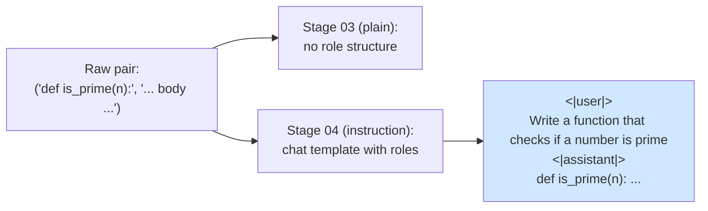
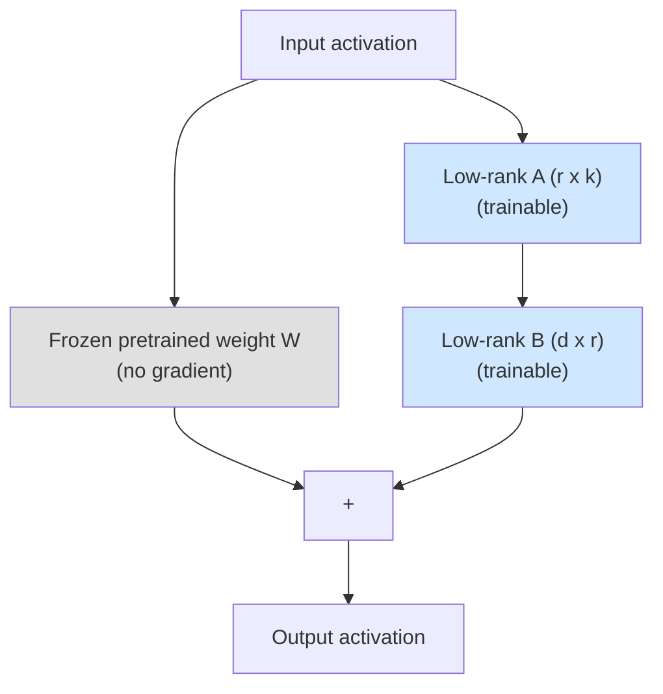
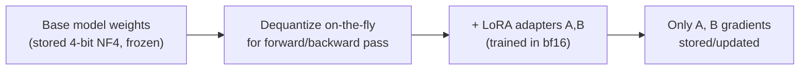

# 04 — Instruction Tuning + PEFT (combined)

> Stage type: Fine-tuning (instruction format, trained via LoRA/QLoRA — not full parameter)
> Builds on: `03_supervised_finetuning_sft.md` checkpoint at `{PERSIST_DIR}/checkpoints/sft/final`
> Produces: `instruct_peft_model` (base weights + LoRA adapter), used by stage 06 (speed techniques) and stage 08 (DPO)

---

## 0. Why these two are merged, and what that costs us

Originally planned as two stages (instruction tuning via full FT, *then* redo with LoRA to compare), we're merging them: reformat the data into instruction/response form **and** train it with LoRA/QLoRA directly, in one pass.

**What we gain:** one training run instead of two, and a directly useful artifact (a real instruction-following adapter) sooner.

**What we give up, explicitly:** a clean ablation. We will *not* be able to say "instruction formatting alone improved X%" vs. "PEFT alone changed Y%" — our stage-04 numbers reflect *both* changes at once, compared against stage 03's full-FT/no-instruction-format baseline. Section 4 calls this out again at evaluation time so the comparison isn't over-interpreted.

---

## 1. Theory

### 1.1 Instruction tuning: what's actually different in the data

Stage 03 trained on raw `(prompt, completion)` pairs with no consistent structure — the model learned "continue this code" but has no notion of "this is an instruction, respond helpfully to it." Instruction tuning wraps the same kind of underlying task data into a **consistent template** with explicit roles, so the model learns the *pattern* "given a user instruction, produce a response" — which generalizes to instructions it never saw verbatim during training.



The model's own tokenizer ships a **chat template** (Jinja2-based) that defines exactly how roles get serialized into token sequences — we use it rather than hand-rolling our own markers, since it must match how the model will be *prompted* at inference time too.

### 1.2 LoRA: the core idea

Full fine-tuning updates every weight matrix $W \in \mathbb{R}^{d \times k}$ in the model. **LoRA (Low-Rank Adaptation)** freezes $W$ entirely and instead learns a small *update* $\Delta W$ constrained to be **low-rank**:

$$
W' = W + \Delta W = W + BA, \quad B \in \mathbb{R}^{d \times r},\ A \in \mathbb{R}^{r \times k},\ r \ll \min(d, k)
$$

Only $A$ and $B$ are trained; $W$ stays frozen. Since $r$ (the "rank") is small — typically 8 to 64 — the number of trainable parameters collapses:

$$
\text{full FT params} = d \times k \qquad \text{LoRA params} = r \times (d + k)
$$

For a $1024 \times 1024$ matrix with $r=16$: full FT = ~1M params, LoRA = ~33k params — a **~30x reduction** for that matrix alone.



**Why this works at all (intuition, not full theory):** the hypothesis behind LoRA is that the *change* needed to adapt a pretrained model to a new task lies in a low intrinsic-dimensional subspace, even though the weight matrices themselves are full-rank. Empirically this holds well enough that LoRA matches or comes very close to full FT quality on most fine-tuning tasks, at a fraction of the trainable parameters and memory.

### 1.3 QLoRA: adding quantization on top

**QLoRA** = LoRA applied on top of a **4-bit quantized frozen base model**. The frozen weights $W$ are stored in 4-bit (NF4 format, designed to match the typical distribution of pretrained weights well), while the LoRA adapters $A, B$ are still trained in bf16. This is what lets you fine-tune models on much less VRAM than the base model's fp16/bf16 size would otherwise require — at 0.5B params we don't strictly *need* this to fit on a T4, but we use it anyway here so the pattern is in place when you scale this same notebook to a 3B–7B model later.



### 1.4 Where to attach LoRA adapters

LoRA is applied to specific weight matrices, not the whole model. For transformer architectures, the standard choice is the **attention projection matrices** (`q_proj`, `k_proj`, `v_proj`, `o_proj`), and increasingly also the **MLP/feedforward matrices** (`gate_proj`, `up_proj`, `down_proj`) for better quality at modest extra cost. We target both sets here since at 0.5B scale the extra trainable parameters are still cheap.

---

## 2. Code

### 2.1 Reformat data with the model's chat template

```python
# ============================================================
# Run Cells 1-4 from 01_foundations_and_setup.md first
# ============================================================
from datasets import load_dataset

raw = load_dataset("iamtarun/python_code_instructions_18k_alpaca", split="train")
raw = raw.shuffle(seed=42).select(range(3000))  # same slice size/seed as stage 03, for comparability

tok = load_tokenizer()

def to_chat_format(ex):
    instruction = ex["instruction"]
    if ex.get("input", "").strip():
        instruction += f"\n\nInput: {ex['input']}"
    messages = [
        {"role": "user", "content": instruction},
        {"role": "assistant", "content": ex["output"].strip()},
    ]
    # apply_chat_template handles the exact role markers this model expects —
    # don't hand-roll these, they must match what you prompt with at inference time.
    text = tok.apply_chat_template(messages, tokenize=False, add_generation_prompt=False)
    return {"text": text}

formatted = raw.map(to_chat_format, remove_columns=raw.column_names)
print(formatted[0]["text"][:500])
```

### 2.2 Tokenize with loss masking on the assistant turn only

Same masking principle as stage 03 (§1.2 there), but now the "prompt" is everything up to and including the assistant role marker. A naive approach — render the full chat template, then string-search for where the assistant's reply text begins — is fragile: it breaks if the role markers or the assistant's own text happen to appear inside the user content. The robust approach is to **tokenize the prompt-only template and the full template separately**, then use their token-length difference as the mask boundary:

```python
MAX_LEN = 512

def tokenize_chat_clean(ex_raw):
    instruction = ex_raw["instruction"]
    if ex_raw.get("input", "").strip():
        instruction += f"\n\nInput: {ex_raw['input']}"
    answer = ex_raw["output"].strip()

    # Prompt-only render (ends right where the assistant should start generating)
    prompt_text = tok.apply_chat_template(
        [{"role": "user", "content": instruction}],
        tokenize=False, add_generation_prompt=True,
    )
    # Full render (user turn + assistant turn)
    full_text = tok.apply_chat_template(
        [{"role": "user", "content": instruction}, {"role": "assistant", "content": answer}],
        tokenize=False, add_generation_prompt=False,
    )

    prompt_ids = tok(prompt_text, add_special_tokens=False)["input_ids"]
    full_ids = tok(full_text, add_special_tokens=False)["input_ids"]

    # Everything up to len(prompt_ids) is masked; everything after is real assistant content
    labels = [-100] * len(prompt_ids) + full_ids[len(prompt_ids):]
    full_ids = full_ids[:MAX_LEN]
    labels = labels[:MAX_LEN]
    return {"input_ids": full_ids, "labels": labels, "attention_mask": [1] * len(full_ids)}

tokenized = raw.map(tokenize_chat_clean, remove_columns=raw.column_names)
print("Example labels (first 20):", tokenized[0]["labels"][:20], "... (-100 = masked prompt)")
```

**Why tokenize prompt-only and full separately instead of string-splitting the rendered text:** chat templates can include special tokens or formatting that don't survive naive string slicing cleanly, and user content could coincidentally contain substrings that look like role markers. Tokenizing both renders independently and diffing their *lengths* sidesteps both issues — it's a few extra tokenizer calls per example, which is irrelevant at our data scale.

### 2.3 Configure LoRA / QLoRA

```python
from peft import LoraConfig, get_peft_model, prepare_model_for_kbit_training

# Load base model 4-bit quantized (QLoRA-style) — set four_bit=False if you have ample VRAM
# and want plain LoRA on a bf16 base instead (slightly higher quality, more memory).
base_model = load_model(model_name=f"{PERSIST_DIR}/checkpoints/sft/final", four_bit=True)
base_model = prepare_model_for_kbit_training(base_model)  # required prep step for k-bit + LoRA

lora_config = LoraConfig(
    r=16,                    # rank — see hyperparameter section for the tradeoff
    lora_alpha=32,           # scaling factor, commonly set to 2x rank
    lora_dropout=0.05,
    bias="none",
    target_modules=["q_proj", "k_proj", "v_proj", "o_proj",
                     "gate_proj", "up_proj", "down_proj"],  # attention + MLP, per theory section 1.4
    task_type="CAUSAL_LM",
)

model = get_peft_model(base_model, lora_config)
model.print_trainable_parameters()
# Expect output like: trainable params: ~8-17M || all params: ~500M || trainable%: ~2-3%
```

### 2.4 Training loop

```python
from transformers import TrainingArguments, Trainer, DataCollatorForSeq2Seq

collator = DataCollatorForSeq2Seq(tokenizer=tok, padding=True, label_pad_token_id=-100)

training_args = TrainingArguments(
    output_dir=f"{PERSIST_DIR}/checkpoints/instruct_peft",
    per_device_train_batch_size=8,    # LoRA's small memory footprint lets us go back up vs stage 03's 4
    gradient_accumulation_steps=4,
    learning_rate=2e-4,               # notably HIGHER than full-FT SFT's 2e-5 — see hyperparameter section
    warmup_ratio=0.03,
    num_train_epochs=3,
    bf16=True,
    logging_steps=10,
    save_strategy="epoch",
    save_total_limit=2,
    report_to="none",
)

trainer = Trainer(model=model, args=training_args, train_dataset=tokenized, data_collator=collator)
trainer.train()

model.save_pretrained(f"{PERSIST_DIR}/checkpoints/instruct_peft/final")  # saves ONLY the adapter, small file
tok.save_pretrained(f"{PERSIST_DIR}/checkpoints/instruct_peft/final")
```

**Note on what gets saved:** `model.save_pretrained` on a PEFT model saves only the adapter weights (a few MB to a few tens of MB), not the full base model — this is part of LoRA's practical appeal, and matters concretely for Colab/Kaggle: re-downloading or re-saving a multi-GB base model every checkpoint would burn your session's time/storage budget fast.

---

## 3. Hyperparameter exploration

### 3.1 LoRA rank ($r$) — the central PEFT-specific hyperparameter

| Rank | Trainable params | Capacity | Typical use |
|---|---|---|---|
| 4–8 | Very few | Limited — good for narrow, simple adaptations | Small stylistic shifts, narrow domains |
| 16–32 (our choice: 16) | Moderate | Good balance for most instruction-tuning tasks | **Most common default** |
| 64–128 | Approaching full-FT-like capacity | Diminishing returns, more VRAM/compute | Complex multi-task adaptation, larger base models |

**Run this sweep yourself:**

```python
def lora_rank_probe(r, max_steps=150):
    bm = load_model(model_name=f"{PERSIST_DIR}/checkpoints/sft/final", four_bit=True)
    bm = prepare_model_for_kbit_training(bm)
    cfg = LoraConfig(r=r, lora_alpha=r*2, lora_dropout=0.05, bias="none",
                      target_modules=["q_proj","k_proj","v_proj","o_proj","gate_proj","up_proj","down_proj"],
                      task_type="CAUSAL_LM")
    m = get_peft_model(bm, cfg)
    trainable, total = m.get_nb_trainable_parameters()
    args = TrainingArguments(output_dir="/tmp/rank_probe", per_device_train_batch_size=8,
                              gradient_accumulation_steps=4, learning_rate=2e-4, max_steps=max_steps,
                              bf16=True, logging_steps=20, report_to="none", save_strategy="no")
    tr = Trainer(model=m, args=args, train_dataset=tokenized.select(range(1500)), data_collator=collator)
    tr.train()
    final_loss = tr.state.log_history[-2]["loss"]
    return trainable, final_loss, m

results = {}
for r in [4, 16, 64]:
    trainable, loss, m = lora_rank_probe(r)
    results[r] = (trainable, loss)
    print(f"r={r}: trainable={trainable:,}, final_loss={loss:.4f}")

# Reading this: loss should drop as r increases, but with SHARPLY diminishing returns
# past r=16-32 for a task this narrow — if r=64's loss is barely better than r=16's,
# that's your sign r=16 was already enough capacity for this data.
```

### 3.2 `lora_alpha` and the scaling factor

LoRA's actual contribution to the forward pass is scaled by $\frac{\alpha}{r}$:

$$
W' = W + \frac{\alpha}{r} BA
$$

This means $r$ and $\alpha$ are coupled — doubling both leaves the *effective* update scale unchanged but changes capacity. The common convention `alpha = 2 * r` (used above) keeps the effective scale roughly consistent as you sweep $r$, which is why the rank sweep in §3.1 is a fair comparison and not confounded by also accidentally changing update magnitude.

### 3.3 Learning rate — why it's ~10x higher than full-FT SFT

Stage 03 used `2e-5` for full-parameter SFT. Here we use `2e-4`. This is **not a mistake** — it's a well-known LoRA-specific pattern: since only the small $A, B$ matrices are updated and the frozen base provides stability, LoRA tolerates (and benefits from) substantially higher learning rates than full fine-tuning of the same model would. As always, verify rather than take this on faith:

```python
for lr in [2e-3, 2e-4, 2e-5]:
    bm = load_model(model_name=f"{PERSIST_DIR}/checkpoints/sft/final", four_bit=True)
    bm = prepare_model_for_kbit_training(bm)
    cfg = LoraConfig(r=16, lora_alpha=32, lora_dropout=0.05, bias="none",
                      target_modules=["q_proj","k_proj","v_proj","o_proj","gate_proj","up_proj","down_proj"],
                      task_type="CAUSAL_LM")
    m = get_peft_model(bm, cfg)
    args = TrainingArguments(output_dir="/tmp/lr_probe_lora", per_device_train_batch_size=8,
                              gradient_accumulation_steps=4, learning_rate=lr, max_steps=100,
                              bf16=True, logging_steps=20, report_to="none", save_strategy="no")
    tr = Trainer(model=m, args=args, train_dataset=tokenized.select(range(1500)), data_collator=collator)
    tr.train()
    print(f"lr={lr}: final loss = {tr.state.log_history[-2]['loss']:.4f}")
```

`2e-5` (the full-FT-appropriate value) should look noticeably under-trained by step 100 here — direct evidence that LoRA's optimal LR range sits in a different place than full FT's.

### 3.4 4-bit (QLoRA) vs. bf16-base LoRA — quality/memory tradeoff

```python
import time

def measure_lora_variant(four_bit):
    bm = load_model(model_name=f"{PERSIST_DIR}/checkpoints/sft/final", four_bit=four_bit)
    if four_bit:
        bm = prepare_model_for_kbit_training(bm)
    cfg = LoraConfig(r=16, lora_alpha=32, lora_dropout=0.05, bias="none",
                      target_modules=["q_proj","k_proj","v_proj","o_proj","gate_proj","up_proj","down_proj"],
                      task_type="CAUSAL_LM")
    m = get_peft_model(bm, cfg)
    torch.cuda.reset_peak_memory_stats()
    args = TrainingArguments(output_dir="/tmp/qlora_probe", per_device_train_batch_size=8,
                              gradient_accumulation_steps=4, learning_rate=2e-4, max_steps=100,
                              bf16=True, logging_steps=50, report_to="none", save_strategy="no")
    tr = Trainer(model=m, args=args, train_dataset=tokenized.select(range(1500)), data_collator=collator)
    t0 = time.time()
    tr.train()
    elapsed = time.time() - t0
    peak_mem_gb = torch.cuda.max_memory_allocated() / 1e9
    return elapsed, peak_mem_gb, tr.state.log_history[-2]["loss"]

for fb in [True, False]:
    elapsed, mem, loss = measure_lora_variant(fb)
    print(f"4-bit={fb}: time={elapsed:.1f}s, peak_mem={mem:.2f}GB, final_loss={loss:.4f}")
```

**Reading this:** expect 4-bit to use meaningfully less peak memory, train somewhat slower per step (dequantization overhead), and land at a very slightly higher loss than the bf16-base variant — that's the real, measurable QLoRA tradeoff, not a theoretical claim. On a 16GB T4 at 0.5B scale the difference may be small enough that bf16-base LoRA is actually fine; QLoRA earns its keep more clearly as model size grows (3B+).

---

## 4. Evaluation

> ⚠️ **Reminder of the ablation caveat from §0:** the comparisons below are stage-04 (instruction format + LoRA) vs. stage-03 (plain format + full FT) — two variables changed at once. Read results as "did the combined recipe help," not as isolated attribution.

### 4.1 LLM-as-judge win-rate (primary metric for instruction-following quality)

Perplexity and pass@1 alone don't capture "did the response actually *address the instruction* helpfully" — for that we use a pairwise **LLM-as-judge**: show a judge model both responses to the same prompt, ask which is better, and compute a win-rate.

```python
sft_model = load_model(model_name=f"{PERSIST_DIR}/checkpoints/sft/final")
instruct_model = load_model(model_name=f"{PERSIST_DIR}/checkpoints/sft/final", four_bit=True)
from peft import PeftModel
instruct_model = PeftModel.from_pretrained(instruct_model, f"{PERSIST_DIR}/checkpoints/instruct_peft/final")

def generate_chat(model, tokenizer, instruction, max_new_tokens=200):
    prompt = tokenizer.apply_chat_template(
        [{"role": "user", "content": instruction}], tokenize=False, add_generation_prompt=True
    )
    return generate(model, tokenizer, prompt, max_new_tokens=max_new_tokens, temperature=0.3)

# Reuse EVAL_PROMPTS from stage 01 (the same 5 prompts used at every stage)
comparisons = []
for p in EVAL_PROMPTS:
    resp_sft = generate_chat(sft_model, tok, p)
    resp_instruct = generate_chat(instruct_model, tok, p)
    comparisons.append({"prompt": p, "sft": resp_sft, "instruct_peft": resp_instruct})
    print(f"PROMPT: {p}\n  [SFT]: {resp_sft[:150]}\n  [INSTRUCT+PEFT]: {resp_instruct[:150]}\n")
```

```python
# LLM-as-judge call — uses YOUR Anthropic API key via the same pattern as the
# "anthropic_api_in_artifacts" mechanism, OR substitute any judge model you have access to.
import json

JUDGE_PROMPT_TEMPLATE = """You are evaluating two AI responses to a coding instruction, for a BEGINNER Python learner.

Instruction: {instruction}

Response A: {response_a}

Response B: {response_b}

Which response is more helpful, correct, and beginner-friendly? Reply with ONLY one word: "A", "B", or "Tie"."""

def llm_judge(instruction, response_a, response_b, call_judge_fn):
    """call_judge_fn(prompt: str) -> str — plug in your judge model call here."""
    verdict = call_judge_fn(JUDGE_PROMPT_TEMPLATE.format(
        instruction=instruction, response_a=response_a, response_b=response_b
    )).strip()
    return verdict

# Example wiring with the Anthropic API (see anthropic_api_in_artifacts pattern for full setup):
# def call_judge_fn(prompt):
#     resp = requests.post("https://api.anthropic.com/v1/messages", json={
#         "model": "claude-sonnet-4-6", "max_tokens": 5,
#         "messages": [{"role": "user", "content": prompt}]
#     }, headers={...})
#     return resp.json()["content"][0]["text"]

wins_instruct, wins_sft, ties = 0, 0, 0
for c in comparisons:
    # Randomize A/B order in practice to avoid position bias — omitted here for brevity
    verdict = llm_judge(c["prompt"], c["sft"], c["instruct_peft"], call_judge_fn)
    if verdict == "B": wins_instruct += 1
    elif verdict == "A": wins_sft += 1
    else: ties += 1

print(f"Instruct+PEFT wins: {wins_instruct}, SFT wins: {wins_sft}, Ties: {ties}")
```

**Important methodological note:** with only 5 prompts this is a *qualitative sanity check*, not a statistically powered win-rate — stage 10 discusses scaling this to a proper eval set (30-50+ prompts) once you're past initial iteration. Also, **always randomize which response is shown as "A" vs "B"** in a real run — LLM judges have documented position bias; the simplified code above omits randomization for clarity, don't skip it in practice.

### 4.2 Pass@1 (reused from stage 03, now on chat-templated prompts)

```python
def pass_at_1_chat(model, tokenizer, cases, max_new_tokens=100):
    passed = 0
    for case in cases:
        instruction = f"Write a Python function: {case['prompt']}"
        completion = generate_chat(model, tokenizer, instruction, max_new_tokens=max_new_tokens)
        # extract code block if model wrapped it in markdown fences
        code = completion.split("```python")[-1].split("```")[0] if "```" in completion else completion
        full_code = case["prompt"] + "\n" + code if not code.strip().startswith("def") else code
        ok = safe_exec_test(full_code, case["test"])  # reused from stage 03 §4.3
        passed += int(ok)
    return passed / len(cases)

print("SFT (stage 03) pass@1:", pass_at_1_chat(sft_model, tok, CODE_EVAL_CASES))
print("Instruct+PEFT (stage 04) pass@1:", pass_at_1_chat(instruct_model, tok, CODE_EVAL_CASES))
```

### 4.3 Efficiency metrics (the PEFT-specific half of this stage's evaluation)

```python
trainable, total = instruct_model.get_nb_trainable_parameters()
print(f"Trainable params: {trainable:,} / {total:,} ({100*trainable/total:.2f}%)")

adapter_path = f"{PERSIST_DIR}/checkpoints/instruct_peft/final"
adapter_size_mb = sum(
    os.path.getsize(os.path.join(adapter_path, f)) for f in os.listdir(adapter_path)
) / 1e6
print(f"Saved adapter size: {adapter_size_mb:.1f} MB  (vs. full model checkpoint, typically ~1-2GB at this size)")
```

**Why this comparison matters in practice:** this is the number that actually changes your Colab/Kaggle workflow — a multi-GB full-FT checkpoint is painful to repeatedly save to Drive within session/storage limits; a tens-of-MB adapter is not. This efficiency gain is as real a "result" of this stage as the quality metrics above.

---

## 5. Interpretation / common pitfalls

- **Forgetting `prepare_model_for_kbit_training`** before wrapping with `get_peft_model` when using 4-bit: training will run but gradients won't flow correctly through the quantized layers in some configurations — always call it for the QLoRA path.
- **Mismatched chat template at inference vs. training:** if you prompt the trained adapter with a hand-written string instead of `tok.apply_chat_template(...)`, you'll get noticeably worse outputs — not because the adapter is bad, but because the input distribution doesn't match training. Always generate through the same templating function used in training (§2.1/§4.1's `generate_chat`).
- **Rank too low for the target_modules list chosen:** if you trim `target_modules` down to just `q_proj`/`v_proj` (a common lighter-weight recipe) but keep `r=16`, capacity drops further than the rank number alone suggests — always re-check `print_trainable_parameters()` after any config change, don't assume.
- **Treating the §3.1–3.4 sweeps as one-shot ground truth:** these probes use `max_steps=100-150` on a 1500-example subset for speed — good enough to see *directional* effects (does loss respond to this hyperparameter at all, and which direction), not for picking a final value to three significant figures. The final training run in §2.4 uses the full data and full epochs.
- **Single biggest source of disappointing results at this stage:** carrying over stage 03's `learning_rate=2e-5` by habit instead of LoRA's much higher effective range (§3.3) — if your LoRA run looks under-trained, this is the first thing to check.

---

### Next: `06_fast_finetuning_techniques.md` — applying mixed precision, gradient checkpointing, larger effective batches, Flash Attention, and packing on top of this LoRA recipe, with throughput/VRAM measurements to show what each technique actually buys you.

> Note: stage numbering keeps `06` (not `05`) since the original standalone PEFT stage was merged into this one — see `00_INDEX.md` for the updated table.