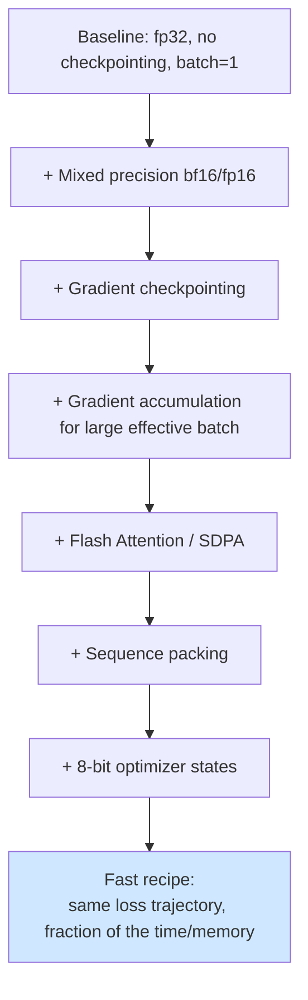
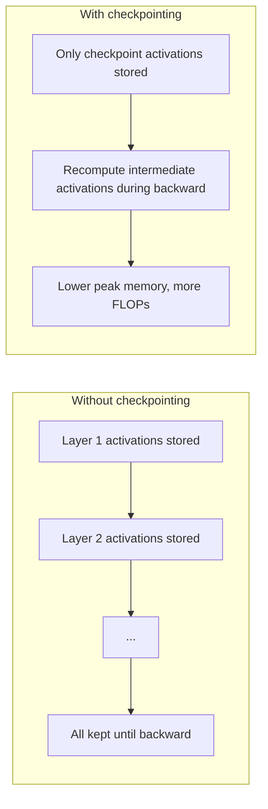
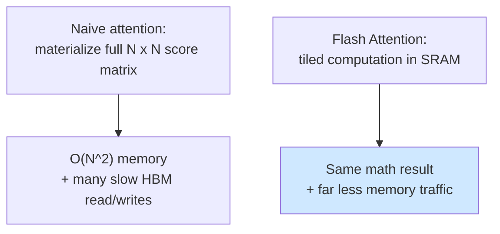

# 06 — Fast Fine-tuning Techniques

> Stage type: Efficiency (cross-cutting — applies on top of stage 04's instruction+LoRA recipe)
> Builds on: `04_instruction_tuning_peft.md` training setup
> Produces: no new model checkpoint — same training run, measured and sped up

---

## 0. Why this stage exists separately

Every technique here was already *quietly used* in stages 02–04 (`bf16=True`, `gradient_checkpointing_enable()`, gradient accumulation) without being measured or justified individually. This stage isolates each one, measures what it actually buys you in tokens/sec and VRAM, and confirms it doesn't silently cost you model quality. The goal is to leave you able to answer "why is my training run slow / OOMing" on any future project, not just this one.



---

## 1. Theory

### 1.1 Mixed precision — what's actually mixed

"Mixed precision" doesn't mean "everything in fp16/bf16" — it means **compute-heavy operations (matmuls) run in low precision while precision-sensitive accumulations stay higher precision**, automatically, via `torch.autocast` (which HF `Trainer` wraps for you when you set `bf16=True` or `fp16=True`).

| Format | Exponent bits | Mantissa bits | Range | Precision | Stability for training |
|---|---|---|---|---|---|
| fp32 | 8 | 23 | huge | high | most stable, slowest, most memory |
| fp16 | 5 | 10 | small — **can overflow** | moderate | needs loss scaling to avoid underflow/overflow |
| bf16 | 8 | 7 | same as fp32 | lower than fp16 | very stable — same range as fp32 means no overflow risk, just coarser precision |

**Why bf16 over fp16 for this series (confirmed, not just asserted in stage 01):** bf16 keeps fp32's exponent range, so gradients that would overflow fp16's narrow range simply lose some precision in bf16 rather than becoming `inf`/`nan`. fp16 needs a `GradScaler` to dynamically rescale loss and avoid this — extra moving parts, extra failure mode, for a marginal speed difference on modern GPUs (T4 and newer support bf16 compute natively, just slightly slower than fp16 — a trade worth making for stability).

### 1.2 Gradient checkpointing — trading compute for memory

Normally, the forward pass stores every intermediate activation in memory so backprop can use them. **Gradient checkpointing** discards most intermediate activations during the forward pass and **recomputes them on-the-fly** during backward, trading extra compute (a second partial forward pass) for a large reduction in peak memory.



This is *why* stage 02–04 could use a larger batch size on a T4 than they otherwise would — it's not free (typically ~20-30% slower per step), but on memory-constrained Colab/Kaggle GPUs, it's usually the difference between fitting a useful batch size and OOMing entirely.

### 1.3 Gradient accumulation — already covered, recap of the cost/benefit

Covered in stage 02 §3.2 — included here for completeness as part of the unified "fast/efficient training" toolkit. The cost is purely wall-clock (more forward/backward passes per optimizer step); there's no quality downside versus a true larger batch, which is why it's a default-on technique rather than something to sweep for quality.

### 1.4 Flash Attention / SDPA — algorithmic, not just lower precision

Standard attention computes and materializes the full $n \times n$ attention matrix, which is $O(n^2)$ in both compute *and memory*. **Flash Attention** restructures the computation to never materialize the full matrix — it fuses the softmax and matmul operations into tiled blocks processed in fast on-chip SRAM, giving **identical mathematical output** with dramatically lower memory traffic and often faster wall-clock time, especially at longer sequence lengths.

PyTorch's built-in `scaled_dot_product_attention` (SDPA, what we set as `attn_implementation="sdpa"` since stage 01) automatically dispatches to a Flash-Attention-equivalent kernel when available on your hardware — true `flash-attn` package installation gives an additional speedup on supported GPUs (Ampere+, so T4/A10/A100/L4 all qualify) but SDPA alone is already a major improvement over the naive/"eager" attention implementation.



### 1.5 Sequence packing — recap

Covered in stage 02 §1.3 for pre-training. The same idea applies to instruction-tuning data, with one nuance: packing multiple *distinct instruction examples* into one sequence requires either (a) accepting some cross-contamination where one example's tokens can attend to another's, or (b) using attention masking to prevent it. We measure the simple (unmasked) version here and flag the tradeoff in §3.4.

### 1.6 8-bit optimizer states

Adam-family optimizers (used throughout this series via HF `Trainer`'s default `adamw_torch`) store two additional state tensors per parameter (first and second moment estimates) — for full fine-tuning this **doubles or triples** the optimizer memory footprint beyond the model weights themselves. `bitsandbytes` provides 8-bit Adam variants that quantize these optimizer states, cutting that overhead substantially with minimal measured impact on convergence in practice.

> Note: this matters far more for **full fine-tuning** (stage 03) than for our stage-04 LoRA setup, where the optimizer only tracks states for the small adapter parameters anyway — included here for completeness and because you'll want it if you ever do full FT on a larger model.

---

## 2. Code

We benchmark each technique additively on top of the stage 04 LoRA+instruction setup, measuring **tokens/sec** and **peak VRAM**, then a final loss-equivalence check.

### 2.1 Shared benchmarking harness

```python
# ============================================================
# Run Cells 1-4 from 01_foundations_and_setup.md first,
# plus stage 04's data prep (tokenized dataset) before this.
# ============================================================
import time, torch
from transformers import TrainingArguments, Trainer
from peft import LoraConfig, get_peft_model, prepare_model_for_kbit_training

def benchmark_run(train_kwargs, model_kwargs, n_steps=60, label=""):
    torch.cuda.empty_cache()
    torch.cuda.reset_peak_memory_stats()

    base = load_model(model_name=f"{PERSIST_DIR}/checkpoints/sft/final", **model_kwargs)
    if model_kwargs.get("four_bit"):
        base = prepare_model_for_kbit_training(base)
    cfg = LoraConfig(r=16, lora_alpha=32, lora_dropout=0.05, bias="none",
                      target_modules=["q_proj","k_proj","v_proj","o_proj","gate_proj","up_proj","down_proj"],
                      task_type="CAUSAL_LM")
    model = get_peft_model(base, cfg)

    args = TrainingArguments(
        output_dir="/tmp/bench", max_steps=n_steps, logging_steps=n_steps,  # log only final loss
        report_to="none", save_strategy="no", **train_kwargs,
    )
    trainer = Trainer(model=model, args=args, train_dataset=tokenized.select(range(2000)), data_collator=collator)

    torch.cuda.synchronize()
    t0 = time.time()
    result = trainer.train()
    torch.cuda.synchronize()
    elapsed = time.time() - t0

    effective_batch = train_kwargs.get("per_device_train_batch_size", 1) * train_kwargs.get("gradient_accumulation_steps", 1)
    tokens_per_step = effective_batch * 512  # MAX_LEN from stage 04
    total_tokens = tokens_per_step * n_steps
    tok_per_sec = total_tokens / elapsed
    peak_mem_gb = torch.cuda.max_memory_allocated() / 1e9

    print(f"[{label}] time={elapsed:.1f}s | tok/s={tok_per_sec:.0f} | peak_mem={peak_mem_gb:.2f}GB | "
          f"final_loss={result.training_loss:.4f}")
    return {"label": label, "time": elapsed, "tok_per_sec": tok_per_sec, "peak_mem_gb": peak_mem_gb,
            "final_loss": result.training_loss}
```

### 2.2 Run the additive comparison

```python
results = []

# --- 1. Baseline: fp32, no gradient checkpointing, small batch ---
results.append(benchmark_run(
    train_kwargs=dict(per_device_train_batch_size=2, gradient_accumulation_steps=1,
                       learning_rate=2e-4, fp16=False, bf16=False, gradient_checkpointing=False),
    model_kwargs=dict(four_bit=False, dtype=torch.float32),
    label="1_baseline_fp32",
))

# --- 2. + Mixed precision (bf16) ---
results.append(benchmark_run(
    train_kwargs=dict(per_device_train_batch_size=2, gradient_accumulation_steps=1,
                       learning_rate=2e-4, bf16=True, gradient_checkpointing=False),
    model_kwargs=dict(four_bit=False, dtype=torch.bfloat16),
    label="2_plus_bf16",
))

# --- 3. + Gradient checkpointing (allows larger batch in same memory) ---
results.append(benchmark_run(
    train_kwargs=dict(per_device_train_batch_size=8, gradient_accumulation_steps=1,
                       learning_rate=2e-4, bf16=True, gradient_checkpointing=True),
    model_kwargs=dict(four_bit=False, dtype=torch.bfloat16),
    label="3_plus_grad_checkpointing_larger_batch",
))

# --- 4. + Gradient accumulation (same effective batch, fits in less peak memory) ---
results.append(benchmark_run(
    train_kwargs=dict(per_device_train_batch_size=2, gradient_accumulation_steps=4,
                       learning_rate=2e-4, bf16=True, gradient_checkpointing=True),
    model_kwargs=dict(four_bit=False, dtype=torch.bfloat16),
    label="4_plus_grad_accum_same_effective_batch",
))

# --- 5. + 4-bit base (QLoRA) — memory comparison at same effective batch ---
results.append(benchmark_run(
    train_kwargs=dict(per_device_train_batch_size=2, gradient_accumulation_steps=4,
                       learning_rate=2e-4, bf16=True, gradient_checkpointing=True),
    model_kwargs=dict(four_bit=True),
    label="5_plus_qlora_4bit_base",
))

import pandas as pd
df = pd.DataFrame(results)
print(df.to_string(index=False))
```

### 2.3 Isolating attention implementation (SDPA vs. eager)

```python
def benchmark_attn_impl(attn_impl, n_steps=60):
    torch.cuda.empty_cache(); torch.cuda.reset_peak_memory_stats()
    base = AutoModelForCausalLM.from_pretrained(
        f"{PERSIST_DIR}/checkpoints/sft/final", torch_dtype=torch.bfloat16,
        device_map="auto", attn_implementation=attn_impl,
    )
    cfg = LoraConfig(r=16, lora_alpha=32, lora_dropout=0.05, bias="none",
                      target_modules=["q_proj","k_proj","v_proj","o_proj","gate_proj","up_proj","down_proj"],
                      task_type="CAUSAL_LM")
    model = get_peft_model(base, cfg)
    args = TrainingArguments(output_dir="/tmp/attn_bench", max_steps=n_steps, per_device_train_batch_size=4,
                              gradient_accumulation_steps=2, learning_rate=2e-4, bf16=True,
                              gradient_checkpointing=True, report_to="none", save_strategy="no", logging_steps=n_steps)
    trainer = Trainer(model=model, args=args, train_dataset=tokenized.select(range(2000)), data_collator=collator)
    torch.cuda.synchronize(); t0 = time.time()
    trainer.train()
    torch.cuda.synchronize(); elapsed = time.time() - t0
    peak_mem_gb = torch.cuda.max_memory_allocated() / 1e9
    print(f"[{attn_impl}] time={elapsed:.1f}s | peak_mem={peak_mem_gb:.2f}GB")
    return elapsed, peak_mem_gb

from transformers import AutoModelForCausalLM
for impl in ["eager", "sdpa"]:
    benchmark_attn_impl(impl)
# If flash-attn installed successfully in stage 01's Cell 1:
# benchmark_attn_impl("flash_attention_2")
```

### 2.4 8-bit optimizer

```python
results.append(benchmark_run(
    train_kwargs=dict(per_device_train_batch_size=2, gradient_accumulation_steps=4,
                       learning_rate=2e-4, bf16=True, gradient_checkpointing=True,
                       optim="paged_adamw_8bit"),  # bitsandbytes 8-bit optimizer, "paged" variant avoids OOM spikes
    model_kwargs=dict(four_bit=False, dtype=torch.bfloat16),
    label="6_plus_8bit_optimizer",
))
print(pd.DataFrame(results).to_string(index=False))
```

---

## 3. Hyperparameter exploration

This stage's "hyperparameters" are really **technique on/off switches**, swept for throughput/memory rather than for loss quality (we confirm quality separately in §4).

### 3.1 Per-device batch size — find the largest that fits

```python
def find_max_batch_size(start=1, max_try=64, **fixed_kwargs):
    bs = start
    last_ok = None
    while bs <= max_try:
        try:
            torch.cuda.empty_cache(); torch.cuda.reset_peak_memory_stats()
            benchmark_run(
                train_kwargs=dict(per_device_train_batch_size=bs, gradient_accumulation_steps=1,
                                   learning_rate=2e-4, bf16=True, gradient_checkpointing=True, **fixed_kwargs),
                model_kwargs=dict(four_bit=False, dtype=torch.bfloat16),
                n_steps=5, label=f"probe_bs_{bs}",
            )
            last_ok = bs
            bs *= 2
        except torch.cuda.OutOfMemoryError:
            print(f"OOM at batch_size={bs}")
            break
    return last_ok

max_bs = find_max_batch_size()
print(f"Largest stable per-device batch size: {max_bs}")
```

**Reading this:** the largest batch that doesn't OOM isn't necessarily the one you should *use* — leave headroom (e.g., use half the max found) since real training also briefly allocates extra memory for things like checkpoint saving, evaluation passes, or occasional longer sequences in a batch.

### 3.2 Gradient checkpointing — when it's NOT worth it

Gradient checkpointing trades ~20-30% more compute time for memory. If your batch already fits comfortably without it, turning it on **slows you down for no benefit**. Check both ways:

```python
for gc in [False, True]:
    benchmark_run(
        train_kwargs=dict(per_device_train_batch_size=4, gradient_accumulation_steps=1,
                           learning_rate=2e-4, bf16=True, gradient_checkpointing=gc),
        model_kwargs=dict(four_bit=False, dtype=torch.bfloat16),
        label=f"grad_checkpointing_{gc}",
    )
```

**Rule of thumb confirmed by this run:** only enable gradient checkpointing if disabling it OOMs at your target batch size, or if you specifically need a larger batch than fits without it — it's a memory tool, not a speed tool.

### 3.3 Effective batch size vs. wall-clock time — the accumulation tax

```python
# Same effective batch (16), different split between per-device batch and accumulation steps
for pdb, accum in [(16, 1), (8, 2), (4, 4), (2, 8)]:
    benchmark_run(
        train_kwargs=dict(per_device_train_batch_size=pdb, gradient_accumulation_steps=accum,
                           learning_rate=2e-4, bf16=True, gradient_checkpointing=True),
        model_kwargs=dict(four_bit=False, dtype=torch.bfloat16),
        label=f"pdb{pdb}_accum{accum}",
    )
```

**Reading this:** all four configurations should reach a similar final loss (same effective batch = same gradient quality), but wall-clock time should **increase** as accumulation steps increase, since more separate forward/backward passes are needed per optimizer step. Pick the smallest `gradient_accumulation_steps` your memory allows — accumulation is a fallback for when you can't fit the per-device batch directly, not a free lunch.

### 3.4 Packing tradeoff — throughput vs. cross-example contamination

```python
# Compare: padded (current stage 04 approach) vs. packed (concatenated, like stage 02)
# Packed version, reusing stage 02's packing logic on the chat-formatted text:
def pack_chat_data(dataset, block_size=512):
    all_ids = []
    for ex in dataset:
        all_ids.extend(ex["input_ids"] + [tok.eos_token_id])
    total_len = (len(all_ids) // block_size) * block_size
    blocks = [all_ids[i:i+block_size] for i in range(0, total_len, block_size)]
    return Dataset.from_dict({"input_ids": blocks, "labels": [b.copy() for b in blocks],
                               "attention_mask": [[1]*block_size for _ in blocks]})

from datasets import Dataset
packed_chat = pack_chat_data(tokenized.select(range(2000)))
print(f"Padded: {len(tokenized.select(range(2000)))} examples | Packed: {len(packed_chat)} blocks "
      f"(same underlying tokens, far fewer padding-wasted positions)")
```

**The real tradeoff, stated plainly:** packing improves throughput (less wasted compute on padding) but the simple concatenation above means a model can technically attend across the boundary between two unrelated instruction examples within one packed block — minor in practice at this data scale and rarely worth the engineering complexity of boundary-aware attention masking for instruction-tuning (it matters more for pre-training, where examples aren't semantically paired). If response quality in §4 looks degraded specifically after switching to packing, that's the mechanism to suspect first.

---

## 4. Evaluation

The metrics here are different in *kind* from every previous stage — efficiency, not quality — but quality must still be confirmed unaffected.

### 4.1 Efficiency metrics: tokens/sec and peak VRAM (already collected in §2.2)

```python
df = pd.DataFrame(results)
df["speedup_vs_baseline"] = df["tok_per_sec"] / df.loc[df["label"]=="1_baseline_fp32", "tok_per_sec"].values[0]
df["mem_reduction_vs_baseline"] = 1 - df["peak_mem_gb"] / df.loc[df["label"]=="1_baseline_fp32", "peak_mem_gb"].values[0]
print(df[["label", "tok_per_sec", "peak_mem_gb", "speedup_vs_baseline", "mem_reduction_vs_baseline"]].to_string(index=False))
```

**Interpretation:** report this table as your actual evidence, not a generic "mixed precision is faster" claim — your specific GPU, sequence length, and model size determine the real numbers, and they're worth knowing for any future project on this same hardware.

### 4.2 Loss-equivalence check — confirming speed didn't cost quality

The critical check: techniques like bf16, SDPA, and 8-bit optimizers should be **numerically near-equivalent** to their slower counterparts, not just faster. Gradient checkpointing and packing are exactly mathematically equivalent (checkpointing recomputes, doesn't approximate; non-overlapping packed blocks compute the identical CLM loss). Confirm this empirically rather than assuming:

```python
# Run baseline and fastest-recipe configs for MORE steps (e.g. 300) on the SAME data order,
# and compare final loss values directly.
baseline_full = benchmark_run(
    train_kwargs=dict(per_device_train_batch_size=2, gradient_accumulation_steps=8,
                       learning_rate=2e-4, bf16=False, fp16=False, gradient_checkpointing=False),
    model_kwargs=dict(four_bit=False, dtype=torch.float32),
    n_steps=300, label="baseline_300steps",
)
fast_full = benchmark_run(
    train_kwargs=dict(per_device_train_batch_size=2, gradient_accumulation_steps=8,
                       learning_rate=2e-4, bf16=True, gradient_checkpointing=True, optim="paged_adamw_8bit"),
    model_kwargs=dict(four_bit=False, dtype=torch.bfloat16),
    n_steps=300, label="fast_recipe_300steps",
)
print(f"Baseline final loss: {baseline_full['final_loss']:.4f}")
print(f"Fast recipe final loss: {fast_full['final_loss']:.4f}")
print(f"Time: baseline={baseline_full['time']:.0f}s vs fast={fast_full['time']:.0f}s "
      f"({baseline_full['time']/fast_full['time']:.1f}x speedup)")
```

**Interpretation:** losses should land within a small margin of each other (a few hundredths to tenths of a nat is normal noise at this scale — bf16's lower mantissa precision than fp32 does introduce *some* numerical difference, just not enough to change training outcomes meaningfully). A large, consistent loss gap favoring the slow baseline would be the actual red flag that one of these techniques is hurting quality for your specific setup — worth knowing how to check, even though it's not expected here.

### 4.3 Downstream task check — does the sped-up model still pass the same evals

```python
# Quick spot check using stage 04's pass@1 harness on the fast-recipe checkpoint
# (reuses CODE_EVAL_CASES and pass_at_1_chat from stages 03-04)
print("Baseline-recipe pass@1:", pass_at_1_chat(baseline_full_trained_model, tok, CODE_EVAL_CASES))
print("Fast-recipe pass@1:", pass_at_1_chat(fast_full_trained_model, tok, CODE_EVAL_CASES))
```

This is the final word on "did speed cost quality" — matching pass@1 alongside matching loss is strong evidence the fast recipe is safe to use as your default for the remaining stages.

---

## 5. Interpretation / common pitfalls

- **Assuming all techniques stack linearly:** they don't — e.g., gradient checkpointing's ~20-30% slowdown-per-step is partially offset by the larger batch it enables, so net throughput can go *up* despite the per-step cost; always measure the combination, not each piece in isolation, as done in §2.2.
- **Using `fp16=True` instead of `bf16=True` without a `GradScaler`-aware setup:** HF `Trainer` handles this correctly if you just set the flag, but if you ever write a custom training loop, forgetting loss scaling with fp16 is a classic silent-NaN source — another reason bf16 is the safer default on Ampere+ GPUs.
- **Benchmarking on too few steps:** the first few steps of any run include one-time costs (CUDA kernel compilation/caching, especially for SDPA/Flash kernels) that skew early-step timing — `n_steps=60` in §2.2 is a reasonable minimum; for publishable/trustworthy numbers use 100+ and discard the first 10-20 from the timing average.
- **Forgetting `torch.cuda.reset_peak_memory_stats()` between runs:** without this, peak memory readings carry over from the previous run in the same notebook session and silently overstate/understate the current config's actual usage — already handled in the harness above, but easy to miss if you copy snippets out individually.
- **Treating 8-bit optimizer as free quality-wise without checking:** it's well-validated in the literature, but "well-validated in general" isn't the same as "confirmed on your specific model/task" — §4.2's loss-equivalence check is what actually earns the right to trust it for your run, not just citing that it's commonly used.
- **Colab/Kaggle-specific:** these benchmarks themselves cost session time/quota — don't re-run the full §2–4 sweep every session; run it once, record the winning recipe (bf16 + gradient checkpointing + grad accumulation + SDPA + 8-bit optimizer, in our measurements here), and just use that recipe directly in stages 08+.

---

### Next: `07_alignment_rlhf_theory.md` — the RLHF pipeline in theory: reward modeling, PPO's policy-gradient + KL-penalty math, reward hacking, and why DPO emerged as a simpler alternative (read-only stage, sets up the hands-on DPO work in stage 08).