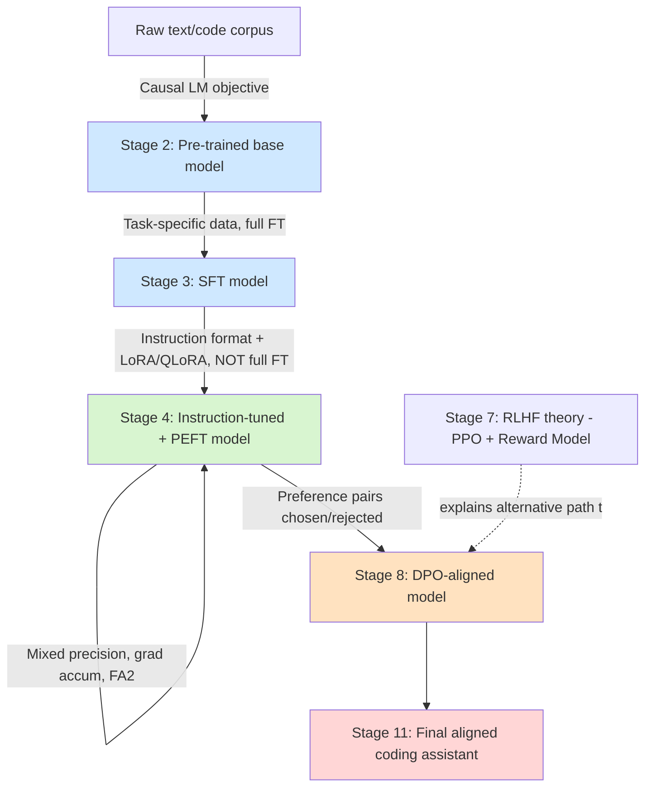

# LLM Training Pipeline: Pre-training → Fine-tuning → Alignment
### A hands-on, single-GPU tutorial series

---

## Why one running problem statement

Instead of using a different toy task per stage (which makes it impossible to compare results), this entire series uses **one problem statement** carried through every stage, so you can literally watch the *same* model's behavior change as it moves through the pipeline and evaluate it the same way each time.

> **Problem Statement:** Build a small language model that acts as a **Python coding assistant for beginners** — it should (1) have basic language/code modeling ability (pre-training), (2) be able to follow instructions like "write a function that..." (instruction tuning), (3) do this efficiently on consumer hardware (PEFT), and (4) prefer safe, well-explained, beginner-friendly answers over terse or risky ones (RLHF alignment via DPO, with PPO covered in theory).

We deliberately pick a **small base model (≤1–1.7B params, e.g. `Qwen2.5-0.5B`/`TinyLlama-1.1B`/`SmolLM2-1.7B`)** and a **tiny pre-training corpus** so that every stage actually finishes in minutes-to-an-hour on a single consumer GPU, while every concept (loss curves, KL divergence, reward hacking, etc.) is still genuinely visible. The same techniques scale to bigger models — only the compute budget changes, not the code.

**Assumed compute (default — tell me if this is wrong and I'll adjust):** 1x consumer GPU, 24GB VRAM class (e.g. RTX 3090/4090) or equivalent cloud GPU (T4/A10/A100). Every stage notes a "if you have less/more" adjustment.

**Assumed background:** You know HF Transformers, basic PyTorch, bitsandbytes. So we will *not* re-explain what a tokenizer is or what `AutoModelForCausalLM` does — we jump straight into training mechanics, math, and decisions.

---

## How each stage file is structured

Every numbered `.md` file in this series follows the same template so you always know where to look:

1. **Theory** — high-level but precise (math where it clarifies, not where it shows off), with a **Mermaid diagram** of the data/computation flow.
2. **Code** — runnable, minimal-but-complete, heavily commented at decision points (not at syntax level).
3. **Hyperparameter exploration** — *not* a fixed table. For every key hyperparameter: what it controls, the failure mode of too-high/too-low, a small sweep you actually run, and how to read the result.
4. **Evaluation** — the specific metric(s) appropriate to *that stage* (these differ a lot — perplexity is meaningless for RLHF, reward-model accuracy is meaningless for pre-training, etc.), with code to compute them and interpretation guidance ("loss=2.1, is that good?").
5. **Interpretation / common pitfalls** — what the numbers and curves actually mean, and what usually goes wrong at this stage.

---

## Tutorial Index

| # | File | Stage | What you'll build | Key eval metric(s) |
|---|------|-------|---|---|
| 00 | `00_INDEX.md` | — | This file | — |
| 01 | `01_foundations_and_setup.md` | Setup | Environment, model/data choice rationale, shared utilities used by every later stage | — |
| 02 | `02_pretraining.md` | Pre-training | Train a small LM from scratch (or continue-pretrain) on a Python/text corpus; causal LM objective | Perplexity, bits-per-byte, loss curves |
| 03 | `03_supervised_finetuning_sft.md` | Fine-tuning (SFT) | Full fine-tune (then compare to PEFT) on plain task data (no instruction format yet) — e.g. code completion | Perplexity delta vs base, task-specific exact-match/pass@k |
| 04 | `04_instruction_tuning_peft.md` | Fine-tuning (Instruction + PEFT, combined) | Reformat data into instruction/response chat-template pairs, train with LoRA/QLoRA directly (not full FT) — LoRA theory + instruction-following in one pass | Win-rate vs stage-03 SFT (LLM-judge), pass@k on held-out coding prompts, **+ efficiency metrics**: trainable %, VRAM, tokens/sec |
| ~~05~~ | *(merged into 04 — separate full-FT-then-LoRA comparison dropped to save a redundant run)* | — | — | — |
| 06 | `06_fast_finetuning_techniques.md` | Efficiency | Mixed precision (fp16/bf16), gradient checkpointing, large effective batch via grad accumulation, Flash Attention, packing, 8-bit optimizers — layered on top of stage 04's LoRA run | Throughput (tok/s), VRAM footprint, loss-equivalence check (does speed cost quality?) |
| 07 | `07_alignment_rlhf_theory.md` | Alignment (Theory) | RLHF pipeline: reward modeling + PPO (full math: policy gradient, KL penalty, reward hacking), then DPO derivation as RL-free alternative | (theory only — sets up #08) |
| 08 | `08_alignment_dpo_practical.md` | Alignment (Practical) | Build a preference dataset (tiny, reused not generated-from-scratch), train with DPO using TRL | Reward margin, win-rate vs SFT model (LLM-judge), KL-to-reference, safety/format adherence rate |
| 09 | `09_hyperparameter_strategy.md` | Cross-cutting | Consolidated framework: how to *choose* (not just tune) LR, batch size, warmup, epochs, LoRA rank, KL coeff, beta (DPO) — search strategies (grid/random/Bayesian), and compute-aware tradeoffs | — (meta-stage) |
| 10 | `10_evaluation_playbook.md` | Cross-cutting | Consolidated evaluation reference: which metric for which stage, why perplexity ≠ quality, LLM-as-judge setup, human eval rubric, benchmark contamination caveats | — (meta-stage) |
| 11 | `11_end_to_end_pipeline_summary.md` | Wrap-up | Full pipeline diagram (Mermaid), model lineage comparison table (base → pretrain → SFT → instruct → PEFT → DPO), what to do next at real scale | — |

---

## Pipeline at a glance

---

## Suggested order of attack (given your time constraint)

Since you mentioned limited time, here's the recommended path and what's safe to skim vs. do hands-on:

1. **01 → 02 → 03 → 04**: do hands-on, these are short (small model, small data, each run is minutes).
2. **05 + 06 together**: PEFT and fast-finetuning are tightly coupled in practice (you'll almost always use QLoRA + bf16 + grad accumulation together) — I'll show them as one combined practical recipe, with 05 focused on *what* PEFT changes and 06 focused on *how to make any training loop faster*.
3. **07**: read theory only first (PPO math, reward hacking, why DPO emerged) — skip running PPO unless you want the full RLHF experience; it's the most compute- and complexity-heavy stage by far.
4. **08**: do hands-on — DPO via TRL is a ~50 line training loop once data is ready, and is what you'll evaluate alongside everything else.
5. **09, 10**: reference docs — read once, then keep open as a lookup while doing 01–08.
6. **11**: 10-minute wrap-up once everything else is done.

---

## What's deferred (per your note)

- Dataset *creation* from scratch (we'll use small existing datasets / tiny hand-built preference sets, not build a data pipeline).
- Anything you said you'd specify later (additional requirements) — flagged here so we don't forget: ⚠️ **pending — you said you'll share more requirements after this first pass is done.**

---

### Next step

Tell me to proceed and I'll start with `01_foundations_and_setup.md` (environment + model/data decisions + shared eval/utility code that every later stage imports), then move stage by stage. If you want me to reorder, merge, or drop any stage (e.g. skip PPO theory entirely, or skip full-FT and go straight to PEFT), say so now before I start writing — restructuring later means rewriting cross-references.