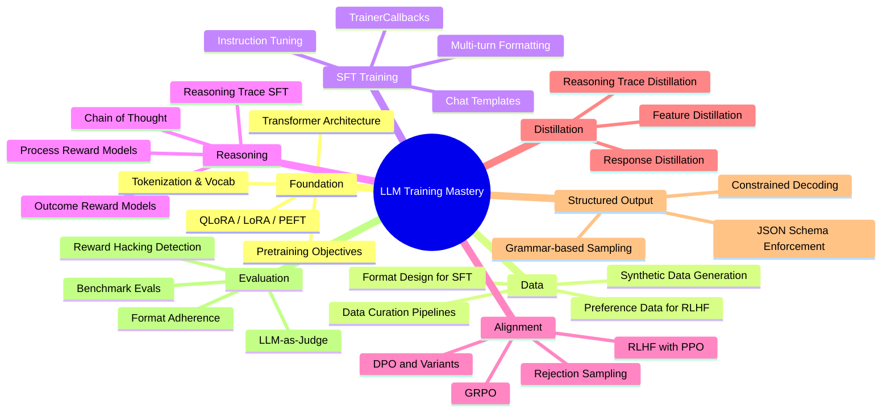
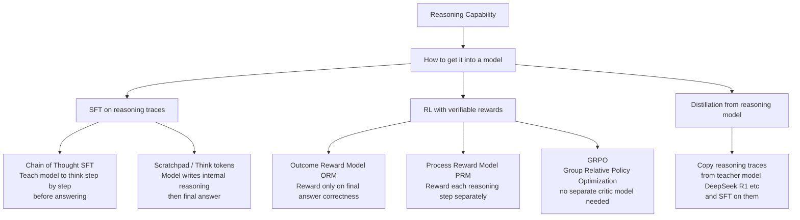
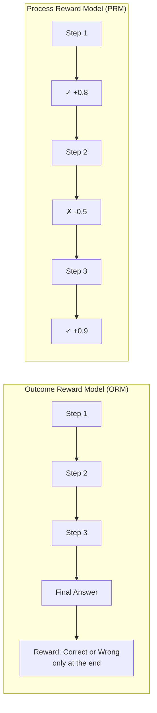
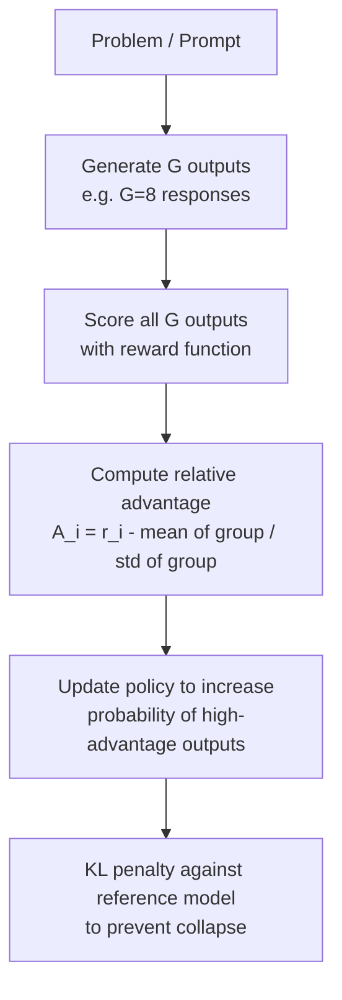
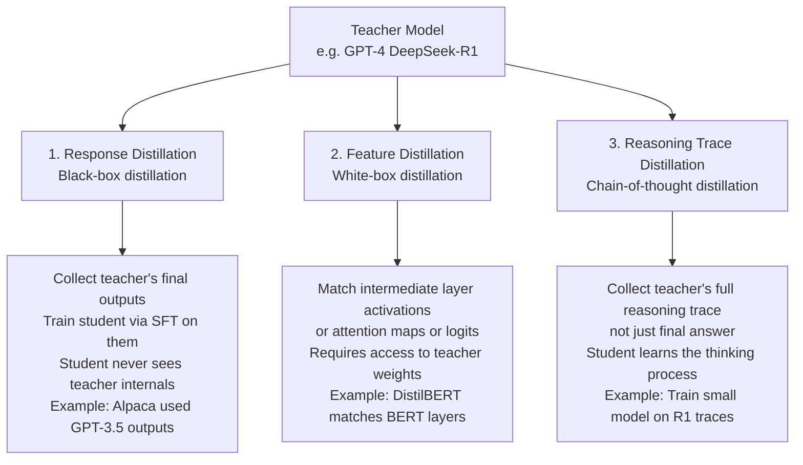
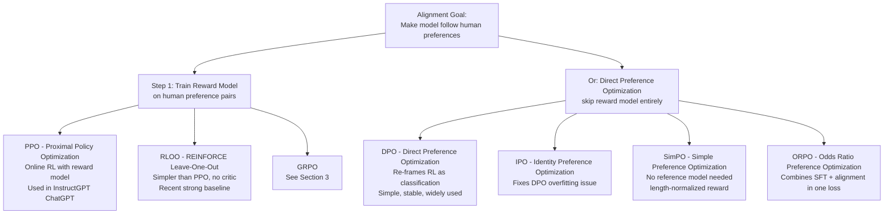
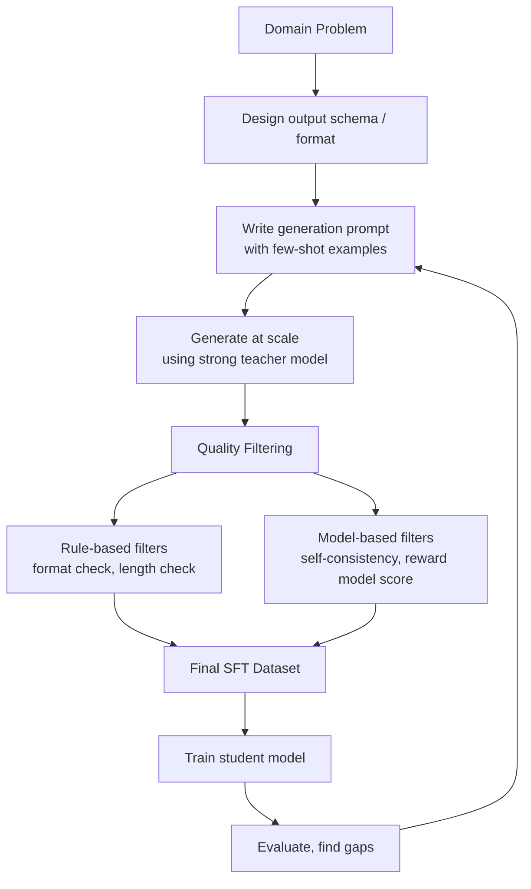
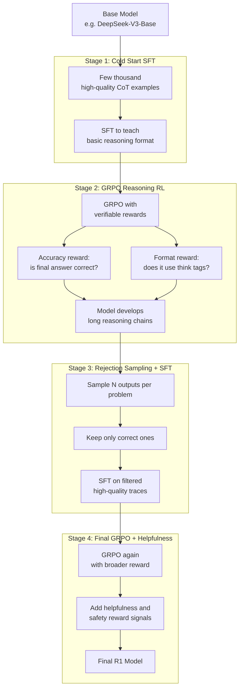

# LLM Training Mastery Roadmap
> From QLoRA fine-tuning → Reasoning Models → Alignment → Production-ready training

---

## Your Current Knowledge Assessment

| Area | Your Claim | Verdict | Notes |
|---|---|---|---|
| QLoRA fine-tuning | Done with LLaMA-2 | ✅ Solid foundation | Still the dominant PEFT method |
| Model Distillation (3 kinds) | Aware of 3 types | ⚠️ Partially right | The 3 types are specific — see Section 4 |
| Instruction Tuning | Task can vary | ✅ Correct | Broader than you may think though |
| Alignment Tuning | DPO-based | ⚠️ DPO is one method | PPO, GRPO, SimPO, RLOO also exist |
| Reasoning Models | Not familiar | 🔴 Gap to fill | Core of modern frontier models |
| TrainerCallbacks | Not aware | 🔴 Gap to fill | Critical for structured output training |
| Structured Output | Not familiar | 🔴 Gap to fill | OpenAI/vLLM both support this |

---

## The Full Map



---

## Section 1 — Foundation (You Have This, Verify the Gaps)

### 1.1 LoRA / QLoRA Refresh

You already know QLoRA. What may have changed:

- **LoRA rank selection** — newer work shows rank 16–64 is usually enough; higher is rarely better
- **DoRA** (Decomposed LoRA) — splits weight into magnitude + direction, often outperforms plain LoRA
- **LoRA+** — different learning rates for A and B matrices, simple 2x speedup trick
- **rsLoRA** — scales LoRA by `1/sqrt(r)` instead of `1/r`, better for high ranks

```
Standard LoRA:   W = W0 + (alpha/r) * B*A
rsLoRA:          W = W0 + (alpha/sqrt(r)) * B*A   ← more stable at high rank
DoRA:            W = (m / ||W0 + BA||) * (W0 + BA) ← magnitude-direction split
```

**What to do**: Read the DoRA paper (Liu et al. 2024). 30-min read, high payoff.

---

### 1.2 PEFT Methods Beyond LoRA

| Method | What it does | When to use |
|---|---|---|
| LoRA | Low-rank adapter on attention/MLP | General fine-tuning |
| QLoRA | LoRA + 4-bit NF4 quantized base | Low VRAM fine-tuning |
| DoRA | Decomposed weight adaptation | Better quality, same cost |
| Prefix Tuning | Learnable tokens prepended | Very few trainable params |
| IA3 | Rescales activations, tiny param count | Extreme low-resource |
| Full Fine-tuning | All weights updated | When you have big compute |

---

## Section 2 — SFT and TrainerCallbacks (Your Immediate Gap)

### 2.1 HuggingFace TrainerCallback

This is what was used in the paper you read. It hooks into the training loop at specific events:

```python
from transformers import TrainerCallback, TrainingArguments, Trainer

class FormatMonitorCallback(TrainerCallback):
    
    # Fires at the start of training
    def on_train_begin(self, args, state, control, **kwargs):
        print("Training started")
    
    # Fires after every optimizer step
    def on_step_end(self, args, state, control, model=None, **kwargs):
        if state.global_step % 100 == 0:
            # Generate sample, run regex, log adherence
            pass
    
    # Fires at end of each epoch
    def on_epoch_end(self, args, state, control, **kwargs):
        pass
    
    # Fires when eval loop completes
    def on_evaluate(self, args, state, control, metrics=None, **kwargs):
        print(f"Eval metrics: {metrics}")

trainer = Trainer(
    model=model,
    args=training_args,
    callbacks=[FormatMonitorCallback()]  # ← plug in here
)
```

**Key events available:**
`on_train_begin` → `on_epoch_begin` → `on_step_begin` → `on_step_end` → `on_log` → `on_evaluate` → `on_epoch_end` → `on_train_end`

### 2.2 TRL Library — The Modern SFT Stack

TRL (by HuggingFace) is what everyone uses now for fine-tuning. Wraps Trainer with LLM-specific features:

```python
from trl import SFTTrainer, SFTConfig
from peft import LoraConfig

lora_config = LoraConfig(
    r=16,
    lora_alpha=32,
    target_modules=["q_proj", "v_proj"],
    lora_dropout=0.05,
    task_type="CAUSAL_LM"
)

trainer = SFTTrainer(
    model=model,
    args=SFTConfig(
        output_dir="./output",
        num_train_epochs=3,
        per_device_train_batch_size=4,
        gradient_accumulation_steps=4,
        packing=True,           # ← packs short sequences, big speedup
        max_seq_length=2048,
    ),
    train_dataset=dataset,
    peft_config=lora_config,    # ← QLoRA goes here
)
```

**Key TRL concepts you should know:**

| Feature | What it does |
|---|---|
| `packing=True` | Packs multiple short examples into one sequence — major throughput gain |
| `DataCollatorForCompletionOnlyLM` | Masks the prompt tokens, only computes loss on completion |
| `chat_template` | Formats multi-turn conversations correctly per model family |
| `neftune_noise_alpha` | Adds noise to embeddings during training — improves instruction following |

### 2.3 Chat Templates — Critical for Multi-Turn

Every model family has its own format. Getting this wrong silently destroys quality:

```
# LLaMA-3 format
<|begin_of_text|><|start_header_id|>system<|end_header_id|>
You are helpful<|eot_id|>
<|start_header_id|>user<|end_header_id|>
Hello<|eot_id|>
<|start_header_id|>assistant<|end_header_id|>
Hi!<|eot_id|>

# Mistral format  
<s>[INST] System prompt here. Hello [/INST] Hi! </s>

# Qwen format
<|im_start|>system
You are helpful<|im_end|>
<|im_start|>user
Hello<|im_end|>
<|im_start|>assistant
Hi!<|im_end|>
```

Always use `tokenizer.apply_chat_template()` — never construct these manually.

---

## Section 3 — Reasoning Models (Your Biggest Gap)



### 3.1 Chain of Thought (CoT) — The Foundation

Two ways to add CoT:

**Zero-shot CoT** — just prompt engineering, no training:
```
"Let's think step by step."  ← appending this to prompts dramatically improves reasoning
```

**CoT SFT** — train on data that contains reasoning traces:
```
Input:  "What is 17 * 23?"
Output: "<think>
         17 * 23 = 17 * 20 + 17 * 3
                 = 340 + 51
                 = 391
         </think>
         The answer is 391."
```

The model learns that `<think>...</think>` is where reasoning happens. At inference, it generates this block before the final answer.

### 3.2 Process Reward Models vs Outcome Reward Models



- **ORM**: Simpler, trains on (problem, final_answer, correct/wrong). Cannot tell you *where* the model went wrong.
- **PRM**: Harder to get training data for (need human step annotations), but teaches the model *which steps are valid reasoning*, not just whether the final answer is right. Used in OpenAI's o1 process.

### 3.3 GRPO — Group Relative Policy Optimization

This is what DeepSeek-R1 used. The key insight: **you don't need a separate critic/value model** (unlike PPO).



**Why GRPO > PPO for reasoning:**

| | PPO | GRPO |
|---|---|---|
| Needs value/critic model | ✅ Yes (doubles memory) | ❌ No |
| Variance reduction | Via critic baseline | Via group mean baseline |
| Best for | General RLHF | Verifiable reward tasks (math, code) |
| Used in | InstructGPT | DeepSeek-R1, Qwen reasoning |

**GRPO loss (simplified):**
```
L_GRPO = -E[ A_i * log π_θ(o_i | q) ] + β * KL(π_θ || π_ref)

where A_i = (r_i - mean(r_group)) / std(r_group)
```

**Reward functions for GRPO** — no neural reward model needed when reward is verifiable:
```python
def math_reward(response, ground_truth):
    extracted = extract_final_answer(response)
    return 1.0 if extracted == ground_truth else 0.0

def format_reward(response):
    has_think = bool(re.search(r"<think>.*?</think>", response, re.DOTALL))
    return 0.5 if has_think else 0.0

# Combine rewards
total_reward = math_reward(...) + format_reward(...)
```

**TRL now has GRPOTrainer:**
```python
from trl import GRPOTrainer, GRPOConfig

trainer = GRPOTrainer(
    model=model,
    reward_funcs=[math_reward, format_reward],  # ← your reward functions
    args=GRPOConfig(num_generations=8),         # ← G=8 in the diagram above
    train_dataset=dataset,
)
```

---

## Section 4 — Distillation (Correcting Your Understanding)

You said "3 kinds" — you are right that there are 3, but the actual 3 depend on the taxonomy. Here is the correct breakdown:



| Type | Access needed | What student learns | Cost |
|---|---|---|---|
| Response | API / outputs only | Final answer style | Cheapest |
| Feature | Full model weights | Internal representations | Expensive |
| Reasoning Trace | API with CoT output | How to reason | Medium |

**Most practical for you today**: Response + Reasoning Trace distillation. You can generate DeepSeek-R1 or Qwen-QwQ traces and train a smaller model on them.

---

## Section 5 — Alignment Tuning (Expanding Your DPO Knowledge)

You correctly identified DPO. Here is the full family:



### 5.1 DPO in Detail

DPO requires **preference pairs** — for the same prompt, you need a chosen (good) and rejected (bad) response:

```python
dataset = [
    {
        "prompt": "Explain gravity",
        "chosen": "Gravity is a fundamental force that attracts objects with mass toward each other...",
        "rejected": "Gravity makes things fall down."
    }
]
```

DPO loss:
```
L_DPO = -log σ( β * log[π_θ(y_w|x)/π_ref(y_w|x)] - β * log[π_θ(y_l|x)/π_ref(y_l|x)] )

y_w = chosen (winner), y_l = rejected (loser)
β controls how far you deviate from reference model
```

```python
from trl import DPOTrainer, DPOConfig

trainer = DPOTrainer(
    model=model,
    ref_model=ref_model,      # ← frozen copy of the SFT model
    args=DPOConfig(beta=0.1),
    train_dataset=dataset,    # ← needs prompt/chosen/rejected columns
)
```

### 5.2 When to use which

| Method | Best for | Needs |
|---|---|---|
| PPO | Complex reward, online feedback | Reward model + lots of compute |
| DPO | Offline preference data, stable training | Preference dataset + ref model |
| SimPO | When you want no ref model | Just preference dataset |
| ORPO | Single-stage SFT + alignment | No separate ref model or SFT stage |
| GRPO | Math/code/verifiable tasks | Reward function (no neural RM) |

---

## Section 6 — Structured Output Generation

### 6.1 How OpenAI's Structured Outputs Work

OpenAI's strict mode uses **constrained decoding** — at each token generation step, the logits are masked to only allow tokens that keep the output valid according to the schema.


### 6.2 Open-Source Equivalents

**Outlines** (most popular):
```python
import outlines

model = outlines.models.transformers("mistralai/Mistral-7B")

schema = {
    "type": "object",
    "properties": {
        "name": {"type": "string"},
        "age": {"type": "integer"}
    }
}

generator = outlines.generate.json(model, schema)
result = generator("Extract person info from: John is 30 years old")
# result is guaranteed to be valid JSON matching schema
```

**vLLM** (production serving with guided decoding):
```python
from vllm import LLM, SamplingParams

llm = LLM(model="mistralai/Mistral-7B-Instruct-v0.2")
params = SamplingParams(
    guided_decoding={
        "json": {"type": "object", "properties": {"answer": {"type": "string"}}}
    }
)
```

**LM-Format-Enforcer** — works with HuggingFace generate():
```python
from lmformatenforcer import JsonSchemaParser
from lmformatenforcer.integrations.transformers import build_transformers_prefix_allowed_tokens_fn

parser = JsonSchemaParser(schema)
prefix_fn = build_transformers_prefix_allowed_tokens_fn(tokenizer, parser)

output = model.generate(
    input_ids,
    prefix_allowed_tokens_fn=prefix_fn  # ← hooks into generate loop
)
```

---

## Section 7 — Synthetic Data Generation (What the Paper Did)

This is now a core skill — most modern fine-tuning is on synthetic data.



### Key pipelines to learn:

| Tool / Framework | Purpose |
|---|---|
| **Magpie** | Generate instruction data from any chat model by exploiting the chat template directly |
| **Self-Instruct** | Use model to generate its own instruction data |
| **Evol-Instruct** | Iteratively evolve simple instructions into complex ones |
| **UltraFeedback** | Generate preference data using GPT-4 as judge |
| **DeepSeek R1 pipeline** | Cold-start SFT → GRPO → rejection sampling → full GRPO |

---

## Section 8 — The DeepSeek-R1 Training Pipeline (Study This)

This is the blueprint for training reasoning models in 2024–2025:



**Key insight from R1**: Pure RL (Stage 2) is enough to develop emergent reasoning — the model learns to self-verify, backtrack, and extend reasoning chains **without any explicit supervision** on how to do this.

---

## Section 9 — Evaluation (Often Neglected)

Training without robust eval is flying blind.

### 9.1 LLM-as-Judge

```python
judge_prompt = """
You are evaluating a reasoning model's response.
Rate the response on:
1. Correctness (0-10)
2. Reasoning quality (0-10)  
3. Format adherence (0-10)

Response to evaluate:
{response}

Ground truth:
{ground_truth}

Return JSON: {"correctness": X, "reasoning": X, "format": X, "explanation": "..."}
"""
```

### 9.2 Reward Hacking — The Hidden Failure Mode

When you train with RL, models learn to maximize the reward signal, not the actual goal. Common patterns:

| Reward function | How models hack it |
|---|---|
| Length bonus | Model adds padding / repeats itself |
| Format regex check | Model outputs the regex pattern literally |
| Answer correctness | Model memorizes answer formats, not reasoning |
| Human preference | Model learns to sound confident, not be correct |

**Defense**: Use multiple independent reward signals. If a model can score high on all simultaneously, it likely did the right thing.

---

## Your Learning Sequence

```mermaid
gantt
    title Learning Roadmap
    dateFormat  X
    axisFormat  Week %s

    section Foundation Refresh
    DoRA and LoRA variants        :a1, 0, 1w
    TRL SFTTrainer + callbacks    :a2, 1, 2w
    Chat templates deep dive      :a3, 2, 1w

    section Reasoning
    CoT SFT hands-on              :b1, 3, 2w
    PRM vs ORM concepts           :b2, 5, 1w
    GRPO theory + GRPOTrainer     :b3, 6, 2w

    section Alignment
    DPO hands-on with TRL         :c1, 8, 2w
    SimPO and ORPO                :c2, 10, 1w

    section Distillation
    Response distillation project :d1, 11, 2w
    Reasoning trace distillation  :d2, 13, 2w

    section Structured Output
    Outlines + vLLM guided decode :e1, 15, 1w

    section Capstone
    Train domain reasoning model  :f1, 16, 3w
```



### Week-by-Week Priority

**Weeks 1–3: Fix immediate gaps**
- TRL library — SFTTrainer, DataCollatorForCompletionOnlyLM, packing
- TrainerCallbacks — implement the format monitor from the paper you read
- Chat templates — understand LLaMA-3, Mistral, Qwen formats

**Weeks 4–7: Reasoning**
- Build and train a CoT dataset on a domain you know
- Implement GRPO with TRL's GRPOTrainer on a math/logic problem
- Understand the R1 pipeline stages

**Weeks 8–11: Alignment**
- Build a preference dataset (use LLM-as-judge to annotate)
- Train DPO, compare to SFT baseline

**Weeks 12–15: Distillation + Structured Output**
- Generate reasoning traces from DeepSeek-R1 API
- Fine-tune a 3B/7B model on those traces
- Add constrained decoding with Outlines

**Weeks 16–19: Capstone**
- Pick a domain (medical, legal, your Nyaya example)
- Generate synthetic data → SFT → GRPO → evaluate

---

## Key Papers to Read (In Order)

1. **QLoRA** (Dettmers et al. 2023) — your foundation
2. **Self-Instruct** (Wang et al. 2023) — synthetic data generation
3. **DPO** (Rafailov et al. 2023) — direct preference optimization
4. **Let's Verify Step by Step** (Lightman et al. 2023) — PRM
5. **DeepSeek-R1** (DeepSeek 2025) — full reasoning pipeline
6. **GRPO** (Shao et al. 2024) — the algorithm
7. **SimPO** (Meng et al. 2024) — simple preference optimization
8. **DoRA** (Liu et al. 2024) — improved LoRA

---

## Tools & Libraries Reference

| Library | Purpose | Install |
|---|---|---|
| `trl` | SFT, DPO, GRPO, PPO trainers | `pip install trl` |
| `peft` | LoRA, QLoRA, DoRA | `pip install peft` |
| `bitsandbytes` | 4-bit/8-bit quantization | `pip install bitsandbytes` |
| `outlines` | Constrained decoding | `pip install outlines` |
| `vllm` | Fast inference + guided decode | `pip install vllm` |
| `lm-format-enforcer` | JSON/regex enforcement in HF | `pip install lm-format-enforcer` |
| `axolotl` | Config-driven fine-tuning wrapper | `pip install axolotl` |
| `LitGPT` | Clean reference implementations | GitHub: Lightning-AI/litgpt |

---

## Corrections Summary

1. **Distillation types** — the 3 types are Response, Feature, and Reasoning Trace. Not Soft-label/Hard-label/Progressive (that's a different taxonomy). Both are valid frameworks; the one above is more useful for LLM work.

2. **Alignment** — DPO is correct but it's one of ~6 viable methods. For reasoning/math tasks, GRPO has become dominant because it doesn't need a trained reward model.

3. **Instruction tuning** — your instinct is right that "tasks can vary." The modern framing is: instruction tuning = SFT on (instruction, response) pairs, and the data mix matters enormously. Single-task fine-tuning often hurts generalization; mixed-task usually helps.

4. **What you didn't know you were missing**: The TRL library has unified all of these (SFT, DPO, GRPO, PPO, RLOO) under one consistent API. Learning TRL is the fastest path to hands-on experience with everything above.