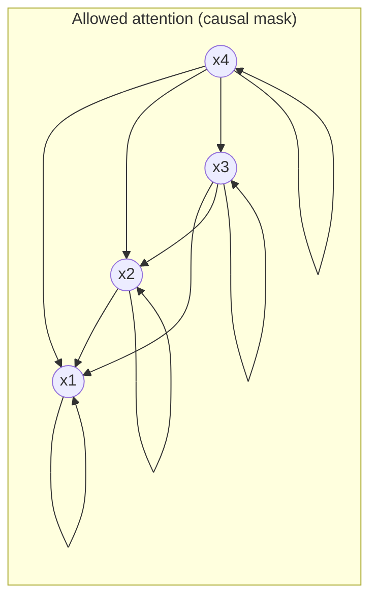
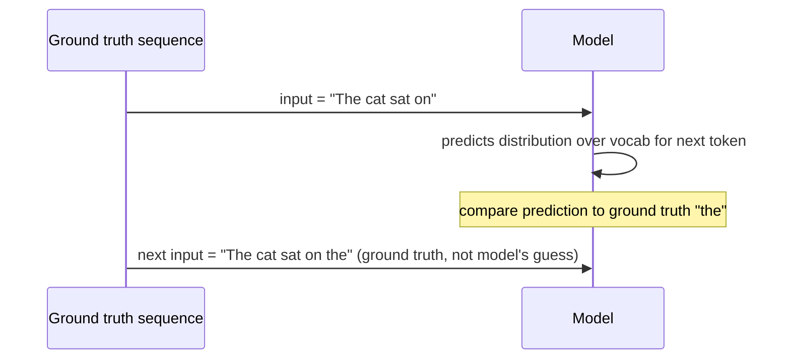
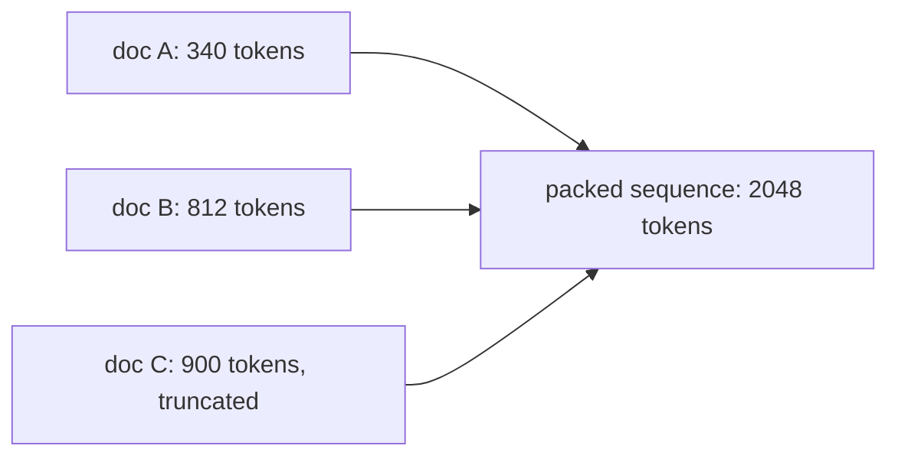

# Chapter 2 · Lesson 1 — Causal LM (Decoder-Only) Objective

> **Where this fits:** This is the objective behind GPT, LLaMA, Mistral, Qwen, and basically every modern chat model. Understanding it precisely — not just "predict the next token" — is what separates a candidate who read a blog post from one who has actually trained something.

---

## 1. The Core Idea, Precisely Stated

The causal LM objective trains a model to predict the next token given all previous tokens, and **only** previous tokens.

Formally, for a sequence of tokens `x1, x2, ..., xT`, the model learns:

```
P(x_t | x_1, x_2, ..., x_{t-1})   for every position t
```

The full sequence probability factorizes as:

```
P(x_1, ..., x_T) = Π P(x_t | x_1, ..., x_{t-1})
```

That's it — that's the entire mathematical foundation of GPT-style models. Everything else (attention masking, teacher forcing, loss computation) exists to make this factorization trainable efficiently.

---

## 2. Why "Causal"? — The Masking Constraint

The word *causal* means position `t` can only attend to positions `≤ t`. This isn't a design preference — it's a hard requirement, because at inference time the model genuinely doesn't have future tokens yet.



If you trained without this mask, the model would "cheat" by looking at the answer — great training loss, useless model at inference, since inference never has future tokens available.

**This is the exact thing you mixed up in your interview** — describing causal masking while explaining an "encoder" forward pass. Encoders (BERT-style) do **not** mask the future; every token attends to every other token, forward and backward. Masking is what makes a decoder a decoder. Worth burning into memory:

| | Encoder | Decoder |
|---|---|---|
| Attention direction | Bidirectional | Causal (left-to-right only) |
| Used for | Understanding tasks (classification, embeddings) | Generation tasks |
| Pretraining objective | Masked LM | Next-token prediction |

**Made concrete — the mask as an actual matrix.** For the 4-token sequence `[The, cat, sat, on]`, the raw attention scores before softmax get this mask added to them (0 = allowed, `-inf` = blocked):

```
              The    cat    sat    on
   The   [    0.0,  -inf,  -inf,  -inf ]
   cat   [    0.0,   0.0,  -inf,  -inf ]
   sat   [    0.0,   0.0,   0.0,  -inf ]
   on    [    0.0,   0.0,   0.0,   0.0 ]
```

After softmax, any `-inf` becomes `0` probability — those positions get **zero attention weight**, guaranteed, not just "small." That's why it's a hard architectural constraint and not a soft preference: it's implemented as literally negative infinity, so no amount of training can make the model attend to a future token.

---

## 3. Teacher Forcing — What It Actually Means

During training, you don't let the model use its *own* previous predictions to predict the next token. You feed it the **ground-truth** previous tokens from the corpus, every single time.



Why? Two reasons, and both matter in an interview:

1. **Parallelism.** Because every target token is already known, you can compute predictions for *all* positions in a sequence in a single forward pass (this is what the causal mask enables). No teacher forcing → you'd need to generate one token at a time even during training, which is orders of magnitude slower.
2. **Stability.** Early in training, the model's own predictions are close to random. Feeding those back in would compound errors and the model might never recover a coherent training signal.

**The known downside — exposure bias:** at inference time, the model *does* condition on its own previous outputs, not ground truth. If it makes a mistake early in generation, it's now in a distribution it never saw during training, and errors can compound. This is a real, named problem — bring it up unprompted in interviews, it signals depth.

> Production note: at scale, exposure bias is rarely solved with training-time tricks like scheduled sampling — it's just not worth the throughput cost. Instead it's handled downstream: better decoding strategies (nucleus/top-p sampling, beam search variants), and later training stages (SFT, RLHF/DPO) which do train against distributions closer to the model's own outputs and partially correct for this.

**Made concrete — a full worked pass through one sentence.**

Take the corpus sentence: `"The cat sat"` → tokens `[The, cat, sat]`.

In a single forward pass (this is the parallelism teacher forcing buys you — all four rows below happen simultaneously, not one at a time):

| Step | Model sees (input so far) | Model must predict | What's used as truth to compute loss |
|---|---|---|---|
| 1 | `The` | next token | `cat` (ground truth, regardless of what the model output) |
| 2 | `The, cat` | next token | `sat` (ground truth, even if step 1's prediction was wrong) |
| 3 | `The, cat, sat` | next token | `<eos>` |

Notice step 2: even if the model's step-1 prediction was garbage (say it predicted `dog` instead of `cat`), step 2 still conditions on the **real** `cat`, not the model's wrong guess. That's the entire mechanism in one sentence — the corpus is always the input, never the model's own output. At inference time, there's no corpus to fall back on, so step 2 would condition on whatever the model actually generated at step 1 — this is precisely where exposure bias enters.

---

## 4. From Objective to Loss Function

Next-token prediction is a classification problem at every position — classify over the vocabulary. So the loss is cross-entropy, applied token-by-token, then averaged.

```
Loss = -(1/T) * Σ log P(x_t | x_1, ..., x_{t-1})
```

In practice, this is implemented as a simple **shift-by-one** trick:

```
input_ids  = [BOS, "The", "cat", "sat", "on"]
labels     = ["The", "cat", "sat", "on", EOS]
```

The label at position `t` is just the input at position `t+1`. No separate labeling process, no human annotation — the corpus labels itself. This is *why* pretraining scales: unlimited free supervision from raw text.

**Made concrete — actual numbers through the loss formula.**

Say the vocabulary is tiny — just 5 tokens: `[cat, dog, sat, on, mat]`. The model just processed `"The cat"` and needs to predict the next token. Ground truth is `sat`. The model outputs these raw logits, which softmax turns into probabilities:

```
token:       cat    dog    sat    on     mat
logits:      1.2    0.3    2.1    0.5    0.9
softmax:     0.14   0.06   0.34   0.07   0.10   (rounded, sums to ~1.0)
```

The true token is `sat`, which the model assigned probability **0.34**. Cross-entropy loss for this single position:

```
loss = -log(0.34) = 1.08
```

Read that literally: the loss is just "how surprised was the model by the correct answer." If the model had been very confident and correct (say `P(sat) = 0.95`), loss would be `-log(0.95) = 0.05` — near zero. If it had been confidently *wrong* (say `P(sat) = 0.01`), loss would be `-log(0.01) = 4.6` — a heavy penalty. This is why cross-entropy punishes confident wrong answers much more harshly than uncertain ones — the `-log` curve is steep near 0.

The total training loss is just this same calculation averaged over every token position, in every sequence, in the batch.

**Sanity check worth knowing cold — loss at initialization.** Before any training, an untrained model's weights are effectively random, so its output distribution over the vocabulary is close to uniform. For a vocabulary of size `V`, uniform probability per token is `1/V`, so expected loss at step 0 is:

```
loss ≈ -log(1/V) = log(V)
```

For a 50,000-token vocabulary: `log(50000) ≈ 10.8`. **If your loss at training step 0 isn't close to this number, something is broken before you've even started** — bad initialization, a bug in the loss mask, or a data pipeline issue. This is a genuinely useful debugging fact, and dropping it unprompted in an interview signals you've actually run training, not just read about it.

**Perplexity — the same number, different units.** Perplexity is just `e^loss` (or `2^loss` if loss is in log base 2). A loss of 1.08 is a perplexity of about 2.9 — loosely, "the model was as uncertain as if it were guessing uniformly among ~3 tokens." Papers and leaderboards often report perplexity instead of raw loss because it's more interpretable at a glance; they're the same underlying quantity.

---

## 5. Code: Implementing the Loss Correctly

```python
import torch
import torch.nn.functional as F

def causal_lm_loss(logits, input_ids, ignore_index=-100):
    """
    logits:    (batch, seq_len, vocab_size) — raw model output, pre-softmax
    input_ids: (batch, seq_len) — the same sequence used as input
    """
    # Shift: predict token t+1 from tokens up to t
    shift_logits = logits[:, :-1, :].contiguous()
    shift_labels = input_ids[:, 1:].contiguous()

    loss = F.cross_entropy(
        shift_logits.view(-1, shift_logits.size(-1)),
        shift_labels.view(-1),
        ignore_index=ignore_index,   # used to mask padding tokens, see below
    )
    return loss
```

**Three details that separate a correct implementation from a naive one — these are the kind of things an interviewer probes for once they know you can recite the basic idea:**

1. **Padding must be masked out of the loss.** If sequences in a batch are padded to equal length, the pad tokens must not contribute to the loss — set their label to `ignore_index=-100` (PyTorch's convention), otherwise the model wastes capacity learning to predict padding.
2. **Numerical stability.** `F.cross_entropy` internally does a fused log-softmax, avoiding computing `softmax` then `log` separately (which is numerically unstable at scale, especially in fp16). Never hand-roll `log(softmax(x))` in production code.
3. **Loss is computed in fp32** even under mixed-precision (bf16/fp16) training. The matmuls run in reduced precision, but the final loss reduction is upcast — otherwise you get silent precision loss that shows up as noisy, hard-to-reproduce loss curves.
4. **Logit growth is a real failure mode at scale.** Nothing in the plain cross-entropy loss stops the raw logits from growing very large over long training runs — the softmax is shift-invariant, so the model can drift toward huge logit magnitudes without the loss objecting, and that drift causes instability (loss spikes, precision issues in fp16/bf16). Large-scale training runs (PaLM is a published example) add an auxiliary **z-loss** term, `z_loss = 1e-4 * log(Σ exp(logits))²`, purely to keep the logits' scale bounded. It's a small addition to the code but a real thing to mention if asked "how would you stabilize a large training run."

---

## 6. Sequence Packing (a production detail almost no one mentions unprompted)

Real training corpora aren't neatly sized to the model's context length. Two documents don't naturally end at the exact right point, so multiple short documents are typically **packed** into one training sequence separated by an `<eos>` token.



The subtlety: without care, the model can attend *across* document boundaries within a packed sequence — token 5 of doc B attending back into doc A. Some training setups accept this as noise; more careful ones use a **document-level attention mask** (block-diagonal, not just causal) so packed documents don't leak information into each other.

> This is a good place to show judgment in an interview: "we could either accept minor cross-document leakage as a compute/simplicity tradeoff, or add a block-diagonal mask — the second is more correct but costs implementation complexity and slightly more memory for the mask." That's a tradeoff statement, not a fact recital — it's what senior answers sound like.

---

## 7. Is Next-Token Prediction Actually the Best Objective? (the "is there a better approach" question)

Worth knowing this isn't treated as settled science — it's the dominant choice because it scales, not because it's provably optimal:

- **Alternatives that have been tried:** span corruption (T5), fill-in-the-middle (FIM, used in code models like StarCoder so the model can insert code, not just append), multi-token prediction (Meta's 2024 work predicting several future tokens at once, showing sample-efficiency gains).
- **Why next-token prediction still wins in practice:** simplicity, perfect fit for autoregressive generation at inference (no train/inference objective mismatch), and it composes cleanly with teacher forcing for parallel training.
- **Where it's weak:** it has no explicit notion of planning or lookahead — the model has to *implicitly* learn to plan several tokens ahead purely because the loss rewards it indirectly (getting token t+5 right requires having "understood" where the sequence is going by token t). Multi-token prediction objectives exist specifically to make this signal more explicit.

---

## Key Takeaways

- Causal LM = factorize sequence probability left-to-right, enforced by a causal attention mask — implemented literally as `-inf` in the pre-softmax scores, a hard constraint, not a soft preference.
- Teacher forcing = every position conditions on the *ground-truth* previous tokens, never the model's own guesses, which is what enables computing all positions in one parallel forward pass.
- Loss = shifted cross-entropy, self-supervised from raw text — no labeling required. Numerically, it's just `-log(probability assigned to the correct token)`, averaged over all positions.
- Loss ≈ `log(vocab_size)` at initialization is a real sanity check; perplexity (`e^loss`) is the same quantity in more interpretable units.
- Production correctness requires: padding masks in the loss, fp32 loss accumulation, a decision on sequence-packing attention leakage, and — at large scale — logit stabilization (z-loss) to prevent instability.
- Next-token prediction is the dominant objective because it scales and matches inference — not because it's the only or provably best option.

---

## Self-Check Before Moving to Lesson 2

Can you answer these out loud, in under 30 seconds each, without notes — including working a small number through, not just stating the concept?

1. Why can't you train a causal LM the same way you'd train a masked LM (BERT)?
2. What breaks if you forget to mask padding tokens in the loss?
3. What is exposure bias, and name one way production systems mitigate its downstream effects.
4. If your vocab size is 32,000 and your loss at training step 0 is 4.2, is that expected or a red flag? Why?
5. Two models both have loss 1.0 on your eval set, but one was trained without z-loss and shows occasional spikes late in training. What's a plausible explanation?