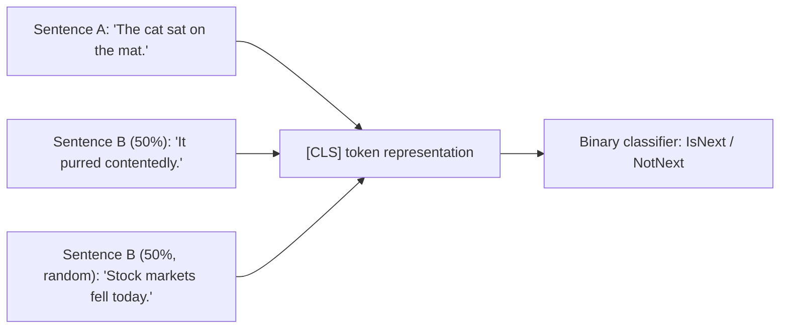

# Chapter 2 · Lesson 2 — Masked LM + NSP (BERT-Style Pretraining)

> **Where this fits:** This is the other half of the encoder/decoder split from Lesson 1. If Lesson 1 was "predict what comes next," this lesson is "fill in what's missing" — a fundamentally different objective that produces fundamentally different models (good at understanding, not generation).

---

## 1. The Core Idea

Masked Language Modeling (MLM) hides some tokens in the input and asks the model to reconstruct them, using context from **both directions** — before and after the masked token. This is only possible because encoders have no causal mask (recall Lesson 1's table: encoders are bidirectional).

```
Input:  "The [MASK] sat on the mat"
Target: predict "cat" at the masked position, using both "The" (left) and "sat on the mat" (right)
```

Compare this to Lesson 1's causal LM, which could only ever use "The" — nothing to the right exists yet during generation. This directional difference is *the* reason BERT is good at classification/understanding tasks and bad at open-ended generation: it was never trained to produce a sequence left-to-right.

---

## 2. The Masking Recipe — More Subtle Than "Just Mask Some Tokens"

BERT doesn't simply replace 15% of tokens with `[MASK]`. The actual recipe, per selected token:

| Probability | What happens | Why |
|---|---|---|
| 80% | Replace with `[MASK]` | The main signal |
| 10% | Replace with a **random** token | Forces the model to build real contextual representations for *every* token, not just ones that look like `[MASK]` — because it can never be sure a given token wasn't corrupted |
| 10% | Keep the **original** token, unchanged | Same reason — the model can't just learn "output = input" for unmasked positions, since some unmasked-looking tokens are secretly the correct label to predict |

**Worked example.** Sentence: `"The cat sat on the mat"`, 15% masking selects the token `cat` (1 of ~6-7 tokens):

```
80% of the time:  "The [MASK] sat on the mat"   → predict "cat"
10% of the time:  "The dog sat on the mat"       → predict "cat" (even though input shows "dog")
10% of the time:  "The cat sat on the mat"       → predict "cat" (input unchanged, still a training example)
```

This matters at inference/fine-tuning time too: `[MASK]` never appears in downstream fine-tuning data (real sentences don't contain literal `[MASK]` tokens), so the 10%/10% split reduces the train-vs-finetune mismatch — the model wasn't only ever trained to react to the literal `[MASK]` symbol.

---

## 3. The Loss — Only Computed on Masked Positions

This is a common point of confusion, worth being precise about: **unmasked tokens contribute zero loss.** Unlike Lesson 1's causal LM, where every position gets a prediction and a loss term, MLM only backpropagates through the ~15% of positions that were selected for masking.

```
Loss = -(1/|masked positions|) * Σ_{t in masked} log P(x_t | full bidirectional context)
```

**Practical consequence:** MLM is a much less sample-efficient objective per token than causal LM. Causal LM gets a training signal from *every* token in the corpus; MLM throws away information from ~85% of tokens at each step. This is one real reason (not the only one) that decoder-only models scaled better and became the dominant pretraining paradigm industry-wide.

---

## 4. Next Sentence Prediction (NSP) — What It Was, and Why It Was Dropped

Original BERT trained on two objectives simultaneously: MLM plus NSP — a binary classification task, "does sentence B actually follow sentence A in the original text, or was B randomly sampled from elsewhere in the corpus?"



**Why RoBERTa (2019) dropped it — the actual finding, not just "it didn't help":** RoBERTa's ablations showed NSP contributed little to downstream task performance, and removing it while training on longer, contiguous spans of text (rather than sentence pairs) actually **improved** results. The hypothesis: NSP's negative examples (random unrelated sentences) were too easy to distinguish using surface-level topic cues alone, so the model wasn't learning genuinely useful coherence signals — it was learning a shortcut.

**What replaced the idea, rather than just deleting it:**
- **ALBERT's Sentence Order Prediction (SOP):** instead of random vs. real, use two *consecutive* sentences and predict whether their order was swapped. This is a harder task that can't be solved with topic-matching shortcuts, so it forces genuine coherence modeling.
- **RoBERTa's approach:** drop the pairwise framing entirely, train on full contiguous documents packed to the max sequence length, MLM-only.

This is a good interview beat: don't just say "NSP was removed" — say *why* the ablation showed it wasn't earning its keep, and name what (if anything) replaced it. That's the difference between reciting a fact and understanding a research finding.

---

## 5. Code: Implementing MLM Masking

```python
import torch
import random

def mask_tokens(input_ids, vocab_size, mask_token_id, special_token_ids, mlm_prob=0.15):
    """
    input_ids: (seq_len,) tensor of token ids
    special_token_ids: set of ids that should never be masked (e.g. [CLS], [SEP], [PAD])
    Returns: masked_input_ids, labels (with -100 for non-masked positions)
    """
    labels = input_ids.clone()
    masked_input_ids = input_ids.clone()

    # Build a mask of eligible positions (not special tokens)
    eligible = torch.tensor([tok.item() not in special_token_ids for tok in input_ids])

    # Select 15% of eligible positions
    prob_matrix = torch.full(input_ids.shape, mlm_prob)
    prob_matrix[~eligible] = 0.0
    selected = torch.bernoulli(prob_matrix).bool()

    # Labels: -100 (ignored in loss) everywhere except selected positions
    labels[~selected] = -100

    for idx in selected.nonzero(as_tuple=True)[0]:
        r = random.random()
        if r < 0.8:
            masked_input_ids[idx] = mask_token_id
        elif r < 0.9:
            masked_input_ids[idx] = random.randint(0, vocab_size - 1)
        # else: 10% — leave unchanged

    return masked_input_ids, labels
```

Notice: this uses the exact same `-100` / `ignore_index` mechanism from Lesson 1's padding mask — the pattern "use `-100` to mean 'not part of the loss'" is a recurring implementation trick across pretraining objectives, not something unique to MLM.

---

## 6. Production Variants Worth Knowing (the "is there a better approach" layer)

- **Whole Word Masking (WWM):** if a word is split into multiple subword tokens (e.g. `"playing"` → `play` + `##ing`), mask *all* subword pieces together rather than independently. Masking only `##ing` makes the task trivially easy (the model just sees `play` and pattern-matches). WWM was shown to meaningfully improve BERT's downstream performance.
- **Span masking (SpanBERT):** mask contiguous spans of tokens (geometric-distribution-sampled length) rather than individual scattered tokens. Forces the model to do more genuine inference rather than relying on immediate neighbor tokens, and is a closer match to T5-style span corruption (Lesson 3).
- **ELECTRA's replaced-token-detection:** a different but related idea — instead of masking and reconstructing, corrupt tokens with a small generator model, then train a discriminator to detect *which* tokens were replaced. Every token gets a training signal (binary real/fake), directly attacking MLM's sample-inefficiency problem from Section 3. Notably more compute-efficient per FLOP than vanilla MLM in the original paper's comparisons.

---

## Key Takeaways

- MLM masks ~15% of tokens using an 80/10/10 recipe (mask / random / unchanged) specifically to reduce train-vs-finetune mismatch.
- Loss is only computed on masked positions — this is *why* MLM is less sample-efficient per token than causal LM, a real factor in why decoder-only pretraining became dominant.
- NSP was dropped based on RoBERTa's ablation finding that it taught a shortcut (topic-matching) rather than genuine coherence — not just "it turned out unnecessary."
- SOP (ALBERT) and dropping-NSP-entirely (RoBERTa) are two different responses to the same finding — know both.
- WWM, span masking, and ELECTRA's discriminator objective are the real production-grade evolutions of vanilla MLM.

---

## Self-Check Before Moving to Lesson 3

1. Why does the 10%-random-token rule exist — what specific failure mode does it prevent?
2. If MLM only trains on 15% of tokens per step, name one concrete objective that was designed specifically to fix that inefficiency.
3. A colleague says "NSP was just useless, that's why it got removed." What's the more precise version of that claim?