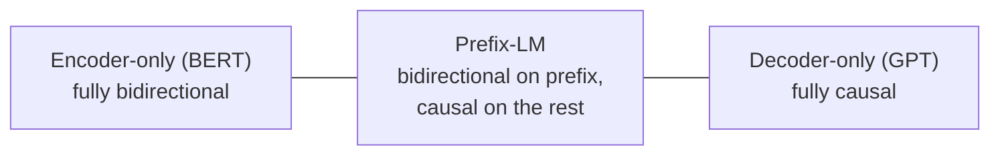
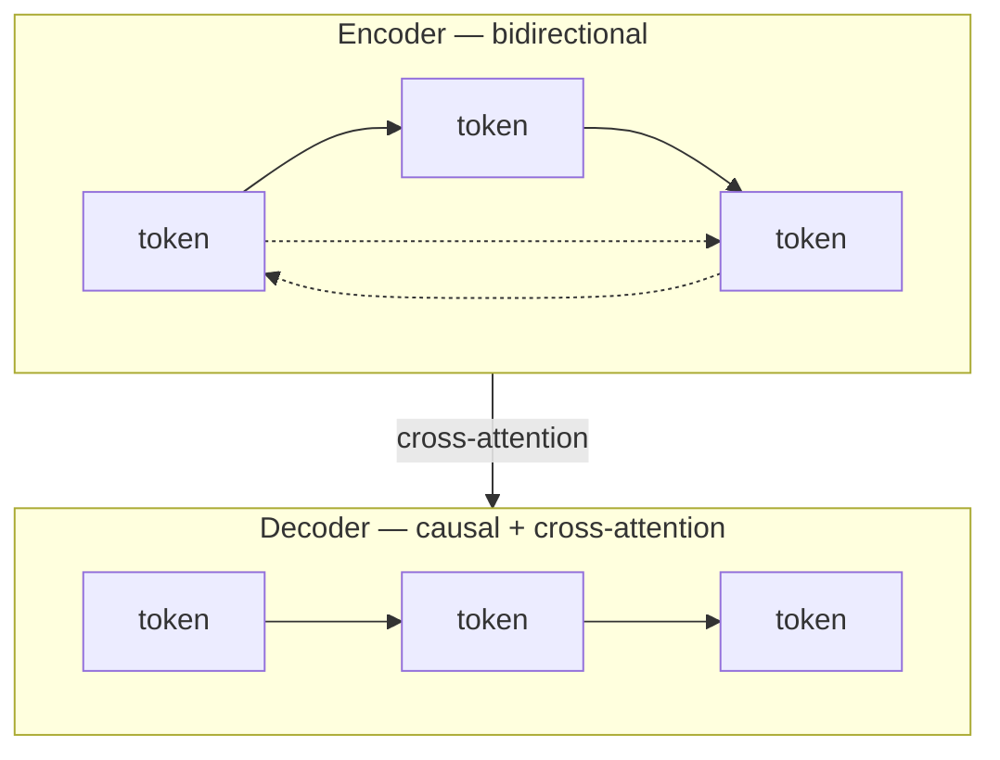

# Chapter 2 · Lesson 3 — Prefix-LM and Encoder-Decoder Objectives (T5-Style Span Corruption)

> **Where this fits:** Lessons 1 and 2 gave you the two "pure" extremes — fully causal (decoder-only) and fully bidirectional (encoder-only MLM). This lesson covers the middle ground: architectures that mix both, and why you'd deliberately choose that mix.

---

## 1. The Attention-Masking Spectrum

Everything so far is really one spectrum of "how much bidirectionality do you allow, and where":



Encoder-decoder models (T5) are a variant of this same idea, but implemented as two separate stacks rather than one stack with a mixed mask.

---

## 2. Prefix-LM — One Model, Mixed Masking

Prefix-LM takes a single decoder stack, but instead of a pure causal mask, part of the input (the "prefix" — e.g., a question, or source text) gets **full bidirectional** attention among itself, while everything after it remains causal.

```
              prefix tokens          generated tokens
              (bidirectional)         (causal)
Input:    [ Translate: The cat ]  [ Le    chat  ]
Mask:      full attention among      each token only sees
           prefix tokens               itself + everything before it
```

**Concrete mask matrix** for prefix = `["Translate:", "The", "cat"]`, generation = `["Le", "chat"]`:

```
                Translate:  The   cat   Le    chat
   Translate:  [   0.0,    0.0,  0.0, -inf, -inf ]
   The         [   0.0,    0.0,  0.0, -inf, -inf ]
   cat         [   0.0,    0.0,  0.0, -inf, -inf ]
   Le          [   0.0,    0.0,  0.0,  0.0, -inf ]
   chat        [   0.0,    0.0,  0.0,  0.0,  0.0 ]
```

Notice the top-left 3×3 block is fully open (bidirectional prefix) while the bottom-right follows the exact causal pattern from Lesson 1. **Why this is useful:** the prefix (question, source sentence, instructions) benefits from full context understanding in both directions — nothing about "Translate:" changes meaning based on word order constraints — while the generated output still needs the causal property required for autoregressive generation.

---

## 3. Encoder-Decoder — Two Stacks Instead of One Mixed Mask

T5 takes a different implementation path to a similar goal: a **fully bidirectional encoder** processes the input, and a **fully causal decoder** generates the output, with the decoder attending to the encoder's output via **cross-attention**.



**Prefix-LM vs. encoder-decoder — the real distinction to articulate in an interview:** they express nearly the same masking idea, but Prefix-LM does it with **one set of weights, one stack**, while encoder-decoder uses **two separate weight sets** connected by cross-attention. This has real consequences:

| | Prefix-LM | Encoder-Decoder (T5) |
|---|---|---|
| Parameter sharing | Single stack, shared weights across prefix/generation | Separate encoder and decoder weights |
| Compute at inference | Prefix reprocessed unless cached | Encoder runs once, cached; decoder reuses it every generation step |
| Best suited for | General-purpose single-stack simplicity | Tasks with a clear input→output split (translation, summarization) |

---

## 4. T5's Span Corruption Objective — Worked Example

T5's pretraining objective isn't MLM (predict single masked tokens) or plain causal LM — it's **span corruption**: contiguous spans of the input are replaced with a single sentinel token, and the decoder's job is to generate the missing spans, each prefixed by its sentinel.

**Worked example.** Original text:

```
"The cat sat on the mat and slept all afternoon"
```

Two spans get corrupted (`sat on the` and `all`):

```
Encoder input:  "The cat <X> mat and slept <Y> afternoon"
Decoder target: "<X> sat on the <Y> all <Z>"
```

Where `<X>`, `<Y>` are sentinel tokens marking corrupted spans, and `<Z>` marks the end. The decoder learns to reconstruct **only the missing spans**, in order, each tagged with the sentinel that marks where it goes.

**Why this is a genuinely different objective from both Lesson 1 and Lesson 2, not just a mashup:**
- Vs. MLM (Lesson 2): predicts *variable-length spans*, not single tokens — closer to how real omissions look (a missing phrase, not a missing word).
- Vs. causal LM (Lesson 1): the encoder gets full bidirectional context of the *entire* corrupted input before the decoder generates anything, whereas causal LM never sees anything but the past.
- Loss is computed causal-LM-style *within the decoder*, over the compressed target sequence of just the spans — much shorter than reconstructing the full original sentence, which makes span corruption noticeably more compute-efficient per training step than naively regenerating the whole input.

---

## 5. When Each Architecture Is Actually Chosen (Production Reasoning, Not Trivia)

This is the part interviewers are really testing when they ask "why encoder-decoder vs. decoder-only":

- **Decoder-only (GPT-style):** default choice today for general-purpose chat/instruction-following models. One stack, scales predictably, and the causal objective matches inference exactly — no train/inference mismatch. Dominant because of simplicity at scale, not because it's architecturally superior for every task.
- **Encoder-decoder (T5-style):** still genuinely competitive for tasks with a clean, fixed input→output mapping — translation, summarization, structured extraction — where the input doesn't need to be regenerated token-by-token and a compressed, fully-contextualized encoding is enough. Also more compute-efficient at inference for long-input/short-output tasks, since the encoder runs once and its output is cached, versus a decoder-only model that reprocesses the full input as part of its causal sequence.
- **Prefix-LM:** a middle ground used less often as a *named* choice today, but the *mask pattern* itself is very much alive — it's essentially what "system prompt + user prompt (bidirectional-ish in effect) + generation (causal)" resembles conceptually in modern instruction-tuned decoder-only models, even though those models are technically pure causal-LM under the hood.

**A senior-sounding answer names the actual tradeoff axis (compute efficiency for fixed input→output tasks vs. simplicity/scaling for general generation), not just "GPT uses decoder-only, T5 uses encoder-decoder."**

---

## Key Takeaways

- Prefix-LM and encoder-decoder both mix bidirectional and causal attention — the difference is single mixed-mask stack vs. two separate weight stacks joined by cross-attention.
- T5's span corruption objective predicts variable-length missing spans via sentinel tokens, generated causally within the decoder — distinct from both single-token MLM and pure next-token causal LM.
- Encoder-decoder remains a real production choice (not just a historical artifact) for fixed input→output tasks where inference-time compute efficiency (cached encoder output) matters.
- The interview-grade answer to "why this architecture" cites the actual compute/parameter-sharing tradeoff, not just which company used which name.

---

## Self-Check Before Moving to Lesson 4

1. Draw (mentally or on paper) the attention mask matrix for a Prefix-LM with a 2-token prefix and 3-token generation.
2. Why is T5's decoder target the *spans only*, not the full reconstructed sentence — what's the efficiency argument?
3. For a document summarization service processing long articles into short summaries at high volume, would you lean encoder-decoder or decoder-only, and what's the concrete reason (not just "T5 is for summarization")?