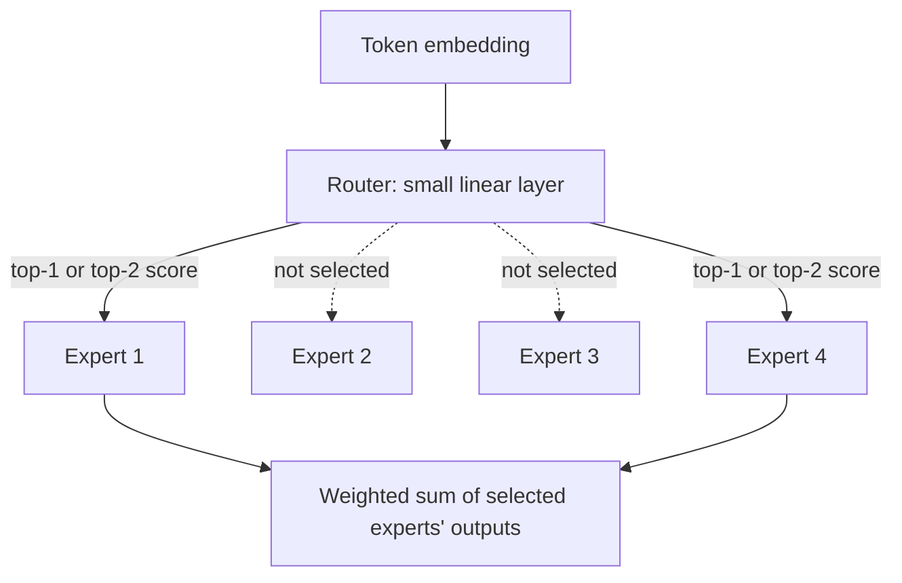

# Chapter 2 · Lesson 4 — Mixture-of-Experts (MoE) Pretraining

> **Where this fits:** Everything in Lessons 1–3 assumed every parameter processes every token — a "dense" model. MoE breaks that assumption: different tokens are routed to different subsets of parameters. This changes the training story enough that it deserves its own lesson, and it's an increasingly common interview topic given Mixtral, DeepSeek-MoE, and Grok's public architectures.

---

## 1. The Core Idea

In a dense transformer's feed-forward block, every token passes through the same feed-forward network. In an MoE layer, you instead have **N expert feed-forward networks**, and a small **router** network decides, per token, which 1-2 experts should process it.



**The core value proposition, stated precisely:** total parameter count can be huge (all N experts combined), but the compute cost per token stays small, because each token only activates 1-2 experts, not all N. This decouples "how much knowledge can the model store" (scales with total params) from "how much compute does each token cost" (scales with active params) — a distinction dense models don't have.

---

## 2. The Router — Worked Example

The router is just a small linear layer producing a score per expert, followed by softmax and top-k selection.

**Worked example.** 4 experts, router outputs these raw scores for one token:

```
expert:   E1     E2     E3     E4
score:    2.1    0.4    3.5    1.0
softmax:  0.19   0.04   0.63   0.07   (rounded)
```

For **top-1 routing**, the token goes entirely to E3 (highest score, 0.63), and E3's output is scaled by that 0.63 gate value before being returned. For **top-2 routing** (used by Mixtral, for example), the token goes to E3 and E1 (the two highest), and the outputs are combined as a weighted sum using their renormalized scores among just those two.

```python
import torch
import torch.nn.functional as F

def top_k_routing(router_logits, k=2):
    """
    router_logits: (num_tokens, num_experts)
    Returns: top-k expert indices per token, and their gate weights
    """
    scores = F.softmax(router_logits, dim=-1)
    top_k_scores, top_k_indices = scores.topk(k, dim=-1)
    # Renormalize so the chosen experts' weights sum to 1
    top_k_scores = top_k_scores / top_k_scores.sum(dim=-1, keepdim=True)
    return top_k_indices, top_k_scores
```

---

## 3. The Problem MoE Introduces: Load Imbalance

Nothing in the router's objective inherently encourages it to spread tokens evenly across experts. Left alone, routers tend to collapse — a few "popular" experts get most of the tokens, the rest are barely trained, and you've effectively wasted most of your parameter budget. This is the single biggest practical failure mode specific to MoE training, and it doesn't exist in dense models at all.

**The fix: an auxiliary load-balancing loss**, added to the main cross-entropy loss:

```
aux_loss = α * N * Σ_i (f_i * P_i)
```

Where, per expert `i`: `f_i` = fraction of tokens actually routed to expert `i` in the batch, `P_i` = average router probability assigned to expert `i` across the batch, `N` = number of experts, `α` = a small weighting coefficient (commonly ~0.01).

**Why this specific formula works — the intuition, not just the equation:** this term is minimized when routing is uniform (every expert gets `1/N` of tokens and `1/N` average probability). It's a soft nudge, applied *during* training, pushing the router away from collapsing onto a small subset of experts, without hard-coding which expert should get which tokens.

---

## 4. Expert Capacity — The Other Practical Constraint

Even with a load-balancing loss encouraging even routing, real batches will never route *perfectly* evenly. Production MoE implementations set a **capacity per expert** — a hard cap on how many tokens each expert can process in a given batch, typically:

```
capacity = (tokens_per_batch / num_experts) * capacity_factor
```

`capacity_factor` is usually slightly above 1.0 (e.g., 1.25) to absorb natural imbalance. **What happens when an expert hits capacity:** any additional tokens routed to it are simply **dropped** — they skip that expert entirely (or fall back to a residual/default path, depending on implementation), meaning some tokens effectively get less processing than others in that batch. This is a real, named tradeoff (throughput and memory predictability vs. occasionally under-processing some tokens) — worth stating explicitly if asked about MoE production concerns.

---

## 5. Why This Changes the Hyperparameter Story (the actual "how MoE differs" answer)

This is the section that turns "I know what MoE is" into "I understand how training one is different":

| Hyperparameter concern | Dense model | MoE model |
|---|---|---|
| Learning rate | Standard scaling rules apply directly | Often needs to be tuned more conservatively — router training is more sensitive to LR instability than dense FFN training |
| Batch size | Standard considerations | Needs to be large enough that even sparsely-routed experts see enough tokens per step to get a meaningful gradient signal |
| New hyperparameters | — | Number of experts, top-k, capacity factor, aux-loss coefficient α — none of these exist in a dense model at all |
| Effective vs. total params | Same thing | Must be tracked separately — "70B total params, 12B active" changes how you reason about both capability and compute cost |
| Communication cost (distributed) | Standard data/tensor parallel | Routing means tokens may need to be sent to whichever GPU holds the selected expert (**expert parallelism**) — an entirely new distributed-systems dimension |

---

## 6. Diagnosis: Reading MoE-Specific Training Signals

- **Aux loss not decreasing / staying high** → router isn't learning to balance; check `α` isn't too small to matter, or too large and dominating the main task loss.
- **A few experts show near-zero utilization across many steps** → classic router collapse; consider router z-loss (a variant of Lesson 1's z-loss idea, applied to router logits to prevent them from becoming too peaked too early) or noisy top-k routing (injecting small noise into router scores early in training to encourage exploration).
- **High token drop rate at a given capacity factor** → either raise the capacity factor (costs more memory/compute headroom) or investigate why routing is more skewed than expected for this data mixture.

---

## Key Takeaways

- MoE decouples total parameters (knowledge capacity) from active parameters (per-token compute cost) via sparse routing.
- The router is a small learned classifier over experts; top-k selection determines how many experts process each token.
- Load-balancing auxiliary loss exists specifically because nothing else prevents router collapse onto a few popular experts.
- Capacity factor is a real, named tradeoff: token dropping vs. memory/compute predictability.
- MoE introduces genuinely new hyperparameters (num experts, top-k, capacity factor, aux-loss weight) and a new distributed-training dimension (expert parallelism) that don't exist in dense models at all.

---

## Self-Check Before Moving to Lesson 5

1. Why can't you just rely on cross-entropy loss alone to keep MoE routing balanced?
2. A model has "47B total parameters, 13B active." Explain to a non-ML stakeholder what that actually means for cost and capability.
3. Your MoE model's aux loss is near zero but you notice 2 of 8 experts have near-zero token counts throughout training. What's the most likely explanation, and what would you check first?