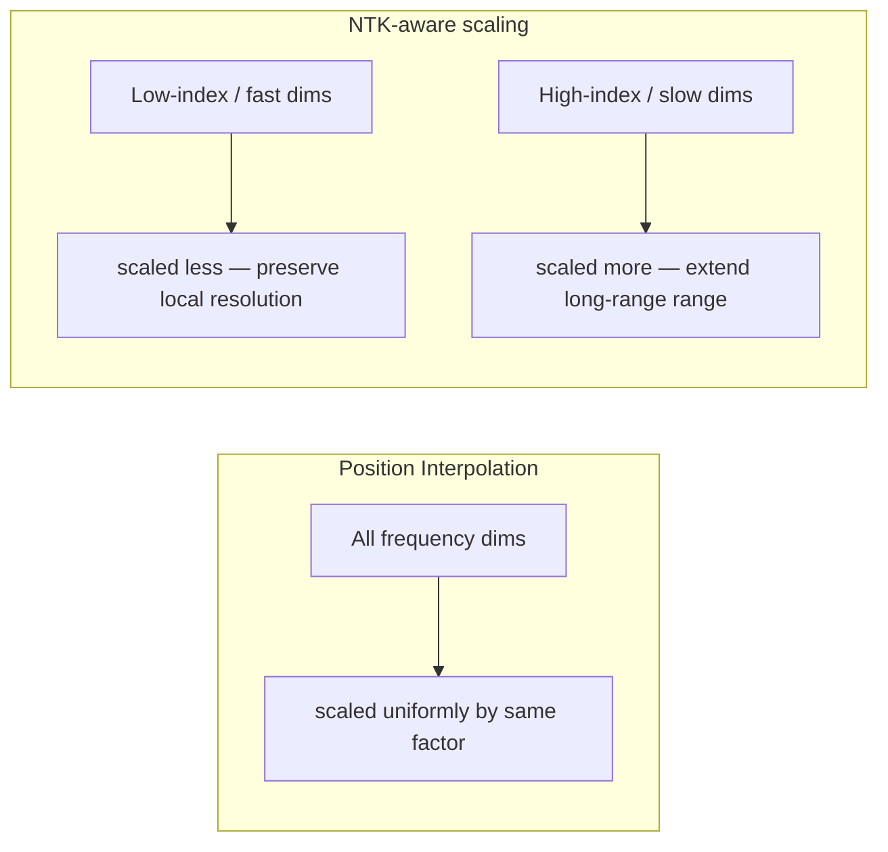

# Chapter 2 · Lesson 5 — Long-Context Pretraining & Position Extension

> **Where this fits:** Chapter 0 mentioned RoPE as the dominant positional encoding without going deep. This lesson is where that pays off — understanding *why* extending context length isn't just "set `max_seq_len` higher" is a genuinely deep topic interviewers use to separate candidates who've only read model cards from those who understand the mechanism.

---

## 1. Why You Can't Just Increase Context Length for Free

A model trained with `max_seq_len = 4096` has, during training, only ever seen relative position offsets up to 4096. RoPE (rotary position embeddings) encodes position by rotating the query/key vectors by an angle proportional to position — and the rotation frequencies the model learned to interpret are calibrated to the range it saw in training.

Push the model to a 32K-token input at inference time without any adjustment, and the model is now facing rotation angles it never encountered — the attention patterns degrade, often catastrophically, well before you hit the literal token limit. This is the core problem every long-context method below is solving.

---

## 2. RoPE Refresher — Just Enough Math to Follow the Fixes

RoPE rotates each query/key vector by an angle that depends on its position `m` and a fixed per-dimension frequency `θ_i`:

```
angle(m, i) = m * θ_i,     θ_i = base^(-2i/d)
```

Where `base` is typically 10000, `d` is the head dimension, and `i` indexes pairs of dimensions. **The intuition, not the full derivation:** low-index dimensions rotate fast (encode fine-grained, local position differences), high-index dimensions rotate slowly (encode coarse, long-range position differences) — similar in spirit to how sinusoidal encodings mix frequencies, but implemented as a rotation rather than an additive signal.

---

## 3. Method 1 — Position Interpolation (PI)

**Idea:** instead of letting position indices run up to the new, larger max length, *compress* them back into the range the model was trained on.

```
Trained on:     positions 0 ... 4096
New target:     positions 0 ... 32768   (8x longer)

Position Interpolation rescales:  m_new = m * (4096 / 32768) = m * 0.125
```

So position 32768 gets treated, angle-wise, as if it were position 4096 — every position gets squeezed into the familiar range. **Worked example:** token at true position 8192 in the new long sequence, with an 8x extension factor, is treated as position `8192 * 0.125 = 1024` for the purposes of rotation — well within the range the model has seen.

**The cost:** because all positions are now packed more densely into the same angular range, the model has less resolution to distinguish between nearby positions than it used to. This is why PI requires a short fine-tuning phase on longer sequences after interpolation — it isn't a pure inference-time trick, unlike some of what follows.

---

## 4. Method 2 — NTK-Aware Scaling

**The problem PI has:** it scales *all* frequency dimensions by the same factor, uniformly, even though (per Section 2) different dimensions encode different position granularities. Squeezing the fast-rotating (fine-grained/local) dimensions the same amount as the slow-rotating (long-range) ones unnecessarily damages the model's ability to distinguish nearby tokens.

**NTK-aware scaling's fix:** scale the `base` parameter itself (not each position uniformly), which has the effect of stretching high-frequency (local) dimensions less than low-frequency (long-range) dimensions — non-uniform interpolation, informed by neural tangent kernel theory on how neural networks learn different frequency components.



Practical upshot: NTK-aware scaling often works reasonably well **without any fine-tuning at all** for moderate extension factors, because it does less damage to the frequencies the model relies on for local coherence — a real advantage over plain PI for quick context extension.

---

## 5. Method 3 — YaRN (Yet another RoPE extensioN method)

YaRN combines and refines the above ideas: it applies NTK-aware-style non-uniform scaling across frequency dimensions, **plus** an additional attention temperature adjustment to compensate for the fact that, even with better frequency scaling, longer sequences naturally produce flatter, more diffuse attention distributions (more tokens competing for attention mass). YaRN's temperature correction sharpens attention back toward how it behaved at the original training length.

**Why this is the current practical favorite (as of recent long-context open models):** it needs meaningfully less fine-tuning data/steps than PI to reach good long-context performance, because it starts from a much less damaged frequency representation.

---

## 6. Comparison Table — What to Say When Asked "Which Would You Use"

| Method | Fine-tuning required? | Preserves local resolution? | Typical use case |
|---|---|---|---|
| Position Interpolation | Yes, meaningful fine-tuning | No — uniform compression damages it | Simple, well-understood baseline |
| NTK-aware scaling | Minimal to none for moderate extension | Better — non-uniform | Quick extension without training budget |
| YaRN | Some, but much less than PI | Best of the three | Production long-context models (current practical default) |

---

## 7. The Data Side — Long-Context Pretraining Isn't Just a Position-Encoding Trick

A gap worth naming explicitly: none of the above matters if the training data doesn't actually contain long-range dependencies worth learning. A common real pipeline:

1. Pretrain (or continue pretraining) primarily at the original, shorter context length — most compute-efficient.
2. Do a shorter **context-extension phase**: apply one of the scaling methods above, continue training on a data mix deliberately weighted toward long documents (books, long code repositories, concatenated related documents) so the model actually has long-range signal to learn from — training on short documents padded/packed to a long context length teaches nothing about genuinely long dependencies.
3. Evaluate with long-context-specific benchmarks (e.g., needle-in-a-haystack retrieval tests) — perplexity alone can look fine while long-range retrieval quietly fails, since most tokens in a long document still only depend on nearby context.

---

## Key Takeaways

- Extending context length isn't free: RoPE's rotation frequencies are calibrated to the trained range, and naive extension degrades attention well before hitting the token limit.
- Position Interpolation compresses all position indices uniformly — simple, but damages local resolution and needs real fine-tuning.
- NTK-aware scaling changes the rotation *base* instead, preserving local (high-frequency) resolution better — often usable with little or no fine-tuning.
- YaRN adds an attention-temperature correction on top of NTK-style scaling and is the current practical default for production long-context extension.
- Position-encoding tricks alone aren't sufficient — the fine-tuning data mix needs genuine long-range structure, or the model won't learn to use the extended context regardless of how well-calibrated the positions are.

---

## Self-Check Before Moving to Lesson 6

1. Why does naive context extension fail even before you hit the actual token limit?
2. In one sentence, what's the core difference between what Position Interpolation scales and what NTK-aware scaling scales?
3. A team extended context length using NTK-aware scaling with zero fine-tuning, and the model handles long documents fine on perplexity but fails "find this fact buried in the middle of a long document" tests. What's a plausible explanation, and what would you check?