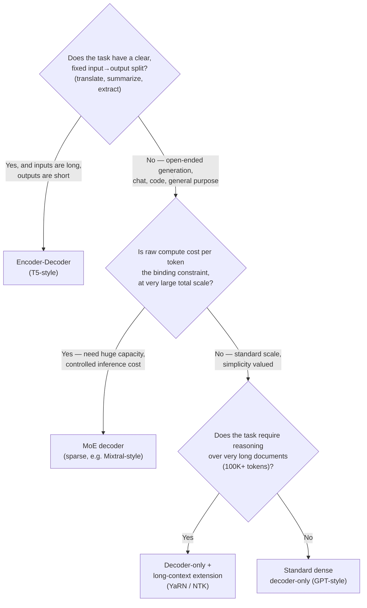

# Chapter 2 · Lesson 6 — Diagnosis & Mental Models: Choosing an Architecture Family

> **Where this fits:** Lessons 1–5 gave you five architecture families in isolation. This lesson is about the skill interviewers actually care about most: given a real constraint set, which one do you reach for, and can you justify it out loud in under a minute?

---

## 1. The Decision Isn't "Which Is Best" — It's "Best For What"

Every architecture family from this chapter is state-of-the-art *for some constraint profile*. The mental model to build is a small decision tree driven by three questions, in order:

This is deliberately a *starting* heuristic, not a rigid rule — the point of having it is that you can state it fast in an interview, then immediately layer nuance on top, which is exactly what a senior answer sounds like.

---

## 2. Working Through Real Constraint Profiles

**Case: customer support chatbot, must run cheaply at high query volume, general conversational ability needed.**
→ Dense decoder-only, likely a smaller model (not MoE — the operational complexity of expert parallelism isn't worth it unless you're already at a scale where total-parameter capacity is the binding constraint, and a well-tuned dense model at moderate size is usually simpler to serve reliably).

**Case: legal document summarization, inputs are 50-page contracts, output is a 1-page summary, latency matters, high volume.**
→ Encoder-decoder is a legitimate, defensible choice here — the input→output split is clean, and the encoder-runs-once/cached-output property (Lesson 3) is a real inference-cost win when input is much longer than output. A decoder-only model is *also* a defensible choice (it's what most production systems actually use today, for tooling/ecosystem reasons more than architectural superiority) — this is a case where saying "either is defensible, here's the tradeoff" is the strongest answer, not picking one side dogmatically.

**Case: foundation model for a company that wants max capability per training-dollar, willing to accept serving complexity.**
→ MoE is the argument to make, precisely because total-parameter capacity scales while active-parameter (serving) cost stays controlled — but flag the real cost: expert-parallel serving infrastructure, load-balancing tuning (Lesson 4), and harder debugging when something goes wrong.

**Case: a coding assistant that needs to reason across an entire large codebase in one context window.**
→ Decoder-only with long-context extension (Lesson 5) is the direct fit — but the answer isn't complete without naming that position-encoding tricks alone aren't sufficient (Lesson 5, Section 7) — the fine-tuning data needs genuine long-range dependencies, or the "long context" is decorative.

---

## 3. The Diagnostic Habit: Separate "What's Broken" From "What's the Fix"

This is the meta-skill from your original interview feedback (Chapter 5 of the full index will hammer this again for fine-tuning specifically, but it starts here): when someone describes a system that isn't working well, resist jumping straight to "switch architectures." Run through:

1. **Is this actually an architecture problem, or a data/training problem?** A dense decoder-only model performing poorly on long documents might just need better long-context fine-tuning data (Lesson 5), not a switch to encoder-decoder.
2. **What's the actual binding constraint?** Latency? Total training compute budget? Serving infrastructure complexity? Team's ability to operate the system? Architecture choices trade these against each other — naming which one is binding *before* proposing a fix is what makes an answer sound like engineering judgment instead of trivia recall.
3. **What's the fallback if the "right" architecture is too operationally complex for the team?** A dense model that a small team can reliably operate often beats a theoretically superior MoE setup nobody can debug at 2am. This is a legitimate, senior-sounding point to raise unprompted.

---

## 4. A Compact Comparison Table for Fast Recall

| Constraint | Best-fit architecture | Real cost of that choice |
|---|---|---|
| Clean input→output task, long input/short output | Encoder-decoder | Two weight stacks to maintain; less flexible for open-ended generation |
| Maximize capacity per training/serving dollar at large scale | MoE | Router tuning, load balancing, expert-parallel serving complexity |
| Very long-document reasoning | Decoder-only + long-context extension | Needs genuine long-range training data, not just position tricks |
| General-purpose, simplicity, well-understood tooling | Dense decoder-only | Leaves some efficiency on the table vs. MoE at very large scale |

---

## Key Takeaways

- Architecture choice is a constraint-satisfaction problem, not a "which is objectively best" question — always answer with the constraint that's driving the choice.
- A three-question decision tree (input/output split → compute-vs-capacity tradeoff → long-context need) gets you to a fast, defensible starting answer.
- The strongest interview answers name a real cost of the chosen architecture, not just its benefit — every choice here trades something away.
- Diagnose before prescribing: confirm the problem is actually architectural before recommending an architecture change.

---

## Self-Check Before Moving to Lesson 7

1. Walk through the three-question decision tree out loud for: "a search engine's query-to-answer system, queries are short, source documents are long, needs to run at massive scale cheaply."
2. Name one real operational cost of choosing MoE that a candidate who's only read the Mixtral paper abstract would likely miss.
3. A team says "our decoder-only model handles a 128K context window per the config, but it seems to ignore facts in the middle of long inputs." Which chapter's lesson explains this, and what's the diagnostic question you'd ask them?