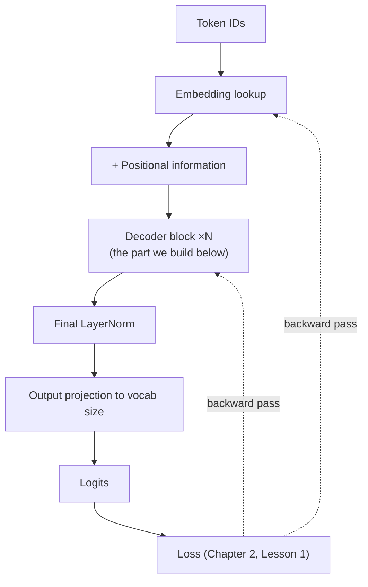
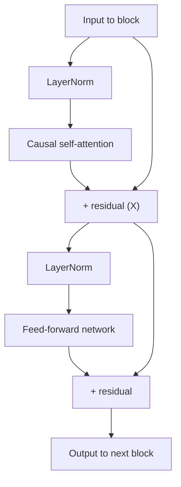

# Chapter 3 · Lesson 1 — Forward/Backward Pass: Building a Minimal Decoder Block From Scratch

> **Where this fits:** This is the direct redo of the third question from your actual interview — the one where you accidentally described causal (decoder) attention while claiming to explain an encoder's forward pass, and where the backward pass got a single sentence. This lesson fixes both: a complete, correct forward pass with real code, and a backward pass explained in enough depth to survive follow-up questions.

---

## 1. The Full Pipeline, End to End — the Map Before the Detail

Before code, the shape of the whole thing, because losing track of *where you are* in this pipeline is exactly what caused the encoder/decoder mixup in your original answer:



Each decoder block internally:



This is **pre-LN** (LayerNorm before the sub-layer, not after) — the modern default (GPT-2 onward, LLaMA, etc.) because it produces more stable gradients in deep networks than the original post-LN design. Worth stating this explicitly if asked — "pre-LN" vs. "post-LN" is a real, checkable design choice, not an implementation detail nobody cares about.

---

## 2. Step 1 — Embeddings and Position

```python
import torch
import torch.nn as nn
import math

class TokenEmbedding(nn.Module):
    def __init__(self, vocab_size, d_model):
        super().__init__()
        self.embedding = nn.Embedding(vocab_size, d_model)
        self.d_model = d_model

    def forward(self, token_ids):
        # Scaling by sqrt(d_model) — from the original Transformer paper,
        # keeps embedding magnitude comparable to the positional signal added next
        return self.embedding(token_ids) * math.sqrt(self.d_model)
```

**Worked shape example:** vocab size 32,000, `d_model = 512`, batch of 2 sequences, each 10 tokens long. Input `token_ids` has shape `(2, 10)`. Output of this layer: `(2, 10, 512)` — every token is now a 512-dim vector.

For position, we'll use RoPE (rotary position embeddings, referenced in Chapter 2 Lesson 5) rather than the older additive sinusoidal encoding, since it's the current default in most modern decoder-only models:

```python
def build_rope_cache(seq_len, head_dim, base=10000):
    # One frequency per pair of dimensions
    inv_freq = 1.0 / (base ** (torch.arange(0, head_dim, 2).float() / head_dim))
    positions = torch.arange(seq_len).float()
    angles = torch.outer(positions, inv_freq)  # (seq_len, head_dim/2)
    return torch.cos(angles), torch.sin(angles)

def apply_rope(x, cos, sin):
    # x: (batch, heads, seq_len, head_dim)
    x1, x2 = x[..., ::2], x[..., 1::2]
    rotated = torch.stack([x1 * cos - x2 * sin, x1 * sin + x2 * cos], dim=-1)
    return rotated.flatten(-2)
```

**Important distinction from Chapter 0:** RoPE isn't added to the embedding like sinusoidal encoding was — it's applied to the query and key vectors *inside* attention, as a rotation. This is why Chapter 2 Lesson 5's long-context methods talk about scaling RoPE's frequencies directly, rather than talking about "the positional embedding table," which doesn't exist in a RoPE-based model at all.

---

## 3. Step 2 — Causal Self-Attention, Correctly (This Is Where Your Original Answer Mixed Up Encoder/Decoder)

```python
class CausalSelfAttention(nn.Module):
    def __init__(self, d_model, num_heads):
        super().__init__()
        assert d_model % num_heads == 0
        self.num_heads = num_heads
        self.head_dim = d_model // num_heads

        self.q_proj = nn.Linear(d_model, d_model, bias=False)
        self.k_proj = nn.Linear(d_model, d_model, bias=False)
        self.v_proj = nn.Linear(d_model, d_model, bias=False)
        self.out_proj = nn.Linear(d_model, d_model, bias=False)

    def forward(self, x, cos, sin):
        B, T, D = x.shape  # batch, seq_len, d_model

        q = self.q_proj(x).view(B, T, self.num_heads, self.head_dim).transpose(1, 2)
        k = self.k_proj(x).view(B, T, self.num_heads, self.head_dim).transpose(1, 2)
        v = self.v_proj(x).view(B, T, self.num_heads, self.head_dim).transpose(1, 2)
        # q, k, v: (B, num_heads, T, head_dim)

        q = apply_rope(q, cos, sin)
        k = apply_rope(k, cos, sin)

        # Attention scores
        scores = (q @ k.transpose(-2, -1)) / math.sqrt(self.head_dim)  # (B, heads, T, T)

        # THE CAUSAL MASK — this is what makes this a DECODER block.
        # An encoder block would skip this entirely and attend freely.
        causal_mask = torch.triu(torch.ones(T, T), diagonal=1).bool()
        scores = scores.masked_fill(causal_mask, float('-inf'))

        attn_weights = torch.softmax(scores, dim=-1)
        attn_output = attn_weights @ v  # (B, heads, T, head_dim)

        # Merge heads back — this is the "projection matrix" you correctly
        # described as mixing information learned by different heads
        attn_output = attn_output.transpose(1, 2).contiguous().view(B, T, D)
        return self.out_proj(attn_output)
```

**Worked numeric micro-example** — tie this to Chapter 2 Lesson 1's mask matrix, now inside actual attention math. For `T=4`, `head_dim=2`, one head, ignore RoPE for a moment and imagine raw scores before masking:

```
raw scores (query · key, scaled):
                pos0   pos1   pos2   pos3
   pos0     [   0.5,   0.3,   0.8,   0.1 ]
   pos1     [   0.2,   0.9,   0.4,   0.6 ]
   pos2     [   0.1,   0.3,   0.7,   0.5 ]
   pos3     [   0.4,   0.2,   0.6,   0.9 ]
```

After `masked_fill` with the causal mask:

```
                pos0    pos1    pos2    pos3
   pos0     [   0.5,   -inf,   -inf,   -inf ]
   pos1     [   0.2,    0.9,   -inf,   -inf ]
   pos2     [   0.1,    0.3,    0.7,   -inf ]
   pos3     [   0.4,    0.2,    0.6,    0.9 ]
```

After softmax (row-wise), the upper-right `-inf` entries become exactly `0` — position 0 truly cannot attend to positions 1-3, no matter what the raw scores were. This is the literal mechanism, in code, of the thing you correctly described conceptually — the numbers make it concrete instead of abstract.

---

## 4. Step 3 — Feed-Forward Network and Full Block Assembly

```python
class FeedForward(nn.Module):
    def __init__(self, d_model, d_ff):
        super().__init__()
        self.fc1 = nn.Linear(d_model, d_ff)
        self.fc2 = nn.Linear(d_ff, d_model)
        self.act = nn.GELU()  # SwiGLU is the modern preferred variant; GELU here for clarity

    def forward(self, x):
        return self.fc2(self.act(self.fc1(x)))


class DecoderBlock(nn.Module):
    def __init__(self, d_model, num_heads, d_ff):
        super().__init__()
        self.ln1 = nn.LayerNorm(d_model)
        self.attn = CausalSelfAttention(d_model, num_heads)
        self.ln2 = nn.LayerNorm(d_model)
        self.ffn = FeedForward(d_model, d_ff)

    def forward(self, x, cos, sin):
        # Pre-LN + residual, exactly as in the diagram in Section 1
        x = x + self.attn(self.ln1(x), cos, sin)
        x = x + self.ffn(self.ln2(x))
        return x
```

`d_ff` is typically 4x `d_model` (e.g., 512 → 2048) — worth knowing as a default ratio, since "why 4x" occasionally comes up (empirically found to work well; it's a capacity/compute tradeoff, not a theoretically derived constant).

---

## 5. Why the Residual Connection Isn't Optional — the Backward-Pass Reason

This is the connective tissue between "forward pass" and "backward pass" that answers tend to skip. Residual connections (`x = x + sublayer(x)`) aren't primarily about representation power — their main justification is **gradient flow**.

During backpropagation, the gradient of a sum `x + f(x)` with respect to `x` is:

```
d(x + f(x))/dx = 1 + df(x)/dx
```

That `+1` term means gradient always has a direct, undiminished path backward through every residual connection, regardless of how small or unstable `df(x)/dx` is. Stack 40+ decoder blocks without residual connections, and gradients must flow purely through the multiplicative chain of every sublayer's Jacobian — in practice this vanishes or explodes long before reaching the earliest layers. **This is the real answer to "why do transformers use residual connections" — not "it helps," but the literal `+1` in the backward-pass derivative.**

---

## 6. The Backward Pass — What Actually Happens, Precisely

Your original answer said "compute the loss and based on that loss pass the gradient and update the model parameter" — true, but this is where an interviewer can tell whether you understand the mechanism or are summarizing a diagram. Here's the actual chain:

1. **Loss is a scalar** (Chapter 2 Lesson 1's cross-entropy, averaged over positions and batch).
2. **Autograd walks the computational graph backward**, from the loss, applying the chain rule at every operation — every matmul, every softmax, every LayerNorm — computing `∂loss/∂(that tensor)` at each step, using exactly the kind of local derivative shown in Section 5 for the residual case.
3. **Every learnable parameter** (`q_proj.weight`, `fc1.weight`, embedding table, etc.) accumulates a gradient — `∂loss/∂parameter` — as the backward pass reaches it.
4. **The optimizer (AdamW)** uses each parameter's gradient, plus its own running estimates of first and second moments of past gradients (this is what makes Adam "adaptive" — Chapter 4 covers this in full), to compute an update step and modify the parameter in place.

```python
# What this looks like in actual training code — the part your answer
# correctly gestured at but didn't show:
logits = model(input_ids)                    # forward pass (Sections 2-4)
loss = causal_lm_loss(logits, input_ids)      # Chapter 2, Lesson 1
loss.backward()                                # THIS is the backward pass —
                                                # autograd computes every ∂loss/∂param
optimizer.step()                               # apply the update using those gradients
optimizer.zero_grad()                          # clear gradients before the next batch
```

**The one-line mental model worth having ready:** *forward pass computes a number (the loss); backward pass computes, for every parameter, "if I nudge this parameter slightly, how much does the loss change" — and the optimizer nudges every parameter in the direction that decreases it.*

---

## 7. Encoder vs. Decoder Forward Pass — the Corrected Version, Side by Side

Directly repairing the specific mixup from your interview:

| Step | Encoder block | Decoder block |
|---|---|---|
| Attention mask | None — full bidirectional attention | Causal mask (Section 3's `triu` mask) |
| Typical training objective | MLM (Chapter 2, Lesson 2) | Next-token prediction (Chapter 2, Lesson 1) |
| Can process the whole input at once at inference? | Yes — no autoregressive generation | No — must generate one token at a time, reusing causal structure |
| Everything else (LayerNorm, residuals, FFN, multi-head projection) | **Identical mechanism** | **Identical mechanism** |

That last row is worth saying explicitly in an interview: the *only* structural difference between an encoder block and a decoder block is the presence or absence of the causal mask. Everything else in Sections 2 and 4 is shared machinery. Stating this precisely is what would have prevented the original mixup.

---

## Key Takeaways

- Pre-LN + residual connections is the modern default block structure — know this by name, not just by drawing it.
- RoPE is applied inside attention to Q/K vectors as a rotation, not added to the embedding — a real distinction from older positional encoding.
- The causal mask, made concrete as an actual `-inf`-filled matrix, is the *only* structural difference between an encoder and decoder block.
- Residual connections exist primarily for gradient flow — the `+1` term in the backward-pass derivative — not just "richer representations."
- The backward pass is autograd applying the chain rule backward through every operation in the forward pass, producing a gradient for every parameter, which the optimizer then uses to update weights.

---

## Self-Check Before Moving to Lesson 2

1. Without looking back, list the four sub-steps inside one decoder block, in order, including where the two residual connections attach.
2. Why does removing residual connections cause vanishing gradients in deep networks — answer using the actual derivative, not just "it helps gradients."
3. An interviewer asks: "what's structurally different between your encoder and decoder implementation?" Give the one-sentence correct answer.
4. What specific object does `loss.backward()` actually populate on each parameter tensor, and what does `optimizer.step()` do with it?