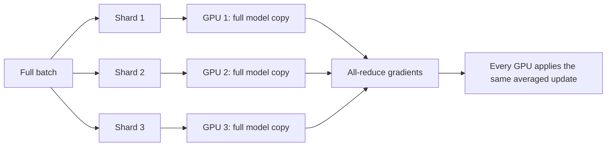
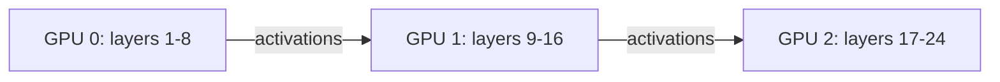
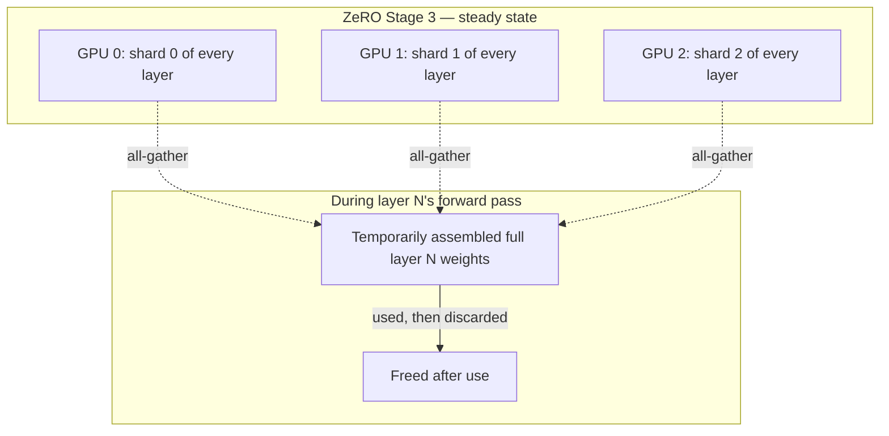

# Chapter 3 · Lesson 3 — Distributed Training: Data, Tensor, Pipeline Parallelism, and FSDP/ZeRO

> **Where this fits:** Lessons 1-2 assumed the model fits on one GPU. It doesn't, past a certain scale — a 70B parameter model in fp32 alone needs 280GB just for weights, before optimizer states and activations. This lesson is about how training is actually split across many GPUs.

---

## 1. The Memory Problem, Quantified First

Before the strategies, know *why* they're necessary — this framing is what makes the rest of the lesson land as engineering necessity rather than trivia:

For AdamW training, per parameter you typically need to store: the fp32 master weight (4 bytes, Lesson 2), the bf16/fp16 working weight (2 bytes), the gradient (2-4 bytes), and two Adam moment estimates in fp32 (4 bytes each, first and second moment). That's roughly **16-18 bytes per parameter** just for weights/optimizer state — before activations.

```
7B model:    7e9 * 18 bytes  ≈ 126 GB   — doesn't fit on one 80GB GPU
70B model:   70e9 * 18 bytes ≈ 1.26 TB  — doesn't fit on any single GPU that exists
```

This is the actual reason distributed training strategies exist — it's a memory-capacity problem first, and a speed problem second.

---

## 2. Data Parallelism (DP) — The Baseline, and Its Limit

Each GPU holds a **full copy** of the model, processes a different shard of the batch, computes gradients independently, then gradients are averaged (all-reduced) across GPUs before the optimizer step.



**The limit, directly from Section 1:** every GPU still needs to hold the *entire* model plus optimizer state. DP increases throughput (more data processed per step) but does nothing for the memory problem — if the model doesn't fit on one GPU, DP alone can't fix that.

---

## 3. Tensor Parallelism (TP) — Splitting Individual Layers

Instead of replicating the whole model, split individual weight matrices themselves across GPUs. For a linear layer, split the weight matrix column-wise across GPUs — each GPU computes a partial output using its slice of the weights, and the results are combined via communication (all-reduce or all-gather, depending on the split axis).

```
Full weight matrix W: (d_model, d_ff)
GPU 0 holds: W[:, :d_ff/2]     GPU 1 holds: W[:, d_ff/2:]
Each GPU computes a partial output; combine via communication.
```

**Cost:** requires frequent, high-bandwidth communication *within* a single forward/backward pass (not just once per step like DP's gradient all-reduce) — this is why tensor parallelism is almost always used **within a single node** where GPUs are connected via fast interconnect (NVLink), not across nodes over standard networking, where the communication overhead would dominate.

---

## 4. Pipeline Parallelism (PP) — Splitting the Model by Depth

Instead of splitting individual layers (TP) or replicating the whole model (DP), split the model's *layers* across GPUs — GPU 0 holds layers 1-8, GPU 1 holds layers 9-16, etc. Activations are passed forward between GPUs as data flows through the model's depth.



**The naive problem: the pipeline bubble.** If GPU 1 must wait for GPU 0 to finish its forward pass before starting, and GPU 0 sits idle during GPU 1's turn, most GPUs are idle most of the time — badly underutilizing the hardware. **The fix: micro-batching** — split each batch into several smaller micro-batches and pipeline them, so while GPU 1 processes micro-batch 1, GPU 0 is already starting micro-batch 2. This doesn't eliminate the bubble entirely but shrinks it substantially; the remaining idle fraction is a real, quantifiable tradeoff (more pipeline stages → proportionally more bubble overhead unless micro-batch count scales accordingly).

---

## 5. ZeRO / FSDP — Solving DP's Memory Problem Without TP's Communication Cost

**The key insight ZeRO (Zero Redundancy Optimizer) is built on:** in plain data parallelism, every GPU redundantly stores the *exact same* optimizer states, gradients, and (optionally) weights. ZeRO removes that redundancy by **sharding** these across the data-parallel GPUs instead of replicating them, and gathering only what's needed, when it's needed.

| ZeRO Stage | What's sharded across GPUs | What's still replicated |
|---|---|---|
| Stage 1 | Optimizer states (the ~8 bytes/param of Adam moments) | Gradients, weights |
| Stage 2 | + Gradients | Weights |
| Stage 3 | + Weights themselves | Nothing — everything sharded |

**Stage 3, concretely:** each GPU only permanently holds `1/N` of the model's parameters (where `N` = number of GPUs). When a layer needs to run its forward pass, the full weights for *that layer* are temporarily gathered from all GPUs (all-gather), used, then discarded again — never permanently held in full on any single GPU.



**FSDP (Fully Sharded Data Parallel)** is PyTorch's native implementation of this same ZeRO Stage 3 idea — in practice, "ZeRO-3" and "FSDP" are used almost interchangeably in conversation, though ZeRO originated in Microsoft's DeepSpeed library and FSDP is PyTorch's own implementation of the same core technique.

**The real tradeoff, worth stating explicitly:** ZeRO/FSDP solves the memory problem DP alone can't (Section 1-2), without TP's need for extremely high-bandwidth intra-node communication — but the constant gather/discard cycle for Stage 3 does add communication overhead compared to Stage 1 or plain DP, so it's a genuine memory-vs-communication tradeoff, not a strictly-better replacement for DP.

---

## 6. Putting It Together — How Production Training Actually Combines These

Real large-scale training runs (LLaMA, GPT-4-class training, per public technical reports) don't pick just one strategy — they combine them, matched to hardware topology:

```
Tensor Parallelism   → within a node (fast NVLink interconnect)
Pipeline Parallelism → across a small number of node groups
Data Parallelism (+ ZeRO sharding) → across the many node groups, the outermost/largest split
```

This combination is often called **3D parallelism**. The mental model for *why* this specific nesting: use the communication-heaviest strategy (TP) only where communication is cheapest (within a node), and use the communication-lightest strategy (DP, with periodic gradient all-reduce) across the slowest, most distant connections (across large numbers of nodes).

---

## 7. Diagnosis: Which Strategy Is the Bottleneck

- **GPU utilization is low, GPUs seem to be waiting on each other** → check pipeline bubble (Section 4) if using PP — likely too few micro-batches per pipeline stage.
- **Model doesn't fit even with DP across many GPUs** → DP alone doesn't shard memory (Section 2); need ZeRO stage 2/3, or add TP/PP.
- **Training is memory-fine but slower than expected, with high network utilization** → likely too much cross-node communication — check whether TP is accidentally spanning nodes (Section 3's explicit warning) instead of staying within a node.

---

## Key Takeaways

- The core problem distributed training solves is a memory-capacity wall (Section 1's arithmetic), not just raw speed.
- DP replicates the full model per GPU — increases throughput, does nothing for memory capacity.
- TP splits individual weight matrices — needs high-bandwidth intra-node communication, so it stays within a node.
- PP splits the model by depth — introduces pipeline bubbles, mitigated (not eliminated) by micro-batching.
- ZeRO/FSDP shards optimizer state, gradients, and (Stage 3) weights across DP GPUs, solving DP's memory redundancy problem at the cost of added gather/discard communication.
- Production training combines all of these as "3D parallelism," matched to hardware interconnect speed at each level.

---

## Self-Check Before Moving to Lesson 4

1. Why can't data parallelism alone solve the "model too big for one GPU" problem, even with 1000 GPUs?
2. Explain in one sentence why tensor parallelism is typically kept within a single node.
3. What specifically does ZeRO Stage 3 do differently from Stage 1, and what's the tradeoff for doing so?
4. A team reports GPUs are memory-fine but pipeline-parallel training throughput is disappointing. What's the first thing you'd check?