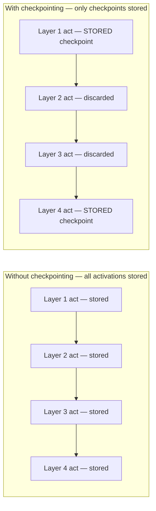

# Chapter 3 · Lesson 4 — Gradient Accumulation & Gradient Checkpointing

> **Where this fits:** Lesson 3 solved memory for *model* weights and optimizer state across GPUs. This lesson covers two separate, commonly-confused techniques for managing memory and effective batch size on top of that — both come up constantly in "how would you train this on limited hardware" interview questions.

---

## 1. These Solve Two Different Problems — Don't Conflate Them

A recurring interview trap: candidates use "gradient accumulation" and "gradient checkpointing" interchangeably. They solve different problems:

| | Gradient Accumulation | Gradient Checkpointing |
|---|---|---|
| Problem solved | Want a large *effective batch size* but can't fit it in memory at once | Activations from the forward pass consume too much memory during training |
| Mechanism | Run several small forward/backward passes, accumulate gradients, update once | Discard some activations during forward pass, recompute them during backward pass |
| Cost | None to final quality — mathematically identical to one large batch | Extra compute (recomputation) in exchange for memory |

---

## 2. Gradient Accumulation — Worked Through

Say your target effective batch size is 512 sequences, but a single GPU can only fit 64 sequences in memory at once (activation memory limit). Gradient accumulation runs 8 forward/backward passes of 64 sequences each, **accumulating** (summing) gradients across them, and only calls the optimizer step once every 8 micro-batches.

```python
accumulation_steps = 8
optimizer.zero_grad()

for i, micro_batch in enumerate(dataloader):
    with torch.autocast(device_type="cuda", dtype=torch.bfloat16):
        logits = model(micro_batch["input_ids"])
        loss = causal_lm_loss(logits, micro_batch["input_ids"])
        loss = loss / accumulation_steps   # scale down — see why, below

    loss.backward()   # gradients ACCUMULATE into .grad by default in PyTorch

    if (i + 1) % accumulation_steps == 0:
        optimizer.step()
        optimizer.zero_grad()
```

**Why divide by `accumulation_steps`:** `causal_lm_loss` (Chapter 2, Lesson 1) already averages over tokens *within* a micro-batch. But gradients from `.backward()` calls simply **add** into `.grad` across the accumulation loop — without dividing, the effective loss being optimized would be the *sum* of 8 batches' average losses, not the average across all 512 sequences combined. Dividing by `accumulation_steps` before each `.backward()` corrects this, making the accumulated result mathematically identical to having computed the loss over the full 512-sequence batch directly.

**Why this is mathematically free (no quality cost), unlike checkpointing:** gradients are linear — the gradient of a sum of losses equals the sum of gradients of each loss term. Accumulating gradients across micro-batches and then stepping once produces the *exact same* parameter update as if you'd had enough memory to process all 512 sequences in one shot. The only cost is wall-clock time (8 sequential forward/backward passes instead of 1 parallel one) — not model quality.

---

## 3. Gradient Checkpointing — The Actual Memory Problem It Solves

During the forward pass, every intermediate activation (output of every LayerNorm, every attention layer, every FFN layer, per Lesson 1's decoder block) is normally kept in memory, because the backward pass needs them to compute gradients (recall Lesson 1, Section 6 — backprop needs local derivatives at each operation, which depend on the forward-pass values at that point).

For a deep model with a long sequence length, this activation memory can exceed the memory used by the weights and optimizer state combined — activation memory scales with `batch_size × sequence_length × d_model × num_layers`, and grows fast.

**Gradient checkpointing's trade:** instead of storing every activation, only store activations at a subset of "checkpoint" layers. During the backward pass, when an un-stored activation is needed, **recompute it** by re-running the forward pass from the nearest checkpoint.



During backward pass, to get Layer 2 and 3's activations back, you re-run the forward pass starting from checkpoint 1 (Layer 1's stored activation) up through Layer 3 — recomputing what was discarded, right when it's needed.

```python
from torch.utils.checkpoint import checkpoint

class DecoderBlockWithCheckpointing(nn.Module):
    def __init__(self, block):
        super().__init__()
        self.block = block

    def forward(self, x, cos, sin):
        # Instead of running block(x) directly and keeping its activations,
        # wrap it so PyTorch recomputes them during backward instead of storing them
        return checkpoint(self.block, x, cos, sin, use_reentrant=False)
```

**The actual tradeoff, in concrete terms:** commonly cited rule of thumb — checkpointing every layer can reduce activation memory substantially (often 60-70%+ in deep models) at the cost of roughly a 20-30% increase in training step time (because the forward pass through checkpointed segments effectively runs twice — once normally, once during recompute). This isn't a free lunch like gradient accumulation — it's a genuine compute-for-memory trade, and worth stating as such rather than presenting it as strictly beneficial.

---

## 4. Choosing Checkpoint Granularity — Not All-or-Nothing

Checkpointing every single layer maximizes memory savings but also maximizes recomputation cost. A common middle ground: checkpoint every `k`-th layer (e.g., every 2nd or 4th decoder block) rather than every layer, trading some memory savings back for less recomputation overhead — this is a real tunable, not a binary switch, and naming it signals you understand the tradeoff has a dial, not just an on/off.

---

## 5. When to Use Which — Direct Answer for an Interview

- **Gradient accumulation:** use whenever the target effective batch size doesn't fit in memory, and you're not compute-bound on wall-clock time — essentially always worth using since there's no quality cost, only a time cost.
- **Gradient checkpointing:** use when activation memory (not weight/optimizer memory — that's Lesson 3's problem) is the binding constraint — typically for very deep models or very long sequence lengths, where the 20-30%-ish time cost is worth it to fit training at all, or to fit a larger batch size that itself improves throughput enough to offset the recompute cost.
- **Both together, commonly:** checkpointing frees activation memory, which can then be spent on a larger per-GPU micro-batch size, which reduces how many gradient-accumulation steps are needed to reach the target effective batch size — they compose rather than compete.

---

## Key Takeaways

- Gradient accumulation solves effective-batch-size-vs-memory; it's mathematically exact (identical result to one large batch) and costs only wall-clock time.
- Gradient checkpointing solves activation memory; it trades genuine extra compute (recomputation) for memory savings — not free.
- Forgetting to divide the loss by `accumulation_steps` is a real, common bug that silently changes the effective learning rate/gradient scale.
- Checkpointing granularity (every layer vs. every k-th layer) is a tunable tradeoff, not a binary choice.

---

## Self-Check Before Moving to Lesson 5

1. A candidate says "gradient accumulation and checkpointing both let you train bigger models with less memory — they're basically the same technique." What's wrong with that statement?
2. Why must the loss be divided by `accumulation_steps` before each `.backward()` call, precisely?
3. What's the actual mechanism gradient checkpointing uses to save memory — "it compresses activations" or something else? Be specific.
4. You have plenty of GPU memory for weights/optimizer state but not for activations at your desired sequence length. Which technique from this lesson directly addresses that, and why not the other one?