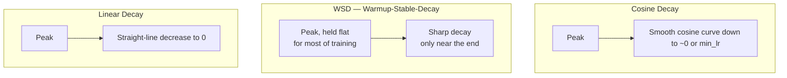

# Chapter 3 · Lesson 5 — Learning Rate Schedules: Warmup, Cosine Decay, WSD

> **Where this fits:** Every training loop in Lessons 1-4 has referenced "the optimizer step" without specifying how the learning rate changes over time. This lesson makes that explicit — and warmup in particular is one of the most consistently under-explained topics in interview answers, including implicitly in your own original transcript.

---

## 1. Why the Learning Rate Isn't a Single Constant

A fixed learning rate for the entire training run is almost never used in practice for transformers. Two separate problems motivate changing it over time, and they're solved by different parts of the schedule:

1. **Early instability** → solved by **warmup**
2. **Needing to settle into a good minimum late in training** → solved by **decay**

---

## 2. Warmup — Why It's Non-Negotiable, Not Just Convention

At initialization (recall Chapter 2, Lesson 1's loss-at-init sanity check), the model's weights are essentially random, and gradients computed from this state can be large and poorly-conditioned — the loss landscape near a random initialization is much rougher than near a partially-trained model. Adam-family optimizers make this worse early on: Adam's adaptive learning rate divides by an estimate of gradient variance, and that variance estimate is itself noisy and unreliable during the very first steps (few samples to estimate it from) — this specific interaction is well-documented as a cause of early training divergence when a large learning rate is applied immediately.

**Warmup's fix:** start the learning rate near zero, and linearly ramp it up to the target peak value over some number of steps (commonly a few hundred to a few thousand steps, or a small percentage of total training steps).

```python
def lr_with_warmup(step, warmup_steps, peak_lr):
    if step < warmup_steps:
        return peak_lr * (step / warmup_steps)
    return peak_lr  # decay schedule takes over after this, see Section 3
```

**Worked example:** `peak_lr = 3e-4`, `warmup_steps = 2000`. At step 500: `lr = 3e-4 * (500/2000) = 7.5e-5` — a quarter of peak. At step 2000: full `3e-4` is reached, and the decay schedule (Section 3) takes over from there.

**What happens if you skip warmup** — the concrete failure mode, not just "it's less stable": applying the full peak learning rate from step 0 with unreliable Adam variance estimates frequently produces a loss spike or outright divergence (`NaN`) in the first few hundred steps, before the optimizer's internal statistics have had a chance to stabilize. This is directly checkable against Chapter 2 Lesson 1's loss-at-init sanity check — if you skip warmup and see an early spike right after a normal-looking initial loss, warmup is the first thing to check.

---

## 3. Decay Schedules — Three Common Shapes

After warmup, the learning rate needs to come back down over the course of training. Three schedules dominate in practice:



**Cosine decay** — the long-standing default (GPT-3, LLaMA-family recipes):

```
lr(step) = min_lr + 0.5 * (peak_lr - min_lr) * (1 + cos(π * step / total_steps))
```

Smooth, gradual reduction — spends more time at higher learning rates early (faster progress) and eases into a low learning rate late (fine settling into a minimum) without any hard corners in the curve.

**WSD (Warmup-Stable-Decay)** — a more recent practical alternative (used in some recent open training recipes): hold the learning rate flat at its peak for the bulk of training, then apply a short, sharp decay only near the very end. **The practical advantage this solves:** with cosine decay, the *total* number of training steps must be decided in advance, because the cosine curve's shape depends on `total_steps` — extending training later means the schedule no longer matches what was actually run. WSD's flat-then-decay shape means you can extend the "stable" phase indefinitely without needing to predetermine the total step count, and simply apply the decay phase whenever you decide to stop — a real operational flexibility advantage for large, expensive runs where the exact stopping point may only become clear as training progresses.

**Linear decay** — simplest, straight line down to zero (or a small minimum), used less often for large-scale pretraining today but still common in fine-tuning setups (Chapter 6 will return to this).

---

## 4. Why Decay at All — the Actual Reasoning, Not Just "It's Standard"

A learning rate held high for the entire run tends to prevent the model from settling precisely into a good minimum — updates stay large enough to keep "bouncing" around a good solution rather than converging into it. Decaying the learning rate late in training lets the optimizer take progressively smaller, more precise steps, refining the solution rather than continuing to explore broadly. This is the same underlying intuition as simulated annealing in optimization more broadly — large exploratory steps early, small refining steps late.

---

## 5. Code: A Complete Warmup + Cosine Decay Scheduler

```python
import math

def lr_schedule(step, warmup_steps, total_steps, peak_lr, min_lr=1e-5):
    if step < warmup_steps:
        return peak_lr * (step / warmup_steps)
    progress = (step - warmup_steps) / (total_steps - warmup_steps)
    progress = min(progress, 1.0)
    return min_lr + 0.5 * (peak_lr - min_lr) * (1 + math.cos(math.pi * progress))

# In the training loop:
for step, batch in enumerate(dataloader):
    lr = lr_schedule(step, warmup_steps=2000, total_steps=100_000, peak_lr=3e-4)
    for group in optimizer.param_groups:
        group["lr"] = lr
    # ... forward, backward, optimizer.step() as in earlier lessons
```

---

## 6. Diagnosis: Reading Learning-Rate-Related Symptoms

- **Loss spikes in the first few hundred steps, initial loss looked normal (near `log(vocab_size)`, per Chapter 2 Lesson 1)** → check warmup length; too short or absent warmup is the first suspect (Section 2).
- **Loss plateaus early and never improves further, well before expected total steps** → learning rate may have decayed too early or too aggressively relative to total training length — check the decay schedule's `total_steps` parameter actually matches the real planned run length.
- **Loss looks fine throughout training but final quality is worse than expected** → peak learning rate itself may simply be mis-tuned (too low = slow, incomplete convergence; too high = noisy convergence to a worse minimum) — this is a separate axis from the *shape* of the schedule, and Chapter 4 covers tuning the peak value itself.

---

## Key Takeaways

- Warmup exists because of a specific, well-documented failure mode: unreliable early Adam variance estimates combined with a rough loss landscape near random initialization, causing spikes/divergence if the full learning rate is applied immediately.
- Cosine decay is the long-standing default; WSD trades some of cosine's smoothness for the practical advantage of not needing to fix total training steps in advance.
- Decay isn't cosmetic — it's what allows the optimizer to transition from broad exploration to precise convergence late in training.
- Loss-spike timing is a diagnostic signal: spikes in the first few hundred steps point to warmup; plateaus well before expected completion point to decay schedule mismatch.

---

## Self-Check Before Moving to Lesson 6

1. Explain the specific mechanism (not just "instability") by which skipping warmup causes early training divergence with Adam.
2. What operational problem does WSD solve that cosine decay doesn't, and why does cosine decay have that problem in the first place?
3. A training run shows a loss spike at step 150, right after a normal-looking initial loss around step 0. What's the first hyperparameter you'd check, and why?